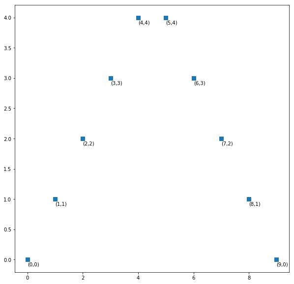

附录
================

参考书目
-----------
| [0] Neural Networks: Tricks of the Trade 
| [1] Eric Matthes，袁国忠(译).Python编程从入门到实践[M].北京:人民邮电出版社，2016
| [2] Micha Gorelick，Ian Ozsvald，胡世杰，徐旭彬(译).Python高性能编程[M].北京:人民邮电出版社，2017
| [3] Jake VanderPlas，陈俊杰，陈小莉(译).Python数据科学手册[M].北京:人民邮电出版社，2017
| [4] Python Machine Learning （美）塞巴斯蒂安·拉施卡（Sebastian Raschka）[M].北京:机械工业出版社，2017
 
机器学习相关
--------------
- `Deep Learning Book by Ian GoodFellow <http://www.deeplearningbook.org/>`_
- `Neural Networks and Deep Learning (Michael Nielsen) <http://neuralnetworksanddeeplearning.com/index.html>`_
- `Distill Clear Explanations of machine learning <https://distill.pub/>`_
- `CS231 斯坦福大学汇总 <https://github.com/sharedeeply/cs231n-camp>`_
- `吴恩达 CS229 课程讲义中文翻译 <https://kivy-cn.github.io/Stanford-CS-229-CN/#/README>`_
- `cs229 Notes <http://cs229.stanford.edu/notes/>`_
- `ml-cheatsheet <https://ml-cheatsheet.readthedocs.io/en/latest/activation_functions.html>`_
- `莫烦PYTHON <https://morvanzhou.github.io>`_
- `Keras 参考文档 <https://www.jianshu.com/p/e9c1e68a615e>`_
- `scipy-lectures <http://scipy-lectures.org/index.html>`_
- `scikit-learn和tensorflow的区别 <https://www.jianshu.com/p/0837b7c6ce10>`_
- `主流机器学习框架对比 <https://www.leiphone.com/news/201702/T5e31Y2ZpeG1ZtaN.html>`_
- `判断欠拟合还是过拟合 <https://blog.csdn.net/qq_30374549/article/details/80937159>`_
- `马里兰大学，机器学习课程资料 <http://www.cs.umd.edu/class/spring2016/cmsc422//schedule/>`_
- `机器学习 <https://thepythonguru.com/top-5-machine-learning-libraries-in-python/#more-1948>`_
- `标准化和归一化详解 <https://www.jianshu.com/p/95a8f035c86c>`_
- `Artificial Intelligence, Deep Learning, and NLP <http://www.wildml.com/>`_
- `常用代价函数 <https://stats.stackexchange.com/questions/154879/a-list-of-cost-functions-used-in-neural-networks-alongside-applications>`_

Python相关
-----------
- `Python 从入门到深入 <https://pythonhowto.readthedocs.io/zh_CN/latest/>`_ 
- `Module of the Week <https://pymotw.com/3/>`_
- `Numpy 和 Scipy 官网 <https://docs.scipy.org/doc/>`_

数据相关
--------------
- `scipy.stats 函数相关 <https://blog.csdn.net/pipisorry/article/details/49515215>`_
- `Pandas 官方文档 <http://pandas.pydata.org>`_
- `Python 数据库操作实例 <http://www.cnblogs.com/idbeta/p/5209522.html>`_
- `Sqlite 数据库操作 <http://www.runoob.com/sqlite/sqlite-data-types.html>`_

数学相关
-----------
- `机器学习中的基本数学知识 <https://www.cnblogs.com/steven-yang/p/6348112.html>`_
- `拉格朗日乘子法 <http://jermmy.xyz/2017/07/27/2017-7-27-understand-lagrange-multiplier/>`_

图像相关
-----------
- `Matplotlib 用户指南 <https://wizardforcel.gitbooks.io/matplotlib-user-guide/>`_
- `OpenCV-Python 官方教程 <https://opencv-python-tutroals.readthedocs.io/en/latest/index.html>`_
- `Mahotas 计算机视觉库 <https://mahotas.readthedocs.io/en/latest/>`_
- `GeoGebra 数学绘图工具 <https://www.geogebra.org/>`_
- `Graphviz 官网 <http://www.graphviz.org>`_
- `Graphviz 示例1 <https://graphs.grevian.org/example>`_
- `Graphviz 示例2 <https://renenyffenegger.ch/notes/tools/Graphviz/examples/index>`_
- `Graphviz 示例3 <http://www.tonyballantyne.com/graphs.html>`_
- `Matplotlib 教程 <https://liam.page/2014/09/11/matplotlib-tutorial-zh-cn/>`_
- `matplotlib 进阶和入门 <https://blog.csdn.net/qq_34337272/article/details/79555544>`_
- `Pillow 图像处理 <https://pillow.readthedocs.io/en/5.3.x/>`_
- `Turtle 绘图示例 <https://www.zhihu.com/question/271643290/answer/525019532>`_
- `learnopencv <https://www.learnopencv.com>`_
- `Mayavi 官网 <http://docs.enthought.com/mayavi/mayavi/>`_
- `Mayavi2 3D <http://scipy-lectures.org/packages/3d_plotting/index.html#making-it-interactive>`_

符号和表达式
--------------
- `正则表达式 <http://deerchao.net/>`_
- `常用数学符号的 LaTeX 表示方法 <http://www.mohu.org/info/symbols/symbols.htm>`_
- `Math in reStructuredText <https://yuyuan.org/MathInreStructuredText/#use-mathjax-in-restructuredtext>`_

manim 环境配置
--------------
- `缺少sty文件时的安装方法 <https://blog.csdn.net/guojingjuan/article/details/84878630>`_
- `3Blue1Brown风格的视频 <https://www.bilibili.com/read/cv17444>`_

嵌入式相关
------------------
- `树莓派跑OpenCV <https://www.pyimagesearch.com/2017/09/04/raspbian-stretch-install-opencv-3-python-on-your-raspberry-pi/>`_

LaTeX数学表达式
~~~~~~~~~~~~~~~~

.. math::
  
  c^{2}=a^{2}+b^{2}
  
.. math::
  
  \ P(X=a|Y=b)=\frac{P(X=a,Y=b)}{P(Y=b)}

.. math::

  \Delta w = \eta (y^{i} - {\hat{y}}^i)x^{i}
  
此行必须添加，否则后序表达式出错：

.. role:: raw-latex(raw)
    :format: latex html

.. math::

  w^{T}x + w0 = 0  \qquad (0)\\
  w^{T}x + w0 = 1  \qquad (1)\\
  w^{T}x + w0 = -1 \qquad (2)

# 分段函数
.. math::
    
  P(y^i|x^i;w) = \left\{ \begin{array}{ll}
                  \phi (z^i) & \textrm{$y^i=1$}\\
                  1 - \phi (z^i) & \textrm{$y^i=0$}\\
                  \end{array} \right.
  
This: :raw-latex:`\((x+a)^3\)`
This: :raw-latex:`\((x+a)_3\)`

this: :raw-latex:`\(W \approx \sum{f(x_k) \Delta x}\)`

this: :raw-latex:`\(W = \int_{a}^{b}{f(x) dx}\)`

:raw-latex:`\(\sqrt{x}\)`，不好处理

inline :math:`\frac{ \sum_{t=0}^{N}f(t,k) }{N}` inline

and this:

.. math::

  |x| = \left\{
      	\begin{array}{ll}
      		x  & \mbox{if } x \geq 0 \\
      		-x & \mbox{if } x < 0
      	\end{array}
      \right.

# 多公式对齐，&号相当于表格分隔符，\\\\ 用于换行

.. math::

  \begin{eqnarray}
  f(x) & = & \cos x \\
  f’(x) & = & -\sin x \\
  \int_{0}^{x} f(y)dy &
  = & \sin x
  \end{eqnarray}

.. raw:: latex html

   \[ \frac{1}{\Bigl(\sqrt{\phi \sqrt{5}}-\phi\Bigr) e^{\frac25 \pi}} =
   1+\frac{e^{-2\pi}} {1+\frac{e^{-4\pi}} {1+\frac{e^{-6\pi}}
   {1+\frac{e^{-8\pi}} {1+\ldots} } } } \]

When :raw-latex:`\(a \ne 0\)`, there are two solutions to :raw-latex:`\(ax^2 + bx + c = 0\)` and they are
:raw-latex:`\(x = {-b \pm \sqrt{b^2-4ac} \over 2a}.\)`

其他语法
~~~~~~~~~~~~

| .. _my-reference-label0:
| .. _nopara_decorator_class:
| :ref:`marker` 

.. parsed-literal::

     驱动器 C 中的卷是 系统专区
     卷的序列号是 78E7-2220

  object 和 type 关系图 （实线表继承关系，虚线表实例关系 Shalabh Chaturvedi）
 
.. admonition:: 注意

  任何对文件的读取和写入动作，都会自动改变文件的指针偏移位置。
  
*重点(emphasis)通常显示为斜体*

**重点强调(strong emphasis)通常显示为粗体**

`解释文字(interpreted text)通常显示为斜体`

:时间: 2016年06月21日

1. 枚举列表1
#. 枚举列表2
#. 枚举列表3

(I) 枚举列表1
(#) 枚举列表2
(#) 枚举列表3

A) 枚举列表1
#) 枚举列表2
#) 枚举列表3

下面是引用的内容：

    “真的猛士，敢于直面惨淡的人生，敢于正视淋漓的鲜血。”

    --- 鲁迅

..

      “人生的意志和劳动将创造奇迹般的奇迹。”

      — 涅克拉索

.. code-block:: python
  :linenos:
  :lineno-start: 0
  
  def AAAA(a,b,c):
      for num in nums:
          print(Num)

-a            command-line option "a"
-b file       options can have arguments
              and long descriptions
--long        options can be long also
--input=file  long options can also have
              arguments
/V            | DOS/VMS-style options toofdsfds
              | fdsafdsafdsafsafdsafsa
              | fdsafdsafsd

John Doe wrote::

>> Great idea!
>
> Why didn't I think of that?

You just did!  ;-)

    | A one, two, a one two three four
    |
    | Half a bee, philosophically,
    |     must, *ipso facto*, half not be.
    | But half the bee has got to be,
    |     *vis a vis* its entity.  D'you see?
    |
    | But can a bee be said to be
    |     or not to be an entire bee,
    |         when half the bee is not a bee,
    |             due to some ancient injury?
    |
    | Singing...
    
| 第四个段落，段内的换行。
| 用竖线和空格开头，之后的每一行
| 在渲染时都会单独成行。
| 这功能不常用，因为用列表会更美观。

=====  =====
col 1  col 2
=====  =====
1      Second column of row 1.
2      Second column of row 2.
       Second line of paragraph.
3      - Second column of row 3.

       - Second item in bullet
         list (row 3, column 2).
\      Row 4; column 1 will be empty.
=====  =====

- 功能      

  - 你好 list item.  The blank line above the
    first list item is required; blank lines between list items
    (such as below this paragraph) are optional.

- 函数

  - 你好 is the first paragraph in the second item in the list.
  
    This is the second paragraph in the second item in the list.
    The blank line above this paragraph is required.  The left edge
    of this paragraph lines up with the paragraph above, both
    indented relative to the bullet.
  
    - This is a sublist.  The bullet lines up with the left edge of
      the text blocks above.  A sublist is a new list so requires a
      blank line above and below.

::

    原始文本块内的任何标记都不会被转换，随便写。

    `Bary.com <http://www.bary.com/>`_

    这还会显示在原始文本块中。

        缩进都会原样显示出来。

        只要最后有空行，缩进退回到 :: 的位置，就表示退出了\ `原始文本块`_。

会自动把网址转成超链接，像这样 http://www.bary.com/ ，注意结束的地方要跟空格。

如果你希望网址和文本之间没有空格，可以用转义符号反斜杠 \\ 把空格消掉，由于反斜\
杠是转义符号，所以如果你想在文中显示它，需要打两个反斜杠，也就是用反斜杠转义一\
个反斜杠。

渲染后紧挨文本和句号的超链接\ http://www.bary.com/\ 。

其实遇到紧跟常用的标点的情况时，不需要用空格，只是统一使用空格记忆负担小。\
你看\ http://www.bary.com/，这样也行。

.. note::

  写完本文我发现我用的渲染器对中文自动消除了空格，行尾不加反斜杠也行，但我不\
  保证其他渲染器也这么智能，所以原样保留了文内的反斜杠。

如果希望硬断行且不自动添加空格（例如中文文章），在行尾添加一个反斜杠。\
折上去的部分就不会有空格。注意所有的硬换行都要对齐缩进。

+-------------+----+-----+----+-----+----+-----+
+打开模式     +r   +r+   +w   +w+   +a   +a+   +
+=============+====+=====+====+=====+====+=====+
+可读         ++   ++    +    ++    +    ++    +
+-------------+----+-----+----+-----+----+-----+
+可写         +    ++    ++   ++    ++   ++    +
+-------------+----+-----+----+-----+----+-----+
+创建         +    +     ++   ++    +    +     +
+-------------+----+-----+----+-----+----+-----+
+覆盖         +    +     ++   ++    +    +     +
+-------------+----+-----+----+-----+----+-----+
+指针在开始   ++   ++    ++   ++    +    +     +
+-------------+----+-----+----+-----+----+-----+
+指针在结尾   +    +     +    +     ++   ++    +
+-------------+----+-----+----+-----+----+-----+ 

以空格作分隔符，间距均匀。决定了这个表格最多可以有5列,下划线的长度应不小于字符长度。
每一行的下划线，决定了相应列是否合并，如果不打算合并列，可以取消表内分隔线

===== ===== ===== ===== =====   
11    12    13    14    15
----------- -----------------   
21    22    23    24    25
----- ----- ----- ----- -----   
31    32    33    34    35
----- ----------- -----------   
41    42    42    44    45
============================= 

:Date: 2001-08-16
:Version: 1
:Authors: - Me
          - Myself
          - I
:Indentation: Since the field marker may be quite long, the second
   and subsequent lines of the field body do not have to line up
   with the first line, but they must be indented relative to the
   field name marker, and they must line up with each other.
:Parameter i: integer
