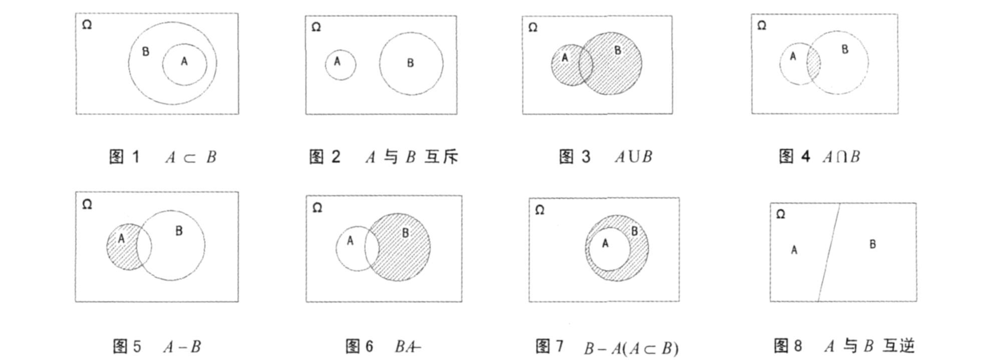
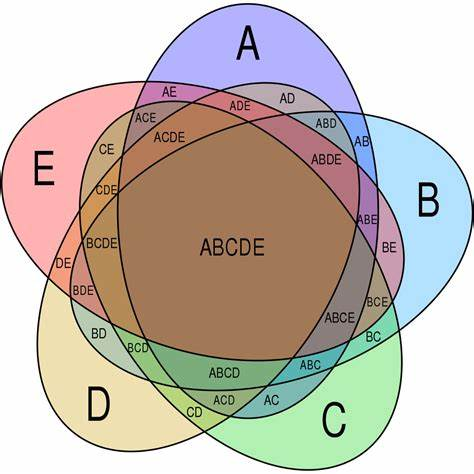
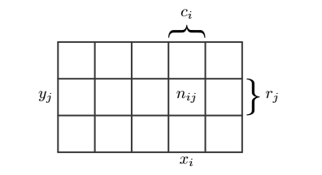
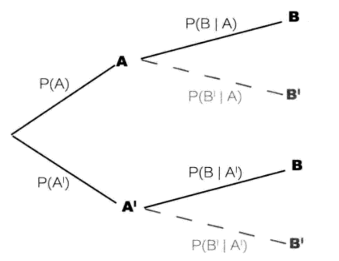
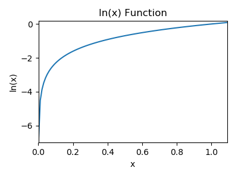

.. role:: raw-latex(raw)
    :format: latex html

概率与贝叶斯分类
=====================

从概率开始
--------------

基本数学概念
~~~~~~~~~~~~~~

随机试验的特征：

- 可在相同条件下重复进行，之所以强调相同条件，是因为改变了试验条件，试验就被改变了，试验 A 就变成了试验 B，所以说某项试验就暗含了是在某种条件约束下进行的。
- 在试验结果出来之前，可事先明确所有可能的结果（Outcomes）。例如抛硬币只有正反两面。
- 试验结果出来之前是不能确定结果的。

概率讨论基于随机试验的结果，某种试验被简写为试验 E (Experiment，也可使用 Trial)，试验 E 的所有可能结果组成的集合（Set，结果的全集），被称为试验 E 的样本空间，简写为 S（sample space，或希腊字母  :raw-latex:`\(\Omega\)` 表示），显然 S 就是结果集，例如抛硬币试验的样本空间 S:{正，反}。S 集合中的每个元素称为样本空间 S 的样本点（Sample），例如“正”样本点。

试验 E 的样本空间 S 的子集被称为试验 E 的随机事件（Random Event），简称事件（Event），显然事件的本质是集合，而集合是在一定条件下的结果集，例如抛硬币中的 “正” 事件。根据事件包含样本点的数目，可以分为：

- 基本事件，也被称为原子事件，有单个样本点组成的集合称为基本事件，S 有多少个样本点，就有多少个基本事件。例如抛硬币试验 E 的基本事件为 {正} 和 {反}。基本事件两两互不相容，互为互斥事件，如何事件（除不可能事件）都可以表示为多个基本事件的并集。
- 必然事件，S 是自身的子集，本质就是由所有基本事件构成的集合。
- 不可能事件，空集不包含任何基本事件，每次试验都不可能发生。

根据事件之间的关系，两个或多个事件可以分为以下几种关系：

- 独立事件：A, B 事件无相互影响，相互独立，P(A) = P(A|B)，同时 P(B) = P(B|A) 也成立。
- 互斥事件：A, B 事件不可能同时发生；1 个发生，另一个就不可能发生。
- 对立事件，也被称为互逆事件：如果 A,B 为对立事件，那么要么 A 发生，要么 B 发生，P(A) + P(B) = 1，A 的对立事件常记作 A'。

事件之间的关系常用韦恩图（venn diagram）表示，它可以方便地描述 2 个事件的关系。

对 S 集合进行完备划分，使得所有事件互斥，且并集为 S，那么就得到一个完备事件组(complete events group)，简称为完备组，例如掷骰子（a die，复数为 dice）试验，样本空间为 S:{1,2,3,4,5,6}，An 表示划分的事件，它的完备组可以为：

- A1 和 A2，其中 A1: {1,2,3}，A2: {4, 5, 6}
- A1,A2...A6，其中 A1:{1}，A2{2}，A3{3} 以此类推。

显然如果事件 A1、A2、A3...An 构成一个完备组，则它们两两互不相容，其并集为样本空间。完备组被用于定义全概率公式，A 和 A' 是一组典型的完备组。

考虑掷骰子试验 E：它的样本空间为 S:{1,2,3,4,5,6}。基于该样本空间集合，我们可以考察很多条件下的事件：

- 奇偶条件：取到偶数的事件，取到奇数的事件。
- 大小条件：取到 <= 3 的事件，>=5 的事件。
- 倍数条件：取到是 3 的倍数的事件，非 3 的倍数的事件。
- 取到数字同时为偶数且是 3 的倍数的事件。

显然考察条件不同，事件就不同。概率表征事件 A 发生可能性的大小，那么如何精确定义某个事件的概率呢？随机试验的结果具有随机现象：每次试验结果呈现不确定性，在大量重复试验中结果又具有统计规律性。

- 频数：在相同条件下，进行 n 次试验，事件 A 发生的次数 :raw-latex:`\(n_A\)` 称为事件 A 发生的频数。
- 频率：  :raw-latex:`\(n_A\)`/:raw-latex:`\(n\)`  称为事件 A 发生的频率，并记为 :raw-latex:`\(f_n(A)\)` 。
- 概率：当 :raw-latex:`\(n\to \infty\)` 时，:raw-latex:`\(f_n(A)\)` 被定义为事件 A 发生的概率，记为 P(A)，P 是 Probability 的缩写（依据为大数定律）。

有些时候，我们更关心试验结果的某些函数，而不是结果本身，例如在掷两枚骰子的试验中，关心点数之和为 7 的情况。

随机变量：定义在样本空间上的实值单值函数，简写为 X，也即 X=X(e)，e 表示样本空间 S 中的样本点。随机变量与随机事件一样，具有统计规律性，使用它来描述各种随机现象。

此时使用一种随机变量的定义就可以定义一个事件，例如事件 {X=7} 表示两次掷骰子的和为 7 的事件，且概率表示为 P(X=7)。

韦恩图
~~~~~~~~~~~~~

韦恩图（venn diagram）在集合理论中被广泛使用，由于概率的本质就是事件集合相对于样本空间的占比，所以韦恩图也被用于描述事件之间的关系和运算。

  韦恩图表示事件的关系和运算（图自网络）

继续考虑掷骰子试验，我们可以对应上图描述以下事件之间的关系：

- 图1：描述事件的包含关系，例如事件 A {X<5}，事件 B {X<3}，显然 A 是 B 的子集
- 图2：描述互斥事件，不可同时发生，例如事件 A{X>4}，B {X<3}。
- 图3：描述相关事件的并集，例如事件 A {X = 偶数}，B {X > 3}，则阴影部分对应 A {X = 偶数 或 X > 3}。
- 图4：描述相关事件的交集，例如事件 A {X = 偶数}，B {X > 3}，则阴影部分对应 A {X = 偶数 且 X > 3}。
- 图5 和 图6 描述事件补集的关系。
- 图8 描述了对立事件（互逆事件），例如 A{X < 3}，B{X >= 3}，它们构成了一个完备组。

通过韦恩图可以非常直观得计算出 2 个事件的交并，互补事件的概率。但是它不适合描述多事件和多随机变量事件，否则图像将变得混乱，同时它也不适合描述条件概率。

  韦恩图描述多事件关系

打地鼠与概率规则
~~~~~~~~~~~~~~~~~~

考虑掷骰子试验，结果为偶数的概率是多少？结果为偶数时，它是 3 的倍数的概率有多少？如果结果为 3 的倍数，它是偶数的概率有多少？这就涉及到了先验概率，条件概率和联合概率的关系和计算问题。

- 先验概率（prior probability）：可以通过分析得到，不依赖于其他事件，例如P(X=偶数) = 3/6 = 1/2。
- 条件概率（conditional probability，也称为后验概率，posterior probability），记作 P(A|B)，在事件 B 发生后，A 发生的概率，例如 P(Y=3的倍数|X=偶数)。
- 联合概率（joint probability），记作 P(A,B) 或 P(A :raw-latex:`\(\cap\)` B)，A 和 B事件同时发生的概率，例如 P(Y=3的倍数，X=偶数)。

这三种概率之间是什么关系呢？为了推导概率的一般规则，考虑下面的打地鼠游戏：

  打地鼠游戏

地鼠从某个洞中探出头来，游戏者非常快速地把它敲回去，这非常有趣。如果我们想要统计一些规律：从某行出来，某列出来，某个洞中出来。为了分析地鼠探头的规律性，可以抽象成以下模型：

地鼠出现的位置可以使用两个随机变量来描述：X 和 Y，X 表示横坐标，Y 表示纵坐标，假设 X 的取值为 :raw-latex:`\(x_i\)`, 其中 i = 1,2,3...I；Y 可以取值为  :raw-latex:`\(y_j\)`，其中 y = 1,2,3...J，考虑 N 次试验，同时对随机变量 X 和 Y 进行统计：

- 把 {X = :raw-latex:`\(x_i\)` 且 Y = :raw-latex:`\(y_j\)`} 的出现次数记作 :raw-latex:`\(n_{ij}\)` ;
- 把 X 取值为 :raw-latex:`\(x_i\)` （与 Y 无关，只关心列，column）的出现次数记为 :raw-latex:`\(c_i\)` ;
- 把 Y 取值为 :raw-latex:`\(y_j\)` （与 X 无关，只关心行，row）的出现次数记为 :raw-latex:`\(r_j\)` 。

  两个随机变量的网格图表示

根据概率定义，当 N 趋向于无穷时，可以得出联合概率计算公式：

.. math::

  P(X=x_i,Y=y_j) = \frac{n_{ij}}{N} \qquad  (1)

同理，先验概率 X = :raw-latex:`\(x_i\)` 的计算公式为出现在 i 列上的次数 :raw-latex:`\(c_i\)` 与总试验的次数比值：

.. math::

  P(X=x_i) = \frac{c_{i}}{N} \qquad  (2)

另外注意到  :raw-latex:`\(c_i = \sum_j{n_{ij}}\)`，可以得出概率的加和规则（sum rule）：

.. math::

  P(X=x_i) = \sum_jP(X=x_i,Y=y_i) \qquad (3)

已知落在列 i 上的总点数 :raw-latex:`\(c_i\)` ，那么落在 ij 上的点数  :raw-latex:`\(n_{ij}\)` 与它的比值就是条件概率：

.. math::

  P(Y=y_j|X=x_i) = \frac{n_{ij}}{c_i} \qquad (4)

根据公式 (1)(2)(4)，可以得出联合概率和条件概率的关系，它被称为概率的乘法规则（product rule）：

.. math::

  P(X=x_i,Y=y_j) = \frac{n_{ij}}{N} = \frac{n_{ij}}{c_i}\frac{c_i}{N} = P(Y=y_j|X=x_i)P(X=x_i) \qquad (5)

同样根据乘法规则，可以得到 :raw-latex:`\(P(Y=y_j,X=x_i)\)` 的概率公式：

.. math::

  P(Y=y_j,X=x_i) = \frac{n_{ij}}{N} = \frac{n_{ij}}{r_j}\frac{r_j}{N} = P(X=x_i|Y=y_j)P(Y=y_j) \qquad (6)

通过公式 (5)(6) 可以看出联合概率在两个条件概率之间架起了一座桥梁，得到条件概率的算术关系：

.. math::
  
  \ P(y_j|x_i)=\frac{P(x_i|y_j)P(y_j)}{P(x_i)} \qquad (Bayes' theorem)

上式被称为贝叶斯定理（Bayes' theorem），它是机器学习中朴素贝叶斯和贝叶斯分类算法的理论基础。上式中的分母可以用全概率公式表示：

.. math::

  P(X) = \sum_j{P(X|y_j)}{P(y_j)}

其中的所有的 :raw-latex:`\(y_j\)` 事件构成了一个完备组。

条件概率与概率树
~~~~~~~~~~~~~~~~~

上面使用网格图表示两个随机变量，可以清晰地阐述三种概率的关系。但是当随机变量超过 2 个时，使用网格图就无法表达了。概率树可以清晰地表示多种随机变量关系。

  概率树

概率树以分层的方式依次描述不同的随机变量。

- 第一层随机变量描述随机变量 X，它有 i 个分支，分别对应 :raw-latex:`\(X=x_i\)` 事件，这里简写为事件 A 和 A'，先验概率在相应的分支上标出，对应的节点标出事件 A 和 A'，所有分支上的事件构成一个完备组，它们的概率和为 1。
- 第二层分支线上标出已知所连接的上一级结果的情况下的第二层结果的概率。所以它是条件概率。
- 根据乘法规则，从根节点沿着分支依次向右连乘，得到联合概率。所有联合概率的和一定为 1，这可以用来校验计算是否正确。

概率树使用规则：

- 努力分出需要计算的概率的不同层级。如果给定了条件概率 P(A|B)，则第一层应该考虑 B 的各分支，第二层再考虑 A。
- 将已知概率填入概率树相应位置。
- 每一层各个分支构成一个完备组，概率总和为 1，我们可以根据 P(A) 计算出它的对立事件 P(A') =  1 - P(A)。
- 根据乘法规则，由已知概率求解联合概率，或者条件概率。注意所有联合概率的和一定为 1，这可以用来校验计算是否正确。

有了概率树，我们在应用贝叶斯定理时将非常直观和清晰，这里以一个示例说明。

某种疾病在人群中的感染概率为 1%，某种试剂对感染情况进行阳性测试，如果该人已感染，则阳性概率为 95%（另外 5% 被称为假阴性），如果未感染，则阳性概率为 10%（称为假阳性）。如果某人试验为阳性，那么他感染该疾病的概率为多少？

表面上看，由于测试为阳性，感染的几率可能很高，实际可能并非如此。根据概率树使用规则，首先分析问题中的随机变量包含两种：

- 是否感染（Infect），我们使用 P(Y) 和 P(N) 表示它们的概率
- 是否检出阳性（Positive，阴性为 Negative），我们使用 P(+) 和 P(-) 表示它们的概率。

由于我们已知人群的感染率，所以感染情况的概率放在第一层，得到：

.. code-block:: sh
  :linenos:
  :lineno-start: 0
    
      Y
    / 
   / P(Y) = 1/100
  /
  \
   \ P(N) = 1 - P(Y) = 99/100
    \
      N 

接着分别在已经感染人群和非感染人群中考虑阳性检出情况：

.. code-block:: sh
  :linenos:
  :lineno-start: 0

            + P(+,Y) = P(+|Y)P(Y) = 1%*95%
           /
          / P(+|Y) = 95%     
         Y
        / \ P(-|Y) = 1 - P(+|Y) = 5%
       /   \
      /     -
     /
    / P(Y) = 1%
   /
   \ 
    \ P(N) = 1 - P(Y) = 99%
     \
      \     + P(+,N) = P(+|Y)P(Y) = 10%*99%
       \   /
        \ / P(+|N) = 10% 
         N 
          \ P(-|N) = 1 - P(+|N) = 90%
           \
            -

如果某人试验为阳性，那么他感染该疾病的概率为多少？首先求出所有试验为阳性的人数占比：P(+,Y) + P(+,N) = P(+|Y)P(Y) + 
P(+|N)P(N) = 1%*95% + 10%*99%，其中真阳性的人数占比为 P(+,Y)，所以求出在检出阳性后患病概率为：

.. math::
  
  \ P(Y|+)=\frac{P(+,Y)}{P(+,Y) + P(+,N)} = \frac{P(+,Y)}{P(+|Y)P(Y) + P(+|N)P(N)}

结果为 95/(95+990) = 8.76%，所以即便检出为阳性，由于感染人群的概率很小，此人患病的可能性依然很低。不过要注意到在检出阳性后，此人的患病率比其他人的患病概率还是高了 8 倍多，基础概率已经改变了。如果有更先进（成本也更高）的检测方法对其进行阳性测试，那么基础概率就要使用 8.76%，而不再是 1%了。

观察上面的计算公式，可以看出就是对贝叶斯定理的应用：

.. math::

  \begin{eqnarray}
  \ P(+,Y) &=& P(+|Y)P{Y} \qquad (乘法规则) \\  
  \ P(+) &=& P(+|Y)P(Y) + P(+|N)P(N) \qquad (全概率公式)
  \end{eqnarray}

以上两式代入上式中的分子和分母就是贝叶斯公式：

.. math::

  P(Y|+) = \frac{P(+|Y)P(Y)}{P(+)}

当考虑的随机变量很多，无法理清相关概率时，通过概率树由已知条件概率计算相反的条件概率，要比直接套用贝叶斯公式更清晰直观，且非常简便。

朴素贝叶斯分类
--------------

朴素贝叶斯
~~~~~~~~~~~~

贝叶斯定理常用于解决语自然语言（NLP，Nature Language Processing)）中的文档分类问题，例如垃圾邮件过滤，新闻分类，文本情感分析（sentiment analysis，也称为观点挖掘：opinion mining）等。

.. math::
  
  \ P(y_j|x_i)=\frac{P(x_i|y_j)P(y_j)}{P(x_i)} \qquad (Bayes' theorem)

观察上面的公式，如何使用它与文本分类相结合？文本分类问题中有两个随机变量：分类和文档，根据得到的文本分析它的分类倾向。结合上式，可以转化为以下形式：

.. math::
  
  \ P(c_i|w)=\frac{P(w|c_i)P(c_i)}{P(w)} 

式中 :raw-latex:`\(c_i\)` 表示 i 分类的概率，例如样本中垃圾邮件/非垃圾邮件的占比，w 则表示文本，例如一个句子，一段文字甚至一篇文章。那么如何使用上式进行分类呢？贝叶斯分类准则为在 w 条件下，:raw-latex:`\(P(c_i|w)\)` 条件概率最高，则被分类为 :raw-latex:`\(c_i\)`。

w 是一串单词或词组(w={w0,w1...})，我们必须把它向量化：每个词的出现或不出现作为一个特征。如果我们考虑单词顺序，把一个句子甚至一篇文章整体作为特征，那么由于单词之间有意义的组合结果太多，导致我们的样本稀少，所以朴素贝叶斯基于贝叶斯定理，而假设特征之间相互独立（Independence），也即不考虑单词组合顺序，而认为每个单词的出现相互独立，这一假设实际上并不成立，但是实际测试效果却很好。朴素（Naive）的意思也由此而来。此时的类条件概率公式如下：

.. math::
  
  \ P(w|c_i)=\prod_k P(w_k|c_i) 

朴素贝叶斯分类器有两种实现方式：

基于伯努利模型（Bernoulli model）实现，也即假设每个特征（单词）同等重要，不考虑单词在文档中出现的次数，只考虑是否出现，特征向量中只有 0 和 1。

- 先验概率 :raw-latex:`\(P(c_i) = \frac {i 类下文档总数}{整个训练样本的文档数}\)`
- 类条件概率 :raw-latex:`\(P(w_k|c_i)= \frac {(i 类下包含单词 w_k 的文档数 + 1)}{( i 类的文档总数 + 2)}\)`

之所以要分子加 1，分母加 2 是由于在进行类条件概率计算时需要多个概率相乘，如果其中一个概率为 0，那么乘积也就为 0，为了避免这种情况，将所有词的出现次数在每一分类中初始化为 1，显然分母要加上分类的数目，这里只有 2 类，所以为 2。

基于多项式模型（multinomial model）实现，考虑特征的出现次数，向量中记录的是单词的出现次数。设文档 d = (w0,w1,...,wk)，tk是该文档中出现过的单词，允许重复，则

- 先验概率 :raw-latex:`\(P(c_i) = \frac {i 类下单词总数}{整个训练样本的单词总数}\)`
- 类条件概率 :raw-latex:`\(P(w_k|c_i)= \frac {(i 类下单词 w_k 在各个文档中出现过的次数之和 + 1)}{(i 类下单词总数 + |V|)}\)`

其中 V 是训练样本的词汇表（vocabulary，即抽取单词，单词出现多次，只算一个），可以把它看做 V 维的向量，所以用 \|V\| 表示训练样本包含多少个单词（V 的模）。与伯努利模型类似为了防止概率计算为 0，将词汇表中的每个单词在每一分类中出现的次数初始化为 1，分母则要增加词汇表的长度。

:raw-latex:`\(P(w_k|c_i)\)` 可以看作是单词 :raw-latex:`\(w_k\)` 在证明 d 属于 i 类上提供的证据强度，而 :raw-latex:`\(P(c_i) \)` 可以认为是类别 i 在整体上的占比(有多大可能性)。

对比两个模型：

- 两者计算粒度不一样，多项式模型以单词为粒度，伯努利模型以文件为粒度，因此两者的先验概率和类条件概率的计算方法不同。
- 计算后验概率时，对于一个文档 d ，多项式模型中，只有在 d 中出现过的单词，才会参与后验概率计算，伯努利模型中，没有在 d 中出现，但是在全局单词表中出现的单词，也会参与计算。

构建特征向量
~~~~~~~~~~~~~

我们收集到的文本数据可能存储各种文件中，例如 txt 文本中，例如一封邮件的内容可能是这样的：

.. code-block:: sh
  :linenos:
  :lineno-start: 0
  
  Hi Peter,
  
  With Jose out of town, do you want to
  meet once in a while to keep things
  going and do some interesting stuff?
  
  Let me know
  Eugene
  
我们必须对它进行向量化，然后进行各类概率的计算，文档特征向量化步骤如下：

- 从所有训练集中提取所有单词，也即分词操作，对于英文来说比较简单，但是汉语就需要专门的分词工具。
- 经过分词后，句子变成了单词向量，此时进行数据清洗：去除不需要的字符。
- 词干提取（word stemming），有些语言会随着语境单词出现变体，例如 have, has，这是一个提取单词原形的过程，也被称为词形还原。
- 停用词（stop-word）移除：停用词是指在各种文本中很常见，但是包含很少的区分文本所属类别的有用信息，英语中常见的停用词有is、and、has等。不同的领域可能需要使用不同的停用词库，nltk 软件包提供了这些常用词库。
- 生成特征向量，也即词汇表，为方便调试，可以对它进行字母排序。

scikit-learn 提供了以上处理步骤，这里为了深入理解处理步骤，基于伯努利模型进行最基本处理的代码实现。数据源于《机器学习实战》，社区留言板数据包含两种侮辱类留言和非侮辱类留言，使用朴素贝叶斯进行分类。

.. code-block:: python
  :linenos:
  :lineno-start: 0
  
  messages =[['my', 'dog', 'has', 'flea', 'problems', 'help', 'please'],
             ['maybe', 'not', 'take', 'him', 'to', 'dog', 'park', 'stupid'],
             ['my', 'dalmation', 'is', 'so', 'cute', 'I', 'love', 'him'],
             ['stop', 'posting', 'stupid', 'worthless', 'garbage'],
             ['mr', 'licks', 'ate', 'my', 'steak', 'how', 'to', 'stop', 'him'],
             ['quit', 'buying', 'worthless', 'dog', 'food', 'stupid']]
  class_vec = [0,1,0,1,0,1]    # 类别标签，1 表示侮辱性留言

这里的留言条目已经进行了分词处理，我们直接使用它生成词汇表和特征向量。集合对象可以去除重复元素，借助它我们生成每个单词只出现一次的词汇表：

.. code-block:: python
  :linenos:
  :lineno-start: 0
  
  def vocab_list_create(msgs):
      vocab_set = set()
      for i in msgs:
          vocab_set |= set(i)
      
      return sorted(list(vocab_set))
  
  vocab_list = vocab_list_create(messages)
  print(vocab_list)

  >>>
  ['I', 'ate', 'buying', 'cute', 'dalmation', 'dog', 'flea', ...]

使用词汇表，将一条留言转换为特征向量，可以看到第一个 1 对应词汇表中的 'dog'，它出现在了第一条留言中。

.. code-block:: python
  :linenos:
  :lineno-start: 0
  
  import numpy as np
  def message2vec(vocab_list, msg):
      vec = np.zeros(len(vocab_list))
      for word in msg:
          if word in vocab_list:
              vec[vocab_list.index(word)] = 1
      return vec
  
  print(message2vec(vocab_list, messages[0]))
  
  >>>
  [ 0.  0.  0.  0.  0.  1.  1.  0.  0.  1.  1.  0.  0.  0.  0.  0.  0.  0.
    1.  0.  0.  1.  0.  1.  0.  0.  0.  0.  0.  0.  0.  0.]

由于大部分单词表中的单词不会再文档中出现，所以特征向量的大部分元素值为 0，所以特征向量是稀疏（sparse）的。

为了提高处理效率，我们直接将所有留言一次性转换为一个 2D ndarray 类型，这样可以保证所有向量处在同一块连续内存中。

.. code-block:: python
  :linenos:
  :lineno-start: 0
  
  # every row is a message vec 
  def messages2vecs(vocab_list, msgs):
      msgs_len = len(msgs)
      shape = (msgs_len,len(vocab_list))
      matrix = np.zeros(shape)
      
      for i in range(msgs_len):
          for word in msgs[i]:
              if word in vocab_list:
                  matrix[i,vocab_list.index(word)] = 1
      return matrix
      
  msg_vecs = messages2vecs(vocab_list, messages)
  print(msg_vecs)
  
  >>>
  [[ 0.  0.  0.  0.  0.  1.  1.  0.  0.  1.  1.  0.  0.  0.  0.  0.  0.  0.
     1.  0.  0.  1.  0.  1.  0.  0.  0.  0.  0.  0.  0.  0.]
     ...

生成的 2D 数组每一行对应一条留言的特征向量，行数等于留言数，列数等于词汇表的长度。可以看到第一条特征向量与 message2vec 生成结果是一样的。

.. admonition:: 注意

  尽管数组中的元素大小只有 0 和 1，我们并没有定义为 uint8 或者其他整型，因为在进行概率计算时需要进行除法运算，这里使用默认的 float64 以避免下溢出。

计算类条件概率
~~~~~~~~~~~~~~~~~~

有了每一条信息的特征向量，我们就可以计算类条件概率了，基于特征向量属性的独立性假设，类条件概率公式为：

.. math::
  
  \ P(w|c_i)=\prod_k P(w_k|c_i) 

我们只要计算出每个单词在分类 i 下的概率即可，根据伯努利模型的类条件概率公式计算每个单词在各个分类上的概率：

.. math::
  \ P(w_k|c_i)= \frac{(i类下包含单词w_k的文档数+1)}{(i类的文档总数+2)}

.. code-block:: python
  :linenos:
  :lineno-start: 0
  
  def word_probability_vecs(msg_vecs, class_list):
      index_vec = np.array(class_list)
      prob_vecs = []
      for cls in set(class_list):
          cls_index = index_vec == cls
          cls_vecs = msg_vecs[cls_index,:]
          prob_vec = (np.sum(cls_vecs, axis=0) + 1) / (np.sum(cls_index) + 2)
          prob_vecs.append(prob_vec)
              
      return prob_vecs
  
  word_vecs = word_probability_vecs(msg_vecs, class_list)
  print(word_vecs[0]) # 在非侮辱性分类中，每个单词的出现概率
  print(word_vecs[1]) # 在侮辱性分类中，每个单词的出现概率

  >>>
  [ 0.4  0.4  0.2  0.4  0.4  0.4  0.4  0.2  0.2  0.4  0.4  0.6  0.4  0.4  0.4
    0.4  0.2  0.4  0.8  0.2  0.2  0.4  0.2  0.4  0.2  0.4  0.4  0.4  0.2  0.2
    0.4  0.2]
  [ 0.2  0.2  0.4  0.2  0.2  0.6  0.2  0.4  0.4  0.2  0.2  0.4  0.2  0.2  0.2
    0.2  0.4  0.2  0.2  0.4  0.4  0.2  0.4  0.2  0.4  0.2  0.2  0.4  0.8  0.4
    0.4  0.6]

word_probability_vecs 返回所有分类下的条件概率，是一个列表，这样在多分类情况下依然通用。这里取第一个单词 'I' 来验证，它在正分类中出现了 1 次，所以结果为 (1+1)/(3+2) = 2/5 = 0.4。

注意这里的实现和《机器学习实战》中的实现是不一样的，原书实现中分母取了所有当前分类的单词数，这是不正确的，`参考Issues <https://github.com/pbharrin/machinelearninginaction/issues/10>`_ 。

同样，遍历分类列表，计算每种分类的概率，结果按分类从小到大排列，也即 cls_prob_vecs[0] 对应正分类。

.. code-block:: python
  :linenos:
  :lineno-start: 0
  
  def class_probability(class_list):
      cls_vec = np.array(class_list)
      total_msgs = len(class_list)
      
      cls_prob_vecs = []
      for cls in set(class_list):
          cls_prob = len(cls_vec[cls_vec==cls]) / total_msgs
          cls_prob_vecs.append(cls_prob)
      
      return cls_prob_vecs
  
  cls_prob_vecs = class_probability(class_list)
  print(cls_prob_vecs)
  
  >>>
  [0.5, 0.5] # messages 中分类条目分别为 3 + 3，所以为 0.5 和 0.5

有了每个单词的条件概率，我们就可以使用连乘求得每条留言的类条件概率，但是由于每个数都是很小的分数，连乘将导致下溢出，通常取自然对数来解决，这样乘法就被转变为了加法。

  ln(x) 函数单调递增

由于 ln(x) 函数在整个定义域上单调递增，所以在 (0,1] 区间上也是单调递增，概率大的值对应 ln(x) 值也更大。

.. code-block:: python
  :linenos:
  :lineno-start: 0
  
  # msg_vector is a vector
  def naive_bayes_classifier(msg_vec, prob_vecs, cls_prob_vecs):
      ps = []
      
      for prob, cls_prob in zip(prob_vecs, cls_prob_vecs):
          p = np.sum(np.log(prob) * msg_vec) + np.log(cls_prob)
          ps.append(p)
          print(p)
      
      # 返回概率最大的分类
      return ps.index(max(ps))

以上函数对一个特征向量进行分类，其中对概率采用了对数处理，返回概率最大的分类。

实现朴素贝叶斯类
~~~~~~~~~~~~~~~~~

基于以上函数封装 NB 类，并支持同时预测多条信息，同时评估准确率：

.. code-block:: python
  :linenos:
  :lineno-start: 0
  
  class NB():
      def __init__():
          pass
  
      def word_probability_vecs(self, msg_vecs, class_list):
          index_vec = np.array(class_list)
          prob_vecs = []
          for cls in set(class_list):
              cls_index = index_vec == cls
              cls_vecs = msg_vecs[cls_index,:]
              prob_vec = (np.sum(cls_vecs, axis=0) + 1) / (np.sum(cls_index) + 2)
              prob_vecs.append(np.log(prob_vec)) # 概率取对数
  
          return prob_vecs
      
      def class_probability(self, class_list):
          cls_vec = np.array(class_list)
          total_msgs = len(class_list)
          
          cls_prob_vecs = []
          for cls in set(class_list):
              cls_prob = len(cls_vec[cls_vec==cls]) / total_msgs
              cls_prob_vecs.append(np.log(cls_prob)) # 概率取对数
      
          return cls_prob_vecs

基于以上更新后的概率计算函数，实现 fix 和 predict 类方法：

.. code-block:: python
  :linenos:
  :lineno-start: 0
  
    def fix(self, train_msgs, train_class):
        # 生成分类集合
        self.class_set = set(train_class)
        self.class_num = len(self.class_set)
        self.class_array = np.array(list(self.class_set))
        
        # 生成单词表
        self.vocab_list = vocab_list_create(train_msgs)
        
        # 训练集留言转换为特征向量
        self.msg_vecs = messages2vecs(self.vocab_list, train_msgs)
        
        # 计算各分类上单词的条件概率 P(wk|ci)
        self.prob_vecs = self.word_probability_vecs(self.msg_vecs, train_class)
        
        # 计算各分类的先验概率 P(ci)
        self.cls_prob_vecs = self.class_probability(train_class)
        
    def predict(self, msgs):
        msgs_len = len(msgs)
        
        # 将信息列表转换为 2D array，每行对一特征向量
        predict_vecs = messages2vecs(self.vocab_list, msgs)
        
        # 生成 msgs_len * class_num 的数组，每一行对应在不同分类上的预测概率
        predict_array = np.zeros((msgs_len, self.class_num))

        for i in range(self.class_num):
            prob_vec = self.prob_vecs[i][:,np.newaxis] # transfrom to n*1 
            predic_prob = predict_vecs.dot(prob_vec) + self.cls_prob_vecs[i] # msgs_len*1
            predict_array[:, i] = predic_prob[:,0]
        
        # 计算每一行上的概率最大索引
        index = np.argmax(predict_array, axis=1)
        
        # 通过索引获取分类信息
        return self.class_array[index]
    
    # 根据预测标签，打印预测准确率
    def predict_accurate(self, predicted_cls, label_cls):
        label_vec = np.array(label_cls)
        correct_num = np.sum(label_vec == predicted_cls)
        ratio = correct_num / len(predicted_cls)
        
        print("Predict accurate percent {}%".format(ratio * 100))
        return ratio

fix 方法根据训练数据来获取模型参数：条件概率和类概率，predict 对新留言列表进行预测，一次可以预测多条。这里使用训练集进行测试：

.. code-block:: python
  :linenos:
  :lineno-start: 0
  
  nb = NB()
  nb.fix(messages, class_list)
  cls = nb.predict(messages)
  print(cls)

  [0 1 0 1 0 1]

当然我们可以手动指定一些句子，并打印预测准确率：

.. code-block:: python
  :linenos:
  :lineno-start: 0
  
  nb = NB()
  nb.fix(messages, class_list) # 训练模型
  
  test_messages = [['you', 'are', 'stupid'],
                   ['I', 'am', 'very', 'well']]
  test_labels = [1, 0]
  
  # 对新数据进行预测
  predicted_cls = nb.predict(test_messages)
  print(predicted_cls)
  nb.predict_accurate(predicted_cls, test_labels)

  >>>
  
  [1 0]
  Predict accurate percent 100.0%

显然由于我们的训练样本很少，导致词汇表很小，很多负面或者正面词汇都没有包含进来，不过作为示例已经足够了。

词袋模式和词集模式
~~~~~~~~~~~~~~~~~~~~

如果把每一词是否在单词表（词汇表）中出现作为一个特征，就称为词集模式（SOW，Set of words），显然这里把每条信息作为一个集合看待，所有重复单词都作为集合的一个元素看待。但是实际上如果一个词在文档中不止一次出现，那么这可能意味着我们丢失了一些信息。

如果考虑到单词在文档中出现的次数，这种方法被称为词袋模式（BOW，Bag of words），显然这把一条消息看成了一个装满单词的袋子，袋子可以装入重复的单词。

无论是 SOW 还是 BOW，都未考虑词法和语序的问题，即每个词语都是独立的，语序关系包含的信息已经完全丢失。

.. code-block:: python
  :linenos:
  :lineno-start: 0
  
  def bag_message2vec(vocab_list, msg):
      vec = np.zeros(len(vocab_list))
      for word in msg:
          if word in vocab_list:
              vec[vocab_list.index(word)] += 1
      return vec
  
  def bag_messages2vecs(vocab_list, msgs):
      msgs_len = len(msgs)
      shape = (msgs_len,len(vocab_list))
      matrix = np.zeros(shape)
      
      for i in range(msgs_len):
          for word in msgs[i]:
              if word in vocab_list:
                  matrix[i,vocab_list.index(word)] += 1
      return matrix

词袋模式每次出现均累加，得到所有词的词频。我们使用如下代码测试词频向量：

.. code-block:: python
  :linenos:
  :lineno-start: 0
  
  sentences = ['I want to go to BeiJing', 'Watch the dog watch the dog']
  def sentence2lists(sentences):
      msg_list = []
      for i in sentences:
          msg_list.append(i.lower().split()) # 不区分大小写
      
      return msg_list
  
  msg_list = sentence2lists(sentences)
  vocab_list = vocab_list_create(msg_list)
  msg_vecs = bag_messages2vecs(vocab_list, msg_list)
  print(vocab_list)
  print(msg_vecs)
  
  >>>
  ['beijing', 'dog', 'go', 'i', 'the', 'to', 'want', 'watch']
  [[ 1.  0.  1.  1.  0.  2.  1.  0.]
   [ 0.  2.  0.  0.  2.  0.  0.  2.]]

另外我们要基于多项式模型（multinomial model）来计算概率，这里重新定义 BagNB 类，并更新相关函数，其中预测函数继承自 NB 类：

.. code-block:: python
  :linenos:
  :lineno-start: 0
  
  class BagNB(NB):
      def __init__(self):
         pass
  
      # P(wk|ci)，基于多项式模型，重新实现 word_probability_vecs
      def word_probability_vecs(self, msg_vecs, class_list, V):
          index_vec = np.array(class_list)
          prob_vecs = []
          for cls in set(class_list):
              cls_index = index_vec == cls
              cls_vecs = msg_vecs[cls_index,:]
              cls_total_words = np.sum(msg_vecs[cls_index,:])
              print(cls_total_words, V)
              prob_vec = (np.sum(cls_vecs, axis=0) + 1) / (cls_total_words + V)
              prob_vecs.append(np.log(prob_vec))
  
          return prob_vecs
      
      # P(ci)，基于多项式模型，重新实现 class_probability
      def class_probability(self, msg_vecs, class_list):
          index_vec = np.array(class_list)
          total_words = np.sum(msg_vecs)
          
          cls_prob_vecs = []
          for cls in set(class_list):
              cls_index = index_vec == cls
              cls_total_words = np.sum(msg_vecs[cls_index,:])
              cls_prob = cls_total_words / total_words
              cls_prob_vecs.append(np.log(cls_prob))
      
          return cls_prob_vecs
      
      def fix(self, train_msgs, train_class):
          # 生成分类集合
          self.class_set = set(train_class)
          self.class_num = len(self.class_set)
          self.class_array = np.array(list(self.class_set))
          
          # 生成单词表
          self.vocab_list = vocab_list_create(train_msgs)
          
          # 训练集留言转换为特征向量
          self.msg_vecs = bag_messages2vecs(self.vocab_list, train_msgs)
          
          # 计算各分类上单词的条件概率 P(wk|ci)
          self.prob_vecs = self.word_probability_vecs(self.msg_vecs, train_class, 
                                                      len(self.vocab_list))
          
          # 计算各分类的先验概率 P(ci)
          self.cls_prob_vecs = self.class_probability(self.msg_vecs, train_class)
      
      ......

邮件分类实战
--------------

我们使用朴素贝叶斯进行邮件分类，首先要对邮件数据进行处理，例如删除异常字符，然后转换为向量，最后进行分类。数据收集和清洗往往会占用大部分时间。

数据清洗和向量化
~~~~~~~~~~~~~~~~~

我们可以使用网络爬虫爬取网络数据，针对 html 文件可以使用 pyquery 和 BeautifulSoup 提取。如果我们已经将网页数据保存到数据库，或者其他格式的文件，例如这里将邮件数据保存为 txt 文件，分别放在 email 文件夹下，并分为两类正常邮件和垃圾邮件，对应子文件夹 ham 和 spam。

针对一个邮件文档，我们可以使用 split() 函数对句子进行分割，或者使用 re 模块替换一些特殊字符。Python 自带的 split 函数无法使用多个字符分割字符串，re 模块可以完成这一功能：

.. code-block:: python
  :linenos:
  :lineno-start: 0
  
  p = re.compile(r'[, \-\*]')
  print(p.split('1,2 3-4*5'))
  
  >>>
  ['1', '2', '3', '4', '5']

不过这里我们不打算使用 re 来处理：scikit-learn 封装了 CountVectorizer 模块，通过它可以非常方便地将一个字符串转化为单词列表：

.. code-block:: python
  :linenos:
  :lineno-start: 0
  
  from sklearn.feature_extraction.text import CountVectorizer
  def msg2list(msg):
      vectorizer = CountVectorizer()
      analyze = vectorizer.build_analyzer()
  
      return analyze(msg)

  word_list = msg2list("hello ^$%^$ world!!")
  print(word_list)

  >>>    
  ['hello', 'world']

原句子中有很多干扰字符，analyze 分析器自动进行了清理。下面通过遍历子文件夹生成邮件信息数组和分类数组：

.. code-block:: python
  :linenos:
  :lineno-start: 0
  
  # 加载文档列表的数组和分类数组
  def load_emails():
      import os
      ham_mail_dir = r'db/email/ham/'  # 正常邮件
      spam_mail_dir = r'db/email/spam/'# 垃圾邮件
      
      email_list = []
      file_list = os.listdir(ham_mail_dir)
      class_list = [0] * len(file_list)
      for i in file_list:
          with open(ham_mail_dir + i, "r", encoding='ISO-8859-1') as f:
              msg = f.read(-1)
              email_list.append(msg)
  
      file_list = os.listdir(spam_mail_dir)
      class_list += [1] * len(file_list)
      for i in file_list:
          with open(spam_mail_dir + i, "r", encoding='ISO-8859-1') as f:
              msg = f.read(-1)
              email_list.append(msg)
      
      email_array = np.array(email_list)
      class_array = np.array(class_list)
  
      return email_array,class_array
      
  # 转换为单词列表
  def load_email_msgs():
      words_list = []
      email_array,class_array = load_emails()
      for i in email_array:
          words_list.append(msg2list(i))
          
      words_array = np.array(words_list)
      return words_array,class_array
      
这里返回的是数组类型，这是为了方便我们进行数据集分割，把它们随机地按一定数目划分到训练集和测试集中，以进行交叉验证。

分类和交叉验证
~~~~~~~~~~~~~~~~

shuffle() 函数对样本进行乱序处理，然后我们按比例分割为训练集和测试集：

.. code-block:: python
  :linenos:
  :lineno-start: 0
  
  # 对数据集进行
  def shuffle(X, y, seed=None):
      idx = np.arange(X.shape[0])
      
      np.random.seed(seed)
      np.random.shuffle(idx)
      
      return X[idx], y[idx]
  
  def test_email_nb_classifier(msg_array, class_array):
      # 乱序处理
      msg_array, class_array = shuffle(msg_array, class_array)
      
      # 划分为训练集和测试集，总邮件数为 50，3:2 比例划分
      train_num = 30
      train_array = msg_array[0:train_num]
      train_class_list = list(class_array[0:train_num])
      test_array = msg_array[train_num:]
      test_class_list = list(class_array[train_num:])
      
      # 使用训练集训练
      nb = BagNB()
      nb.fix(train_array, train_class_list)
      
      # 使用测试集测试并返回准确率
      predicted_cls = nb.predict(test_array)
      return nb.predict_accurate(predicted_cls, test_class_list)

为了准确获取模型的分类正确率，这里测试 100 次，然后取平均值：

.. code-block:: python
  :linenos:
  :lineno-start: 0

  def average_test(test_times=100):
      score = 0.0
      
      msg_array, class_array = load_email_msgs()
      for i in range(test_times):
          score += test_email_nb_classifier(msg_array, class_array)
  
      print("Predict average accurate percent {:.2f}%"
            .format(score / test_times * 100))

在如此小的数据及上的测试效果还不错，正确率达到了 96%，实验发现无论是 SOW 还是 BOW 模型，测试结果差别不大。

.. code-block:: python
  :linenos:
  :lineno-start: 0
  
  ......
  Predict accurate percent 95.0%
  Predict accurate percent 100.0%
  Predict accurate percent 100.0%
  Predict accurate percent 100.0%
  Predict accurate percent 95.0%
  Predict accurate percent 95.0%
  Predict accurate percent 100.0%
  Predict accurate percent 90.0%
  Predict average accurate percent 96.00%

移除停用词
~~~~~~~~~~~

nltk 软件包提供了各种语言的常用停用词。

.. code-block:: python
  :linenos:
  :lineno-start: 0
    
  import nltk
  nltk.download('stopwords') # 下载停用词
  
  >>>
  [nltk_data] Downloading package stopwords to
  [nltk_data]     C:\Users\Red\AppData\Roaming\nltk_data...
  [nltk_data]   Unzipping corpora\stopwords.zip.

.. code-block:: python
  :linenos:
  :lineno-start: 0

  from nltk.corpus import stopwords
  
  # 获取停用词，指定语言为 'english'
  stop_words = set(stopwords.words('english'))

无需对每一条加载的邮件信息过滤停用词，只需要在生成词汇表时移除即可。

.. code-block:: python
  :linenos:
  :lineno-start: 0
  
  def stop_words_remove(vocab_list):
      from nltk.corpus import stopwords
      stop_words = set(stopwords.words('english'))
      for word in vocab_list:
          if word in stop_words:
              vocab_list.remove(word)
      
      return vocab_list

  def vocab_list_create(msgs):
      vocab_set = set()
      for i in msgs:
          vocab_set |= set(i)
      
      vocab_list = sorted(list(vocab_set))
      
      # 移除停用词
      return stop_words_remove(vocab_list)

移除停用词可以提高运算效率，并显著提升分类正确率。但是实践证明，移除停用词并不一定会提高分类正确率，不恰当的选择停用词可能效果恰恰相反。例如 'is' 常常被认为是一个停用词，对分类没有帮助，然而当它与 'not' 连用时就包含了非常强烈的否定信息，这在进行n元（n-gram）分词标记时尤为明显。

在邮件分类中，使用 nltk 提供的停用词，分类效果反而下降了：

.. code-block:: python
  :linenos:
  :lineno-start: 0
  
  Predict average accurate percent 94.10%

此外对于不同的应用领域，停用词是不一致的，例如情感倾向分析中，像 'computer' 这类词是中性的，但是在新闻分类中它显然包含了有用的分类信息，再比如数字在大部分分类中无关紧要，但是在垃圾邮件中往往充当重要角色，它可能是一个证券代码。

另外 CountVectorizer 模块同样支持设置停止词，当前内置只支持 'english'，也可以提供停止词列表：

.. code-block:: python
  :linenos:
  :lineno-start: 0
  
  def msg2list(msg, stop_words='english'):
      from sklearn.feature_extraction.text import CountVectorizer
      
      # 支持停止词
      vectorizer = CountVectorizer(stop_words=stop_words)
      analyze = vectorizer.build_analyzer()
  
      return analyze(msg)

可以通过以下方式查看 scikit-learn 自带的停止词，或者更新它：

.. code-block:: python
  :linenos:
  :lineno-start: 0
  
  from sklearn.feature_extraction import text 
  print(text.ENGLISH_STOP_WORDS)
  
  # 添加额外的停止词
  print(text.ENGLISH_STOP_WORDS.union(['xxx', 'www']))

当然停止词同样支持一个列表类型的单词表，这时直接使用该单词表作为停止词。此时无需改动 vocab_list_create 函数，只需要在 msg2list 函数指定即可。

移除高频词
~~~~~~~~~~~~

高频词是指在正负文本中都出现频率很高的单词，通常被认为无助于分类，可以把它们移除掉。简单的方式是直接在两分类上统计高频词，从实际验证看对结果依然有提升：

.. code-block:: python
  :linenos:
  :lineno-start: 0
  
  # 统计单词表词频
  def vocab_freq_get(vocab_list, msg_array):
      words_list = []
      for i in msg_array:
          words_list += i
      
      freq_list = []
      for i in vocab_list:
          freq_list.append(words_list.count(i))
      
      return freq_list
  
  # 移除前 num 个高频词
  def vocab_list_create_remove_freq(msg_array, num=10):
      vocab_list = vocab_list_create(msg_array)
      freq_list = vocab_freq_get(vocab_list, msg_array)
      for i in range(num):
          index = freq_list.index(max(freq_list))
          #print(vocab_list[index])
          freq_list.pop(index)
          vocab_list.pop(index)
      return vocab_list

这样做的话，如果高频词可以被用于分类，效果就不一定好，在每一类上进行单独统计，然后求交集，并移除高频词：

.. code-block:: python
  :linenos:
  :lineno-start: 0
  
  # 获取频率排序后的单词索引，频率越高排序越靠前
  def max_freq_index_get(freq_list, num=10):
      d = {key:val for key,val in zip(range(len(freq_list)), freq_list)}
      d = sorted(d.items(), key=lambda x:x[1], reverse=True)
      
      max_freq_index = []
      for i in range(num):
          max_freq_index.append(d[i][0])
      
      return max_freq_index
  
  # 返回高频停止词：不同分类中前 num 高频词中的交集
  def high_freq_stop_words_get(vocab_list, msg_array, class_array, num=50):
      freq_list_c0 = vocab_freq_get(vocab_list, msg_array[class_array==0])
      freq_list_c1 = vocab_freq_get(vocab_list, msg_array[class_array==1])
      
      high_freq_c0_index = max_freq_index_get(freq_list_c0, num=num)
      high_freq_c1_index = max_freq_index_get(freq_list_c1, num=num)
      
      # 求交集
      high_freq_words = []
      both_freq_index_set = set(high_freq_c0_index).intersection(set(high_freq_c1_index))
      for i in both_freq_index_set:
          high_freq_words.append(vocab_list[i])
      
      return high_freq_words
  
  # 移除不同分类中前 num 高频词中的交集词汇
  def vocab_list_create_remove_freq_class(msg_array, class_array, num=50):
      vocab_list = vocab_list_create(msg_array)
      
      high_freq_words = high_freq_stop_words_get(vocab_list, msg_array, 
                                                 class_array, num=num)
      for word in high_freq_words[:num]:
          vocab_list.remove(word)
      
      return vocab_list

实践发现移除的高频词通常是一些停止词，例如：

.. code-block:: python
  :linenos:
  :lineno-start: 0
  
  ['you', 'all', 'and', 'to', 'of', 'in', 'for', 'have', 'at', 'your']

但是这比使用通用的停止词要准确，这些停止词均是基于当前应用的准确的停止词，在移除高频词后测试效果提升了 1.4 个百分点：

.. code-block:: python
  :linenos:
  :lineno-start: 0
  
  Predict average accurate percent 97.40%

文档转特征向量
~~~~~~~~~~~~~~~~~

实际上 CountVectorizer 模块功能非常强大，使用它可以直接生成词汇表和特征向量，并提供更多参数进行数据的细节处理。

.. code-block:: python
  :linenos:
  :lineno-start: 0
  
  # 导入 CountVectorizer 模块，对数据进行清晰并分割
  from sklearn.feature_extraction.text import CountVectorizer
  cv = CountVectorizer()
  corpus = [
      'This is the first &&*document.',
      'This is the second second document.',
      'And the third one. !!',
      'Is this the first document? <#$>',
      ]
  bag = cv.fit_transform(corpus)
  
  # cv.vocabulary_ 是单词表，格式为 {'word':index}，index 是单词编号
  # 这里把它转换为列表，然后按照索引排序
  vocab_sorted = sorted(cv.vocabulary_.items(), key=lambda x:x[1], reverse=False)
  print(vocab_sorted)
  print(bag.toarray())

  >>>
  [('and', 0), ('document', 1), ('first', 2), ('is', 3), ('one', 4), 
   ('second', 5), ('the', 6), ('third', 7), ('this', 8)]
  [[0 1 1 1 0 0 1 0 1]
   [0 1 0 1 0 2 1 0 1]
   [1 0 0 0 1 0 1 1 0]
   [0 1 1 1 0 0 1 0 1]]

特征向量中的每个索引位置与通过 CountVectorizer 得到的词汇表字典中存储的索引值对应。

观察 bag 中的数组，每一行对应一个句子，显然第一个单词为 'and'，只有第三个句子的第一单词是 'and'，所以第三行第一个元素为 1，其余行皆为 0。另外注意到原句子中有很多干扰字符，fit_transform 方法实现了数据清洗和分割。

N-Gram 模型
~~~~~~~~~~~~

在词袋模型中，特征向量的属性由单个单词构成，也称为1元（1-gram）或者单元（unigram）模型。1-gram 模型完全忽略了单词之间的关系，显然这可能丢失了大量的可被用于分类的信息，例如 'is', 'not' 和 'is not'，显然后者可以表达强烈的否定意义。

N-Gram 是基于一个假设：第 n 个词出现与前 n-1 个词相关，而与其他任何词不相关（也即隐马尔可夫链假设），整个句子出现的概率就等于各个词出现的概率乘积。各个词的概率可以通过语料统计计算得到。

N-Gram 也被称为 n 元模型。假设由 n 个词组成的句子 S=(w1,w2,w3...wn) 组成，如何从概率上对它评估呢？此时基于隐马尔科夫链假设，每一个单词 wi 都只依赖从第一个单词 w1 到它前一个单词 wi-1 的影响，用公式表示 N-Gram 语言模型如下：

.. math::

  P(S) = P(w_1)P(w_2)P(w_3)\cdots P(w_n)= \\ 
  P(w_1)P(w_2|w_1)P(w_3|w_1,w_2)\cdots P(w_n|w_1,w_2,w_3\cdots w_{n-1}) 

N 元模型中数字 N 的选择依赖于特定的应用：Kanaris 等人通过研究发现，在反垃圾邮件过滤中，N 的值为 3 或者 4 的模型即可得到很好的效果，通常：

- N = 2 时，称为 Bi-Gram，只与前 1 词出现概率有关。
- N = 3 时，称为 Tri-Gram，只与前 2 词出现概率有关。

分别使用 1 元模型和 2 元模型来表示文档 "I pretty love you" 的结果如下：

- 1 元模型："I"，"pretty"，"love"，"you"·
- 2 元模型："I pretty"，"pretty love"，"love you"

scikit-learn 中的 CountVecorizer 类支持 ngram_range 参数来使用不同的 N 元模型。它的默认为值为 (1,1)。ngram_range [tuple (min_n, max_n)] 指定使用 N 元模型的范围：

.. code-block:: python
  :linenos:
  :lineno-start: 0
  
  def msg2list(msg, ngram_range=(1,1)):
      from sklearn.feature_extraction.text import CountVectorizer
  
      vectorizer = CountVectorizer(ngram_range=ngram_range)
      analyze = vectorizer.build_analyzer()
  
      return analyze(msg)

更新 msg2list 函数，添加 ngram_range 参数，查看效果：

.. code-block:: python
  :linenos:
  :lineno-start: 0
  
  msg_list0 = msg2list("I pretty love you", ngram_range=(1,1))
  msg_list1 = msg2list("I pretty love you", ngram_range=(2,2))
  msg_list2 = msg2list("I pretty love you", ngram_range=(1,2))
  
  print(msg_list0, msg_list1, msg_list2, sep='\n')
  
  >>>
  ['pretty', 'love', 'you'] # CountVectorizer 默认忽略只有 1 个长度的单词
  ['pretty love', 'love you']
  ['pretty', 'love', 'you', 'pretty love', 'love you']

显然当使用 N-Gram 模型时，要求样本要足够多，这样单词间的组合特征才能充分出来，否则由于特征太过稀疏，导致预测结果变差，例如在当前邮件分类示例上的效果变得很差了：

.. code-block:: python
  :linenos:
  :lineno-start: 0
  
  # ngram_range=(2,2) 预测结果
  Predict average accurate percent 88.10%

当然我们可以取一折中，指定 ngram_range=(1,2)，此时将同时采用 1-Gram 和 Bi-Gram 模型，当然计算量也同时增大了：

.. code-block:: python
  :linenos:
  :lineno-start: 0
  
  # ngram_range=(1,2) 预测结果
  Predict average accurate percent 97.10%

scikit 朴素贝叶斯实现
~~~~~~~~~~~~~~~~~~~~~~

基于 CountVecorizer 类进行文档向量化，加载邮件时无需单个对文档向量化，而是通过 fit_transform 方法直接对所有文档一次性向量化， 

.. code-block:: python
  :linenos:
  :lineno-start: 0
  
  def test_sklearn(email_array, class_array):
      from sklearn.feature_extraction.text import CountVectorizer
      from sklearn.naive_bayes import BernoulliNB   # 伯努利模型
      from sklearn.naive_bayes import MultinomialNB # 多项式模型
      
      email_array, class_array = shuffle(email_array, class_array)
      
      # split into train set and test set
      train_num = 40
      train_array = email_array[0:train_num]
      train_class = class_array[0:train_num]
      test_array = email_array[train_num:]
      test_class = class_array[train_num:]
  
      # 此时可以通过 stop_words='english' 添加停止词 
      vectorizer = CountVectorizer()
      bag = vectorizer.fit_transform(train_array)
  
      # 生成训练集和测试集特征向量
      train_vecs = bag.toarray()
      test_vecs = vectorizer.transform(test_array).toarray()
  
      #clf = MultinomialNB()
      clf = BernoulliNB(alpha=1.0, binarize=0.0, 
                        class_prior=None, fit_prior=True)
      clf.fit(train_vecs, train_class)
  
      predicted_cls = clf.predict(test_vecs)
      #print(predicted_cls, test_class)
      correct_num = np.sum(test_class == predicted_cls)
      
      # 返回正确率
      return correct_num / len(predicted_cls)

BernoulliNB 中的参数意义如下：

- alpha 对应所有词默认的出现的次数，通常为 1，防止概率计算为 0。
- binarize 表示是否对数据二值化，也即所有非 0 值均置为 1，对于 BernoulliNB 模型来说需要二值化，如果传入参数已经是二值化的，那么可以设置为 None。
- class_prior 默认为 None,指定分类先验概率，一个与分类数相同的列表，如果不提供，则直接通过训练样本计算
- fit_prior 当未指定 class_prior 时，是否在通过样本计算分类的先验概率，默认为 True。如果为 False 则认为各个分类概率是均等的，直接使用 1/分类数计算。

test_sklearn 函数第一个参数 email_array 每一个元素都是原始文档，没有进行分词，vectorizer.fit_transform 直接进行向量化处理。

.. code-block:: python
  :linenos:
  :lineno-start: 0
  
  def scikit_average_test(test_times=100):
      score = 0.0
      
      email_array, class_array = load_emails()
      for i in range(test_times):
          score += test_sklearn(email_array, class_array)
  
      print("Predict average accurate percent {:.2f}%"
            .format(score / test_times * 100))

由于这里没有进行高频词处理，所以分类得分要差于我们自编码实现的测试结果。

.. code-block:: python
  :linenos:
  :lineno-start: 0
        
  Predict average accurate percent 93.00%
  
tf-idf 技术
~~~~~~~~~~~~~~

tf-idf（Term Frequency-Inverse Document Frequency），词频-逆文档频率算法，它是一种统计方法，用于评估一词汇对一文件集或一语料库的中的某一类文档的重要性，词汇的重要性随着它在文件中出现的次数成正比增加，但同时会随着它在所有文档中分布的均匀性成反比。计算公式如下：

.. math::

  tf-idf(t,d)=tf(t,d)idf(t,d)

.. math::

  idf(t,d) = \ln\frac{n_d}{df(d,t)}

- 其中 tf(t,d) 表示词汇 t 在文档 d 中出现的次数，也即词频（Term Frequency）。
- idf(t,d)，表示逆文档频率（Inverse Document Frequency），:raw-latex:`\(n_d\)` 为文档总数，df(d,t) 为包含词汇 t 的文档 d 的数量。加 1 是为了保证分母不为 0。取对数是为了保证文档中出现频率较低的词汇不会被赋予过大的权重。

tf-idf 技术是一种加权操作：一个词在一篇文档中出现的次数越多，同时在其他所有文档中出现的次数越少，这个词越能代表这篇文档的特征。tf-idf 技术单纯地认为文本频数小的单词就越重要，文本频数大的单词就越无用，显然这并不是完全正确的。

例如两分类中，一共 100 个样本，各 50 个，正样本中每个文档均含有 'good' 单词，负样本中均含有 'bad' 单词，显然这两个词的逆文档频率 idf('good',d)
= idf('bad',d) = ln(100/50)，大约等于 0.7，而其他词因为出现比较少，这个值就会增大，但是 'good' 和  'bad' 是两个非常典型的用于区分的重要单词，反而因为逆文档频率被抑制了权重。

tf-idf 技术与我们移除高频词汇的原理基本一致，但是没有按分类分开考虑，实际测试发现，效果提升并不明显。

scikit-learn 提供了 TfidfTransformer 模块用于 tf-idf 变换：

.. code-block:: python
  :linenos:
  :lineno-start: 0
  
  def test_sklearn(email_array, class_array, with_tfidf=False):
      ......
      with_tfidf = 1
      if with_tfidf: # tf-idf 变换
          from sklearn.feature_extraction.text import TfidfTransformer
          tfidf_transformer = TfidfTransformer()
          train_vecs = tfidf_transformer.fit_transform(bag).toarray()
  
          test_vecs = tfidf_transformer.transform(vectorizer.transform(test_array)).toarray()
      else:
          train_vecs = bag.toarray()
          test_vecs = vectorizer.transform(test_array).toarray()
      ......    

