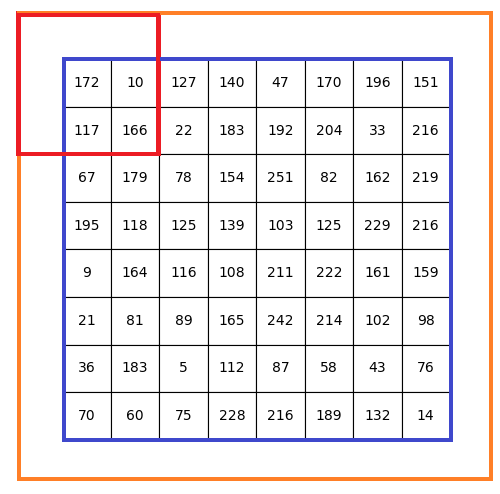

.. role:: raw-latex(raw)
    :format: latex html
    
卷积神经网络
================

从最朴素的 KNN 到非常复杂的多层神经网络，对于图像输入均被拆解为了单个的像素，组成一维的向量，相似的图形在高维空间聚集在一起（向量距离较小），KNN 通过 K 邻近投票的方式来判别输入的数字，而神经网络则使用激活函数在高维度变换成一个一个格子将这些高维空间的点（向量终点）区分开来，但是图像是对 3D 世界的 2D 映射，显然再把 2D 数据拆解成一维向量数据，必定会丢失像素行间信息，这和人脑对图像的识别是有本质区别的。

最直观的感受就是当一张图片在进行角度旋转时，它在高维空间的向量终点将会有非常大的移动，很容易被误判，而然人脑不会因为旋转而无法识别数字，甚至对识别率没有任何影响。为什么？人脑考虑了图片的空间结构，而不单单是一维的像素点。本质上讲 2D 图片的空间结构构成了它要表达的图像内容，是图像内容的基本反映。

实际上，一幅图片的大部分像素对人来讲会被人脑直接过滤掉，而只留下最本质的东西，而KNN和全连接的神经网络它以同等方式处理距离很远和临近的像素值，这样的整个空间结构必须从训练数据中通过强力计算进行推断。

卷积神经网络（Convolutional Neural Network，CNN 或 ConvNets）在图像识别中的表现优异，它通过局部感受野（local receptive fields），共享权重（shared
weights），和池化（pooling，也被称为混合或汇聚）技术来提取图像的空间特性，在大大降低计算量的基础上表现出了令人印象深刻的识别能力。CNN 与 NN 的区别在于它不是直接把像素向量作为输入，而是提前对图像做一些特征提取处理，然后再把特征值作为 NN 的输入，所以其名字在 NN 前加上 C（Convolutional）是名副其实的。

卷积神经网络的基础在于卷积（convolution）处理，我们从卷积操作入手认识 CNN 的本质特性（从最浅的地方下水，总不会是太坏的选择！）。

认识卷积
----------

图像卷积（Convolution）可以提取图像更多特征。卷积的本质就是大矩阵和小矩阵的元素对应乘法运算（不是点积）结果相加，使用结果值替换卷积核坐标元素值，并且滑动小矩阵遍历大矩阵所有可被卷积的元素。

.. figure:: imgs/practice/convol.png
  :scale: 100%
  :align: center
  :alt: convol

  卷积示意图

如上图所示，卷积的运算步骤如下：

- 定义一个卷积核（小矩阵），上图中的红色窗口就是一个 3*3 的卷积核，之所以使用方阵是便于快速计算（底层库进行方阵运算速度更快）
- 从左上角开始（x=0,y=0）将卷积核对齐图片（大矩阵，这里认为是一张灰度图或者一张图片彩色图的单个颜色通道），卷积核矩阵元素与重合的对应元素相乘，乘积相加，结果替换卷积核中间的位置（这就是为何卷积核大小选取奇数的原因）的元素。注意替换是在图片矩阵的副本中进行。
- 每计算一次，向右滑动一次卷积核（红色窗口），直到卷积核对齐到最右侧，然后回到最左侧向下滑动一个像素
- 直至计算结束，可以看到蓝色窗口中的所有元素都被替换（卷积）了

对于蓝色窗口外部的元素，显然没有办法进行卷积运算，只能够根据需要人为设定，比如保持不变，或者清0（这基于边缘像素对物体识别影响很小的假设），或者采用艺术化处理。

.. code-block:: python
  :linenos:
  :lineno-start: 0
  
  # convolute.py
  def convolution_ignore_border(img, kernel):
      from skimage.exposure import rescale_intensity
      
      yksize, xksize = kernel.shape
      
      # kernel must with odd size
      if yksize % 2 == 0 or xksize % 2 == 0:
          print("kernel must with odd size")
          return None
  
      y_slide_count = img.shape[0] - kernel.shape[0]
      x_slide_count = img.shape[1] - kernel.shape[1]    
      if x_slide_count < 0 or y_slide_count < 0:
          print("img size too small to do convolution")
          return None
  
      newimg = img.copy().astype(np.float64)    
  
      # sliding kernel along y(right) and x(down) from left-top corner
      centery, centerx = yksize >> 1, xksize >> 1
      for y in range(0,y_slide_count+1):
          for x in range(0,x_slide_count+1):
              sum = (img[y:y+yksize,x:x+xksize] * kernel).sum()
              # round reducing truncation error float64 -> uint8
              newimg[y+centery, x+centerx] = round(sum)

      # rescale the output image in range [0, 255]
      newimg = rescale_intensity(newimg, in_range=(0, 255))
      return (newimg * 255).astype(np.uint8)
  
  np.random.seed(0)
  matrix = np.random.randint(0, 256, size=(8, 8), dtype=np.uint8)
  kernel = np.ones((3, 3)) * 1.0 / 9
  newimg = convolution_ignore_border(matrix, kernel)
  
下图中左侧马赛克图片就是上面的数字矩阵对应的灰度图像，这里使用 3*3 的平均模糊卷积核，经过卷积处理之后，图像明显变模糊了。但是由于我们没有对边缘像素进行任何处理，所以边缘显得非常突兀，一个可行的办法是对原图像边缘进行扩展处理，然后再进行卷积。

.. figure:: imgs/practice/convol_cmp.png
  :scale: 100%
  :align: center
  :alt: convol

  卷积处理效果对比图

OpenCV 中的 copyMakeBorder 函数用来对边界进行插值（borderInterpolate）处理。使用copyMakeBorder将原图稍微放大，就可以处理边界的情况了。扩充边缘的插值处理有多种方式：

- BORDER_REPLICATE，复制边界值填充，形如：aaaaaa|abcdefgh|hhhhhhh，OpenCV 中的中值滤波medianBlur采用的边界处理方式。
- BORDER_REFLECT，对称填充，形如：fedcba|abcdefgh|hgfedcb
- BORDER_REFLECT_101，对称填充，以最边缘像素为轴，形如：gfedcb|abcdefgh|gfedcba，这种方式也是OpenCV边界处理的默认方式(BORDER_DEFAULT=BORDER_REFLECT_101)也是filter2D, blur, GaussianBlur, bilateralFilter 的默认处理方式，这种方式在边界处理中应用是最广泛的。
- BORDER_WRAP，对边镜像填充，形如：cdefgh|abcdefgh|abcdefg
- BORDER_CONSTANT，以一个常量像素值(由参数 value给定)填充扩充的边界值，这种方式多用在仿射变换，透视变换中。

在卷积神经网络（Convolutional Neural Networks）中通常采用清 0 处理，也即使用 BORDER_CONSTANT 方式，value 设置为 0。

  边框扩展卷积示意图

支持边框扩展的卷积操作实现：

.. code-block:: python
  :linenos:
  :lineno-start: 0
  
  def convolution(img, kernel):
      from skimage.exposure import rescale_intensity
      
      yksize, xksize = kernel.shape
      # kernel must with odd size
      if yksize % 2 == 0 or xksize % 2 == 0:
          print("kernel must with odd size")
          return None
  
      newimg = img.copy().astype(np.float64)
      y_slide_count,x_slide_count = img.shape
  
      left_right = (xksize - 1) // 2
      top_bottom = (yksize - 1) // 2
      img = cv2.copyMakeBorder(img, top_bottom, top_bottom, 
                               left_right, left_right, cv2.BORDER_REFLECT_101)
  
      # sliding kernel along y(right) and x(down) from left-top corner
      for y in range(0,y_slide_count):
          for x in range(0,x_slide_count):
              sum = (img[y:y+yksize,x:x+xksize] * kernel).sum()
              # round reducing truncation error float64 -> uint8
              newimg[y, x] = round(sum)
      
      # rescale the output image in range [0, 255]
      newimg = rescale_intensity(newimg, in_range=(0, 255))
      return (newimg * 255).astype(np.uint8)

为了验证程序的正确性，这里与 OpenCV 实现的 filter2D 进行卷积的结果进行对比：

.. code-block:: python
  :linenos:
  :lineno-start: 0
  
  def verify_convolution(size=8):
      np.random.seed(0)
      matrix = np.random.randint(0, 256, size=(size, size), dtype=np.uint8)
      kernel = np.ones((3, 3)) * 1.0 / 9
      newimg = convolution(matrix, kernel)
      print(np.all(newimg == cv2.filter2D(matrix, -1, kernel)))
  
  verify_convolution()
  
  >>>
  True

实验证明我们的实现和 OpenCV 的实现结果完全相同，接下来我们使用不同的卷积核来检验图片的处理效果，并对比两种实现的性能差别。

图片卷积处理
---------------

首先定义一些常见的卷积核。例如均值模糊卷积核：

.. code-block:: python
  :linenos:
  :lineno-start: 0
  
  smallblur = np.ones((7, 7), dtype=np.float64) * (1.0 / (7 * 7))
  largeblur = np.ones((21, 21), dtype=np.float64) * (1.0 / (15 * 15))  

锐化卷积核：

.. code-block:: python
  :linenos:
  :lineno-start: 0
  
  sharpen = np.array(([0, -1, 0],
                      [-1, 5, -1],
                      [0, -1, 0]), dtype=np.int32)

用于边缘处理的拉普拉斯卷积核，Sobel 卷积核：

.. code-block:: python
  :linenos:
  :lineno-start: 0
  
  laplacian = np.array(([0, 1, 0],
                        [1, -4, 1],
                        [0, 1, 0]), dtype=np.int32)

  sobelX = np.array(([-1, 0, 1],
                     [-2, 0, 2],
                     [-1, 0, 1]), dtype=np.int32)
  sobelY = np.array(([-1, -2, -1],
                     [0, 0, 0],
                     [1, 2, 1]), dtype=np.int32)

浮雕图案卷积核：

.. code-block:: python
  :linenos:
  :lineno-start: 0
  
  emboss = np.array(([-2, -1, 0],
                     [-1, 1, 1],
                     [0, 1, 2]), dtype=np.int32)
                     
.. figure:: imgs/practice/conimgs.png
  :scale: 100%
  :align: center
  :alt: convol

  各种卷积核卷积效果图

尽管已经验证我们手动实现的卷积函数和 OpenCV 的 filter2D 函数结果相同，然而对比一下运算效率更有意义：

.. code-block:: python
  :linenos:
  :lineno-start: 0
  
  def convolute_speed_cmp(count=100, type=0):
      image = cv2.imread(arg_get("image"))
      gray = cv2.cvtColor(image, cv2.COLOR_BGR2GRAY)
      kernel = np.ones((3, 3)) * 1.0 / 9
  
      start = time.time()
      if type == 0:
          for i in range(0,count):
              convolution(gray, kernel)
          print("convolution cost walltime {:.02f}s with loop {}"\
                .format(time.time()-start, count))
      else:
          for i in range(0,count):
              cv2.filter2D(gray, -1, kernel)
          print("filter2D cost walltime {:.02f}s with loop {}" \
                .format(time.time()-start, count))
          
  convolute_speed_cmp(10, 0)
  convolute_speed_cmp(10000, 1)

验证结果对比惊人，为了节省计算时间，不得不分成两个分支，以进行不同的循环。测试图片 640 * 480 的分辨率，竟然达到了 4000 倍的性能差距，笔者当然不相信 OpenCV 能进行如此强劲的优化，很显然我们只是对同一幅图片进行循环处理，OpenCV 内部进行了类似缓存的处理，但是即便每次循环都采用不同的图像，效果依然有 2000 倍之差。

.. code-block:: sh
  :linenos:
  :lineno-start: 0
  
  $ python convolute.py  --image imgs\Monroe.jpg
  convolution cost walltime 21.74s with loop 10
  filter2D cost walltime 5.42s with loop 10000

一个可行的优化方式是对卷积核进行扩展以代替 W*H（图片宽和高的像素数）次的窗口滑动，此时只需要向右向下滑动 kW 和 kH 次，这可以节约大量的循环处理时间。如果要深入理解 OpenCV 的效果为何如此强劲，就要从它的源码入手。

Fast 版本的卷积函数有些复杂，实现也要有些技巧，不过这种优化是值得的：

.. code-block:: python
  :linenos:
  :lineno-start: 0

  def convolution_fast(img, kernel):
      from skimage.exposure import rescale_intensity
      
      yksize, xksize = kernel.shape
      # kernel must with odd size
      if yksize % 2 == 0 or xksize % 2 == 0:
          print("kernel must with odd size")
          return None
  
      newimg = img.copy().astype(np.float64) * 0
  
      # extend four borders to convolute border pixels
      left_right = (xksize - 1) // 2
      top_bottom = (yksize - 1) // 2
      img = cv2.copyMakeBorder(img, top_bottom, top_bottom, 
                               left_right, left_right, 
                               cv2.BORDER_REFLECT_101)
    
      # extend kernel as big as the img size, but no bigger than img
      ytile = img.shape[0] // yksize
      xtile = img.shape[1] // xksize
      nkernel = np.tile(kernel, (ytile, xtile))
      
      # sliding kernel along y(right) and x(down) from left-top corner
      ynksize, xnksize = nkernel.shape

      for y in range(0, yksize):
          for x in range(0, xksize):
              # use nkernel convolute img, so have a cross window
              w_window = min([img.shape[0] - y, ynksize])
              h_window = min([img.shape[1] - x, xnksize])
              
              # resize the window round base kernel size
              (ny, ry) = divmod(w_window, yksize)
              (nx, rx) = divmod(h_window, xksize)
              
              w_window  -= ry
              h_window  -= rx
              
              tmp = img[y:w_window+y, x:h_window+x] * nkernel[:w_window, :h_window]
              tmp = tmp.reshape(ny, yksize, nx, xksize).sum(axis=(1, 3))
  
              for i in range(tmp.shape[0]):
                  for j in range(tmp.shape[1]):
                      newimg[y + i * yksize, x + j * xksize] = round(tmp[i,j])
  
      # rescale the output image in range [0, 255]
      newimg = rescale_intensity(newimg, in_range=(0, 255))
      return (newimg * 255).astype(np.uint8)

与此同时更新性能测试函数，type 为 0 和 2 时分别对应快速版本和普通版本。

.. code-block:: python
  :linenos:
  :lineno-start: 0
  
  def convolute_speed_cmp(image=None, count=100, type=0):
      if image is None:
          image = cv2.imread(arg_get("image"))
          gray = cv2.cvtColor(image, cv2.COLOR_BGR2GRAY)
      else:
          gray = image

      kernel = np.ones((3, 3)) * 1.0 / 9
      start = time.time()
      if type == 0:
          for i in range(0,count):
              convolution_fast(gray + count, kernel)
          print("convolution_fast cost walltime {:.02f}s with loop {}"\
                .format(time.time()-start, count))
      elif type == 1:
          for i in range(0,count):
              cv2.filter2D(gray + count, -1, kernel)
          print("filter2D cost walltime {:.02f}s with loop {}"\
                .format(time.time()-start, count))
      else:
          for i in range(0,count):
              convolution(gray + count, kernel)
          print("convolution cost walltime {:.02f}s with loop {}"\
                .format(time.time()-start, count))        
  
  convolute_speed_cmp(None, 10, 0)
  convolute_speed_cmp(None, 10, 2)

结果显示，快速版本比原函数提高了 4 倍左右的性能，但是距离 OpenCV 的优化版还是差了上千倍。这一结果令人异常深刻。如果直接采用底层语言，性能将会继续提升，采用分治法协同处理是加速的另一个选择。
显然 OpenCV 的代码实现一定经过大量的优化，读一读源码将受益匪浅。

.. code-block:: sh
  :linenos:
  :lineno-start: 0
  
  $ python convolute.py  --image imgs\Monroe.jpg
  convolution_fast cost walltime 5.95s with loop 10
  convolution cost walltime 20.47s with loop 10

我们无需直接编写底层代码，而能一窥底层代码能带来的近似的优化性能，numba 就可以实现，只需要在优化函数前添加装饰器：

.. code-block:: python
  :linenos:
  :lineno-start: 0
  
  from numba import jit
  
  @jit
  def convolution_fast(img, kernel):
  ......

效果很明显，性能大约提升了 13 倍：

.. code-block:: sh
  :linenos:
  :lineno-start: 0
  
  $ python convolute.py  --image imgs\Monroe.jpg
  # numba 优化版本
  convolution cost walltime 3.10s with loop 10
  
  # 维优化版本
  convolution cost walltime 40.57s with loop 10

使用 numba 时提升性能时是有前提条件的，通常当代码中有很多大的 for 循环时，优化效果很好，如果是小循环，或者逻辑处理代码，则可能效果差强人意，这里之所以选择优化 convolute 而不是 convolute_fast 就是基于这种原因，实际上 convolute_fast 优化后的效果反而没有 convolute 效果好。

实践中的优化要基于目标环境通过各个方面（瓶颈分析，软件优化，硬件增强）进行优化，没有一刀切的黄金策略。

CNN 三要素
---------------

  CNN 架构图（图片自 Python Machine Learning）

局部感受野
~~~~~~~~~~~~~~

如果对卷积处理有了深刻认识，那么局部感受野实际上就是一个小矩阵（卷积核）的加权操作，通常把它作为名词解释，也即小矩阵遮住的图像的局部区域。笔者更喜欢这样的解释：小矩阵就是图片的局部（一个小窗口），而“感受”就是加权计算，“野”就是计算结果。无数的局部感受野结果构成新的矩阵，被称为特征图（feature map）。

使用不同的卷积核可以提取到不同的图像特征图，例如锐化，模糊，浮雕效果等。这些特征图从 2D 空间上来反应图片的根本特征。

考虑一幅 MNIST 数字图像，那么它是一个 28*28 的矩阵，使用 3*3 的卷积核，那么从上到下卷积核进行单跨距移动，可以移动 28 - 3 + 1 = 26 次，同样从左到右也可以移动 26 次，就得到一个 26*26 的特征图（特征矩阵）。（这里没有考虑边缘插值处理）

如果使用 5*5 的卷积核，则得到一个 24*24 的特征图。

如果卷积层也用神经网络的一层实现，那么就对应了第 1 层到第 2 层的转换，显然第 1 层输入节点有 28*28 个，第 2 层接受输入到节点有 24*24 个，它们显然不是全连接的：

- 左上角第 1 个感受野中的 25 个像素对应第 1 层中的 25 个输入节点，它们与其他感受野共享一组权重（卷积核）和一个偏置量。
- 第 2 层有 24*24 个节点，对应前层每一感受野的输入，并使用激活函数产生输出。
- 这种卷积加偏置的处理就是一个函数操作，所以输入层到隐藏层的处理也被称为特征映射。

在CNN中，一组共享权重和偏置一起被称为一个卷积核或者滤波器。用于 MNIST 识别的 LeNet 网络使用 6 个 5*5 的卷积核。CNN 中的第 2 层被称为卷积层，当然卷积层可以有多层，也即对特征图继续卷积。

  不同卷积核对MNIST数字 0 的处理效果

我们已经看到不同卷积核对于一幅图片的作用，那么从直观上感受卷积层到底在做什么：

- 数字 0 在进行模糊处理后倾向于向整幅图片扩散强度
- 锐化之后，中间形成明显的孔洞
- 拉普拉斯变换可以发现 0 可以成为两个嵌套的圆环
- Sobel 算子在 x，y 方向的导数将 0 切割成两个弧形
- 浮雕处理后 0 在四个方向被平切

有些变换得到的特征并不适用于人脑对数字的识别，例如浮雕处理后到底对数字识别有什么裨益，当然卷积核有成千上万种供选择，也不可能一一分析。但是人脑是够识别 0 在于它就是一个圈，也许这个圈不太圆，所以锐化操作和拉普拉斯变换就能清晰地反应这一事实，不难假想它们在卷积层对应的节点输入权重可能被调整得比较大，这有益于对手写数字的识别。当然实际上所有的卷积核都是动态学习到的，我们不能指望凑巧生成了一个拉普拉斯变换的卷积核，但是这种直觉理解是有益的。

实际上，人脑还会结合上下文来进行识别，如果在一串数字中，那么圆形就被判定为数字 0，如果是在单词中，显然是字母 o。从这一观点出发机器学习显然具有非常大探索空间。

共享权重和偏置
~~~~~~~~~~~~~~

共享权重和偏置并不是 CNN 网络的发明，而是采用由提取图像特征的算法：卷积来决定的。一幅图片的拍摄环境不会有剧烈变化，只是 3D 世界的一瞬间的采样，所以在这一幅图的不同局部均反映了共同的环境特征：强度，色度等等，所以对于不同的感受野采用不同的权重倒是更令人费解。

共享权重和偏置附带来的好处就是大大降低了网络复杂度和计算量，性能提高了不止一个数量级，如果图片尺寸更大则更明显：

- 设想全连接网络的权重数目在隐藏层 30 个节点情况下，权重数目为：28*28*30 = 23520。
- 而共享权重只需要 (5*5 + 1)*3 = 78 个权重参数，其中 5*5 为卷积核大小，1 为偏置，3 为特征图数目。

池化
~~~~~~~~~~~~~

卷积层之后紧跟的是池化层（pooling layer），对各种特征图进行汇聚处理，以减少传入下一层的特征数量。池化层可以看作是一种特征抽取方式。

池化操作非常容易理解，例如 28*28 的图像矩阵，以 2*2 的池化窗口进行切割，一共可以分为 12*12 个区域，每个区域有 2*2 = 4 个激活值，那么就对这 4 个值进行抽取：

- 选择最大的值，最大值池化（max-pooling）。
- Mean 抽取，也即求平均值。
- MSE抽取，也即标准差抽取，又被称为 L2 池化（L2 pooling）。

当然池化窗口有可以指定跨距（stride）来进行滑动，而不是以窗口单位进行移动。

池化层和卷积层共同完成了对数据特征提取和空间压缩的作用，实际上如果把卷积层的跨距设置得比较大，可以避免使用池化层（池化层本质是丢弃了一些小区域的特征，令该区域最典型一个小区域的特征代表整个区域）。

池化层的输出要对接一个全连接的神经网络，当然也可以只有一层全连接层也即输出层，节点数等于分类数。

实现 CNN
------------

通过以上分析，一个最简的 CNN 模型结构如下所示，其中 FC 表示全连接层（fully-connected），激活函数使用 ReLU：

.. code-block:: sh
  :linenos:
  :lineno-start: 0
  
  INPUT -> CONV(ReLU) -> POOLING -> FC(SOFTMAX) -> OUTPUT

我们使用 Keras 来一步步构建 CNN 神经网络，Keras 对一些深度神经网络的学习库进行了统一接口封装，例如 TensorFlow, CNTK, 或者 Theano，它们被作为后端运行。Keras 支持快速建模和实验，能够以最小的时延把你的想法转换为实验结果。Keras 就是深度学习的“炼丹炉”，将深度学习的六大要素（网络层，损失函数，激活函数，正则化方法，梯度下降优化和参数初始化策略）以模块的方式组合起来，非常易于使用。 正如 Python 的 slogan “人生苦短，我用 Python”，同样适用于 Keras !

这里使用 TensorFlow 作为后端，并借助 GPU 加速。这里依然使用 MNIST 数据集作为“炼丹”原料，感受一下卷积神经网络到底比传统的全连接神经网络优势在哪里。

MNIST 数据集有 40000 个训练集，10000 个测试集，每幅图片是分辨率为 28*28 的灰度图，所以没有颜色通道，也即颜色通道是 1。当使用 TensorFlow 作为后端时，颜色通道在最后，所以我们的输入数据的 shape 为 (40000,28,28,1)，我们要根据通道设置来进行数据转换：

.. code-block:: python
  :linenos:
  :lineno-start: 0
  
  def cnn_load_mnist(ratio=1):
      num_classes = 10
      img_rows, img_cols = 28,28  

      x_train, y_train = dbload.load_mnist(r"./db/mnist", kind='train', 
                                           count=int(ratio*40000))
      x_test, y_test = dbload.load_mnist(r"./db/mnist", kind='test', 
                                         count=int(ratio*10000))
      
      # 对应 ∼/.keras/keras.json 中的 image_data_format 配置
      if K.image_data_format() == 'channels_first':
          x_train = x_train.reshape(x_train.shape[0], 1, img_rows, img_cols)
          x_test = x_test.reshape(x_test.shape[0], 1, img_rows, img_cols)
      else:
          x_train = x_train.reshape(x_train.shape[0], img_rows, img_cols, 1)
          x_test = x_test.reshape(x_test.shape[0], img_rows, img_cols, 1)
      
      # 归一化处理
      x_train = x_train.astype('float32')
      x_test = x_test.astype('float32')
      x_train /= 255
      x_test /= 255
      
      # 转化为对分类标签 
      y_train = keras.utils.to_categorical(y_train, num_classes)
      y_test = keras.utils.to_categorical(y_test, num_classes)
          
      return x_train, y_train, x_test, y_test

'channels_first' 用于 Caffe 和 Theano，'channels_first' 用于 TensorFlow。另外要注意将类别标签转化为多分类标签，例如两个样本的标签为 [5, 0] 转换为二分类矩阵：

.. code-block:: sh
  :linenos:
  :lineno-start: 0

  # 向量类别标签 shape 为 (2,)
  [5 0]
  
  # 转化为二分类矩阵，shape 为 (2, 10)
  [[ 0.  0.  0.  0.  0.  1.  0.  0.  0.  0.]
   [ 1.  0.  0.  0.  0.  0.  0.  0.  0.  0.]]

创建 CNN 序列模型，注意我们的模型没有使用池化层:

- 卷积层：32 个 3*3 的卷积核，输入为图片的高和宽以及通道数，灰度图通道数为 1
- padding 为 same 表示进行边缘插值处理，这样卷积后的特征图大小和输入的图像保持不变
- 卷积层的激活函数设置为 relu
- Flatten 进行一维化处理，以便与全连接层 Dense 对接
- Dense 为全连接层，节点数就是分类数
- Dense 节点的激活函数使用柔性最大值函数（softmax）。 

.. code-block:: python
  :linenos:
  :lineno-start: 0

  from keras.models import Sequential
  from keras.layers.convolutional import Conv2D
  from keras.layers.core import Activation
  from keras.layers.core import Flatten
  from keras.layers.core import Dense
  from keras.layers import Dropout
  from keras.optimizers import SGD
  from keras.layers import Conv2D
  
  def cnn_model_create(width, height, depth, classes):
    model = Sequential()
    input_shape = (height, width, depth)
    if K.image_data_format() == "channels_first":
        input_shape = (depth, height, width)
    
    # define the first (and only) CONV => RELU layer
    model.add(Conv2D(32, (3, 3), padding="same", input_shape=input_shape))
    model.add(Activation("relu"))

    # softmax classifier
    model.add(Flatten())
    model.add(Dense(classes))
    model.add(Activation("softmax"))
    
    return model

model 在使用之前需要编译，其中参数：

- loss 指定代价函数，这里为多分类交叉熵代价函数 "categorical_crossentropy"。
- optimizer 指定梯度下降的优化器，这里使用最原始的 sgd，学习率 lr 设置为 0.001。
- metrics 指定模型评估标准，这里使用准确率 "accuracy"。

编译后使用 fit 训练模型：

- validation_split 指定交叉验证集占训练集数据比例，注意这里不会对训练集进行乱序处理，也即选择最后的十分之一样本，如果样本不是随机的，要首先进行 shuffle 处理。
- batch_size 指定训练批数据量大小，这里为 256
- epochs 指定在数据上训练的轮次
- verbose 0 不输出日志信息，1 为输出进度条记录，2 为每个 epoch 输出一行记录。
- shuffle 为 True，则每一轮次进行乱序处理。

.. code-block:: python
  :linenos:
  :lineno-start: 0
  
  def cnn_mnist_test():
      epochs = 10
      x_train, y_train, x_test, y_test = cnn_load_mnist(1)

      # # SGD(lr=0.005)
      model = cnn_model_create(width=28, height=28, depth=1, classes=10)
      model.compile(loss="categorical_crossentropy", optimizer=SGD(lr=0.001), 
                    metrics=["accuracy"])
      model.fit(x_train, y_train, validation_split=0.1, 
                    batch_size=256, epochs=epochs, verbose=1,
                    shuffle=True)       
  
      score = model.evaluate(x_test, y_test, verbose=1)
      print('Test loss:', score[0])
      print('Test accuracy:', score[1]) 

在经过 10 轮的迭代训练后，得到如下结果，看来我们对 CNN 过度自信了。

.. code-block:: sh
  :linenos:
  :lineno-start: 0
  
  Test loss: 0.571357248878
  Test accuracy: 0.8684

尝试把优化参数从 SGD 更改为 keras.optimizers.Adadelta()，我们将会对 CNN 重获信心。但是记住没有进行更深入的比较是不公正的：

- 与一个全连接浅层神经网络 NN [28*28,50,10] 作比较，它有 40,534 个权重系数
- 而实际上这里的 CNN 的权重系数达到了 251,210 个，这样看 CNN 不仅没有降低计算量，实际上超过了全连接网络的 5 倍以上，CNN 的加速主要得益于 GPU 对卷积的高效处理。特征图转换为一维数据后与全连接层之间参数剧增。在不考虑池化技术的情况下，每个特征图都是一个28*28 的输入向量，多少个特征图，就增加了多少倍的参数。CNN 的优势在于对大分辨率图片（200以上）的处理上，此时的卷积核可以很大，池化窗口也可以很大，此时的性能将超越全连接神经网络。
- CNN 网络的好处在于它考虑了区域 2D 特征，也即当图片轻微变形后（平移，旋转，扭曲），不会影响识别率，而 NN 则不具有这个特性，这里要强调这一点。

.. code-block:: python
  :linenos:
  :lineno-start: 0
  
  model.compile(loss="categorical_crossentropy", 
                optimizer=keras.optimizers.Adadelta(), 
                metrics=["accuracy"])

更新后的训练结果为：

.. code-block:: sh
  :linenos:
  :lineno-start: 0
  
  Test loss: 0.0667042454224
  Test accuracy: 0.9797

至此我们使用一个简单的 CNN 网络将准确度推向了新高度。

CNN 的优势
------------

我们分析过 CNN 的优势在于大分辨率图片的快速学习，另外就是它考虑了 2D 图片特征，所以对于图片轻微的变形具有更强鲁棒性。为了进行这种对比，我们尝试对测试的数据进行平移扩展处理，也即上下左右各移动 offset_pixels 个像素，这样我们就在原来的 10000 个测试集上扩展为 40000 个测试集。

.. code-block:: python
  :linenos:
  :lineno-start: 0
  
  expand_file = r"./db/mnist/mnist_testexp.pkl.gz"
  def expand_mnist(count=0, offset_pixels=1):
      import pickle,gzip
      import scaler
      
      ef = expand_file + str(offset_pixels)
      if os.path.exists(ef):
          print("The expanded training set already exists.")
          return
      
      x_train, y_train = __load_mnist("./db/mnist", kind='t10k', 
                                      count=count, dtype=np.uint8)
      
      # move down 1 pixel
      x_down = np.roll(x_train, offset_pixels, axis=1)
      x_down[:, 0, :] = 0
      
      # move up 1 pixel
      x_up = np.roll(x_train, -offset_pixels, axis=1)
      x_up[:, -1, :] = 0
      
      # move right 1 pixel 
      x_right = np.roll(x_train, offset_pixels, axis=2)
      x_right[:, :, 0] = 0
  
      # move left 1 pixel 
      x_left = np.roll(x_train, -offset_pixels, axis=2)
      x_left[:, :, -1] = 0
  
      expand_x = np.vstack([x_down, x_up, x_right, x_left])
      expand_x, expand_y = scaler.shuffle(expand_x, np.tile(y_train, 4))
      print("Saving expanded data. This may take a few minutes.")
      with gzip.open(ef, "w") as f:
          pickle.dump((expand_x, expand_y), f)

代码具有自解释性，count 指定加载训练集个数，0 表示加载所有，这样扩展后的数据就是 4\*count 个。offset_pixels 指定上下左右移动的像素个数。

.. code-block:: python
  :linenos:
  :lineno-start: 0
    
  def load_expand_mnist(count=0, offset_pixels=1):
      import pickle,gzip
      
      ef = expand_file + str(offset_pixels)
      if not os.path.exists(ef):
          print("The expanded test set not exists.")
          return
  
      f = gzip.open(ef, 'rb')
      expand_x, expand_y = pickle.load(f)
      f.close()
      
      count = int(count)
      if count <= 0:
         return expand_x, expand_y
      return expand_x[0:count], expand_y[0:count]

load_expand_mnist 用于加载扩展数据集。我们这里尝试移动 1/3 个像素，比较 NN 和 CNN 的效果。

  ======= =========== ============= =============
  模型     原数据     平移1像素     平移3像素
  ======= =========== ============= =============
  NN       0.9624       0.9135       0.3726
  CNN      0.9797       0.9582       0.5918
  ======= =========== ============= =============

显然 NN 抗平移性能远远差于 CNN 网络，随着平移像素的增加，NN 的识别率急剧下降，另外注意到我们的 CNN 没有使用池化处理，否则优势将更明显。但是我们的验证也说明 CNN 网络并不能抵抗较大的变形，但是这对于人脑识别基本没有影响，显然 CNN 学习到的特征与背景严重相关，只要前景在背景上进行了移动，学习到的特征就开始失效。所以使用 CNN 前依然要对数据进行中心化等预处理。

显然如果我们把扩展数据添加到训练集，测试集上的结果将会继续变好，实际上如果我们继续对图像进行倾斜，旋转，扭曲等处理，这一结果将更好，这给神经网络以 3D 的视角来理解输入的图像。即便只添加上下左右移动 1 像素的扩展数据集，我们在测试集上获得了如下正确率：

.. code-block:: python
  :linenos:
  :lineno-start: 0
    
  Test loss: 0.0305156658327
  Test accuracy: 0.9913

现在我们可以尝试修改模型：增加池化层，以及随机失活（dropout，也称弃权）层，这里直接借用 Keras 示例模块 examples/mnist_cnn.py:

.. code-block:: python
  :linenos:
  :lineno-start: 0

  def cnn_model_create2(width, height, depth, classes):
      model = Sequential()
      input_shape = (height, width, depth)
      if K.image_data_format() == "channels_first":
          input_shape = (depth, height, width)
      
      model = Sequential()
      model.add(Conv2D(32, kernel_size=(3, 3),
                       activation='relu',
                       input_shape=input_shape))
      model.add(Conv2D(64, (3, 3), activation='relu'))
      model.add(MaxPooling2D(pool_size=(2, 2)))
      model.add(Dropout(0.25))
      model.add(Flatten())
      model.add(Dense(128, activation='relu'))
      model.add(Dropout(0.5))
      model.add(Dense(classes, activation=tf.nn.softmax))
      
      return model

该模型的上传者声称达到了 99.25% 的准确率，我们在扩展训练集上进行训练，得到惊人的结果，也即在 10000 张测试图片中，只有 11 张被分类错误，实际上这 11 张图片即便让人来辨识，也无法分清。
 
.. code-block:: sh
  :linenos:
  :lineno-start: 0
  
  Test loss: 0.004121249028
  Test accuracy: 0.9989

  扩展数据上的学习曲线

观察扩展数据上的学习曲线是一件很有意思的事情：与以往的学习曲线不同，校验集的准曲率竟然遥遥领先于训练集，也即在第一个训练周期，训练集上的准确率还在 85% 左右，而它在校验集上的泛化能力达到了惊人的 97%，另外在迭代 15 次之后，模型并没有饱和，而是在 99% 徘徊。或许我们继续增加迭代次数来获取 100% 的识别率，但是这已经无关紧要。

显然 CNN 从我们提供的训练集上很快就学习到了手写数字的基本特征，而不是一些对分类无效的细枝末节，这似乎和人类观察事物有“点儿”相像了：只需要看一张黑色印刷的数字 0，然后再看一张红色印刷的数字 0，接着看一张缩写或者放大版的 0，并且告诉他这些全都是数字 0，那么人脑立即就能获取 0 和哪些特征是无关的（颜色，大小等），而能立即留下 0 的本质特征印象（一个抽象的数字符号），人脑表现出在小数据上的强劲的泛化能力（学习能力）。

通过人为扩展训练集提高准确率是非常可行的，前提就是扩展后的数据必须反映数据的本质特征，而不能丢失这些特征，比如 0-9 手写数字，平移和旋转都不会丢失数字特征，而如果进行剪切和过分扭曲那么就会导致识别率降低了。

模型保存和加载
----------------

显然当我们扩展训练数据时，并不希望每次都从 0 开始训练，而是期望从现有的基础上继续使用扩展数据训练，或者直接加载模型并进行预测。

model.save 将 Keras 模型和权重保存在一个 HDF5 文件中，该文件将包含：

- 模型的结构，以便重构该模型
- 模型的权重
- 训练配置（损失函数，优化器等）
- 优化器的状态，以便于从上次训练中断的地方开始

.. code-block:: python
  :linenos:
  :lineno-start: 0
  
  from keras.models import load_model
  model.save('mnist_model.h5')
  
  
使用keras.models.load_model(filepath)来重新实例化模型，如果文件中存储了训练配置的话，该函数还会同时完成模型的编译

.. code-block:: python
  :linenos:
  :lineno-start: 0
  
  model = load_model('mnist_model.h5')  

可视化工具
--------------

打印模型信息
~~~~~~~~~~~~~~~~~

keras.utils 提供一些有用的函数，print_summary 用于打印模型概况。

.. code-block:: python
  :linenos:
  :lineno-start: 0
  
  from keras.utils import print_summary
  print_summary(model)

  >>>
  Layer (type)                 Output Shape              Param #
  =================================================================
  conv2d_1 (Conv2D)            (None, 28, 28, 32)        320
  _________________________________________________________________
  activation_1 (Activation)    (None, 28, 28, 32)        0
  _________________________________________________________________
  flatten_1 (Flatten)          (None, 25088)             0
  _________________________________________________________________
  dense_1 (Dense)              (None, 10)                250890
  _________________________________________________________________
  activation_2 (Activation)    (None, 10)                0
  =================================================================
  Total params: 251,210
  Trainable params: 251,210
  Non-trainable params: 0

概况中包括层数，每层的属性，总参数个数以及可训练参数个数。第一层 320 = 32\*(3\*3 + 1)，Flatten 处理后的参数个数 25088 = 28\*28\*32，
全连接层 Dense 为输入加上偏置，也即 25088\*10 + 10 = 250890。

plot_model 可以把上述信息图形化：

.. code-block:: python
  :linenos:
  :lineno-start: 0
  
  from keras.utils import plot_model
  plot_model(model, to_file='model.png', show_shapes=True)

  “最简” CNN 模型图

模型训练曲线图
~~~~~~~~~~~~~~~

模型的 fit 函数会返回一个 History 对象。其 History.history 属性是连续 epoch 训练损失和评估值，以及验证集损失和评估值的记录（如果适用），可以使用这些数据绘制代价函数曲线和准确率曲线。 

.. code-block:: python
  :linenos:
  :lineno-start: 0
  
  H = model.fit(x_train, y_train, validation_split=0.1, 
                batch_size=256, epochs=epochs, verbose=1,
                shuffle=True)       
  ......

  plt.figure()
  
  plt.subplot(2,1,1)
  plt.title("Training Loss and Accuracy")
  plt.plot(np.arange(0, epochs), H.history["acc"], c='black', label="Train")
  plt.plot(np.arange(0, epochs), H.history["val_acc"], c='gray', label="Validation")
  plt.ylabel("Accuracy")
  plt.legend(loc='best')
      
  plt.subplot(2,1,2)
  plt.plot(np.arange(0, epochs), H.history["loss"], c='black', label="Train")
  plt.plot(np.arange(0, epochs), H.history["val_loss"], c='gray', label="Validation")
  plt.xlabel("Epochs")
  plt.ylabel("Loss")
  plt.legend(loc='best')
  plt.tight_layout()
  plt.show()

  CNN 模型学习曲线

通过学习曲线可以查看模型的拟合情况，图中可以看出在迭代 6 个周期后可以早停。

Tensorboard 
~~~~~~~~~~~~~~~~

TensorBoard 是由 Tensorflow 提供的一个可视化工具。通过 keras.callbacks.TensorBoard 回调函数将训练时的日志写入固定目录，然后通过Tensorboard 命令可视化测试和训练的标准评估的动态图像，也可以可视化模型中不同层的激活值直方图。

.. code-block:: sh
  :linenos:
  :lineno-start: 0
  
  tensorboard --logdir=./logs

在浏览器中  http://127.0.0.1:6006 查看动态图。

.. code-block:: python
  :linenos:
  :lineno-start: 0
  
  # 在要检测的层添加名称 'features'
  from keras.callbacks import TensorBoard
  tensorboard = TensorBoard(log_dir='./logs',
                            batch_size=256,
                            embeddings_freq=1,                            
                            embeddings_layer_names=['features'],
                            embeddings_metadata='metadata.tsv',
                            embeddings_data=x_test)

  # 添加 callbacks 参数
  H = model.fit(x_train, y_train, validation_split=0.1, 
                batch_size=256, epochs=epochs, verbose=1,
                shuffle=True, callbacks=[tensorboard])       

