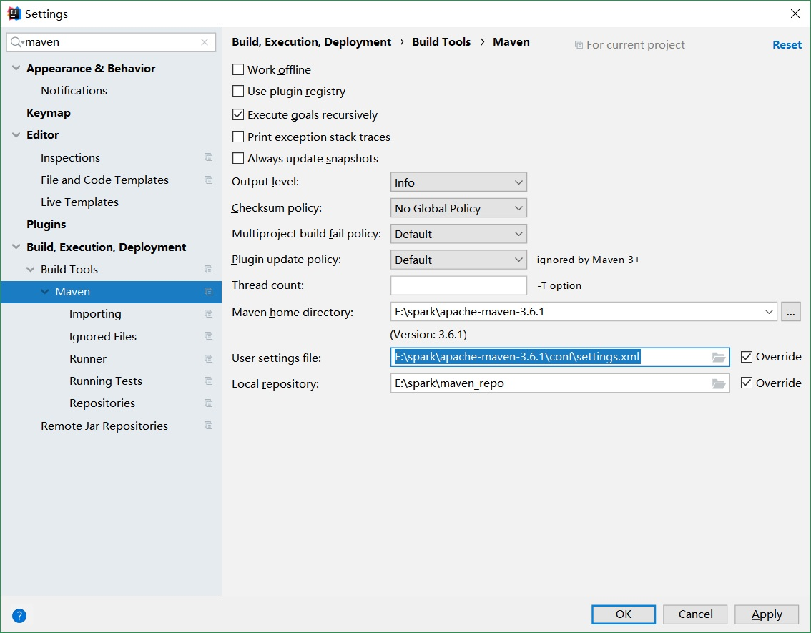

hadoop
================

Hadoop 是一个由 Apache 基金会所开发的分布式大数据存储和处理架构。它实现了一个分布式文件系统（Hadoop Distributed File System），简称 HDFS，用于大数据的存储以及 MapReduce 机制对大数据高效处理。

Hadoop 核心组件:

- HDFS（Hadoop Distributed File System）Hadoop 分布式文件系统.
- YARN，运算资源调度系统
- MapReduce，分布式映射归约编程处理框架。

Hadoop 具有以下优点：

- 高容错性：不依赖于底层硬件，在软件层面维护多个数据副本，确保出现失败后针对这类节点重新进行分布式处理；
- 可以部署在大量的低廉硬件上；
- 针对离线大数据处理的并行处理框架：MapReduce；
- 流式文件访问，一次性写入，多次读取。

与此同时，也有如下缺点：

- 不支持低延迟数据访问；
- 不擅长存储大量的小文件（< block 大小）：寻址数据 block 时间长；元数据记录的存储压力极大。
- 为保证数据一致性，不支持数据随机修改，只可追加或删除后再重新提交。

安装和配置
-------------

版本选择
~~~~~~~~~~~~

在众多的 Linux 发行版中，Ubuntu 通常作为桌面系统使用，具有漂亮的用户界面和高度的软件安装便利性。

与桌面系统不同，服务器要求高性能和高可靠性，所以通常使用 CentOS，Debian 或者 SuSe。

CentOS （Community Enterprise Operating System，社区企业操作系统）。它基于 RHEL （Red Hat Enterprise Linux）依 照开放源代码规定释出的源代码所编译而成。由于出自同样的源代码，因此有些要求高度稳定性的服务器以 CentOS 替代商业版的 RHEL 使用。两者的不同在于CentOS完全开源。

CentOS/RHEL 版本的生命周期具有 7-10 年之久，基本上可以覆盖硬件的生命周期，在整个周期中，软件漏洞都会得到及时的安全补丁支持。这里使用
`CentOS-7-x86_64-DVD-1810.iso <http://isoredirect.centos.org/centos/7/isos/x86_64/CentOS-7-x86_64-DVD-1810.iso>`_。

hadoop 官方在 2.2.0 前默认只提供 32bit 安装包，其后只提供 64bit 安装包，这里选用 hadoop-2.7.5.tar.gz， 它可以运行在 64Bit CentOS 7 系统。

hadoop 使用 java 开发，但是为了提高性能底层代码使用 C 语言开发，这些库文件位于安装包的 lib/native 路径下：

.. code-block:: sh

  libhadoop.a  libhadooppipes.a  libhadoop.so  libhadoop.so.1.0.0  
  libhadooputils.a  libhdfs.a  libhdfs.so  libhdfs.so.0.0.0

可以使用 file 命令查看：

.. code-block:: sh
  
  [root@promote native]# file libhadoop.so.1.0.0 
  libhadoop.so.1.0.0: ELF 64-bit LSB shared object, x86-64, version 1 (SYSV), 
  dynamically linked, BuildID[sha1]=ed024ac48c0f542fa36ddc918a75c51e1c647424, not stripped

如果操作系统和软件 bit 位不匹配，则会在运行 hadoop 时报出如下错误信息：

.. code-block:: sh
  
  util.NativeCodeLoader: Unable to load native-hadoop library for your platform... 

如果要使用官方未提供的版本，需要配置 maven 环境，并使用源码编译，这个过程非常漫长。所以通常采用 64Bit 操作系统配合相应的 hadoop 官方版本。

环境配置
~~~~~~~~~~~~~

hadoop 支持 3 中配置模式，为了验证集群模式，这里使用虚拟机配置两台 CentOS 虚拟机。在实际的生产环境，通常使用 PXE 来批量安装操作系统，除了 IP 地址和主机名之外，所有操作系统配置应保持一致。以下配置均在 root 用户模式下进行。

环境配置如下：

- 主机名 hadoop0（192.168.10.7）用于 master。
- 主机名 hadoop0（192.168.10.8）用于 slave。

均添加普通用户 hadoop，并设置无密码 ssh 登录。以下为配置主机 hadoop0 为例。 

网络配置
````````````

网络配置包括静态 IP 地址，DNS，网关和主机名配置。首先明确主机需要配置的网络信息，通常这些信息会使用主机 MAC 地址生成，并打印成铭牌附在主机上以方便定位，例如：

.. code-block:: sh
  
  IP Address: 192.168.10.7
  Netmask: 255.255.255.0
  Gateway (Router): 192.168.10.1
  DNS Server 1: 192.168.10.1
  DNS Server 2: 8.8.8.8
  Domain Name: hadoop

集群服务器为了保证网络的稳定性，通常使用静态 IP，而不是动态 IP ，系统默认为动态 IP 地址。

.. code-block:: sh
  
  # ifconfig 
  ens33: flags=4163<UP,BROADCAST,RUNNING,MULTICAST>  mtu 1500
          inet 192.168.10.8  netmask 255.255.255.0  broadcast 192.168.10.255
          inet6 fe80::ed0:8205:a345:6ea1  prefixlen 64  scopeid 0x20<link>
          ether 00:0c:29:d0:81:b0  txqueuelen 1000  (Ethernet)
          RX packets 189442  bytes 270275757 (257.7 MiB)
          RX errors 0  dropped 0  overruns 0  frame 0
          TX packets 33656  bytes 2325644 (2.2 MiB)
          TX errors 0  dropped 0 overruns 0  carrier 0  collisions 0
  
ifconfig 查看网口名称，如果服务器配置有多块网卡，则注意连入集群中的网卡，或者做多网卡绑定操作。这里网卡对应网口名称为 ens33。

.. code-block:: sh
  
  # cd /etc/sysconfig/network-scripts
  # cp -f ifcfg-ens33 ifcfg-ens33.bak # 备份原配置文件是个好习惯

编辑 ifcfg-ens33 文件如下：

.. code-block:: sh
  
  # 指定网卡 MAC 地址
  HWADDR=00:0c:29:d0:81:b0 
  TYPE=Ethernet
  # 设置为静态 IP
  BOOTPROTO=staitc
  # 静态 IP 地址 
  IPADDR=192.168.10.7
  # 子网地址
  NETMASK=255.255.255.0
  # 网关
  GATEWAY=192.168.10.1
  # DNS 地址 
  DNS1=192.168.10.1
  DNS2=8.8.8.8
  # 启动时激活 
  ONBOOT=yes

重启网卡，使新配置生效：

.. code-block:: sh

  # systemctl restart network

测试网络连通性，可以 ping 网关，如果可以连接外网，可以 ping 外部网站，例如 www.baidu.com：

.. code-block:: sh
  
  # ping -c 1 192.168.10.1
  PING 192.168.10.1 (192.168.10.1) 56(84) bytes of data.
  64 bytes from 192.168.10.1: icmp_seq=1 ttl=64 time=2.05 ms

配置主机名：

.. code-block:: sh
  
  # 查看主机名
  # hostnamectl status
     Static hostname: localhost.localdomain
  Transient hostname: promote.cache-dns.local

  # 设置主机名
  # hostnamectl set-hostname hadoop0

以上配置修改 /etc/hostname 文件，如果直接修改该文件，则需要重启才能生效，测试主机名：

.. code-block:: sh
  
  # ping -c 1 hadoop0
  PING hadoop0 (192.168.10.7) 56(84) bytes of data.
  64 bytes from promote.cache-dns.local (192.168.10.8): icmp_seq=1 ttl=64 time=0.129 ms

主机名映射
``````````````

通过添加内网主机名映射，可以直接使用域名互访主机。编辑 /etc/hosts，追加主机 IP 和主机名信息：

.. code-block:: sh
  
  192.168.10.7 hadoop0
  192.168.10.8 hadoop0

所有主机均复制相同的一份配置。

关闭防火墙
```````````

由于 hadoop 会提供各类网络服务用于浏览存储和处理信息，主从节点之间也需要网络通信，这些均会创建动态端口。另外集群在和外部网络连接之间均需通过企业防火墙，所以为方便配置，需要关闭防火墙。

CentOS 7 默认使用 firewall 作为防火墙:

.. code-block:: sh
  
  # 查看防火墙状态
  # firewall-cmd --state
  running

  # 停止firewall
  # systemctl stop firewalld.service 
  
  # 重启防火墙使配置生效
  # systemctl restart iptables.service 

  # 禁止firewall开机启动
  # systemctl disable firewalld.service 
  #设置防火墙开机启动
  systemctl enable iptables.service 

CentOS 6 版本使用 iptables 设置防火墙，CentOS 7 也可以使用 yum -y install iptables-services 来安装 iptables 服务，

.. code-block:: sh
  
  # 查看防火墙状态
  # service iptables status
  
  # 关闭防火墙
  # service iptables stop
  # 开启防火墙
  # service iptables start
  
  # 重启防火墙
  # service iptables restart
  
  # 关闭防火墙开机启动
  # chkconfig iptables off
  # 开启防火墙开机启动
  # chkconfig iptables on

关闭 SELinux
````````````

SELinux 提供了程序级别的安全控制机制，hadoop 有些服务，例如 Ambari 需要关闭它：

.. code-block:: sh
  
  # 查看 SELinux 的状态 
  # getenforce
  Enforcing
  # 查看详细信息
  # sestatus  
  SELinux status:                 enabled
  SELinuxfs mount:                /sys/fs/selinux
  SELinux root directory:         /etc/selinux
  ......
  
  # 临时关闭
  # setenforce 0
  # 设置为 enforcing 模式
  # setenforce 1 

永久关闭需要修改配置文件 /etc/selinux/config，将其中SELINUX 设置为 disabled 并重启系统。

时间同步
``````````

在集群分布模式，由于主从节点基于时间来进行心跳同步，必须进行时间同步。在进行时间设置时必须调整时区，在安装操作系统时会设定它：

.. code-block:: sh
  
  # 查看时区状态
  # timedatectl status
  # 列出所有时区
  # timedatectl list-timezones 
  
  # 将硬件时钟调整为与本地时钟一致, 0 为设置为 UTC 时间
  # timedatectl set-local-rtc 1 
  
  # 设置系统时区为上海
  # timedatectl set-timezone Asia/Shanghai 

如果不考虑各个 CentOS 发行版的差异，可以直接这样操作：

.. code-block:: sh
  
  # cp /usr/share/zoneinfo/Asia/Shanghai /etc/localtime

date 命令手动指定系统时间：

.. code-block:: sh
  
  # date -s "2018-05-13 12:01:30"

修改时间后，需要写入硬件 bios，这样在重启之后时间不会丢失：

.. code-block:: sh
  
  # hwclock -w

如果主机可以访问外网，推荐使用 ntp 服务同步系统时间，这样时间同步比较准确：

.. code-block:: sh
  
  # 命令格式 ntpdate ntp-server-ip
  # ntpdate ntp1.aliyun.com

当然也可以自行在内网搭建 ntp 服务器。

系统运行级别
````````````````

图形界面会耗费系统大量资源，为了提高性能，需要运行在非图形界面，也即多用户模式 3：

.. code-block:: sh

  # 查看当前运行级别
  # systemctl get-default
  
  # 设置默认运行级别，graphical.target 或者 multi-user.target
  # systemctl set-default TARGET.target
  
  # 设置为多用户级别
  # systemctl set-default multi-user.target

graphical.target 和 multi-user.target 分别对应 5 和 3，默认应该设置为多用户级别。

CentOS 7 默认使用 systemd 服务，可以通过 ps 查看进程，此时不再使用 /etc/inittab 文件来决定系统运行级别。

用户配置
``````````

基于安全考虑，大多数应用软件应该运行在普通用户状态，所以这里添加普通用户 hadoop，密码初始化为 123456：

.. code-block:: sh
  
  # useradd hadoop
  # passwd hadoop
  Changing password for user hadoop.
  New password: 
  BAD PASSWORD: The password is shorter than 8 characters
  Retype new password: 
  passwd: all authentication tokens updated successfully.

给与 hadoop 用户 sudoer 权限，可以让普通用户通过 sudo 修改系统文件或执行系统命令：
 
.. code-block:: sh
  
  # vi /etc/sudoer
  ## Allow root to run any commands anywhere
  root    ALL=(ALL)       ALL
  # 添加行
  hadoop  ALL=(ALL)       ALL

  # 切换用户以进行测试
  [root@promote ~]# su hadoop
  [hadoop@hadoop0 root]$ 

免密登录
```````````

由于 hadoop 的 shell 脚本均是通过 ssh 来统一在主从节点上执行的，其中 rsync 数据同步服务也需要 ssh 支持，所以必须配置免密码登录。

首先切换到普通用户，在所有主机上生成密钥，然后把生成的公钥分发给其他主机。

.. code-block:: sh
  
  # 通过 -t 和 -P 非交互模式生成密钥
  $ ssh-keygen -t rsa -P "" -f ~/.ssh/id_rsa
  Generating public/private rsa key pair.
  Created directory '/home/hadoop/.ssh'.
  Your identification has been saved in /home/hadoop/.ssh/id_rsa.
  Your public key has been saved in /home/hadoop/.ssh/id_rsa.pub.
  The key fingerprint is:
  SHA256:uCZ92HSkh3fvvFxp2+wS7dHIXRgS3uyQ+XEdt3tf7e0 hadoop@hadoop0
  The key's randomart image is:
  +---[RSA 2048]----+
  |            .. ..|
  |           ..=. =|
  |          . =.++o|
  |       . +   +.o+|
  |      . S + ..o=*|
  |     . = + . .+oX|
  |    . = o     .=*|
  |     o .     +o++|
  |              ==E|
  +----[SHA256]-----+

查看生成的密钥，其中 .pub 文件为公钥：

.. code-block:: sh

  $ ll ~/.ssh/
  total 8
  -rw------- 1 hadoop hadoop 1675 May 25 22:07 id_rsa
  -rw-r--r-- 1 hadoop hadoop  396 May 25 22:07 id_rsa.pub

所有当前主机可以免密登录的其他主机的公钥均放在 ~/.ssh/authorized_keys 文件中，本机登录自身也需要将公钥添加到 authorized_keys 信任列表文件中：

.. code-block:: sh

  $ cat ~/.ssh/id_rsa.pub >> ~/.ssh/authorized_keys 
  
  # 测试本机登录
  [hadoop@hadoop0 .ssh]$ ssh hadoop0
  Last login: Sat May 25 21:14:25 2018 from hadoop0

所以可以分别复制所有 .pub 文件然后追加到某个主机的 authorized_keys 文件中，然后再分发 authorized_keys 文件。

ssh-copy-id 命令可以将本机的 .pub 追加到目标主机的 authorized_keys 文件中：

.. code-block:: sh

  $ ssh-copy-id hadoop0
  /usr/bin/ssh-copy-id: INFO: attempting to log in with the new key(s), to filter out any that are already installed
  /usr/bin/ssh-copy-id: INFO: 1 key(s) remain to be installed -- if you are prompted now it is to install the new keys
  hadoop@hadoop0's password: 
  
  Number of key(s) added: 1
  
  Now try logging into the machine, with:   "ssh 'hadoop0'"
  and check to make sure that only the key(s) you wanted were added.
  
  # 登录测试
  hadoop@hadoop0:/home$ ssh hadoop0
  Last login: Sat May 25 22:20:12 2018 from hadoop0
  [hadoop@hadoop0 ~]$ 

由于在分布式集群模式下，hadoop 命令可以在任一主机上执行并唤醒其他主机进程，所有主机生成的 .pub 文件必须分发给所有其他主机，这样主机之间才能任意互访。

软件安装
~~~~~~~~~

由于 hadoop 使用 java 编写，需要运行在 Java 虚拟机上，首先配置 JDK 环境。

安装 JDK
```````````

CentOS 默认安装 OpenJDK，首先需要把它卸载掉：

.. code-block:: sh
  
  [root@hadoop0 ~]# java -version
  openjdk version "1.8.0_212"
  OpenJDK Runtime Environment (build 1.8.0_212-b04)
  OpenJDK 64-Bit Server VM (build 25.212-b04, mixed mode)

查询 java 安装包，然后删除：

.. code-block:: sh
  
  # 以下四个文件需要删除
  [root@hadoop0 ~]# rpm -qa | grep openjdk
  java-1.7.0-openjdk-1.7.0.111-2.6.7.8.el7.x86_64
  java-1.8.0-openjdk-1.8.0.102-4.b14.el7.x86_64
  java-1.8.0-openjdk-headless-1.8.0.102-4.b14.el7.x86_64
  java-1.7.0-openjdk-headless-1.7.0.111-2.6.7.8.el7.x86_64
  
  # 使用 rpm -e --nodeps 依次删除
  [root@hadoop0 ~]# rpm -e --nodeps java-1.7.0-openjdk-1.7.0.111-2.6.7.8.el7.x86_64
  ......
  
  # 验证删除完毕
  [root@hadoop0 ~]# jave -version
  bash: jave: command not found...

这里使用 1.8 版本的 Oracle 官方 64Bit JDK jdk-8u172-linux-x64.tar.gz。

.. code-block:: sh
  
  [root@hadoop0 hadoop]# mkdir /lib/jdk/
  [root@hadoop0 hadoop]# tar zxf jdk-8u172-linux-x64.tar.gz -C /opt/
  
在 /etc/profile 在中添加系统环境变量，使得所有用户均可使用；如果限定某个用户使用，则添加环境变量到对应用户的 ~/.bash_profile 文件中。 

.. code-block:: sh
     
  export JAVA_HOME=/opt/jdk1.7.0_80
  export PATH=$PATH:$JAVA_HOME/bin
  
  # souce 执行脚本使其立即生效
  # source /etc/profile
  
  # 验证 JDK 是否安装成功
  # java -version
  java version "1.8.0_172"
  Java(TM) SE Runtime Environment (build 1.8.0_172-b11)
  Java HotSpot(TM) 64-Bit Server VM (build 25.172-b11, mixed mode)

安装 hadoop
```````````````

由于 hadoop 以普通用户权限运行，所以安装时也使用普通用户，首先切换到普通用户 su hadoop。为了方便修改 hadoop 的配置文件，解压到 hadoop 用户的 home 目录下，这样可以避免使用超级用户权限修改配置文件。

.. code-block:: sh

  [hadoop@hadoop0 ~]$ sudo tar zxf  hadoop-2.7.5.tar.gz -C ~/
  [sudo] password for hadoop
  
为 hadoop 添加环境变量，编辑 /etc/profile 文件：
  
  [hadoop@hadoop0 ~]$ sudo vi /etc/profile
  export HADOOP_HOME=/home/hadoop/hadoop-2.7.5
  export PATH=$PATH:$HADOOP_HOME/bin:$HADOOP_HOME/sbin

由于 hadoop 进程均是后台启动，所以 shell 中的 JAVA_HOME 环境变量无法被读取，必须通过 etc/hadoop/hadoop-env.sh 设置：

.. code-block:: sh

  # 设置和 /etc/profile 中保持一致：
  export JAVA_HOME=/opt/jdk1.8.0_172

执行 source 命令无需 sudo 权限：

.. code-block:: sh

  [hadoop@hadoop0 ~]$ source /etc/profile

  # 验证安装环境
  [hadoop@hadoop0 ~]$ hadoop version
  Hadoop 2.7.5

运行模式
~~~~~~~~~~~

Hadoop 有三种运行模式：单机模式（Standalone Mode），伪分布模式（Pseudo-Distrubuted Mode）和全分布式集群模式（Full-Distributed Mode）。

单机模式是 Hadoop 安装完后的默认模式，无需进行任何配置。另外针对 hadoop 的所有配置均位于 etc/hadoop 中的 xml 文件中。

单机模式
```````````

单机模式也被称为独立模式，主要用于开发和调式，不对配置文件进行修改，不会使用 HDFS 分布式文件系统，而直接使用本地文件系统。

同样，hadoop 也不会启动 namenode、datanode 等守护进程，Map 和 Reduce 任务被作为同一个进程的不同部分来执行的，以验证 MapReduce 程序逻辑，确保正确。

官网提供了单词统计操作示例，用于验证单机模式，注意 output 文件不可以存在，否则输出报错。

.. code-block:: sh

  [hadoop@hadoop0 ~]$ mkdir input
  [hadoop@hadoop0 ~]$ cd input/
  [hadoop@hadoop0 input]$ echo "hello world" > test.txt
  [hadoop@hadoop0 input]$ cd ../
  [hadoop@hadoop0 ~]$ hadoop jar hadoop-2.7.5/share/hadoop/mapreduce/hadoop-mapreduce-examples-2.7.5.jar wordcount input output
  
这里创建只包含 "hello world" 两个单词的测试文件 test.txt，以便验证结果正确性，查看 output 文件：

.. code-block:: sh
  
  [hadoop@hadoop1 ~]$ cd output/
  [hadoop@hadoop1 output]$ ll
  总用量 0
  -rw-r--r-- 1 hadoop hadoop 16 5月  26 11:54 part-r-00000
  -rw-r--r-- 1 hadoop hadoop 0 5月  26 11:54 _SUCCESS

_SUCCESS 文件用于指示任务运行成功，是一个标记文件，没有内容。part-r-0000 存储结果：

.. code-block:: sh

  [hadoop@hadoop0 output]$ cat part-r-00000 
  hello   1
  world   1

单机模式使用本地文件系统，可以使用 hadoop fs 命令查看：

.. code-block:: sh
  
  # 查看文件系统
  [hadoop@hadoop0 ~]$ hadoop fs -df
  Filesystem        Size        Used   Available  Use%
  file:///    8575254528  6253735936  2321518592   73%
  
  # 当前文件夹文件列表
  [hadoop@hadoop0 ~]$ hadoop fs -ls
  Found 16 items
  -rw-------   1 hadoop hadoop       2600 2018-05-26 11:39 .bash_history
  -rw-r--r--   1 hadoop hadoop         18 2018-10-31 01:07 .bash_logout
  ......

伪分布模式
``````````````

伪分布模式在单机模式上增加了代码调试功能，允许检查内存使用情况，HDFS 命令，以及其他守护进程间交互。它类似于完全分布式模式，这种模式常用来开发测试 Hadoop 程序的执行是否正确并验证算法效率。

伪分布模式只需要一台主机，这里使用 hadoop1 主机为例。

核心配置文件 etc/hadoop/core-site.xml 配置主节点 namenode:

.. code-block:: sh

  <configuration>
      <property>
          <name>fs.defaultFS</name>
          <value>hdfs://hadoop1:9000</value>
      </property>
      <property>
          <name>hadoop.tmp.dir</name>
          # 此目录需配置在 hadoop 用户具有读写的目录
          <value>/home/hadoop/hadooptmp</value>
      </property>
  </configuration>

- fs.defaultFS 属性指定 namenode 的 hdfs 协议的文件系统通信地址，格式为：协议://主机:端口。
- hadoop.tmp.dir 指定 hadoop 运行时的临时文件存放目录（tmp 文件夹已使用 mkdir 创建），例如存放助理节点数据 namesecondary。默认位置为 /tmp/hadoop-${user.name}。

hdfs-site.xml 配置分布式文件系统的相关属性：

.. code-block:: sh

  <configuration>
      <property>
          <name>dfs.namenode.name.dir</name>
          <value>/home/hadoop/data/name</value>
      </property>
      <property>
          <name>dfs.datanode.data.dir</name>
          <value>/home/hadoop/data/data</value>
      </property>
      <property>
          <name>dfs.replication</name>
          <value>1</value>
      </property>
  </configuration>

- dfs.namenode.name.dir 和 dfs.datanode.data.dir 分别配置主从节点的存储位置，默认位置为 /tmp/hadoop-${user.name}/。/tmp 是临时文件夹，空间可能会被系统回收。
- dfs.replication 属性指定每个 block 的冗余副本个数，在伪分布模式下配置为 1 即可，也即不启用副本。

yarn-site.xml 用于配置资源管理系统 yarn ：

.. code-block:: sh

  <configuration>
      <property>
          <name>yarn.resourcemanager.hostname</name>
          <value>hadoop1</value>
      </property>
      <property>
          <name>yarn.nodemanager.aux-services</name>
          <value>mapreduce_shuffle</value>
      </property>
  </configuration>

- yarn.resourcemanager.hostname 配置主资源管理器 resourcemanager 的主机名。
- yarn.nodemanager.aux-services 指明提供 mapreduce 服务。

mapred-site.xml 指定 mapreduce 运行的资源调度平台为 yarn：

.. code-block:: sh
  
  # 从模板文件复制，然后编辑
  $ cp -f mapred-site.xml.template mapred-site.xml
  
  <configuration>
      <property>
      <name>mapreduce.framework.name</name>
      <value>yarn</value>
      </property>
  </configuration>

配置 salves，指定 datanode 主机名。

.. code-block:: sh
  
  # salves
  hadoop1

格式化 hdfs：

.. code-block:: sh
  
  # 原命令 hadoop namenode -formate 被更新为
  $ hdfs namenode -format
  
查看格式化后的 HDFS 文件系统，位于 /home/hadoop/data/name 下：

.. code-block:: sh

  [hadoop@hadoop1 data]$ tree
  .
  └── name # 对应 NameNode 进程，存储主节点信息
      └── current
          ├── fsimage_0000000000000000000
          ├── fsimage_0000000000000000000.md5
          ├── seen_txid
          └── VERSION
  
  2 directories, 4 files

fsimage 文件是 namenode 中关于元数据的镜像，也称为检查点。

最后启动伪分布式集群的进程。

.. code-block:: sh

  $ start-dfs.sh
  
  # 查看启动进程
  $ jps
  13520 Jps
  12787 NameNode # 主节点进程
  13396 SecondaryNameNode # 助理进程
  12885 DataNode # 从节点进程 
  
  $ start-yarn.sh
  $ jps
  13712 Jps
  13681 NodeManager     # 从管理进程
  12787 NameNode
  13396 SecondaryNameNode
  12885 DataNode
  13581 ResourceManager # 主管理进程

也可以通过 WEB 页面查看进程是否启动成功（如果使用 Windows 远程管理，则需要在 hosts 中配置域名映射）：

- hdfs 管理界面 http://hadoop1:50070/
- yarn 管理界面 http://hadoop1:8088/

相应的退出进程脚本为：

.. code-block:: sh

  $ stop-dts.sh
  $ stop-yarn.sh

伪分布验证
```````````

这里依然使用字符统计示例，在 HDFS 文件系统中创建  wordcount/input 文件夹，然后存入 test.txt 文件。

.. code-block:: sh

  $ hadoop fs -mkdir -p /wordcount/input
  $ hadoop fs -ls -R /
  drwxr-xr-x   - hadoop supergroup   0 2018-05-26 17:23 /wordcount
  drwxr-xr-x   - hadoop supergroup   0 2018-05-26 17:23 /wordcount/input

使用 put 命令追加文件：

.. code-block:: sh

  $ hadoop fs -put test.txt /wordcount/input/
  $ hadoop fs -ls /wordcount/input/
  Found 1 items
  -rw-r--r--   1 hadoop supergroup   12 2018-05-26 17:30 /wordcount/input/test.txt

  # 查看 HDFS 目录
  [hadoop@hadoop1 data]$ tree
  .
  ├── data  # 对应 DataNode 进程，存储 block 数据
  │   └── current
  │       └── BP-1621093575-192.168.10.8-1558860568281
  │           ├── current
  │           │   ├── dfsUsed
  │           │   ├── finalized
  │           │   └── rbw
  │           └── tmp
  └── name
      └── current
          ├── fsimage_0000000000000000000
          ├── fsimage_0000000000000000000.md5
          ├── seen_txid
          └── VERSION  

统计单词：

.. code-block:: sh
  
  $ hadoop jar hadoop-2.7.5/share/hadoop/mapreduce/hadoop-mapreduce-examples-2.7.5.jar \
  wordcount /wordcount/input/ /wordcount/output

  # 查看输出结果
  $ hadoop fs -ls -R /wordcount/output
  -rw-r--r--   1 hadoop supergroup          0 2018-05-26 17:40 /wordcount/output/_SUCCESS
  -rw-r--r--   1 hadoop supergroup         16 2018-05-26 17:40 /wordcount/output/part-r-00000

  $ hadoop fs -cat /wordcount/output/part-r-00000
  hello   1
  world   1

使用 get 下载文件：

.. code-block:: sh
  
  $ hadoop fs -get /wordcount/output/* output/ 

.. admonition:: 注意

  hadoop fs 只有绝对路径的访问方式，没有相对路径的访问方式，使用 $ hadoop fs 打印所有支持的命令。
  
全分布模式
`````````````

在全分布式模式下，Hadoop 的守护进程分布运行在由多台主机搭建的集群上，是真正的生产环境，所有主机组成相互连通的网络。
在主机间设置 ssh 免密码登录，把各节点生成的公钥添加到各节点的信任列表。

类似伪分布式，但是需要：

- 在所有主机上安装和配置 Hadoop 运行环境；
- 各个节点执行 hadoop 的普通用户名和用户密码均应相同。
- 时间必须同步。

全分布式的存在单节点故障问题（NameNode 节点宕机），通常不用于实际生产环境。

全分布式的配置关键点在于集群规划：各类服务进程的分配，这里以 hadoop0 和 hadoop1 两台主机为例，划分节点进程注意点：

- NameNode 和 SecondaryNameNode 分布在不同主机。
- DataNode 和 NodeManager 可以分布在所有主机。
- ResourceManager 不应和 NameNode，SecondaryNameNode 主机分布在相同主机，以进行负载平衡，因为只有两台主机，考虑到 NameNode 负载较大，把它放在 hadoop1 主机上。

  ================ =================
  hadoop0           hadoop1
  ---------------- -----------------
  NameNode         SecondaryNameNode
  ---------------- -----------------
  DataNode         DataNode
  ---------------- -----------------
    ---            ResourceManager
  ---------------- -----------------
  NodeManager      NodeManager
  ================ =================

.. note::

  实际生产环境将 NameNode 单独部署在一台主机上，以提高索引速度。

根据以上集群规划配置各文件如下：

.. code-block:: sh

  # hadoop-env.sh
  export JAVA_HOME=/opt/jdk1.7.0_80

  # core-site.xml
  <configuration>
      <property>
          <name>fs.defaultFS</name>
          <value>hdfs://hadoop0:9000</value> # 指定 hdfs 服务地址
      </property>
      <property>
          <name>hadoop.tmp.dir</name>
          # 此目录需配置在 hadoop 用户具有读写的目录
          <value>/home/hadoop/hdata/tmp</value>
      </property>
  </configuration>

  # hdfs-site.xml
  <configuration>
      <property>
          <name>dfs.namenode.name.dir</name>
          <value>/home/hadoop/hdata/name</value>
      </property>
      <property>
          <name>dfs.datanode.data.dir</name>
          <value>/home/hadoop/hdata/data</value>
      </property>
      <property>
          <name>dfs.replication</name>
          # 由于只有两台主机，这里配置为 2，默认为 3
          <value>2</value>
      </property>
      <property>
          <name>dfs.secondary.http.address</name>
          # 配置助理运行节点 SecondaryNameNode
          <value>hadoop1:50090</value>
      </property>
   </configuration>   
   
   # yarn-site.xml
   <configuration>
        <property>
            # ResourceManager 运行在 hadoop1 节点上
            <name>yarn.resourcemanager.hostname</name>
            <value>hadoop1</value>
        </property>
        <property>
            <name>yarn.nodemanager.aux-services</name>
            <value>mapreduce_shuffle</value>
        </property>
  </configuration>
  
  # mapred-site.xml
  <configuration>
      <property>
      <name>mapreduce.framework.name</name>
      <value>yarn</value>
      </property>
  </configuration>
  
  # slaves，配置运行 DataNode 的主机名
  hadoop0
  hadoop1

实际操作中，首先配置 ssh 免密登录，然后在一个主机上将配置文件修改完毕后（可以将 sbin 下用于 windows 平台的 cmd 文件删除，以防命令提示时需要进行补全），通过  scp 将配置后的 hadoop 分发到其他主机上，其他配置文件如 /etc/profile 进行同样操作。

配置完毕后，进行格式化，必须在主节点上进行：

.. code-block:: sh

  $ hdfs namenode -format

在格式化成功后，将创建 namenode 的存储数据，其中的 VERSION 文件记录了集群的 HDFS 版本信息：

.. code-block:: sh

  hadoop@hadoop0:~/hdata/name/current$ cat VERSION 
  namespaceID=421950326
  clusterID=CID-158c8cd0-40c7-4ebe-ab52-2e4ef69a8571
  cTime=0
  storageType=NAME_NODE
  blockpoolID=BP-321273679-192.168.10.7-1558927063408
  layoutVersion=-47

每次格式化生成的版本信息都是不同的，由 clusterID 唯一确定。

start-dfs.sh 启动可以在任意主机上操作，这里以 hadoop0 启动为例。

.. code-block:: sh

  hadoop@hadoop0:~$ start-dfs.sh 
  Starting namenodes on [hadoop0]
  hadoop0: starting namenode, logging to /home/hadoop/hadoop-2.7.5/logs/hadoop-hadoop-namenode-hadoop0.out
  hadoop0: starting datanode, logging to /home/hadoop/hadoop-2.7.5/logs/hadoop-hadoop-datanode-hadoop0.out
  hadoop1: starting datanode, logging to /home/hadoop/hadoop-2.7.5/logs/hadoop-hadoop-datanode-hadoop1.out
  Starting secondary namenodes [hadoop1]
  hadoop1: starting secondarynamenode, logging to /home/hadoop/hadoop-2.7.5/logs/hadoop-hadoop-secondarynamenode-hadoop1.out
  
  # 查看 hadoop0 上进程
  hadoop@hadoop0:~$ jps
  17367 NameNode
  17515 DataNode
  17711 Jps

  # 查看 hadoop1 上进程
  [hadoop@hadoop1 ~]$ jps
  10216 DataNode
  10301 SecondaryNameNode
  10398 Jps

datanode 的存储数据在启动 start-dfs.sh 时生成，其中的 VERSION 同样记录有 clusterID，

.. code-block:: sh

  hadoop@hadoop0:~/hdata/data/current$ cat VERSION 
  #Mon May 27 11:30:10 CST 2018
  storageID=DS-1182442983-192.168.10.7-50010-1558927457305
  clusterID=CID-158c8cd0-40c7-4ebe-ab52-2e4ef69a8571
  cTime=0
  storageType=DATA_NODE
  layoutVersion=-47

此 clusterID 必须和 namenode 中的 clusterID 一致，指明它们属于同一个集群。

.. note::

  在全分布集群模式一旦格式化成功，不可重复格式化，否则将导致 clusterID 不一致，DataNode 进程无法启动。如确需重新格式化，应该删除所有主机上的存储信息，也即这里的 hdata 文件夹。

start-yarn.sh 必须在 yarn 的主节点上执行，这里在 hadoop1 上执行：

.. code-block:: sh

  [hadoop@hadoop1 ~]$ start-yarn.sh 
  starting yarn daemons
  starting resourcemanager, logging to /home/hadoop/hadoop-2.7.5/logs/yarn-hadoop-resourcemanager-hadoop1.out
  hadoop0: starting nodemanager, logging to /home/hadoop/hadoop-2.7.5/logs/yarn-hadoop-nodemanager-hadoop0.out
  hadoop1: starting nodemanager, logging to /home/hadoop/hadoop-2.7.5/logs/yarn-hadoop-nodemanager-hadoop1.out

  # 查看 hadoop1 上进程
  [hadoop@hadoop1 ~]$ jps
  11075 ResourceManager
  10216 DataNode
  11225 Jps
  11180 NodeManager
  10301 SecondaryNameNode

  # 查看 hadoop0 上进程
  hadoop@hadoop0:~$ jps
  18816 Jps
  18688 NodeManager
  17367 NameNode
  17515 DataNode

此时的 WEB 管理界面地址如下：

- hdfs 管理界面 http://hadoop0:50070/
- yarn 管理界面 http://hadoop1:8088/

完全分布式验证与伪分布式验证完全相同，不再赘述。

不同模式配置对比
````````````````

三种模式配置的属性列表如下：

  =============== ============================== =============== =================== ===============
  组件名称         属性名称                       单机模式         伪分布式           完全分布式
  --------------- ------------------------------ --------------- ------------------- ---------------
  Common          fs.defaultFs                    file:///(默认)   hdfs://localhost/  hdfs://namenode
  --------------- ------------------------------ --------------- ------------------- ---------------
  HDFS            dfs.replication                 N/A               1                  2 (默认3)
  --------------- ------------------------------ --------------- ------------------- ---------------
  MapReduce       mapreduce.framework.name        local(默认）     yarn                yarn
  --------------- ------------------------------ --------------- ------------------- ---------------
  Yarn             yarn.resoucemanager.hostname   N/A             localhost          resoucemanager
  --------------- ------------------------------ --------------- ------------------- ---------------
  Yarn            yarn.nodemanager.auxservice     N/A             mapreduce_shuffle  mapreduce_shuffle   
  =============== ============================== =============== =================== ===============

生产环境
~~~~~~~~~~

实际生产环境需要集群可以持续 7*24 小时不间断提供服务，由于全分布集群模式属于一主多从架构，存在单点宕机问题（SecondaryNameNode 属于静态备份，需手动恢复，而不能热备），所以无法满足这一需求。zookeeper 模块解决了这一问题。

高可用集群
`````````````

高可用（High Available）模式属于双主多从，有两个节点 namenode 节点，同一时间只有一个主节点处于激活（active）状态，另一主节点处于热备份状态，所以该节点也被称为 standby，两个主节点存储的数据是完全一致的。当活跃主节点失活时，standy 后备节点立刻被激活。

当原主节点重新被激活后，自动成为 standy 热备节点，不再主动成为激活节点。

高可用模式可以支撑数百台主机集群。当主机达到上千台时，主节点由于元数据激增导致压力变大，热备节点无法分担激活节点的压力。

联邦机制
```````````

联邦机制（federation）与高可用集群类似，同一集群中可以有多个主节点，但它们是对等的，也即同一时间可以有多个激活的主节点，它们之间共享集群中所有元数据，每个 NameNode 进程只负责一部分元数据处理，这些元数据对应不同的文件。

联邦机制也同样存在主节点宕机问题，而导致部分数据无法访问。所以当数据量极大时，需要联邦机制结合高可用集群模式，每一个主节点均有一个热备主节点。

spark
-------------

Spark最初由美国加州伯克利大学（UCBerkeley）的AMP实验室于2009年开发，是基于内存计算的大数据并行计算框架，可用于构建大型的、低延迟的数据分析应用程序。

2013 年 Spark 加入 Apache 孵化器项目后发展迅猛，Spark在2014年打破了 Hadoop 保持的基准排序纪录：Spark用十分之一的计算资源，获得了比 Hadoop 快 3 倍的速度。

Spark具有如下几个主要特点：

- 运行速度快：使用 DAG（Directed Acyclic Graph，有向无环图）执行引擎以支持循环数据流与内存计算。
- 容易使用：同时支持Scala、Java、Python 和 R 语言进行编程，可以通过Spark Shell进行交互式编程。
- 通用性：Spark 提供了完整而强大的技术栈，包括 SQL 查询、流式计算、机器学习和图算法组件。
- 运行模式多样：可运行于独立的集群模式中，可运行于 Hadoop 中，也可运行于Amazon EC2 等云环境中，并且可以访问 HDFS、Cassandra、HBase 等多种数据源。

spark 集群配置
~~~~~~~~~~~~~~

spark 官网 http://spark.apache.org/downloads.html 下载 spark-2.4.3-bin-hadoop2.7.tgz，这里要注意匹配集群环境的 hadoop 版本。

修改 spark 运行环境变量：

.. code-block:: sh

  $ cd spark-2.4.3-bin-hadoop2.7/conf
  $ cp -f spark-env.sh.template spark-env.sh
  
  # 在该文件中添加如下配置
  export JAVA_HOME=/opt/jdk1.8.0_172
  export SPARK_MASTER_IP=hadoop0
  export SPARK_MASTER_PORT=7077
  
  # 在 slaves 文件中添加所有工作节点
  $ cp -f slaves.template slaves
  $ cat slaves
  # A Spark Worker will be started on each of the machines listed below.
  hadoop0
  hadoop1

注意所有工作节点上 spark 的安装位置必须相同，且进行相同如上配置。可以在一个节点配置好后，再一次打包分发。

环境变量只配置 bin 目录，由于 spark/sbin 目录下的脚本命名与 hadoop 相冲突，所以不要添加 spark 环境变量到 /etc/profile 中，而是使用绝对路径启动。

.. code-block:: sh

  export SPARK_HOME=/home/hadoop/spark-2.4.3-bin-hadoop2.7
  export PATH=$PATH:${JAVA_HOME}/bin:${HADOOP_HOME}/bin:${HADOOP_HOME}/sbin:${SPARK_HOME}/bin
  
.. code-block:: sh

  # 在主节点上启动 spark 进程
  hadoop@hadoop0:~/spark-2.4.3-bin-hadoop2.7/sbin$ ./start-all.sh 
  
  # 查看进程
  hadoop@hadoop0:~/spark-2.4.3-bin-hadoop2.7/sbin$ jps
  25538 Jps
  25461 Worker
  25355 Master
  
  # 查看 7077 端口
  hadoop@hadoop0:~/spark-2.4.3-bin-hadoop2.7/sbin$ lsof -i :7077
  COMMAND   PID   USER   FD   TYPE DEVICE SIZE/OFF NODE NAME
  java    25355 hadoop  256u  IPv6 245516      0t0  TCP hadoop0:7077 (LISTEN)

spark 的工作进程 Worker 和主进程 Master 之间使用 TCP 7077 端口通信。在 hadoop1 上查看工作进程是否启动：

.. code-block:: sh
  
  # hadoop1 上查看工作进程
  [hadoop@hadoop1 conf]$ jps
  8311 Worker
  8408 Jps
  
  # 查看 7077 端口状态
  [hadoop@hadoop1 conf]$ lsof -i :7077
  COMMAND  PID   USER   FD   TYPE DEVICE SIZE/OFF NODE NAME
  java    8311 hadoop  301u  IPv6  55206      0t0  TCP hadoop1:42802->hadoop0:7077 (ESTABLISHED)
  
  # 查看使用 42802 的进程 8311
  hadoop    8311  5.7 12.2 5491992 124580 ?      Sl   15:37   0:12 /opt/jdk1.8.0_172/bin/java -cp 
  /home/hadoop/spark-2.4.3-bin-hadoop2.7/conf/:/home/hadoop/spark-2.4.3-bin-hadoop2.7/jars/* 
  -Xmx1g org.apache.spark.deploy.worker.Worker --webui-port 8081 spark://hadoop0:7077

启动流程为 start-all.sh 分别调用 start-master.sh 和 start-slaves.sh，start-slaves.sh 调用 slaves.sh 通过 ssh 通知子节点启动 Worker 进程。

spark shell
~~~~~~~~~~~~~

本地模式
````````````

本地模式也称为单机模式，单机模式运行无需进行集群配置，直接执行 bin 下的 ./spark-shell 即可，常用语简单应用的验证。

.. code-block:: sh
  
  # 成功运行后将进入 spark 的交互环境
  hadoop@hadoop0:~/spark-2.4.3-bin-hadoop2.7/bin$ ./spark-shell
  ......
  Welcome to
      ____              __
     / __/__  ___ _____/ /__
    _\ \/ _ \/ _ `/ __/  '_/
   /___/ .__/\_,_/_/ /_/\_\   version 2.4.3
      /_/
         
  Using Scala version 2.11.12 (Java HotSpot(TM) Server VM, Java 1.8.0_31)
  Type in expressions to have them evaluated.
  Type :help for more information.
  
  scala> 
  
  # 本地模式只启动 SparkSubmit 进程
  $ jps
  5606 Jps
  5241 SparkSubmit

可以键入 scala> :help 查询帮助，:quit 退出交互界面。也通过 local[n] 可以指定执行线程数：

.. code-block:: sh

  hadoop@hadoop0:~/spark-2.4.3-bin-hadoop2.7/bin$ spark-shell --master local[4] 

本地模式只启动 SparkSubmit 进程，它自身作为 Master 并启动指定个数的执行线程。

集群版启动
``````````````

首先在 sbin 下启动 start-all.sh 启动集群服务，然后在启动 spark-shell 时，指定主节点 spark 服务的地址以启动集群服务。

.. code-block:: sh
  
  # --master 参数指定集群主节点地址和端口
  hadoop@hadoop0:~/spark-2.4.3-bin-hadoop2.7/bin$ ./spark-shell --master spark://hadoop0:7077
  
  # 查询参数
  $ $ ./spark-shell --help 
  # --executor-memory MEM  指定单个节点使用的内存数，默认 1G
  # 
  
  # 如果使用虚拟机模拟集群运行，则需要限制每个节点的内存使用
  $ ./spark-shell --master spark://hadoop0:7077 --executor-memory 512m

  # 查看启动进程  
  hadoop@hadoop0:~$ jps
  7236 CoarseGrainedExecutorBackend # 执行任务进程
  7655 Jps
  7147 SparkSubmit                  # 提交任务继承
  6635 Worker
  6524 Master

  # 查看子节点进程
  [hadoop@hadoop1 ~]$ jps
  7474 Worker
  7917 Jps
  7775 CoarseGrainedExecutorBackend

可以通过浏览器访问主节点 http://192.168.10.7:8081/ 查看相关进程和任务信息。

.. code-block:: sh
  
  # 查看更详细的 java 进程信息
  $ jps -lvm 
  13456 sun.tools.jps.Jps -lvm -Denv.class.path=.:/opt/jdk1.8.0_31/lib:/opt/jdk1.8.0_31/jre/lib 
  -Dapplication.home=/home/red/sdc/toolchains/jdk1.8.0_31 -Xms8m
  6635 org.apache.spark.deploy.worker.Worker --webui-port 8081 spark://hadoop0:7077 -Xmx1g
  6524 org.apache.spark.deploy.master.Master --host hadoop0 --port 7077 --webui-port 8080 -Xmx1g

任务提交
`````````````

可以直接在 spark-shell 交互式界面中输入 scala 程序命令，实际上它将读取的命令调用 spark-submit 进行提交，所以我们也可以使用 spark-submit 来提交一个任务。

.. code-block:: sh

  $ ./spark-submit --class org.apache.spark.examples.SparkPi --executor-memory 512m  
  --master spark://hadoop0:7077 
  ~/spark-2.4.3-bin-hadoop2.7/examples/jars/spark-examples_2.11-2.4.3.jar 10000
  
  ......
  18/06/01 19:14:39 INFO TaskSetManager: Finished task 9997.0 in stage 0.0 (TID 9997) in 196 ms on 192.168.10.7 (executor 1) (9998/10000)
  18/06/01 19:14:39 INFO TaskSetManager: Finished task 9986.0 in stage 0.0 (TID 9986) in 300 ms on 192.168.10.8 (executor 0) (9999/10000)
  18/06/01 19:14:39 INFO TaskSetManager: Finished task 9985.0 in stage 0.0 (TID 9985) in 300 ms on 192.168.10.8 (executor 0) (10000/10000)
  18/06/01 19:14:39 INFO DAGScheduler: ResultStage 0 (reduce at SparkPi.scala:38) finished in 251.837 s
  18/06/01 19:14:39 INFO TaskSchedulerImpl: Removed TaskSet 0.0, whose tasks have all completed, from pool 
  18/06/01 19:14:39 INFO DAGScheduler: Job 0 finished: reduce at SparkPi.scala:38, took 252.849893 s
  Pi is roughly 3.141681075141681
  18/06/01 19:14:39 INFO SparkUI: Stopped Spark web UI at http://hadoop0:4040
  18/06/01 19:14:39 INFO StandaloneSchedulerBackend: Shutting down all executors
  18/06/01 19:14:39 INFO CoarseGrainedSchedulerBackend$DriverEndpoint: Asking each executor to shut down
  18/06/01 19:14:40 INFO MapOutputTrackerMasterEndpoint: MapOutputTrackerMasterEndpoint stopped!
  18/06/01 19:14:40 INFO MemoryStore: MemoryStore cleared
  18/06/01 19:14:40 INFO BlockManager: BlockManager stopped
  18/06/01 19:14:40 INFO BlockManagerMaster: BlockManagerMaster stopped
  18/06/01 19:14:40 INFO OutputCommitCoordinator$OutputCommitCoordinatorEndpoint: OutputCommitCoordinator stopped!
  18/06/01 19:14:40 INFO SparkContext: Successfully stopped SparkContext
  18/06/01 19:14:40 INFO ShutdownHookManager: Shutdown hook called
  18/06/01 19:14:40 INFO ShutdownHookManager: Deleting directory /tmp/spark-089079cd-699c-475b-bc63-3b78013bf9b6
  18/06/01 19:14:40 INFO ShutdownHookManager: Deleting directory /tmp/spark-5a5af16b-a97f-4a87-8744-e6199b6c2333

spark-examples_2.11-2.4.3.jar 中提供了很多实例，这里以其中的 SparkPi 为例。spark-submit 将启动 org.apache.spark.deploy.SparkSubmit 进程。

上例中可以看到只要指定任务 \*.jar 和 jar 中的主程序名 org.apache.spark.examples.SparkPi 即可，所以我们只要编写自己的任务 .jar 文件即可进行提交执行。

spark 任务创建
~~~~~~~~~~~~~~

安装 scala
`````````````

因为 Scala 是运行在JVM平台上的，所以安装 Scala 之前要安装 JDK，注意安装时路径不要有空格或者中文。

访问 `Scala官网 <http://www.scala-lang.org>`_ 下载 Scala 编译器安装包，由于目前大多数框架都是用 2.10.x 编写开发的，推荐安装 2.10.x 版本，Windows 平台直接下载 scala-2.10.6.msi 安装即可，会自动配置环境变量。

Scala 安装包会自动添加环境变量，直接验证安装环境：

.. code-block:: sh

  E:\>scala -version
  Scala code runner version 2.10.6 -- Copyright 2002-2018, LAMP/EPFL and Lightbend, Inc.

Linux 环境下载 .tgz 文件，解压后在 /etc/profile 下修改环境变量

.. code-block:: sh

  # 解压缩
  $ tar -zxvf scala-2.10.6.tgz -C /opt/

  vi /etc/profile
  export JAVA_HOME=/opt/jdk1.8.0_172
  export PATH=$PATH:$JAVA_HOME/bin:/opt/scala-2.10.6/bin

Idea和Maven环境配置
````````````````````

Idea 是用户开发 Java 项目的优秀IDE，由于 spark 使用 scala 语言开发，需要安装 scala 插件以支持 spark 开发。

从 http://www.jetbrains.com/idea/download/ 下载社区免费版并安装，由于 Idea 启动时加载比较慢，建议安装在固态硬盘，安装时如果有网络可以选择在线安装 scala 插件。

如果网速较慢，可以选择离线安装，从地址 http://plugins.jetbrains.com/?idea_ce 搜索 Scala 插件，然后下载。

.. figure:: imgs/scala/idea.png
  :scale: 60%
  :align: center
  :alt: idea

  首次启动窗口

首次启动 Idea 安装Scala插件：Configure -> Plugins -> Install plugin from disk -> 选择Scala插件 -> OK -> 重启IDEA。

如果当前已经进入 Idea，可以通过 File->Settings 搜索 Plugins 标签页，在标签页面右下角选择 Install plugin from disk，然后从本地磁盘安装插件。

maven 用于自动配置软件包依赖。它的下载地址，http://maven.apache.org/download.cgi。maven 安装过程：

- 解压 maven 安装包，例如 E:\spark\apache-maven-3.6.1。
- 配置本地类库路径，例如 E:\spark\maven_repo，打开配置文件 E:\spark\apache-maven-3.6.1\conf\settings.xml 做以下配置:
 
.. code-block:: sh

   # 指定本地类库路径
   <localRepository>E:\\spark\\maven_repo</localRepository>
  
   # 添加 aliyun 镜像，加速类库下载
   <mirrors>
     <mirror>
      <id>nexus-aliyun</id>
      <mirrorOf>*</mirrorOf>
      <name>Nexus aliyun</name>
      <url>http://maven.aliyun.com/nexus/content/groups/public</url>
     </mirror>
  </mirrors>
  
  # 配置 JDK 版本 1.8，和系统中安装 JDK 版本一致
  <profile>
    <id>jdk-1.8</id>

    <activation>
      <jdk>1.8</jdk>
    </activation>

    <repositories>
      <repository>
        <id>jdk18</id>
        <name>Repository for JDK 1.8 builds</name>
        <url>http://www.myhost.com/maven/jdk14</url>
        <layout>default</layout>
        <snapshotPolicy>always</snapshotPolicy>
      </repository>
    </repositories>
  </profile>

Idea 配置 maven：File->Settings 搜索 Maven 标签页，进行如下配置：



  maven 配置

单词统计
``````````

首先使用 spark-shell 交互环境，进行单词统计，以验证 spark 在 hadoop 环境的运行是否正常。

.. code-block:: sh

  # 启动 hdfs 服务
  $ start-dfs.sh
  
  # 查看 hdfs 路径验证 hdfs 服务
  $ hadoop fs -ls
  
  # 启动交互式 spark 环境
  $ spark-shell --master spark://hadoop0:7077 --executor-memory 512m
  
  # 进入交互环境，交互环境中自动创建上下文句柄 sc，使用 textFile 方法打开 hdfs 路径或文件
  scala> val textFile = sc.textFile("hdfs://hadoop0:9000/input/")
  textFile: org.apache.spark.rdd.RDD[String] = hdfs://hadoop0:9000/input/ MapPartitionsRDD[5] at textFile at <console>:24
  
  # 查看文件数
  scala> textFile.count
  res2: Long = 1                                                                  
  
  # 统计单词
  scala> val wordCount = textFile.flatMap(line => line.split(" ")).map(word => (word, 1)).reduceByKey(_+_)
  wordCount: org.apache.spark.rdd.RDD[(String, Int)] = ShuffledRDD[8] at reduceByKey at <console>:25

  # 对结果进行排序
  scala> wordCount.sortBy(_._2, ascending=false)
  res3: org.apache.spark.rdd.RDD[(String, Int)] = MapPartitionsRDD[13] at sortBy at <console>:26
  
  # 打印统计信息
  scala> wordCount.collect()
  res4: Array[(String, Int)] = Array((hello,1), (world,1))   

以上均是使用 spark 原生支持的 scala 语言提交任务， pyspark 提供了 python 接口，让应用更容易。

远程提交
``````````````

远程任务提交可以通过 ssh 登录主节点，然后运行 spark-shell 或者 spark-submit 提交任务。这是推荐的做法。

另一种方式是通过 spark-shell 使用 master 参数指定远程主节点，这种方式比较麻烦。

- 首先，登录主机需要配置 spark 运行环境，这包括 jdk，scale，hadoop 以及 spark （SPARK_HOME 和 PATH）自身的环境变量。
- 由于 spark 连接依靠域名（即便配置了 SPARK_LOCAL_IP 为 IP 地址依然会被解析为域名），所以必须将登录主机的域名添加到所有节点上，所以如果没有配置域名服务器，这种操作将很繁琐。
- 关闭登录主机的防火墙。

spark 需要配置 spark-env.sh 和 slaves，网络链接导致的错误会打印大量资源不足信息：

.. code-block:: sh

  WARN TaskSchedulerImpl: Initial job has not accepted any resources; check your 
  cluster UI to ensure that workers are registered and have sufficient resources

此时应通过主节点 http://hadoop0:8080/ 进入 Running Applications ，然后查看 Executor 的 stderr 日志来判断具体错误原因。

通常开发环境位于 Windows 上，此时使用本地模式来测试代码，验证无误后，再 ssh 登录到远程主机提交任务。

pyspark
~~~~~~~~~~

pyspark 是 Spark 提供的一个 Python_Shell，可以以交互的方式使用 Python 编写并提交 Spark 任务。它位于 spark 安装文件的 bin 目录下，所以一旦配置了 SPARK_HOME 环境变量，并添加 bin 目录到 PATH 环境变量就可以直接运行 pyspark 了。

需要注意的是如果系统中有多个版本的 Python，那么需要指定 pyspark 使用的版本：

.. code-block:: sh

  $ which python3
  /usr/bin/python3

  # /etc/profile 指定 pyspark 使用的 python 版本
  export PYSPARK_PYTHON=/usr/bin/python3
  
  # 使用ipython3作为默认启动交互界面  
  export PYSPARK_DRIVER_PYTHON=ipython3

  $ pyspark
  Welcome to
      ____              __
     / __/__  ___ _____/ /__
    _\ \/ _ \/ _ `/ __/  '_/
   /__ / .__/\_,_/_/ /_/\_\   version 2.4.3
      /_/

  Using Python version 3.4.3 (default, Nov 12 2018 22:20:49)
  SparkSession available as 'spark'.
  
  In [1]: 

当然也可以使用 jupyter-notebook 作为交互界面：

.. code-block:: sh

  # 安装 jupyter
  $ pip3 install jupyter

  # 配置 juypter  
  $ jupyter notebook --generate-config
  
  # 生成配置文件位于用户home 下 /home/hadoop/.jupyter/jupyter_notebook_config.py
  # 配置 notebook 的工作目录
  c.NotebookApp.notebook_dir = '/home/hadoop/notebooks'

  # 配置 jupyter 登录密码
  $ jupyter notebook password
  
  # 解决 jupyter 权限 bug
  $ unset XDG_RUNTIME_DIR
    
  # 指定 ip 和 port 可以远程访问 jupyter 进行 pyspark 操作
  export PYSPARK_DRIVER_PYTHON=jupyter
  export PYSPARK_DRIVER_PYTHON_OPTS="notebook --no-browser --ip 192.168.10.7 --port 10000"

使用 jupyter 作为交互界面，启动后日志提示如下：

.. code-block:: sh

  $ pyspark
  [I 13:35:15.689 NotebookApp] Serving notebooks from local directory: /home/hadoop/notebooks
  [I 13:35:15.689 NotebookApp] The Jupyter Notebook is running at:
  [I 13:35:15.689 NotebookApp] http://192.168.10.7:10000/
  [I 13:35:15.689 NotebookApp] Use Control-C to stop this server and shut down all kernels (twice to skip confirmation).

此时可以通过 http://192.168.10.7:10000/ 访问 jupyter notebook。

