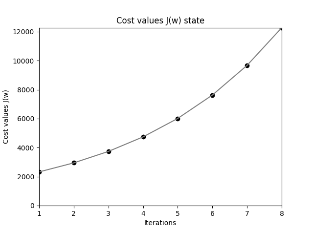

.. role:: raw-latex(raw)
    :format: latex html
    
神经网络
--------------

神经网络原理
~~~~~~~~~~~~~~

神经网络(Neural Networks)由多层感知器组成，每个节点的激活函数均使用 sigmoid 逻辑回归函数。


  神经网络示意图

上图是一个简单的三层神经网络，输入层，1个隐藏层和一个输出层，每个神经节点和节点输出的权重均编号。其中：

- 层号从 1 编号，神经节点从 0 编号
- 层号使用上标加括号表示，节点号使用下标表示。例如 :raw-latex:`\(a^{(2)}_1\)` 表示第 2 层的 1 号节点。同时它也用于表示节点的激活值。
- 0 号节点总是用来表示偏置单元（bias unit），对应感知器中的阈值，它没有输入，输出权重总为 1。
- 输出权重  :raw-latex:`\(w^{(l)}_{ji}\)` 表示第 l 层的第 i 个节点输出到第 l+1 层的第 j 节点权重。显然这里的 ji 不是按照从左到右的层排序的，而是 l+1 节点在前，l 节点在后，这是为了矩阵表达时的方便才如此定义的，看到 ji 就明白是反向定义即可。

:raw-latex:`\(w^{(1)}_{23}\)` 表示第 1 层上的节点 3 (即图中 :raw-latex:`\(a^{(1)}_3\)` )输出到第 2 层上的节点 2 (即图中 :raw-latex:`\(a^{(2)}_2\)` )的权重。 

通常只有单个隐藏层的神经网络被称为单层或者浅层（Shallow）神经网络，当隐藏层大于一层时，被称为深度神经网络(Deep Neural Networks)。

神经网络的学习过程如下：

- 从输入层开始，通过网络前向传播（从左向右，也称为正向传播，Forward propagation）训练数据中的模式，以生成输出。
- 基于输出层的输出，通过一个代价函数计算所需最小化的误差。
- 反向传播（Back propagation）误差，通过链式法则计算代价函数对于网络中每个权重的导数，并更新模型。

每个节点（神经元）可以看作是返回值位于[0,1]连续区间上的逻辑回归单元。

以上图为例，可以写出第 2 层各节点的输入值

.. math::

  \begin{eqnarray}
  a^{(2)}_1 & = & \phi (z^{(2)}_1) & = & \phi (w^{(1)}_{10} x_0 + w^{(1)}_{11} x_1 + w^{(1)}_{12} x_2 + w^{(1)}_{13} x_3) \\
  a^{(2)}_2 & = & \phi (z^{(2)}_2) & = & \phi (w^{(1)}_{20} x_0 + w^{(1)}_{21} x_1 + w^{(1)}_{22} x_2 + w^{(1)}_{23} x_3) \\
  a^{(2)}_3 & = & \phi (z^{(2)}_3) & = & \phi (w^{(1)}_{30} x_0 + w^{(1)}_{31} x_1 + w^{(1)}_{32} x_2 + w^{(1)}_{33} x_3) 
  \end{eqnarray}

可以看到每一层的 a 都是由上一层所有的 x 和每一个 x 所对应的权重系数决定的。这种从左到右的算法就是前向传播算法(Forward propagation)。

其中：

.. math::

  \begin{eqnarray}
  \phi (z) &  = & sigmoid(z) & = & \frac{1}{1+e^{-z}}
  \end{eqnarray}

观察上式，权重 w 和输入 x 可以写成矩阵点乘形式：

.. math::

  \begin{eqnarray}
  \mathbf{W^{(1)}} =
  \left( \begin{array}{ccc}
  w^{(1)}_{10} & w^{(1)}_{11} & w^{(1)}_{12} & w^{(1)}_{13} \\
  w^{(1)}_{20} & w^{(1)}_{21} & w^{(1)}_{22} & w^{(1)}_{23} \\
  w^{(1)}_{30} & w^{(1)}_{31} & w^{(1)}_{32} & w^{(1)}_{33} 
  \end{array} \right)
  \end{eqnarray}

.. math::

  \begin{eqnarray}
  \mathbf{x^{(1)}} =
  \left( \begin{array}{ccc}
  1 \\
  x_1 \\ 
  x_2 \\ 
  x_3
  \end{array} \right)
  \end{eqnarray}

其中权重矩阵 w 行数为第 2 层节点数（接受输出的节点数，不含偏置单元），列数为第 1 层节点数（所有输出节点数，含偏置单元）。观察每个权重的下编号，就可理解为何 l+1 节点在前，l 节点在后的编号定义了。

于是得出第 2 层输出的矩阵表示形式：

.. math::

  \begin{eqnarray}
  z^{(2)} & = & \mathbf{W^{(1)}} \mathbf{x^{(1)}} \\
  a^{(2)} & = & \phi (z^{(2)}) = \phi (\mathbf{W^{(1)}} \mathbf{x^{(1)}})
  \end{eqnarray}

这只是针对一个训练样本所进行的计算。如果要对整个训练集进行计算，需要将训练集特征矩阵进行转置，使得同一个实例的特征都在同一列里。

.. math::

  \begin{eqnarray}
  \mathbf{X^{(1)}} =
  \left( \begin{array}{ccc}
  1 & x_{11} & x_{12} & x_{13} \\
  1 & x_{21} & x_{22} & x_{23} \\
  1 & x_{31} & x_{32} & x_{33} \\
  \vdots & \vdots & \vdots & \vdots
  \end{array} \right)
  \end{eqnarray}

.. math::

  \begin{eqnarray}
  z^{(2)} & = & \mathbf{W^{(1)}} {\mathbf{X^{(1)}}}^T \\
  a^{(2)} & = & \phi (z^{(2)}) = \phi (\mathbf{W^{(1)}} {\mathbf{X^{(1)}}}^T)
  \end{eqnarray}

显然，第 3 层的输入矩阵形式也容易写出。这非常易于编码实现。

神经网络实战
~~~~~~~~~~~~~~~~

实现基本的神经网络类并不复杂，它是多个逻辑回归节点的分层叠加。

.. code-block:: python
  :linenos:
  :lineno-start: 0
  
  # nn.py
  class NN(object):
      def __init__(self, sizes, eta=0.001, epochs=1000, tol=None):
          '''
          Parameters
          ------------
          eta : float
            Learning rate (between 0.0 and 1.0)
          epochs: uint
            Training epochs
          sizes : array like [3,2,3]
            Passes the layers.
          '''
          self.eta = eta
          self.epochs = epochs
          self.num_layers = len(sizes)
          self.sizes = sizes
          self.tol = tol

          self.biases = [np.random.randn(l, 1) for l in sizes[1:]]
          self.weights = [np.random.randn(l, x) for x, l in zip(sizes[:-1], sizes[1:])]

这里定义一个 NN 神经网络类，并定义初始化函数，完成以下工作：

- sizes 参数是一个层数列表，例如 [2,3] 表示神经网络有 2 层，每层节点数分别为 2 和 3。
- biases 成员记录了每一层的偏置单元的权重值，由于前一层偏置的权重个数等于后一层接受输出的节点数，所以这里取 sizes[1:]。
- weights 成员是权重列表，每一个元素都是一个 2 维的 ndarray，由于列表索引从 1 开始，所以 weights[0] 表示的是层 1->2 的权重矩阵。如果 1 层节点数为 2，2 层节点数为 3，则 weights[0] 就是一个 3*2 的二维矩阵。
- tol 停止条件的容忍度，当代价函数小于该值时，退出循环。

注意：理解 weights 的构造形式非常重要。为了逻辑更清晰，这里将偏置从权重矩阵中分离出来，同时初始化为 0-1 之间的随机正态分布数值。
    
.. code-block:: python
  :linenos:
  :lineno-start: 0
  
      def sigmoid(self, z):
          return 1.0/(1.0 + np.exp(-z))

      def sigmoid_derivative(self, z):
          sg = self.sigmoid(z)
          return sg * (1.0 - sg)

sigmoid 为激活函数，sigmoid_derivative 对应它的导数，它被用于梯度下降算法中，其中的临时变量 sg 可以减少一次 sigmoid 运算。

.. code-block:: python
  :linenos:
  :lineno-start: 0
            
      def feedforward(self, X):
          X = X.T
          for b, W in zip(self.biases, self.weights):
              X = self.sigmoid(np.dot(W, X) + b)
          return X

实现前向传播算法(Forward propagation)函数，关键点是从第一层开始针对每一层进行权重矩阵求和然后做 sigmoid。另外注意到 X 是一个训练集的输入矩阵，每一行代表一个样本，所以传入参数后要先对其转置。

显然返回值就是最后的节点输出，它是一个二维矩阵，如果输出节点数为 n，输入样本数为 m，那么它的 shape 为 (n,m)，第 i 行对应第 i 个节点上的输出，第 j 列对应第 j 个样本通过神经网络处理的输出，所以 ij 个元素对应第 j 个样本在节点 i 上的输出（这里 i 和 j 下标均从 0 开始）。

这里使用异或训练集来查看 feedforward 函数的输出：

.. code-block:: python
  :linenos:
  :lineno-start: 0

  def boolXorTrain():
      # Bool xor Train         x11 x12 y1
      BoolXorTrain = np.array([[1, 0, 1],
                               [0, 0, 0],
                               [0, 1, 1],
                               [1, 1, 0]])
      X = BoolXorTrain[:, 0:-1]
      y = BoolXorTrain[:, -1]
  
      nn = NN([2,2,1])
      a = nn.feedforward(X)
      print(a.shape)
    
  boolXorTrain()

  >>>
  (1, 4)

这里使用了 4 个训练样本，网络层数为 [2,2,1]，输出节点数为 1，所以 feedforward 函数会输出 1 行 4 列的结果，这和理论分析是一致的。

从算法上看，feedforward 就是在对输入通过网络权重计算输出的过程，也就是算法进行预测的过程。预测函数也就可以如下实现了：

.. code-block:: python
  :linenos:
  :lineno-start: 0

    def predict(self, X):
        ff = self.feedforward(X)
        if self.sizes[-1] == 1: # 1 output node
            return np.where(ff >= 0.5, 1, 0)
        
        return np.argmax(ff, axis=0)

这里的预测函数同时考虑到了输出节点只有 1 个和多个的情况：

- 如果输出节点只有 1 个，就是一个二分类神经网络，预测方式和逻辑回归是一致的，结果为 0 或 1。
- 如果输出节点有 n (n>1) 个，那么就是 n 分类算法，此时取输出层中输出似然概率最高的那个节点，每个分类编号从 0 到 n - 1。

在多分类情况下，n 个分类通常会安排 n 个输出节点，尽管 n 个节点从输出二进制（sigmoid输出经阈值处理后总是输出0,1）上可以表示 2^n 种分类，这是基于经验主义规定的，或许是 n 个输出节点增加了整个网络参数的节点数和权重数目，使得分类效果更好。

到这里我们还缺少最核心的东西，基于梯度下降的训练函数 fit。在实现它之前必须再次回顾逻辑回归的代价函数和梯度下降算法，因为神经网络本质上就是多层逻辑回归模型的叠加。

反向传播理论推演
~~~~~~~~~~~~~~~~

逻辑回归是一个二分类算法，回顾它的代价函数：

.. math::
    
  J(w) = \sum_{i=1}^{n}-y^i\ln {(\phi (z^i))}-(1-y^i)\ln {(1-\phi (z^i))}

逻辑回归算法，一个输入 :raw-latex:`\(x^i\)` 只对应一个输出  :raw-latex:`\(y^i\)`，可以看做是一个标量，对应的标签值为 0 或者 1。但是在神经网络中，可以有很多输出变量，也即 K 个分类对应一个 K 维的向量，对应不同的标签向量。例如 3 分类的标签向量可能为：

 .. math::

  \begin{eqnarray}
  \mathbf{y^i} =
  \left( \begin{array}{ccc}
  1 \\ 0 \\ 0 
  \end{array} \right)
  \left( \begin{array}{ccc}
  0 \\ 1 \\ 0 
  \end{array} \right)  
  \left( \begin{array}{ccc}
  0 \\ 0 \\ 1 
  \end{array} \right) 
  \end{eqnarray}

那么，对于 K 分类，标签向量被记为 :raw-latex:`\(y^i_k\)`，k 取 1 到 K。此时的代价函数可表示为多个输出节点的代价函数和：

.. math::
    
  J(w) = \sum_{i=1}^{n}\sum_{k=1}^{K}-y^i_k {\ln {(\phi (z^i))}}_k - (1-y^i_k) {\ln {(1-\phi (z^i))}}_k

尽管表达式看起来很复杂，实际算法上只不过在外循环内加上一个用于计算每个输出节点在训练样本 :raw-latex:`\(x^i\)` 上代价的累加。

相较于上面的形式，笔者更喜欢把 K 累加放在外边，这样内侧累加就和逻辑回归代价函数保持一致，表示一个输出节点上的代价函数：

.. math::
    
  J(w) = \sum_{k=1}^{K} \sum_{i=1}^{n} -y^i_k{\ln {(\phi (z^i))}}_k - (1-y^i_k) {\ln {(1-\phi (z^i))}}_k

在逻辑回归中只要对代价函数求权重偏导，就可以得到调整权重 :raw-latex:`\(\Delta w\)`，但是神经网络具有多层，需要采用一种反向传播算法，也即先计算最后一层的误差（预测值与标签值的差），然后再一层一层反向求出各层的误差，直到倒数第二层。

理解反向传播的第一个关键点在于实际上它是逐个对每个训练样本计算代价函数的关于各个权重的偏导，并调整权重（实际上就是随机梯度下降），这将问题大大简化，我们无需一次考虑代价函数中的两层累加，而把问题的注意力放在单个训练样本对代价函数的影响上。

.. figure:: imgs/practice/bp1.png
  :scale: 100%
  :align: center
  :alt: sigcost

  反向传播（对第 2 层权重求偏导）

上图中是一个三层的神经网络，每层均有 2 个节点，暂不考虑偏置节点。除了输入节点外，每个节点被分割为左右两个半圆，左边表示节点的加权求和的权重输入，右边表示节点的激活输出。观察上图中的红色圈中的输出层节点 :raw-latex:`\(a^{(3)}_{1}\)` ，它的权重输入通常标记为  :raw-latex:`\(z^{(3)}_{1}\)`;  它的输出与节点编号相同：:raw-latex:`\(a^{(3)}_{1}=\hat{y^i_1}\)`，这是当样本 i 输入到神经网络后，节点 :raw-latex:`\(a^{(3)}_{1}\)` 的输出。


我们从图中被涂成红色的边上的权重 :raw-latex:`\(w^{(2)}_{11}\)` 开始考虑如何对它进行调整，以使得输出的代价函数最小。
这条边的输入部分就是它连接的左侧节点 :raw-latex:`\(a^{(2)}_{1}\)` 的输出，所以把 :raw-latex:`\(a^{(2)}_{1}\)` 节点的右半边涂成红色，  
这条边的权重输出对应到它连接的右侧节点 :raw-latex:`\(a^{(3)}_{1}\)` 的输入 :raw-latex:`\(z^{(3)}_{1}\)` ，所以把它的左半边涂成红色。

我们很快就会明白为何把这两个半圆涂成红色，这是某种强烈的隐喻，边上权重的调整与它们息息相关。

为了计算 :raw-latex:`\(w^{(2)}_{11}\)` 的偏导数，就要理清 :raw-latex:`\(w^{(2)}_{11}\)` 是如何影响代价函数的，这样我们就可以使用链式法则求偏导了。

.. math::

  \begin{eqnarray}
  J(w) & = & -y^i_1 {\ln {(\phi (z^{(3)}_1))}} - (1-y^i_1) {\ln {(1-\phi (z^{(3)}_1))}}
  \end{eqnarray}

观察关于训练样本 i 的代价函数，注意到式子中的 :raw-latex:`\(\phi (z^{(3)}_1)\)`，它就是输出层节点的输出：

.. math::

  \begin{eqnarray}
  a^{(3)}_1 & = & \phi (z^{(3)}_1) &=& \hat{y^i_1}
  \end{eqnarray}

与权重变量  :raw-latex:`\(w^{(2)}_{11}\)` 发生关联的就是  :raw-latex:`\(z^{(3)}_1\)`：

.. math::

  \begin{eqnarray}
  z^{(3)}_1 & = & w^{(2)}_{11} a^{(2)}_1 + w^{(2)}_{12} a^{(2)}_2 
  \end{eqnarray}

由以上各式根据链式法则求对 :raw-latex:`\(w^{(2)}_{11}\)` 的偏导：

.. math::

  \frac {\partial {J(w)}} {\partial {w^{(2)}_{11}}} = 
  \frac {\partial {J(w)}} {\partial a^{(3)}_{1}} 
  \frac {\partial a^{(3)}_{1}} {\partial z^{(3)}_{1}}
  \frac {\partial z^{(3)}_{1}} {\partial {w^{(2)}_{11}}}=
  \frac {\partial {J(w)}} {\partial {\phi (z^{(3)}_1)}}
  \frac {\partial {\phi (z^{(3)}_1)}} {\partial z^{(3)}_{1}}
  \frac {\partial z^{(3)}_{1}} {\partial {w^{(2)}_{11}}}

观察以上公式，它分为左右两个部分，左侧部分对应代价函数对权重右侧节点的输入的偏导，右侧部分对应权重左侧节点的输出，当然左右可以交换下位置，这样就和图中的标记顺序一致了。到这里就可以理解为何图中如此涂色了。

通常代价函数对节点输入的偏导数称为该节点的误差信号（Error Signal），记为 :raw-latex:`\(\delta^{(l)}_i\)`，它表示当这个节点的输入变化  :raw-latex:`\(\Delta z\)` 时，代价函数将产生  :raw-latex:`\(\delta^{(l)}_i\Delta z\)` 的误差（实际上这就是对导数的数学意义的解释）。这里称为误差信号，更准确的意思是对代价函数的误差的影响大小，信号越大（越强），节点上的输入变化导致的误差就越大。

这里参考逻辑回归中的求导过程，上式结果为：

.. math::

  \frac {\partial {J(w)}} {\partial {w^{(2)}_{11}}} = (a^{(3)}_1-{y^i_1})a^{(2)}_1 = a^{(2)}_1(a^{(3)}_1-{y^i_1}) \qquad (0)

同理，根据上述规则，考虑所有输出节点的代价函数对第 2 层各权重的偏导关系，可以得出：

.. math::

  \begin{eqnarray}
  \frac {\partial {J(w)}} {\partial {w^{(2)}_{12}}} & = & a^{(2)}_2(a^{(3)}_1-{y^i_2}) \qquad (1)\\
  \frac {\partial {J(w)}} {\partial {w^{(2)}_{21}}} & = & a^{(2)}_1(a^{(3)}_2-{y^i_2}) \qquad (2)\\
  \frac {\partial {J(w)}} {\partial {w^{(2)}_{22}}} & = & a^{(2)}_2(a^{(3)}_2-{y^i_2}) \qquad (3)
  \end{eqnarray}

观察以上四个偏导公式，我们对偏导的两部分顺序进行了交换，这就和图中的左右顺序一致了：左侧部分对应权重节点的输入，右侧部分对应 :raw-latex:`\(\delta^{(3)}_i\)`。如果考虑所有第三层的节点，就可以把误差写成向量的形式，记作 :raw-latex:`\(\delta^{(3)}\)` ：

.. math::

  \begin{eqnarray}
  \mathbf{\delta^{(3)}} =
  \left( \begin{array}{ccc}
  a^{(3)}_1 - y^i_1 \\
  a^{(3)}_2 - y^i_2
  \end{array} \right)
  \end{eqnarray}

同时针对第二层的权重的偏导公式可以写成如下形式，注意其中是向量逐元素相乘。

.. math::

  \begin{eqnarray}
  \frac {\partial {J(w)}} {\partial {w^{(2)}_{ij}}} & = {a^{(2)}_j} \delta^{(3)}_i \qquad (1.1)
  \end{eqnarray}

观察上式中的下标关系，可以写成矩阵的乘法形式：

.. math::

  \begin{eqnarray}
  \frac {\partial {J(w)}} {\partial {w^{(2)}}} =
  \left( \begin{array}{ccc}
  \delta^{(3)}_1 \\
  \delta^{(3)}_2
  \end{array} \right)
  \left( \begin{array}{ccc}
  a^{(2)}_1 & a^{(2)}_2
  \end{array} \right)
  \end{eqnarray}=\delta^{(3)} {a^{(2)}}^T

尽管已经发现了代价函数对权重的偏导规律：输入和信号误差相乘。但是假如每一层的信号误差都要使用链式法则重新计算（特别是层数很多时），那么计算量无疑是巨大的，观察链式法则，我们会发现对第 1 层求偏导的计算链要基于第 2 层的信号误差，同理第 2 层的信号误差要基于第 3 层的信号误差，直至输出层。

这里继续对第 1 层中权重 :raw-latex:`\(w^{(1)}_{11}\)` 求偏导，来说明以上的规律。

.. figure:: imgs/practice/bp2.png
  :scale: 100%
  :align: center
  :alt: bp2

  反向传播（对第 1 层权重求偏导）

图中输入层无需考虑加权和激活部分，直接输入到权重边，所以整个圆被涂红。首先梳理清楚 :raw-latex:`\(w^{(1)}_{11}\)` 与代价函数的关系（函数链，以便运用链式求导法则）：

.. math::

  \begin{eqnarray}
  z^{(2)}_1 & = & w^{(1)}_{11} x^1 + w^{(1)}_{12} x^2 \\
  a^{(2)}_1 & = & \phi({z^{(2)}_1})\\ 
  z^{(3)}_1 & = & w^{(2)}_{11} a^{(2)}_1 + w^{(2)}_{12} a^{(2)}_2 \\
  z^{(3)}_2 & = & w^{(2)}_{21} a^{(2)}_1 + w^{(2)}_{22} a^{(2)}_2 
  \end{eqnarray}

显然它通过 :raw-latex:`\(z^{(3)}_1\)` 和  :raw-latex:`\(z^{(3)}_2\)` 与代价函数关联了起来（这里的代价函数就要考虑所有输出点的情况了），另外我们在对第二层权重求偏导时，已经计算过代价函数对 :raw-latex:`\(z^{(3)}_1\)` 和  :raw-latex:`\(z^{(3)}_2\)` 的偏导，即 :raw-latex:`\(\delta^{(3)}_1\)` 和 :raw-Latex:`\(\delta^{(3)}_2\)`，所以对  :raw-latex:`\(w^{(1)}_{11}\)` 的偏导公式可以写成：

.. math::

  \frac {\partial {J(w)}} {\partial {w^{(1)}_{11}}} = 
  (\frac {\partial {J(w)}} {\partial {\phi (z^{(3)}_1)}}
  \frac {\partial {\phi (z^{(3)}_1)}} {\partial z^{(3)}_{1}}
  \frac {\partial z^{(3)}_{1}} {\partial {\phi (z^{(2)}_1)}}
  + \frac {\partial {J(w)}} {\partial {\phi (z^{(3)}_2)}}
  \frac {\partial {\phi (z^{(3)}_2)}} {\partial z^{(3)}_{2}}
  \frac {\partial z^{(3)}_{2}} {\partial {\phi (z^{(2)}_1)}})
  \frac {\partial {\phi (z^{(2)}_1)}} {\partial {z^{(2)}_{1}}} 
  \frac {\partial {(z^{(2)}_2)}} {\partial {w^{(1)}_{11}}}

我们把 :raw-latex:`\(\delta^{(3)}_1\)` 和 :raw-Latex:`\(\delta^{(3)}_2\)` 代入以上公式，上式被化简成：

.. math::

  \frac {\partial {J(w)}} {\partial {w^{(1)}_{11}}} =
  x^1(\delta^{(3)}_1
  w^{(2)}_{11}
  + \delta^{(3)}_2
  w^{(2)}_{21})
  \frac {\partial {\phi (z^{(2)}_1)}} {\partial {z^{(2)}_{1}}} 
  
注意这里把输入 :raw-Latex:`\(x^1\)` 放在了最左边，其中：

.. math::

  \frac {\partial {\phi (z^{(2)}_1)}} {\partial {z^{(2)}_{1}}} = a^{(2)}_1(1-a^{(2)}_1)

我们不急于写出其他几个权重的偏导数，而是观察上式与第 2 层权重偏导公式(1.1)的关系，左边为输入项，右侧为代价函数对 :raw-latex:`\(z^{(2)}_1\)` 的偏导，根据误差信号的定义，右侧部分可以标记为 :raw-Latex:`\(\delta^{(2)}_1\)`，对应下图中的橙色部分的偏导。  

.. math::

  \delta^{(2)}_1 =
  (\delta^{(3)}_1
  w^{(2)}_{11}
  + \delta^{(3)}_2
  w^{(2)}_{21})
  \frac {\partial {\phi (z^{(2)}_1)}} {\partial {z^{(2)}_{1}}} 

.. figure:: imgs/practice/bp3.png
  :scale: 100%
  :align: center
  :alt: bp2

  反向传播（第 2 层信号误差）

对照上图，仔细观察  :raw-Latex:`\(\delta^{(2)}_1\)` 组成的各个部分，可以体会到它和正向传播的某种对称性。

.. figure:: imgs/practice/bp4.png
  :scale: 100%
  :align: center
  :alt: bp2

  反向传播和正向传播关系

观察图中蓝色部分，正向传播使用权重矩阵点乘输入进行：

.. math::

  \begin{eqnarray}
  \mathbf{W^{(2)}} =
  \left( \begin{array}{ccc}
  w^{(2)}_{11} & w^{(2)}_{12} \\
  w^{(2)}_{21} & w^{(2)}_{22}
  \end{array} \right)
  \end{eqnarray}

.. math::

  \begin{eqnarray}
  \mathbf{a^{(2)}} =
  \left( \begin{array}{ccc}
  a^{(2)}_{1}\\
  a^{(2)}_{2}
  \end{array} \right)
  \end{eqnarray}

.. math::
  
  z^{(3)} = {\mathbf{W^{(2)}}} \mathbf{a^{(2)}}

为何观察上述对称性，我们把 :raw-Latex:`\(\delta^{(2)}\)` 的两个表达式列出来：

.. math::

  \begin{eqnarray}
    \delta^{(2)}_1 &=&
  (\delta^{(3)}_1
  w^{(2)}_{11}
  + \delta^{(3)}_2
  w^{(2)}_{21})
  \frac {\partial {\phi (z^{(2)}_1)}} {\partial {z^{(2)}_{1}}}   \\
    \delta^{(2)}_2 &=&
  (\delta^{(3)}_1
  w^{(2)}_{12}
  + \delta^{(3)}_2
  w^{(2)}_{22})
  \frac {\partial {\phi (z^{(2)}_2)}} {\partial {z^{(2)}_{2}}}
  \end{eqnarray}

观察上述矩阵运算过程，正向传播使用权重矩阵的各行与输入相乘叠加得出下一层的权重输入，逆向传播使用权重矩阵的各列分别信号误差相乘，得出上一层的信号误差，所以 :raw-Latex:`\(\delta^{(2)}\)` 和  :raw-Latex:`\(\delta^{(3)}\)` 的关系可以表示为：

.. math::
  
  \delta^{(2)} = {\mathbf{W^{(2)}}}^T \delta^{(3)} \odot \frac {\partial {\phi (z^{(2)})}} {\partial {z^{(2)}}}

其中 :raw-Latex:`\(\odot\)` 表示元素逐项对应相乘。图中的蓝色线对应权重矩阵的第一行，红色线对应权重矩阵的第一列，它们可以同时充当正向传播和反向传播的桥梁，也即转置的作用。到这里就可以总结出反向传播的所有公式了：

.. math::

  \delta^{(l)} = {{\mathbf{W}}^{(l)}}^T \delta^{(l+1)} \odot \frac {\partial {\phi (z^{(l)})}} {\partial {z^{(l)}}} \qquad (0)

注意当计算到第 2 层的信号误差时，第 1 层的权重调整系数就已经得到了，所以式子中的 l >= 2，并且当 l 为输出层时，无需激活函数的偏导部分，l 的取值范围为 [L,2]。有了每层的误差，就可以基于它计算每个权重的调整系数了，它是对式 (1.1) 的扩展：

.. math::

  \begin{eqnarray}
  \frac {\partial {J(w)}} {\partial {w^{(l-1)}_{ij}}} & = {a^{(l-1)}_j} \delta^{(l)}_i 
  = \delta^{(l)} {a^{(l-1)}}^T \qquad (1)
  \end{eqnarray}

显然这里使用 l-1 是为了公式 (1) 中 l 的取值范围和公式 (2) 保持一致。对于偏置项，由于输入总是 1， 所以调整系数就是输出节点的信号误差。

尽管这里只计算了 2 层权重的偏导来推导反向传播公式，显然它基于链式法则，可以推广到任意层，整个反向传播的计算流程描述如下：

- 随机初始化所有权重
- 使用一个样本进行正向传播，得到输出层的信号误差
- 复制一份权重和偏置，并初始化为 0，所有系数调整在该拷贝上进行
- 基于输出层的信号误差反向计算上一层的信号误差，使用信号误差计算出调整系数
- 对拷贝权重和偏置进行调整，直至计算到第 2 的信号误差并调整完第一层 1 的权重和偏置
- 更新拷贝项替到原权重和偏置

以上算法显示是随机梯度下降，也可以使用批量梯度下降，也即使用一批样本，对拷贝的权重和偏置进行累积调整，这一批训练样本处理完后再更新到原权重和偏置，这样效率要高很多。

反向传播理论思考
``````````````````

反向传播是如何被发现的？是偶然的，还是必然的。我记起来孟德尔发现遗传定律的豌豆杂交实验。豌豆具有多种特征：皮皱和光滑，高矮，种子颜色，种子的圆扁等等，它们之间有无数种组合，这里很像多个训练样本对层层线性和非线性神经网络的影响。

孟德尔成功的原因有几个要点：

- 将问题简化，先研究一对相对性状的遗传，再研究两对或多对性状的遗传
- 应用统计学方法对实验结果进行分析
- 基于对大量数据的分析而提出假设，再设计实验来验证。

孟德尔在以上方法指导下，耐心地进行 7 年的豌豆种植试验，最终破解了生物遗传密码，称为遗传学之父。

逆向传播的发现也具有类似特征：

- 首先简化问题：只考虑一个样本对一个输出节点的影响
- 运用链式法则求倒数第 1 层的权重偏导数，观察发现它只与左侧节点的输入和代价函数对右侧节点输入的偏导数（信号误差）有关，并且基于链式法则，对任意层有效。
- 继续对前一层求偏导，可以发现第 2 层的信号误差与第 3 层的信号误差的关系，进而总结出规律公式 (0) 和 (1)。

并且可以发现最后一层的信号误差与代价函数和激活函数有关，其他层信号误差只与后一层的信号误差以及激活函数（激活函数关于输入的偏导数）有关：

- 如果我们要替换代价函数，那么只要调整最后一层信号误差计算方式。
- 如果要替换激活函数，那么在计算每一层信号误差时都要考虑，当然我们把它和它的导数均定义为函数，在代码实现上非常简单。

在大部分教科书上，神经网络的代价函数可能使用的是 MSE（均方差），而不是 MLE（最大对数似然函数）。笔者猜测，如果对线性回归比较熟悉，那么就倾向于使用 MSE，至少从形式上看很简单，并且求导过程不会那么可怕；另一条研究神经网络的路线是：感知器到Adaline模型，到逻辑回归，再到神经网络，那么选择 MLE 就水到渠成。笔者更倾向于第二条路线。不过这无关紧要，重要的是不同的代价函数对神经网络实现和性能到底有什么影响？

或许有人记得 MLE 形式的代价函数在逻辑回归中是个凸函数，这让我们可以找到极小值，而在神经网络中，每个权重都经过了层层的线性和非线性叠加变换，指望这里的代价函数具有凸函数特性是不可能的。想象一个层数为 [2，2，1]的神经网络，它的权重数目为 2*2 + 2*1 = 6，我们不可能绘制一个 6 维的代价函数曲面，但是我们可以把其中的 4 个权重固定，只改变其中的两个，这样取得的曲面图就是一个子集，它能从侧面反映出代价函数的凹凸性，所以我称为这里的代价函数曲面为拟曲面图。

下图是在 XOR 问题上训练完成的权重上，调整其中两个权重得到的曲面图，显然它不是凸面函数，有着丰富的波动从而导致众多的局部极小值。此图是在直观层面上说明选择神经网络的代价函数已经不再考虑凹凸性了，也即凹凸性不是选择 MLE 方法的原因。这里可以提及的是权重使用随机初值化，而不是全 0，是因为 0 附近很可能是一个局部极小值，导致每次迭代都无法收敛。

.. figure:: imgs/practice/xor.png
  :scale: 100%
  :align: center
  :alt: xor

  神经网络的代价函数拟曲面图

MSE 代价函数
`````````````

MSE 代价函数很容易写出来，与 Adaline 模型不同的是，这里要考虑输出层有 K 个输出节点的情况，也即预测值是一个向量，而不再是一个数字：

.. math::
    
  J(w) = \frac{1}{2n}\sum_{i=1}^{n}\sum_{k=1}^{K}({\hat y}^i_k - {y^i_k})^2

.. figure:: imgs/practice/bp.png
  :scale: 100%
  :align: center
  :alt: bp

  反向传播MSE代价函数求偏导

上面已经指出如果要替换代价函数，那么只要调整最后一层信号误差计算方式。这里使用 MSE 代价函数对上图中的  :raw-latex:`\(z^{(3)}_1\)` 求偏导数，在考虑一个样本情况时可忽略常数 1/n：

.. math::

  \frac {\partial {J(w)}} {\partial {z^{(3)}_{1}}} = 
  \frac {\partial {J(w)}} {\partial a^{(3)}_{1}} 
  \frac {\partial a^{(3)}_{1}} {\partial z^{(3)}_{1}}=
  \frac {\partial {J(w)}} {\partial {\phi (z^{(3)}_1)}}
  \frac {\partial {\phi (z^{(3)}_1)}} {\partial z^{(3)}_{1}}=
  ({\hat y}^i_1 - {y^i_1})\frac {\partial {\phi (z^{(3)}_1)}} {\partial z^{(3)}_{1}}
  = (a^{(3)}_1 - {y^i_1})\frac {\partial {\phi (z^{(3)}_1)}} {\partial z^{(3)}_{1}}


得到最后一层的信号误差 :raw-latex:`\(\delta^{(3)}\)`：
 
.. math::

  \begin{eqnarray}
  \mathbf{\delta^{(3)}} =
  \left( \begin{array}{ccc}
  (a^{(3)}_1 - y^i_1)\frac {\partial {\phi (z^{(3)}_1)}} {\partial z^{(3)}_{1}} \\
  (a^{(3)}_2 - y^i_2)\frac {\partial {\phi (z^{(3)}_2)}} {\partial z^{(3)}_{2}} 
  \end{array} \right)
  \end{eqnarray}\qquad (MSE)

对比最大对数似然估计，可以看到这里只是多了激活函数对节点输入的偏导数项。显然 MSE 在反向计算每一层信号误差时都需要加入该项，则 MLE 在计算最后一层信号误差时无需考虑（因为代价函数求导时约去了该项）。

.. math::

  \begin{eqnarray}
  \mathbf{\delta^{(3)}} =
  \left( \begin{array}{ccc}
  a^{(3)}_1 - y^i_1 \\
  a^{(3)}_2 - y^i_2 
  \end{array} \right)
  \end{eqnarray}\qquad (MLE)

基于以上理论，实现反向传播不再困难，我们尝试在一个样本上实现反向传播算法，并在测试验证正确后再尝试优化。

实现反向传播
````````````````

定义名为 backprop 的类函数，x 是一个样本，为 1*n 的特征矩阵。y 是标签值，它是一个 K 维向量，K 为输出层的节点数。

.. code-block:: python
  :linenos:
  :lineno-start: 0
  
    def backprop(self, x, y): 
        # 初始化新的偏置和权重系数矩阵
        delta_b = [np.zeros(b.shape) for b in self.biases]
        delta_w = [np.zeros(w.shape) for w in self.weights]

        # 转置样本特征矩阵，以便于权重矩阵左乘
        x = x.reshape(x.shape[0], 1)
        y = y.reshape(y.shape[0], 1)
        activation = x
        
        # 记录每一层每一节点的激活函数输出，用于在反向传播时计算激活函数的偏导 a(1-a)
        # 第一层就是 x 自身
        acts = [x]
        
        # zs 记录每一层每一节点的权重输入
        zs = []
        
        # 进行前向传播，以得到每层每个节点的权重输入，激活函数值和最终输出层的信号误差
        for b, W in zip(self.biases, self.weights):
            z = W.dot(activation) + b
            zs.append(z)
            activation = self.sigmoid(z)
            acts.append(activation)

        # 反向传播，这里使用 MSE 代价函数，所以 L-1 层信号误差计算需乘以激活函数的导数
        delta = (acts[-1] - y) * self.sigmoid_derivative(zs[-1])
        delta_b[-1] = delta   # 偏置的输入总是 1， 所以就是信号误差
        delta_w[-1] = np.dot(delta, acts[-2].transpose()) 
        for l in range(2, self.num_layers):
            sp = self.sigmoid_derivative(zs[-l])
            delta = np.dot(self.weights[-l+1].transpose(), delta) * sp
            delta_b[-l] = delta
            delta_w[-l] = np.dot(delta, acts[-l-1].transpose())
        
        # 更新偏置和权重
        self.biases = [b-(self.eta) * nb / X.shape[0]
                        for b, nb in zip(self.biases, delta_b)]
        self.weights = [w-(self.eta) * nw / X.shape[0]
                        for w, nw in zip(self.weights, delta_w)]

结合理论分析，再理解上面的代码实现并不困难。注意以上函数一次只使用一个样本进行权重调整，这在实际中运行中效率很慢，我们可以使用矩阵来实现批量样本的权重更新。

.. code-block:: python
  :linenos:
  :lineno-start: 0
  
    # X is an array with n * m, n samples and m features every sample
    def mbatch_backprop(self, X, y):
        delta_b = [np.zeros(b.shape) for b in self.biases]
        delta_w = [np.zeros(w.shape) for w in self.weights]

        # feedforward
        if X.ndim == 1:
            X = X.reshape(1, X.ndim)
        if y.ndim == 1:
            y = y.reshape(1, y.ndim)
        
        activation = X.T
        acts = [activation] 
        zs = []             
        for b, W in zip(self.biases, self.weights):
            z = W.dot(activation) + b
            zs.append(z)
            activation = self.sigmoid(z)
            acts.append(activation)

        # 这里的注意点在于偏置的更新，需要进行列求和
        delta = (acts[-1] - y.T) * self.sigmoid_derivative(zs[-1])
        delta_b[-1] = np.sum(delta, axis=1, keepdims=True)
        delta_w[-1] = np.dot(delta, acts[-2].transpose())
        for l in range(2, self.num_layers):
            sp = self.sigmoid_derivative(zs[-l])
            delta = np.dot(self.weights[-l+1].transpose(), delta) * sp
            delta_b[-l] = np.sum(delta, axis=1, keepdims=True)
            delta_w[-l] = np.dot(delta, acts[-l-1].transpose())

        self.biases = [b-(self.eta) * nb / X.shape[0]
                        for b, nb in zip(self.biases, delta_b)]
        self.weights = [w-(self.eta) * nw / X.shape[0]
                        for w, nw in zip(self.weights, delta_w)]

训练函数支持批量训练，这里默认批处理样本数为 8。

.. code-block:: python
  :linenos:
  :lineno-start: 0
    
    # MSE 代价函数，用于统计观察下降情况
    def quadratic_cost(self, X, y):
        return np.sum((self.feedforward(X) - y.T)**2) / self.sizes[-1] / 2 
        
    def fit_mbgd(self, X, y, batchn=8, verbose=False):
        '''mini-batch stochastic gradient descent.'''
        self.errors_ = []
        self.costs_ = []
        self.steps_ = 100  # every steps_ descent steps statistic cost and error sample
        
        if batchn > X.shape[0]:
            batchn = 1
        
        for loop in range(self.epochs):
            X, y = scaler.shuffle(X, y) # 每周期对样本随机处理
            if verbose: print("Epoch: {}/{}".format(self.epochs, loop+1), flush=True)
            
            x_subs = np.array_split(X, batchn, axis=0)
            y_subs = np.array_split(y, batchn, axis=0)
            for batchX, batchy in zip(x_subs, y_subs):
                self.mbatch_backprop(batchX, batchy)
            
            # 使用正向传播获取误差值，计算代价函数值，观察收敛情况
            if self.complex % self.steps_ == 0:
                cost = self.quadratic_cost(X,y)
                self.costs_.append(cost)

                # 平均最后5次的下降值，如果下降很慢，停止循环，很可能落入了局部极小值
                if len(self.costs_) > 5:
                    if sum(self.costs_[-5:]) / 5 - self.costs_[-1] < self.tol:
                        print("cost reduce very tiny less than tol, just quit!")
                        return

                print("costs {}".format(cost))
            self.complex += 1

注意，如果下降很慢，则停止循环，很可能落入了局部极小值，此时应该重新训练网络以尝试其他权重值。

分割异或问题
`````````````

我们尝试用最简单的 [2,2,1] 神经网络来解决 XOR 异或分割问题。众所周知，异或问题不是线性可分的，那么神经是怎么通过非线性函数实现异或分割的呢？

.. code-block:: python
  :linenos:
  :lineno-start: 0
  
  def boolXorTrain():
      # Bool xor Train         x11 x12 y1
      BoolXorTrain = np.array([[1, 0,  1],
                               [0, 0,  0],
                               [0, 1,  1],
                               [1, 1,  0]])
      X = BoolXorTrain[:, 0:2]
      y = BoolXorTrain[:, 2]
      if y.ndim == 1: # vector to 2D array
          y = y.reshape(y.shape[0], 1)
  
      nn = NN([2,2,1], eta=0.5, epochs=10000, tol=1e-4)
      nn.fit_mbgd(X,y)
      pred = nn.predict(X)
      print(nn.weights)
      print(pred)

如果我们尝试将权重和偏置的初始值均置为 0，将会诧异地发现根本无法收敛。这预示着 0 点处是一个局部极小点，实际使用中如果发现跌入局部极小点而无法收敛到 0 附近，那么就要重新随机初始化权重，然后重新训练。

.. code-block:: sh
  :linenos:
  :lineno-start: 0
  
  >>> python nn.py
  ......
  costs 0.00024994697604848544
  cost reduce very tiny, just quit!
  weights: [array([[-5.55203673,  5.34505725],
         [-6.10271765,  6.20215693]]), array([[ 9.2106689 , -8.70927677]])]
  biases: [array([[-2.89311115],
         [ 3.10518764]]), array([[ 4.06794821]])]
  [[1 0 1 0]]

实际观察，在学习率为 0.5 时，大约需要 7000 个迭代周期（实际上由于样本很少，等同于批量周期下降）才会收敛到比较满意的值。当然我们可以增加 tol 来成倍降低迭代周期，当然我们最关心的不仅仅是计算量的大小，还有分类的实际效果。

首先看下代价下降曲线图，首先很庆幸我们随机的一组权重参数在一开始就给出了较小的代价值，也即我们选择的点邻近一个局部最优点，在迭代大约 2000次之后，就已经下降到接近于 0。


  神经网络在 XOR 问题上的代价函数下降曲线

现在回归最根本的问题，尽管预测值和实际的标签已经完全一致，也即正确率 100%，那么神经网络是如何做到的呢？根据以往的线性分割模型无法分割 XOR 的点，直觉上可以想到，它可能进行了某种非线性分割，比如用一个椭圆（这里指高维曲面）把其中两个标签为 1 的点圈起来，外部则为 0 的点。但是如何验证推测呢？一个需要点发散思维的方式是绘图，这样就需要把图像限制在 3D 空间，也即特征变量最多有 2 个，XOR 训练集正好满足了这一特征，剩下的就是使用已经训练好的这组权重和偏置来对更多的假想特征值进行预测，来获取代价值的曲面。

.. code-block:: python
  :linenos:
  :lineno-start: 0
  
    def draw_perdict_surface(self, X, y):
        from mpl_toolkits import mplot3d
        # XOR 特征值范围为 0-1，所以在 -2-2 区间作图足够反应整个预测平面
        x1 = np.linspace(-2, 2, 80, endpoint=True)
        x2 = np.linspace(-2, 2, 80, endpoint=True)
    
        title = 'Perdict Surface and Contour'
        # 生成网格化坐标
        x1, x2 = np.meshgrid(x1, x2)
        acts = np.zeros(x1.shape)
        for i in range(x1.shape[0]):
            for j in range(x1.shape[1]):# 计算输出层激活值
                acts[i,j] = self.feedforward(np.array([x1[i,j], x2[i,j]]).reshape(1,2))

        plt.figure(figsize=(6, 6))
        ax = plt.axes(projection='3d') # 绘制输出层激活值曲面图，透明度设置为 0.8 以便于观察样本点
        ax.plot_surface(x1, x2, acts, rstride=1, cstride=1, cmap='hot', 
                        edgecolor='none', alpha=0.8)
        
        # 绘制样本点的输出层的激活值（蓝色）和标签值（红色）
        z = self.feedforward(X)
        ax.scatter3D(X[:,0], X[:,1], z, c='blue')
        ax.scatter3D(X[:,0], X[:,1], y[:,0], c='red')
        ax.set_title(title)
        ax.set_xlabel("x1")
        ax.set_ylabel("x2")
        # 绘制 3D 曲面的等高线
        ax0 = plt.axes([0.1, 0.5, 0.3, 0.3])
        ax0.contour(x1, x2, acts, 30, cmap='hot')
        plt.show()

实际上这里有些前提，例如输出层只有一个节点，我们可以直接使用输出值作为曲面的第三维，想象输出层有多个节点，那么其中一个节点的输出所能绘制的曲面就是高高低低，而低洼的地方对应样本点在该节点输出为 1 的特征坐标，高凸的地方对应输出 1 的特征坐标。


  神经网络在 XOR 问题上的预测曲面（1）

通过预测曲面图清楚地看到神经网络的强大之处，它非常聪明地生成了一对“翅膀”，靠近脊柱的地方凹陷，两侧翅膀高凸，观察样本点，预测值为1的样本点均落在了两侧翅膀上，预测值为 0 的样本点均落在了脊柱上。那么自然可以想到，另一种分割方法是预测值为1的样本点能落在脊柱上，而0的样本点落在翅膀上，此时脊柱隆起，而翅膀向下扇动：


  神经网络在 XOR 问题上的预测曲面（2）

梯度下降和交叉熵函数
``````````````````````

在逻辑回归中，我们指出数据的标准化和权重的初始值异常重要，否则将导致求和函数的输出很大，继而使得 sigmoid 函数的输出接近 1 或者 -1，尽管正确的标签应该是 0 和 1（此时错误非常严重，预测和实际完全相反），此时的斜率非常小（曲线接近平行于 x 轴，导数很小），也就导致梯度下降在开始时非常缓慢。

神经网络也有如此问题，可以尝试将所有权重初始化为 3，偏置为 0，可以得到如下的下降曲线图，此时“学习效率”在初期非常低：


  神经网络在权重比较大时初期下降速度变慢

我们观察神经网络在使用 MSE 代价函数时的权重调整计算公式，以理解为何会出现这类现象：

.. math::

  \delta^{(l)} = {{\mathbf{W}}^{(l)}}^T \delta^{(l+1)} \odot \frac {\partial {\phi (z^{(l)})}} {\partial {z^{(l)}}} \qquad (0)

.. math::

  \begin{eqnarray}
  \frac {\partial {J(w)}} {\partial {w^{(l-1)}_{ij}}} & = {a^{(l-1)}_j} \delta^{(l)}_i 
  = \delta^{(l)} {a^{(l-1)}}^T \qquad (1)
  \end{eqnarray}

.. math::

  \frac {\partial {\phi (z^{(l)})}} {\partial {z^{(l)}}} = a^{(l)}_1(1-a^{(l)})

理论分析阶段已经指出，基于 MSE （二次代价函数）的代价函数时，公式(0) 的最后一层就需要乘以激活函数的导数部分（当权重较大时，斜率很小），这其实就是学习缓慢的原因所在。而交叉熵函数（最大对数似然函数）就不需要该项。可以想到如果去除该项，下降速度将加快，更改 mbatch_backprop 并不复杂：

.. code-block:: python
  :linenos:
  :lineno-start: 0
    
    # 增加类型 type 参数，可以在 MSE 和交叉熵函数之间选择代价函数
    def mbatch_backprop(self, X, y, type='llh'):
        delta_b = [np.zeros(b.shape) for b in self.biases]
        delta_w = [np.zeros(w.shape) for w in self.weights]

        # feedforward
        if X.ndim == 1:
            X = X.reshape(1, X.ndim)
        if y.ndim == 1:
            y = y.reshape(1, y.ndim)
        
        activation = X.T
        acts = [activation] # list for all activations layer by layer
        zs = []             # z vectors layer by layer
        for b, W in zip(self.biases, self.weights):
            z = W.dot(activation) + b
            zs.append(z)
            activation = self.sigmoid(z)
            acts.append(activation)
            
        # 交叉熵函数时，第一项无需求乘以激活函数的导数，且无需取平均：样本数置为 1
        samples = X.shape[0]
        if type == 'llh':
            samples = 1
            delta = (acts[-1] - y.T) * self.sigmoid_derivative(zs[-1])
        else:
            delta = (acts[-1] - y.T) * self.sigmoid_derivative(zs[-1])
        delta_b[-1] = np.sum(delta, axis=1, keepdims=True)
        delta_w[-1] = np.dot(delta, acts[-2].transpose())
        for l in range(2, self.num_layers):
            sp = self.sigmoid_derivative(zs[-l])
            delta = np.dot(self.weights[-l+1].transpose(), delta) * sp
            delta_b[-l] = np.sum(delta, axis=1, keepdims=True)
            delta_w[-l] = np.dot(delta, acts[-l-1].transpose())
        
        self.biases = [b-(self.eta) * nb / samples
                        for b, nb in zip(self.biases, delta_b)]
        self.weights = [w-(self.eta) * nw / samples
                        for w, nw in zip(self.weights, delta_w)]

在同样的权重初始化下，可以看到使用交叉熵函数作为代价函数时，下降速度提高了 40 倍，以极快的速度下降到了指定的 tol 之下：


  神经网络在使用交叉熵代价函数时下降速度加快

总结：使用 MSE 代价函数时，在神经元犯错严重的时候反而学习速率更慢。使用交叉熵代价函数时则神经元犯错严重时速度更快（最后一层的信号误差不再乘以激活函数的导数，只保留预测值和标签值差值，因为犯错严重，几乎相反，所以差值在最大值 1 或者 -1 附近）。特别指出，当使用次代价函数时，当神经元在接近正确的输出前只在少量样本犯了严重错误时，学习变得异常缓慢，使用交叉熵代价函数就可以缓解这种情况。

当然，如果我们把权重初始化得异常大，那么就会犯逻辑回归中的错误，误差值被钳制在了 1 和 -1 上，更大的错误并不能继续提高下降速度，所以对数据标准化以及权重随机初始在 0-1 之间是至关重要的。

另外要注意到我们这里只考虑了最后一层信号误差大小对梯度下降的影响，实际分析整个链式求导法则，可以发现每一层的误差都在不停减小，也即越靠近输入层，权重调整值越小，这是神经网络的另一大问题：梯度消失。

下面的数据源于随机初始化偏置，而权重调整为 0 时，进行一些周期的梯度下降后的权重和偏置值，明显发现后层的权重更大，前层权重更小：

.. code-block:: python
  :linenos:
  :lineno-start: 0
  
  weights: [array([[ 0.00099128,  0.00099128],
         [ 0.00130966,  0.00130966]]), array([[-0.14912941, -0.13739083]])]
  biases: [array([[ 0.00759751],
         [-0.15077827]]), array([[ 0.13845597]])]

神经网络的强大表现力
``````````````````````

我们已经看到在 XOR 问题上神经网络预测曲面，它以非常具有弹性的方式扭曲，以适应不同样本所在的空间，并把它们包围或者分割开来。如果尝试在 XOR 数据的基础上，在 y = x 方向增加一些样本点，并且设置标签值互相交替，感性地看一下神经网络表现能力：


  神经网络在交替数据上的强大表现能力

通过实践可以发现数据的分类交织越复杂，就要使用更多的隐藏节点，否则很难训练出有效的模型。这里使用 [2,10,1] 网络结构来训练样本，并观察上图中的等高线，负样本被一一限制在像蜂房一样的格子里，格子外则是正样本的领域。再观察 3D 图形，曲面在负样本聚集处快速下陷，形成一个蜂巢（或者抽屉）从而能把正负样本分离出来。

不要寄希望于每次训练都能得到这一组权重，让预测平面看起来如此完美无瑕，实际上 [2,10,1] 的网络权重已经达到了 2*10 + 10*1 = 30 个，它能张成的空间早已超出人脑所能想象之外，上图只不过是数亿亿分之一的一个解决方案，大部分在训练集上的预测曲面可能是这样的：
它们长得奇形怪状，但是确实能够完美的分割训练集，但是对于未知数据的泛化能力就要大打问号了。


  神经网络在交替数据上的一种不太好的分割

实际上上图已经出现了过拟合现象，神经网络如此强劲的表达能力能够将每一个样本点单独圈在一个蜂巢里，而让我们误以为它在训练集上正确率达到了百分之百，而实际上它的泛化能力可能差到了极致。实际上在多样本多特征值的超级复杂网络上，我们根本不可能如此直观地观察预测平面，这就要使用各种方式避免过拟合。

MNIST数据分类
```````````````

这里使用 MNIST 数据集进行手写数字分类的测试，作为参照，使用 sklearn 的多层感知器 MLP 分类模型作为基准。

.. code-block:: python
  :linenos:
  :lineno-start: 0
  
  def sklearn_nn_test():
      from sklearn.neural_network import MLPClassifier
      images, labels, y_test, y_labels = dbload.load_mnist_vector(count=40000, test=10000)
     
      mlp = MLPClassifier(hidden_layer_sizes=(100,), max_iter=10000, activation='logistic',
                          solver='sgd', early_stopping=True, verbose=10, tol=1e-4, shuffle=True,
                          learning_rate_init=0.01)
      mlp.fit(images, labels)
      print("Training set score: %f" % mlp.score(images, labels))
      print("Test set score: %f" % mlp.score(y_test, y_labels))
  
该算法在迭代大约 30 次之后可以达到 96.5% 的测试集识别率，效果还是很好的：

.. code-block:: sh
  :linenos:
  :lineno-start: 0
  
  Training set score: 0.999700
  Test set score: 0.965000

.. code-block:: python
  :linenos:
  :lineno-start: 0

  def MNISTTrain():
      images, labels, y_test, y_labels = dbload.load_mnist_vector(count=40000, test=10000)
   
      y = np.zeros((labels.shape[0], 10))
      for i, j in enumerate(labels):
          y[i,j] = 1
  
      nn = NN([images.shape[1], 100, 10], eta=5, epochs=100000, tol=1e-4)
      nn.fit_mbgd(images, y, costtype='llh', batchn=256, x_labels=labels, 
                  Y_test=y_test, y_labels=y_labels)

这里对 fit_mbgd 函数增加一些用于在训练过程中用到的评估参数，并新增了评估函数：

.. code-block:: python
  :linenos:
  :lineno-start: 0
  
    def evaluate(self, x_train, x_labels, y_test, y_labels):
        pred = self.predict(x_train)
        error = pred - x_labels
        error_entries = np.count_nonzero(error != 0)

        test_entries = x_labels.shape[0]
        print("Accuracy rate {:.02f}% on trainset {}".format(
              (test_entries - error_entries) / test_entries * 100,
              test_entries), flush=True)
    
        pred = self.predict(y_test)
        error = pred - y_labels
        error_entries = np.count_nonzero(error != 0)
    
        test_entries = y_labels.shape[0]
        print("Accuracy rate {:.02f}% on testset {}".format(
              (test_entries - error_entries) / test_entries * 100,
              test_entries), flush=True)

在 fit_mbgd 中每次统计代价函数时，均对训练集和测试集进行评估，以观察神经网络的学习进度。注意这里的学习率 5 是经过多次实验验证的，它是训练时间和良好的结果的权衡的结果，较大的学习率有助于跳出局部最小值。在迭代大约 10 多次后，测试集的正确率达到了 94%，之后尽管训练集的正确率还在上升，但是测试集的准确率基本不动了。

.. code-block:: sh
  :linenos:
  :lineno-start: 0
    
  Accuracy rate 99.72% on trainset 40000
  Accuracy rate 94.60% on testset 10000


  MNIST 训练集和测试集分类准确率曲线图

实际上神经网络在 8 个迭代期后的学习已经基本无效了，它无法泛化到测试数据上。所以这不是有效的学习。神经网络在这个迭代期后就过度拟合（overfitting）或者过度训练（overtraining）了。

检测过度拟合的明显方法就是跟踪测试数据集合上的准确率随训练变化情况。如果测试数据上的准确率不再提升，那么就应该停止训练。要么换一组随机权重参数，要么调整学习率或者其他超参数。所以通常把训练数据集分成两部分：训练数据集和校验数据集，校验数据集用于预防过度拟合。

交叉验证
``````````````

现实中，在实际解决问题时，人们总是要进行各种权衡，也即没有一击必中的解决方案。所以是选用几种不同的算法来训练模型，并比较它们的性能，从中选择最优的一个是惯常的做法。但是评估不同模型的性能优劣，需要确定一些衡量标准。常用的标准之一就是分类的准确率，也即被正确分类的样例所占的比例。这种方法被称为交叉验证：将训练数据集划分为训练集和校验集，从而对模型的泛化能力进行评估。

交叉验证（CV，Cross Validation）法又分为两种：Holdout 交叉验证（Holdout cross-validation）和 K 折交叉验证（K-fold cross-validation）。

Holdout 留出法，MNIST 分类示例中将初始数据集（initial dataset）分为训练集（training dataset）和测试集（test dataset）两部分，就是一种 Holdout 方法。训练集用于模型的训练，测试集进行性能的评价。然而从上述训练过程可以看到，在实际操作中，常常需要反复调试和比较不同的参数以提高模型在新数据集上的预测性能。这一调参优化的过程就被称为模型的选择（model selection），这是在给定分类问题上调整参数以寻求最优值（也称为超参，hyperparameter，通常指权重系数之外的参数，例如学习率）的过程。

在这一过程中如果重复使用同样的测试集，测试集等于成了训练集的一部分，此时模型容易发生过拟合，也即模型最终将能很好的泛化到训练集和测试集，但是在新数据上表现糟糕。

所以改进的 Holdout 方法将数据集分成 3 部分：

- 训练集（training set），训练集用于不同算法模型的训练。
- 验证集（validation set），模型在验证集上的性能表现作为模型选择的标准。
- 测试集（test set）用于评估模型应用于新数据上的泛化能力。

使用模型训练及模型选择阶段不曾使用的新数据作为测试集的优势在于：评估模型应用于新数据上能够获得较小偏差（防止过拟合）。


  Holdout 交叉验证模型（图来自 Python Machine Learning）

Holdout 方法的缺点在于性能的评估对训练集和验证集分割方法（例如分割比例）是敏感的。

我们必须确定训练退出的标准，而这是非常困难的，最简单的方式就是评估验证集的分类准确度的变化，如果最近几个迭代周期的准确度变化很微弱，那么就可以停止训练了。

实际上我们很快就会发现，分类准确率和训练集和验证集分割比例呈正相关，也即训练集越大，验证集准确率越高，与此同时训练集的准确率也越高，也即扩大训练数据集可以防止模型的过拟合，但是实际中收集更多数据是非常昂贵的，甚至是不现实的。

Holdout 方法提供了一种观察算法拟合情况的视窗，它揭示出数据集的独立同分布特征，如果算法能够很好地学习到真实数据的特征，那么它在这三个数据集上的得分就应该是基本一致的，而不是在训练集上很高，而在其他测试集上效果很一般。

Holdout 常用于寻找理想的超参数，以取得三个数据集上的平衡（既不欠拟合也不过拟合）。K 折交叉验证是对Holdout 方法的扩展，它具有更实际的应用意义。

K 折交叉验证
``````````````

K-折交叉验证（K-fold Cross Validation，K-CV） 随机将训练数据集划分（通常为均为划分）为 K 个子集，其中 K-1 个用于模型的训练，剩余的 1 个用于测试。依次使用第 1 到 K 个子集用于测试，重复此过程 K 次，就得到了 K 个模型及对模型性能的评价。

K-CV方法的优势在于（每次迭代过程中）每个样本点只有一次被划入训练数据集或测试数据集的机会，与 Holdout方法相比，这将使得模型性能的评估具有较小的方差（防止了过拟合）。

K 的标准值为 10，这对大多数应用来说都是合理的。但是，如果训练数据集相对较小，那就有必要加大 K 的值。如果增大 K 的值，在每次迭代中将会有更多的数据用于模型的训练，这样通过计算各性能评估结果的平均值对模型的泛化性能进行评价时，可以得到较小的偏差（防止了欠拟合）。当然 K 值取得较大，处理时间也随之增加。

通常情况下，我们将K-CV 方法用于模型的调优，也就是找到使得模型泛化性能最优的超参值。一旦找到了满意的超参值，就在全部的训练集上重新训练模型，并使用独立的测试数据集对模型性能做出最终评价。

sklearn 实现了 KFold 算法，示例代码如下：

.. code-block:: python
  :linenos:
  :lineno-start: 0
  
  def kfold_estimate(k=10):
      from sklearn.model_selection import KFold
      images, labels, y_test, y_labels = dbload.load_mnist_vector(count=500, test=100)
      
      scores_train = []
      scores_validate = []
      scores_test = []
      cv = KFold(n_splits=k, random_state=1)
      for train, test in cv.split(images, labels):
          X_images, X_labels = images[train], labels[train]
          y = np.zeros((X_labels.shape[0], 10))
          for i, j in enumerate(X_labels):
              y[i,j] = 1
  
          nn = NN([X_images.shape[1], 100, 10], eta=1, epochs=10000, tol=1e-2)
          nn.fit_mbgd(X_images, y, costtype='llh', batchn=64)
          
          # 分别在训练集，交叉验证集和测试集上验证第 k 次的得分
          score = heldout_score(nn, X_images, X_labels)        
          test_entries = X_labels.shape[0]
          print("Accuracy rate {:.02f}% on trainset {}".format(
                score, test_entries), flush=True)
          scores_train.append(score)
          
          score = heldout_score(nn, images[test], labels[test])        
          test_entries = labels[test].shape[0]
          print("Accuracy rate {:.02f}% on vcset {}".format(
                score, test_entries), flush=True)
          scores_validate.append(score)
          
          score = heldout_score(nn, y_test, y_labels)        
          test_entries = y_test.shape[0]
          print("Accuracy rate {:.02f}% on testset {}".format(
                score, test_entries), flush=True)
          scores_test.append(score)
  
      print(scores_train)
      print(scores_validate)
      print(scores_test)

如果测试样本的分类是不均衡的，就应该使用分层 K 折交叉验证，它对标准 K 折交叉验证做了稍许改进，可以获得偏差和方差都较低的评估结果，特别是类别比例相差较大时。在分层交叉验证中，类别比例在每个分块中得以保持，这使得每个分块中的类别比例与训练数据集的整体比例一致。对应的实现为 sklearn 中的 StratifiedKFold 类：

.. code-block:: python
  :linenos:
  :lineno-start: 0
  
  # 初始化分层 K 折交叉验证类对象
  from sklearn.model_selection import StratifiedKFold
  cv = StratifiedKFold(n_splits=k, random_state=1)

实际上 MNIST 训练数据集的分类就不是均分的：

.. code-block:: python
  :linenos:
  :lineno-start: 0
  
  images, labels, y_test, y_labels = dbload.load_mnist_vector(count=40000, test=10000)
  
  unique = np.unique(labels)
  for i in unique:
      print(i, ':\t', np.sum(labels==i))

  >>>  
  0 :      3924
  1 :      4563
  2 :      3943
  3 :      4081
  4 :      3909
  5 :      3604
  6 :      3975
  7 :      4125
  8 :      3860
  9 :      4016

K 折交叉验证的一个特例是留一（Leave-one-out，LOO-CV）交叉验证法。如果设原始数据有 N 个样本，那么LOO-CV 就是 N-CV，即每个样本单独作为验证集，其余的 N-1 个样本作为训练集，所以 LOO-CV 会得到 N 个学习模型，用这 N 个模型最终的验证集的分类准确率的平均数作为此 LOO-CV 分类器的性能指标。相比于前面的 K-CV，LOO-CV有两个明显的优点：

- 每一回合中几乎所有的样本皆用于训练模型，因此最接近原始样本的分布，这样评估所得的结果比较可靠。
- 实验过程中没有随机因素会影响实验数据，确保实验过程是可以被复制的。

但 LOO-CV 的缺点是计算成本高，需要建立的模型数量与原始数据样本数量相同，当原始数据样本数量相当多时，LOO-CV 在实作上便有困难，除非每次训练分类器得到模型的速度很快，或是可以用并行化计算减少计算所需的时间。

使用不同的分类模型进行 K 折交叉验证，如果平均得分比较高，方差比较低，那么这个模型的泛化能力就较强，且性能稳定。

回归拟合和正则化
~~~~~~~~~~~~~~~~~~

分类模型用于离散量的预测，而回归模型（regression model）可用于连续型变量。比如某种物品的价格波动，销售量，某地区不同时间的降水，气温变化等等。

线性回归
``````````````

众所周知，连续函数在坐标系中表示出各类直线或者曲线，所谓线性回归，就是使用线性回归函数（也称为回归方程，Linear Regression Equations）来拟合所有的样本点，以使得代价最小，并能有效预测未知数据。用于拟合训练数据的回归函数被称为假设函数（Hypothesis Function）。

我们有这样一组数据，假设样本只有一个样本特征值 x1，你可以把它想象成某种物品的品质（纯度，精度等等），而 y 是这种物品的单位价格。我们有了以上训练样本，如何在给定新的品质特征值时，来预测它的价格 y 呢？


  线性回归模拟数据

显然可以使用一条直线来预测新数据，关键是我们如何找到这条直线的截距（直线方程的常量）和 x1 的参数（也即权重系数）。显然 x1 是变量，而预测值 y 是因变量，这里只有一个变量，所以也被称为单变量线性回归(Linear Regression with One Variable)。

.. math::

  y = w_1*x_1 + b

上式是单变量（一元）直线方程，对于训练集来说，一个样本就对应上图中的 1 个点，所以一个 x1 也就对应一个 y，在已知一组 x1（训练样本） 和一组对应的 y（目标值）时，如何反推出参数 w1 和 b 呢？线性回归问题就是在一组训练集和寻找最佳拟合参数的过程。所以假设函数是在参数 w1 和 b 条件下的关于 x1 的函数：

.. math::

  h_{(w_1,b)}(x_1) = b + w_1*x_1

我们的目标是寻找一组参数 w1 和 b 使得每个样本的预测值与其对应的标签值误差和最小。


  拟合直线与训练集的误差

图中的蓝色线段对应预测值和真实值（回归问题中也被称为目标值 ，Target Value；分类问题中被称为标签值，显然它是离散的 ）的误差，显然由于误差有正有负，直接相加会相互抵消，取绝对值相加是一个好办法，不过绝对值函数有不好的特性，不是连续可导的，无法利用梯度下降令代价函数最小。通常取差的平方和（SSE），当它最小时，那么预测值就和目标值最接近。

.. math::

  J(w_1,b) = \frac{1}{2n} \sum_{i=1}^{n}(h_{(w_1,b)}(x^i) - y^i)^2

代价函数（Cost Function）也被称作平方误差函数。之所以要求出误差的平方和，是因为误差平方代价函数，对于大多数问题，特别是回归问题，都是一个合理的选择。实际上这里对平方误差和（SSE）取了平均（除以了n），所以实际上描述的是均方差（MSE），对于一个训练集来说 n 是一个不变的常数，所以 SSE 和 MSE 最优结果是一致的。另外注意到式中的 1/2，这只是为了方便求导数，它在求导数时被约掉了。

依据数学理论，可以看到代价函数是一个凹陷的曲面，实际上它是一个严格的凸函数，可以取到极小值，我们可以通过求导数，然后令导数表达式为 0 直接使用代数法求解参数，也可以利用梯度下降法，在大规模问题上，直接求解需要求系数的逆矩阵（有时候逆矩阵不存在），耗时费力，并且很难观察中间结果，通常梯度下降是个好办法。

实现线性回归
`````````````

这里从最简的单变量线性回归入手，它在讨论梯度下降上既简单（利于图形化），又不失一般性。

.. code-block:: python
  :linenos:
  :lineno-start: 0
  
  # linearegress.py
  class LRegress():
    def __init__(self, b=None, w1=None, eta=0.001, tol=0.001):
        self.eta = eta
        self.tol = tol
        
        np.random.seed(None)
        self.b = b
        if self.b is None:
            self.b = np.random.randn(1)[0]
        
        self.w1 = w1
        if self.b is None:
            self.w1 = np.random.randn(1)[0]

    # both w and b is verctor, and X is 2D array 
    def hypothesis(self, X):
        return self.b + self.w1 * X[:,0]

    def predict(self, X):
        return self.hypothesis(X)
    
    # MSE/LSE Least square method
    def cost(self, X, y):
        return np.sum((self.hypothesis(X) - y)**2) / X.shape[0] / 2

    def delta_b(self, X, y):
        return np.sum(self.b + self.w1*X[:,0] - y) / X.shape[0]

    def delta_w(self, X, y):
        derective = (self.b + self.w1*X[:,0] - y) * X[:,0]
        return np.sum(derective) / X.shape[0]

定义 LRegress 类，初始化函数中参数 eta 和 tol 分别对应学习率和最小下降值，如果已经接近最优值并小于 tol 则退出迭代。

- 参数 b 和 w1 通常选择 0 附近的随机值，特别是在数据标准化之后，这有助于加快梯度下降速度。
- hypothesis 是假设函数，通过它计算预测值
- cost 在当前参数 (w1 和 b) 上计算代价，也即 MSE。
- delta_b 和 delta_w 用于计算梯度下降时，b 和 w1 的下降系数。

.. code-block:: python
  :linenos:
  :lineno-start: 0
  
    def bgd(self, X, y, max_iter=1000):
        # for drawing Gradient Decent Path
        self.costs_ = [] 
        self.bs_ = []
        self.w1s_ = []
        
        self.steps_ = 1
        self.complex = 0
        
        for loop in range(max_iter):
            cost = self.cost(X, y)
            if(cost < self.tol):
                print("cost reduce very tiny less than tol, just quit!")
                return
            
            # cache to store delta
            delta_b  = self.eta * self.delta_b(X, y)
            delta_w1 = self.eta * self.delta_w(X, y)
            
            if self.complex % self.steps_ == 0:
                self.bs_.append(self.b)
                self.w1s_.append(self.w1)
                cost = self.cost(X,y)
                self.costs_.append(cost)
            
            # update w1 and b together
            self.b -= delta_b
            self.w1 -= delta_w1
            self.complex += 1

类的核心部分就是上面的梯度下降函数 bgd，由于我们基于所有数据进行梯度下降，所以是批量梯度下降（BGD），下降曲线非常平滑。注意更新参数时需要同时更新 b 和 w1，否则如果先更新了 self.b，那么在计算 delta_w1 时就会使用新的 self.b，这和数学理论是不一致的。 

- costs\_，bs\_，w1s\_ 用于统计梯度下降过程中的代价值，b 和 w1 的权重变化，用于绘制下降曲线。
- steps\_ 则指定了统计周期的步长，越小统计采样越密集。

.. code-block:: python
  :linenos:
  :lineno-start: 0
  
  def load_linear_dataset(random_state=None, features=1, points=50):
      rng = np.random.RandomState(random_state)
     
      # Generate sample data
      x = 20 * rng.rand(points, features) + 2
      y = 0.5 * (x[:,0] - rng.rand(1, points)).ravel() - 1
  
      return x, y

load_linear_dataset 使用 numpy 的正态分布函数生成模拟数据，我们可以调整生成点数，也可以生成多特征的样本，这里 features 指定为 1。

线性回归和梯度下降
````````````````````

测试函数非常简单，首先生成随机数据，为了能够重复实验结果，random_state 设置为 0。

.. code-block:: python
  :linenos:
  :lineno-start: 0
  
  def LRTest():
      samples = 50
      X, y = load_linear_dataset(random_state=0, features=1, points=samples)
  
      lr = LRegress(b=5, w1=5, eta=0.005, tol=0.001)
      lr.bgd(X, y, max_iter=100)
    
为了观察梯度下降的过程，我们把 b 和 w1 初始化为较大的值 5，以学习率 0.005 进行 100 次梯度下降。


  线性回归拟合直线

在进行 100 次梯度下降后，得到的拟合直线并不完美，准确说相当糟糕。是迭代次数不够吗？


  线性回归下降曲线

继续观察下降曲线，几乎所有的下降都在第一次完成，接下来的下降速度非常缓慢，显然简单增加迭代次数绝不是个好办法。


  线性回归代价函数曲面

接着观察 3D 代价函数的曲面图，可以发现第一次下降几乎就到了谷底，接着从此点到最优点的下降速度非常慢？为何会出现这种现象？

代价函数曲面在某个方向上的波动程度和在该方向上的偏导数相关，也即梯度越大，上升越快，反之则平缓。

.. math::

  \begin{eqnarray}
  \frac {\partial {J(w_1,b)}}{\partial {b}} & = & \frac{1}{n} \sum_{i=1}^{n} (h_{(w_1,b)}(x^i) - y^i)\\
  \frac {\partial {J(w_1,b)}}{\partial {w_1}} & = & \frac{1}{n} \sum_{i=1}^{n} (h_{(w_1,b)}(x^i) - y^i)x^i\\
  \Delta b &=& \eta \frac {\partial {J(w_1,b)}}{\partial {b}}\\
  \Delta w_1 &=& \eta \frac {\partial {J(w_1,b)}}{\partial {w_1}}
  \end{eqnarray}

对比 b 和 w1 参数的偏导数只是相差变量 xi，显然如果 xi 整体上大于 1，那么相当于放大了 w1 方向的梯度，否则相当于压缩了 w1 方向的梯度。

我们观察 x1 和 y 样本点分布图，x1 的坐标分布在 0 - 20 之间，显然整体上可以认为近似放大了 10 倍，这样使得整个下降曲面在 w1  方向非常陡峭，而在 b 方向非常平缓。所以第一次下降之所以取得非常大的下降效果，基本上就在于 w1 方向上下降的贡献。

此时的代价函数输出为 1.26891864292，还处在远大于 0 的地方，这里尝试将迭代次数增大到 5000 次，可以获得比较满意的效果。


  迭代 5000 次的拟合直线

我们已经指出通过简单增加迭代次数不是个好办法，因为 b 方向的梯度非常平缓，那么是否可以增加学习率呢？

学习率导致的震荡
`````````````````

这里尝试将学习增加一倍：从 0.005 调整为 0.01，迭代次 100 的结果为还是很不理想，代价函数最终输出为 1.99786346573，结果似乎更差了。


  学习率从 0.005 调整为 0.01 下降曲线

在学习率增加后，下降曲线反而平缓了，上例中第一次迭代就从 2000 下降到了 2 以下，这次反而在迭代 100 次之后才刚刚下降到 2 。到底发生了什么？ 


  学习率从 0.005 调整为 0.01 代价函数曲面

从代价函数的曲面图中可以看出原因，由于 w1 方向非常陡峭，过大的学习率使得每次调整参数总是跳过最优点，而在 w1 方向产生了震荡，庆幸的是每次震荡到对侧还是下降的，最终还是能够收敛最优值，但是显然我们浪费了很多次迭代。

那么如何解决这种问题呢？暂时先放在一边，如果我们继续增大学习率会发生什么呢？直觉上会向上方震荡发现，而根本不能收敛。实际上为了画出比较理想的图形，需要异常小心得选择 eta，否则发散速度非常快，以至于无法作图，这里将 eta 设置为 0.011，并且迭代次数调整为 8。

.. code-block:: python
  :linenos:
  :lineno-start: 0
  
  lr = LRegress(b=5, w1=5, eta=0.011, tol=0.001)
  lr.bgd(X, y, max_iter=8)

显然较大的学习率容易导致代价函数无法收敛，并且以极快的速度发散（由于取均方差，所以是以平方的形式发散）。



  学习率从 0.005 调整为 0.011 代价函数下降曲线

在代价函数曲面图上，下降根本没有发生，而是从谷底发散开来。


  学习率从 0.005 调整为 0.011 代价函数曲面

当然这里的初始参数均为 5，如果我们很幸运地一开始就初始化在了谷底，显然较大的学习率将能够加快 b 方向上的收敛速度，事实确实如此。然而再更多的变量情况下，我们根本不可能指望能够选择这样一组参数，幸运的可能性非常之低。

难道只能依靠以较小的学习率和庞大的迭代次数来解决这种问题？当然不是。为何会出现在 w1 方向震荡的情况，我们已经知道代价曲面在 w1 方向上异常陡峭，而在 b 方向上却非常平缓，是否可以对数据做一些处理，令两个方向的梯度大体一致呢？答案就是数据标准化。

数据标准化和梯度下降
```````````````````````

我们不能指望现实中的量纲都处在一个数量级，例如长度，密度，体积，重量，价值等等，它们具有不同的单位。房屋价格可能和面积，房间数均有关，但是它们的单位相差悬殊。数据标准化就是把不同量纲的特征值进行正态分布处理，处理后的数据在各个特征值上均值为 0 ，均方差（标准差）为 1。

.. code-block:: sh
  :linenos:
  :lineno-start: 0
  
  (trainData - mean(trainData)) / std(trainData)
  (testData - mean(trainData)) / std(trainData)

标准化处理公式如上所示，注意测试集和训练集一样均需使用 **训练集** 的均值和标准差统一处理，这一点非常重要。同样在实际预测时，特征值也需要同样的处理。

由于在预测时也需要对数据进行标准化处理，所以需要记录训练集的均值和标准差，对 bgd 函数和预测函数进行更新。

.. code-block:: python
  :linenos:
  :lineno-start: 0
  
    # 新增标准化处理函数，并记录训练集的均值和标准差
    def standard(self, X):
        self.mean = np.mean(X, axis=0)
        self.std = np.std(X, axis=0)
        assert(np.std(X, axis=0).any())
        return (X - self.mean) / self.std
    
    # 更新预测函数
    def predict(self, X):
        try:
            X = (X - self.mean) / self.std
        finally:
            return self.hypothesis(X)
    
    # 添加 standard 开关，是否对数据进行标准化
    def bgd(self, X, y, max_iter=1000, standard=True):
        # for drawing Gradient Decent Path
        self.costs_ = [] 
        self.bs_ = []
        self.w1s_ = []
        
        self.steps_ = 1
        self.complex = 0
        
        if standard: X = self.standard(X)
        for loop in range(max_iter):
            cost = self.cost(X, y)
            if(cost < self.tol):
                print("cost reduce very tiny less than tol, just quit!")
                return X
            
            delta_b  = self.eta * self.delta_b(X, y)
            delta_w1 = self.eta * self.delta_w(X, y)
            
            # update weights and b together
            if self.complex % self.steps_ == 0:
                self.bs_.append(self.b)
                self.w1s_.append(self.w1)
                cost = self.cost(X,y)
                self.costs_.append(cost)

            self.b -= delta_b
            self.w1 -= delta_w1
            self.complex += 1
        
        # 返回标准化数据
        return X

在数据标准化后，x1 被压缩到了 [-2, 2] 范围内。此时 x1 特征值基本分布在原点周围，且方差为 1，那么在 w1 方向上它对梯度的影响就很小了，代价曲面看起来就是一个在 w1 和 b 两方向梯度基本均等的曲面。


  数据标准化后拟合直线

我们可以使用非常高的学习率进行梯度下降，在迭代 100 次后就达到了非常低的代价值 0.0103701224044。所以上图中的拟合直线非常标准，几乎就是最优值。


  
  数据标准化后代价函数下降曲线

数据标准化后代价函数下降曲线非常平滑，不会出现有时候剧烈下降，有时又不动的情况，实际上在迭代 40 次以后就可以停止了，此时的误差也只有 0.011。


  
  数据标准化后代价函数下降曲面

观察代价函数的曲面图，它和直觉上的分析一致，在 b 和 w1 维度上比例保持一致，等高线成了标准的圆环。梯度下降的路径成了非常理想的弧线。最优值基本在 w1 靠近 0 附近，所以将参数初始化为 0 附近的随机值将会加快梯度下降速度。

使用数据标准化要注意的是：要在预测时对数据采取同样的标准化处理。使用以上模型尝试对一些值进行预测，对照标准化之前的数据样本散点图，和实际是基本一致的。

.. code-block:: python
  :linenos:
  :lineno-start: 0
  
  print(lr.predict(np.array([[5],[10],[15]])))
  
  >>>
  [1.22770885  3.77016164  6.31261442]
  
线性回归和随机梯度下降
`````````````````````````

如果训练数据集非常庞大，比如数十万甚至百万级别，那么在整体数据上求得偏导数，然后计算每次下降的 delta 参数将非常耗时，甚至内存的限制也无法一次加载所有数据。这时候就需要使用随机梯度下降。

随机梯度（SGD）下降基于大数定理，随机选取的子集的分布能够反映整体数据的分布，当在随机选取的子集上训练次数越来越多，最终就会接近批量梯度下降的效果。SGD每次选取一个样本进行权重调节，如果一次选取多个样本，则称为小批量梯度下降（MBGD）。

.. code-block:: python
  :linenos:
  :lineno-start: 0
  
    def sgd(self, X, y, max_iter=1000, standard=True):
        # for drawing Gradient Decent Path
        self.costs_ = [] 
        self.bs_ = []
        self.w1s_ = []
        
        self.steps_ = 1
        self.complex = 0
        
        STDX = self.standard(X) if standard else X
        import scaler
        # 每次迭代进行乱序处理，以期找到较好拟合结果
        X,y = scaler.shuffle(STDX, y)     
        for loop in range(max_iter):
            import scaler
            X,y = scaler.shuffle(STDX, y) 
            for Xi, yi in zip(X, y):
                Xi = Xi.reshape(Xi.size, 1)
                cost = self.cost(Xi, yi)
                if(cost < self.tol):
                    print("cost reduce very tiny less than tol, just quit!")
                    return STDX

                delta_b  = self.eta * self.delta_b(Xi, yi)
                delta_w1 = self.eta * self.delta_w(Xi, yi)
                
                # update weights and b together
                if self.complex % self.steps_ == 0:
                    self.bs_.append(self.b)
                    self.w1s_.append(self.w1)
                    cost = self.cost(X,y)
                    self.costs_.append(cost)

                self.b -= delta_b
                self.w1 -= delta_w1
                self.complex += 1
        return STDX

测试代码进行一些调整，由于每次基于单个数据下降，那么 tol 应调小一些，b 和 w1 这里初始化为 15，以便观察到代价曲面中梯度下降的扭曲现象。

.. code-block:: python
  :linenos:
  :lineno-start: 0
  
  def LRTest():
      samples = 50
      X, y = load_linear_dataset(random_state=0, features=1, points=samples)
      lr = LRegress(b=15, w1=15, eta=0.1, tol=1e-4)
      X = lr.sgd(X, y, max_iter=100, standard=True)

sgd 函数实现随机梯度下降，注意每次迭代前进行数据的乱序处理，显然随机梯度下降在小范围内可能出现逆调整，也即下降曲线比较粗糙，偶然上升，但是整体趋势在不断下降，并接近 BGD 的效果：


  
  随机梯度下降代价函数曲线

观察随机梯度下降代价函数曲面上的下降过程，路径弯弯曲曲，局部体现为随机漫步，整体在靠近等高线的圆心。


  
  随机梯度下降代价函数曲面

线性回归和非线性回归
``````````````````````

已经看到线性回归得到的拟合模型，似乎总是对应直线。实际上并非总是如此，线性回归的假设函数的标准形式（k表示每个样本的特征数）：

.. math::

  h_w(x) = w_0 + w_1*x_1 + w_2*x_2 + \cdots + w_k*x_k
  
式中的 :raw-latex:`\(w_i\)` 表示参数（Parameters，或者权重），:raw-latex:`\(x_i\)` 表示自变量（Independent variable）。每个参数只与其中的一个自变量相乘，然后叠加。这就是线性的本质：一个参数只以线性相乘的方式影响一个自变量。

当然可以使用多项式的形式对上式进行扩充，例如：

.. math::

  h_w(x) = w_0 + w_1*x_1 + w_2*x_1^2 + w_3*x_2 + w_4*x_1*x_2 + w_5*x_2^2

这里可以认为基于基本特征，扩展了新特征 x3，x4 和 x5。其中 x3 = x1*x1，x4 = x1*x2 等。这可以得到曲线形式的线性回归，当然可以扩充到任意次多项式，通常不会用到超过 3 次项形式。扩充特征的方式不仅仅是指数函数，还可以是倒数，或者以 e 为底的 x1 次方等等。 

常见的非线性回归假设函数有参数的指数形式，以及参数的傅里叶形式，这里不做深入讨论。

.. math::

  \begin{eqnarray}
  h_w(x) &=& w_0 * x_1^{w_1} \\
  h_w(x) &=& w_0 + w_1\cos {(x_1 + w_2)} + w_3*\cos{(2x_1 + w_4)}
  \end{eqnarray}


多项式线性回归
`````````````````

这里使用一组身体质量指数 (BMI，体重(kg)/ 身高(m))，尝试通过 BMI 来预测肥胖率。BMI 数据实际上有四列，对应一组中学生的身高，体重，BMI指数以及肥胖程度。这里只用到了 BMI 和目标值。

.. code-block:: python
  :linenos:
  :lineno-start: 0

  def BMITest():
      import scaler
      # 梯度下降中会对数据进行标准化，在加载数据时无需做标准化处理
      X,y = dbload.load_bmi_dataset(standard=False)
      X = X[:,2].reshape(X.shape[0],1) # last column is BMI
      lr = LRegress(b=5, w1=5, eta=0.1, tol=0.001)
      
      X = lr.bgd(X, y, max_iter=100, standard=True)

这里使用批量梯度下降，迭代 100 次，采用较大的学习率 0.1，得到下降曲线。显然在迭代 40 次后基本达到最优值，但是此时的代价函数返回 6.46，实际上误差还是很大的。


  
  BMI下降代价函数曲线

从获得的拟合直线图上可以看出直线基本已经位于所有训练样本点的中心，更多的迭代无法使代价函数继续下降。


  
  BMI 拟合直线

从曲面图的等高线上也可以验证这一点，参数已经取到了最优值，这说明我们选择的假设函数并不能很好地拟合 BMI 数据。实际中可以使用交叉验证方式来评估模型的准确度。


  
  BMI下降代价函数曲面图

观察样本点的分布情况，肥胖率和BMI指数之间似乎不是严格线性的，而是一个弧形，也即是一个曲线。

这里直接使用 sklearn 中的线性回归模型 LinearRegression，尝试使用多项式进行拟合。为了进行多项式拟合，首先定义特征扩展函数：

.. code-block:: python
  :linenos:
  :lineno-start: 0

  # extend style as [x1,x2] to [1, x1, x2, x2x1, x1^2, x2^2]
  def poly_extend_feature(X,degree=2):
      from sklearn.preprocessing import PolynomialFeatures
      poly = PolynomialFeatures(degree=degree)
      return poly.fit_transform(X)

  X = np.array([[1],[2]])
  extendX = poly_extend_feature(X)
  print(extendX)

  >>>
  [[ 1.  1.  1.]
   [ 1.  2.  4.]]

这里验证特征扩展函数，由于我们只有一项特征值 BMI，所以这里使用 2 行 1 列的模拟数据来测试 poly_extend_feature。对于样本 1 它的 x1 就是 1，对应第一项为常数项 1，第二项为 x1 本身，第三项为平方项，观察第二行数据，处理方式相同。

.. code-block:: python
  :linenos:
  :lineno-start: 0
  
  def BMISklearnTest():
      from sklearn.linear_model import LinearRegression
      
      # 加载数据
      X,y = dbload.load_bmi_dataset(standard=False)
      X = X[:,2].reshape(X.shape[0],1) # last column is BMI
      
      # y = b + w1x + w2* x** 2，扩展数据
      extend_X = poly_extend_feature(X, degree=2)
      
      # 训练模型，fit_intercept 为 False 将同时训练常数项
      lr = LinearRegression(fit_intercept=False)
      lr.fit(extend_X, y)
      print(lr.coef_) 
      
      # 计算代价函数的最终值
      cost = np.sum((lr.predict(extend_X) - y)**2) / extend_X.shape[0] / 2
      print("cost:\t%f" % cost)
      
      # 评估模型得分
      print("score:\t%f" % lr.score(extend_X, y))
      
      plt.figure()
      x1 = np.linspace(10, 40, 50, endpoint=True).reshape(50,1)
      extend_x1 = poly_extend_feature(x1, degree=2)
      plt.plot(x1, lr.predict(extend_x1), c='red')
      plt.scatter(X, y, c='black', marker='o')
      plt.xlabel("BMI")
      plt.ylabel("Fat%")
      plt.show()
  
  BMISklearnTest()
  
  >>>
  [-23.18746064   3.28574267  -0.03998913]
  cost:   6.040900
  score:  0.760597

打印结果第第一行分别对应 b (w0)，w1 和 w2，它存储在 coef_ 类成员中。由于 LinearRegression 没有提供计算代价值的函数，这里使用MSE方式实现，结果为 6.04，比我们的线性模型要好一些，score 则表示对模型的评估，也即预测准确率在 76%。


  
  BMI 多项式拟合曲线

当然可以使用更复杂的多项式，比如3次或者4次，但是观察数据分布，实际上我们无法再通过简单的 BMI 指数一个特征值来提高预测肥胖度的准确率了。

