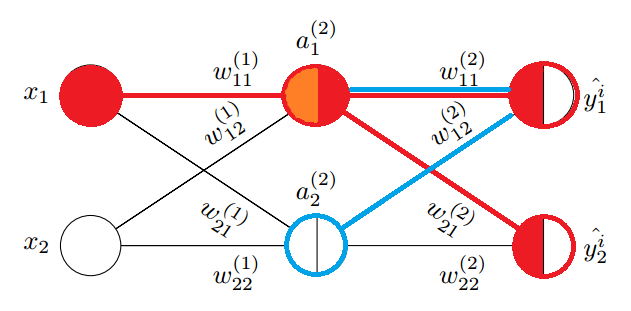
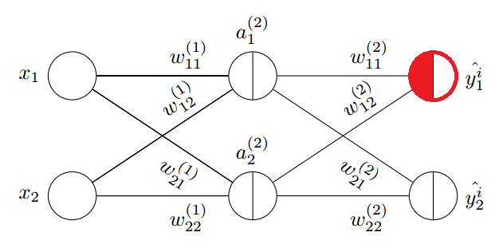

.. role:: raw-latex(raw)
    :format: latex html
    
神经网络
--------------

神经网络原理
~~~~~~~~~~~~~~

神经网络(Neural Networks)由多层感知器组成，每个节点的激活函数均使用 sigmoid 逻辑回归函数。

.. figure:: imgs/practice/neuron.png
  :scale: 100%
  :align: center
  :alt: neuron

  神经网络示意图

上图是一个简单的三层神经网络，输入层，1个隐藏层和一个输出层，每个神经节点和节点输出的权重均编号。其中：

- 层号从 1 编号，神经节点从 0 编号
- 层号使用上标加括号表示，节点号使用下标表示。例如 :raw-latex:`\(a^{(2)}_1\)` 表示第 2 层的 1 号节点。同时它也用于表示节点的激活值。
- 0 号节点总是用来表示偏置单元（bias unit），对应感知器中的阈值，它没有输入，输出权重总为 1。
- 输出权重  :raw-latex:`\(w^{(l)}_{ji}\)` 表示第 l 层的第 i 个节点输出到第 l+1 层的第 j 节点权重。显然这里的 ji 不是按照从左到右的层排序的，而是 l+1 节点在前，l 节点在后，这是为了矩阵表达时的方便才如此定义的，看到 ji 就明白是反向定义即可。

:raw-latex:`\(w^{(1)}_{23}\)` 表示第 1 层上的节点 3 (即图中 :raw-latex:`\(a^{(1)}_3\)` )输出到第 2 层上的节点 2 (即图中 :raw-latex:`\(a^{(2)}_2\)` )的权重。 

通常只有单个隐藏层的神经网络被称为单层或者浅层（Shallow）神经网络，当隐藏层大于一层时，被称为深度神经网络(Deep Neural Networks)。

神经网络的学习过程如下：

- 从输入层开始，通过网络前向传播（从左向右，也称为正向传播，Forward propagation）训练数据中的模式，以生成输出。
- 基于输出层的输出，通过一个代价函数计算所需最小化的误差。
- 反向传播（Back propagation）误差，通过链式法则计算代价函数对于网络中每个权重的导数，并更新模型。

每个节点（神经元）可以看作是返回值位于[0,1]连续区间上的逻辑回归单元。

以上图为例，可以写出第 2 层各节点的输入值

.. math::

  \begin{eqnarray}
  a^{(2)}_1 & = & \phi (z^{(2)}_1) & = & \phi (w^{(1)}_{10} x_0 + w^{(1)}_{11} x_1 + w^{(1)}_{12} x_2 + w^{(1)}_{13} x_3) \\
  a^{(2)}_2 & = & \phi (z^{(2)}_2) & = & \phi (w^{(1)}_{20} x_0 + w^{(1)}_{21} x_1 + w^{(1)}_{22} x_2 + w^{(1)}_{23} x_3) \\
  a^{(2)}_3 & = & \phi (z^{(2)}_3) & = & \phi (w^{(1)}_{30} x_0 + w^{(1)}_{31} x_1 + w^{(1)}_{32} x_2 + w^{(1)}_{33} x_3) 
  \end{eqnarray}

可以看到每一层的 a 都是由上一层所有的 x 和每一个 x 所对应的权重系数决定的。这种从左到右的算法就是前向传播算法(Forward propagation)。

其中：

.. math::

  \begin{eqnarray}
  \phi (z) &  = & sigmoid(z) & = & \frac{1}{1+e^{-z}}
  \end{eqnarray}

观察上式，权重 w 和输入 x 可以写成矩阵点乘形式：

.. math::

  \begin{eqnarray}
  \mathbf{W^{(1)}} =
  \left( \begin{array}{ccc}
  w^{(1)}_{10} & w^{(1)}_{11} & w^{(1)}_{12} & w^{(1)}_{13} \\
  w^{(1)}_{20} & w^{(1)}_{21} & w^{(1)}_{22} & w^{(1)}_{23} \\
  w^{(1)}_{30} & w^{(1)}_{31} & w^{(1)}_{32} & w^{(1)}_{33} 
  \end{array} \right)
  \end{eqnarray}

.. math::

  \begin{eqnarray}
  \mathbf{x^{(1)}} =
  \left( \begin{array}{ccc}
  1 \\
  x_1 \\ 
  x_2 \\ 
  x_3
  \end{array} \right)
  \end{eqnarray}

其中权重矩阵 w 行数为第 2 层节点数（接受输出的节点数，不含偏置单元），列数为第 1 层节点数（所有输出节点数，含偏置单元）。观察每个权重的下编号，就可理解为何 l+1 节点在前，l 节点在后的编号定义了。

于是得出第 2 层输出的矩阵表示形式：

.. math::

  \begin{eqnarray}
  z^{(2)} & = & \mathbf{W^{(1)}} \mathbf{x^{(1)}} \\
  a^{(2)} & = & \phi (z^{(2)}) = \phi (\mathbf{W^{(1)}} \mathbf{x^{(1)}})
  \end{eqnarray}

这只是针对一个训练样本所进行的计算。如果要对整个训练集进行计算，需要将训练集特征矩阵进行转置，使得同一个实例的特征都在同一列里。

.. math::

  \begin{eqnarray}
  \mathbf{X^{(1)}} =
  \left( \begin{array}{ccc}
  1 & x_{11} & x_{12} & x_{13} \\
  1 & x_{21} & x_{22} & x_{23} \\
  1 & x_{31} & x_{32} & x_{33} \\
  \vdots & \vdots & \vdots & \vdots
  \end{array} \right)
  \end{eqnarray}

.. math::

  \begin{eqnarray}
  z^{(2)} & = & \mathbf{W^{(1)}} {\mathbf{X^{(1)}}}^T \\
  a^{(2)} & = & \phi (z^{(2)}) = \phi (\mathbf{W^{(1)}} {\mathbf{X^{(1)}}}^T)
  \end{eqnarray}

显然，第 3 层的输入矩阵形式也容易写出。这非常易于编码实现。

神经网络实战
~~~~~~~~~~~~~~~~

实现基本的神经网络类并不复杂，它是多个逻辑回归节点的分层叠加。

.. code-block:: python
  :linenos:
  :lineno-start: 0
  
  # nn.py
  class NN(object):
      def __init__(self, sizes, eta=0.001, epochs=1000, tol=None):
          '''
          Parameters
          ------------
          eta : float
            Learning rate (between 0.0 and 1.0)
          epochs: uint
            Training epochs
          sizes : array like [3,2,3]
            Passes the layers.
          '''
          self.eta = eta
          self.epochs = epochs
          self.num_layers = len(sizes)
          self.sizes = sizes
          self.tol = tol

          self.biases = [np.random.randn(l, 1) for l in sizes[1:]]
          self.weights = [np.random.randn(l, x) for x, l in zip(sizes[:-1], sizes[1:])]

这里定义一个 NN 神经网络类，并定义初始化函数，完成以下工作：

- sizes 参数是一个层数列表，例如 [2,3] 表示神经网络有 2 层，每层节点数分别为 2 和 3。
- biases 成员记录了每一层的偏置单元的权重值，由于前一层偏置的权重个数等于后一层接受输出的节点数，所以这里取 sizes[1:]。
- weights 成员是权重列表，每一个元素都是一个 2 维的 ndarray，由于列表索引从 1 开始，所以 weights[0] 表示的是层 1->2 的权重矩阵。如果 1 层节点数为 2，2 层节点数为 3，则 weights[0] 就是一个 3*2 的二维矩阵。
- tol 停止条件的容忍度，当代价函数小于该值时，退出循环。

注意：理解 weights 的构造形式非常重要。为了逻辑更清晰，这里将偏置从权重矩阵中分离出来，同时初始化为 0-1 之间的随机正态分布数值。
    
.. code-block:: python
  :linenos:
  :lineno-start: 0
  
      def sigmoid(self, z):
          return 1.0/(1.0 + np.exp(-z))

      def sigmoid_derivative(self, z):
          sg = self.sigmoid(z)
          return sg * (1.0 - sg)

sigmoid 为激活函数，sigmoid_derivative 对应它的导数，它被用于梯度下降算法中，其中的临时变量 sg 可以减少一次 sigmoid 运算。

.. code-block:: python
  :linenos:
  :lineno-start: 0
            
      def feedforward(self, X):
          X = X.T
          for b, W in zip(self.biases, self.weights):
              X = self.sigmoid(np.dot(W, X) + b)
          return X

实现前向传播算法(Forward propagation)函数，关键点是从第一层开始针对每一层进行权重矩阵求和然后做 sigmoid。另外注意到 X 是一个训练集的输入矩阵，每一行代表一个样本，所以传入参数后要先对其转置。

显然返回值就是最后的节点输出，它是一个二维矩阵，如果输出节点数为 n，输入样本数为 m，那么它的 shape 为 (n,m)，第 i 行对应第 i 个节点上的输出，第 j 列对应第 j 个样本通过神经网络处理的输出，所以 ij 个元素对应第 j 个样本在节点 i 上的输出（这里 i 和 j 下标均从 0 开始）。

这里使用异或训练集来查看 feedforward 函数的输出：

.. code-block:: python
  :linenos:
  :lineno-start: 0

  def boolXorTrain():
      # Bool xor Train         x11 x12 y1
      BoolXorTrain = np.array([[1, 0, 1],
                               [0, 0, 0],
                               [0, 1, 1],
                               [1, 1, 0]])
      X = BoolXorTrain[:, 0:-1]
      y = BoolXorTrain[:, -1]
  
      nn = NN([2,2,1])
      a = nn.feedforward(X)
      print(a.shape)
    
  boolXorTrain()

  >>>
  (1, 4)

这里使用了 4 个训练样本，网络层数为 [2,2,1]，输出节点数为 1，所以 feedforward 函数会输出 1 行 4 列的结果，这和理论分析是一致的。

从算法上看，feedforward 就是在对输入通过网络权重计算输出的过程，也就是算法进行预测的过程。预测函数也就可以如下实现了：

.. code-block:: python
  :linenos:
  :lineno-start: 0

    def predict(self, X):
        ff = self.feedforward(X)
        if self.sizes[-1] == 1: # 1 output node
            return np.where(ff >= 0.5, 1, 0)
        
        return np.argmax(ff, axis=0)

这里的预测函数同时考虑到了输出节点只有 1 个和多个的情况：

- 如果输出节点只有 1 个，就是一个二分类神经网络，预测方式和逻辑回归是一致的，结果为 0 或 1。
- 如果输出节点有 n (n>1) 个，那么就是 n 分类算法，此时取输出层中输出似然概率最高的那个节点，每个分类编号从 0 到 n - 1。

在多分类情况下，n 个分类通常会安排 n 个输出节点，尽管 n 个节点从输出二进制（sigmoid输出经阈值处理后总是输出0,1）上可以表示 2^n 种分类，这是基于经验主义规定的，或许是 n 个输出节点增加了整个网络参数的节点数和权重数目，使得分类效果更好。

到这里我们还缺少最核心的东西，基于梯度下降的训练函数 fit。在实现它之前必须再次回顾逻辑回归的代价函数和梯度下降算法，因为神经网络本质上就是多层逻辑回归模型的叠加。

反向传播理论推演
~~~~~~~~~~~~~~~~

逻辑回归是一个二分类算法，回顾它的代价函数：

.. math::
    
  J(w) = \sum_{i=1}^{n}-y^i\ln {(\phi (z^i))}-(1-y^i)\ln {(1-\phi (z^i))}

逻辑回归算法，一个输入 :raw-latex:`\(x^i\)` 只对应一个输出  :raw-latex:`\(y^i\)`，可以看做是一个标量，对应的标签值为 0 或者 1。但是在神经网络中，可以有很多输出变量，也即 K 个分类对应一个 K 维的向量，对应不同的标签向量。例如 3 分类的标签向量可能为：

 .. math::

  \begin{eqnarray}
  \mathbf{y^i} =
  \left( \begin{array}{ccc}
  1 \\ 0 \\ 0 
  \end{array} \right)
  \left( \begin{array}{ccc}
  0 \\ 1 \\ 0 
  \end{array} \right)  
  \left( \begin{array}{ccc}
  0 \\ 0 \\ 1 
  \end{array} \right) 
  \end{eqnarray}

那么，对于 K 分类，标签向量被记为 :raw-latex:`\(y^i_k\)`，k 取 1 到 K。此时的代价函数可表示为多个输出节点的代价函数和：

.. math::
    
  J(w) = \sum_{i=1}^{n}\sum_{k=1}^{K}-y^i_k {\ln {(\phi (z^i))}}_k - (1-y^i_k) {\ln {(1-\phi (z^i))}}_k

尽管表达式看起来很复杂，实际算法上只不过在外循环内加上一个用于计算每个输出节点在训练样本 :raw-latex:`\(x^i\)` 上代价的累加。

相较于上面的形式，笔者更喜欢把 K 累加放在外边，这样内侧累加就和逻辑回归代价函数保持一致，表示一个输出节点上的代价函数：

.. math::
    
  J(w) = \sum_{k=1}^{K} \sum_{i=1}^{n} -y^i_k{\ln {(\phi (z^i))}}_k - (1-y^i_k) {\ln {(1-\phi (z^i))}}_k

在逻辑回归中只要对代价函数求权重偏导，就可以得到调整权重 :raw-latex:`\(\Delta w\)`，但是神经网络具有多层，需要采用一种反向传播算法，也即先计算最后一层的误差（预测值与标签值的差），然后再一层一层反向求出各层的误差，直到倒数第二层。

理解反向传播的第一个关键点在于实际上它是逐个对每个训练样本计算代价函数的关于各个权重的偏导，并调整权重（实际上就是随机梯度下降），这将问题大大简化，我们无需一次考虑代价函数中的两层累加，而把问题的注意力放在单个训练样本对代价函数的影响上。


  反向传播（对第 2 层权重求偏导）

上图中是一个三层的神经网络，每层均有 2 个节点，暂不考虑偏置节点。除了输入节点外，每个节点被分割为左右两个半圆，左边表示节点的加权求和的权重输入，右边表示节点的激活输出。观察上图中的红色圈中的输出层节点 :raw-latex:`\(a^{(3)}_{1}\)` ，它的权重输入通常标记为  :raw-latex:`\(z^{(3)}_{1}\)`;  它的输出与节点编号相同：:raw-latex:`\(a^{(3)}_{1}=\hat{y^i_1}\)`，这是当样本 i 输入到神经网络后，节点 :raw-latex:`\(a^{(3)}_{1}\)` 的输出。


我们从图中被涂成红色的边上的权重 :raw-latex:`\(w^{(2)}_{11}\)` 开始考虑如何对它进行调整，以使得输出的代价函数最小。
这条边的输入部分就是它连接的左侧节点 :raw-latex:`\(a^{(2)}_{1}\)` 的输出，所以把 :raw-latex:`\(a^{(2)}_{1}\)` 节点的右半边涂成红色，  
这条边的权重输出对应到它连接的右侧节点 :raw-latex:`\(a^{(3)}_{1}\)` 的输入 :raw-latex:`\(z^{(3)}_{1}\)` ，所以把它的左半边涂成红色。

我们很快就会明白为何把这两个半圆涂成红色，这是某种强烈的隐喻，边上权重的调整与它们息息相关。

为了计算 :raw-latex:`\(w^{(2)}_{11}\)` 的偏导数，就要理清 :raw-latex:`\(w^{(2)}_{11}\)` 是如何影响代价函数的，这样我们就可以使用链式法则求偏导了。

.. math::

  \begin{eqnarray}
  J(w) & = & -y^i_1 {\ln {(\phi (z^{(3)}_1))}} - (1-y^i_1) {\ln {(1-\phi (z^{(3)}_1))}}
  \end{eqnarray}

观察关于训练样本 i 的代价函数，注意到式子中的 :raw-latex:`\(\phi (z^{(3)}_1)\)`，它就是输出层节点的输出：

.. math::

  \begin{eqnarray}
  a^{(3)}_1 & = & \phi (z^{(3)}_1) &=& \hat{y^i_1}
  \end{eqnarray}

与权重变量  :raw-latex:`\(w^{(2)}_{11}\)` 发生关联的就是  :raw-latex:`\(z^{(3)}_1\)`：

.. math::

  \begin{eqnarray}
  z^{(3)}_1 & = & w^{(2)}_{11} a^{(2)}_1 + w^{(2)}_{12} a^{(2)}_2 
  \end{eqnarray}

由以上各式根据链式法则求对 :raw-latex:`\(w^{(2)}_{11}\)` 的偏导：

.. math::

  \frac {\partial {J(w)}} {\partial {w^{(2)}_{11}}} = 
  \frac {\partial {J(w)}} {\partial a^{(3)}_{1}} 
  \frac {\partial a^{(3)}_{1}} {\partial z^{(3)}_{1}}
  \frac {\partial z^{(3)}_{1}} {\partial {w^{(2)}_{11}}}=
  \frac {\partial {J(w)}} {\partial {\phi (z^{(3)}_1)}}
  \frac {\partial {\phi (z^{(3)}_1)}} {\partial z^{(3)}_{1}}
  \frac {\partial z^{(3)}_{1}} {\partial {w^{(2)}_{11}}}

观察以上公式，它分为左右两个部分，左侧部分对应代价函数对权重右侧节点的输入的偏导，右侧部分对应权重左侧节点的输出，当然左右可以交换下位置，这样就和图中的标记顺序一致了。到这里就可以理解为何图中如此涂色了。

通常代价函数对节点输入的偏导数称为该节点的误差信号（Error Signal），记为 :raw-latex:`\(\delta^{(l)}_i\)`，它表示当这个节点的输入变化  :raw-latex:`\(\Delta z\)` 时，代价函数将产生  :raw-latex:`\(\delta^{(l)}_i\Delta z\)` 的误差（实际上这就是对导数的数学意义的解释）。这里称为误差信号，更准确的意思是对代价函数的误差的影响大小，信号越大（越强），节点上的输入变化导致的误差就越大。

这里参考逻辑回归中的求导过程，上式结果为：

.. math::

  \frac {\partial {J(w)}} {\partial {w^{(2)}_{11}}} = (a^{(3)}_1-{y^i_1})a^{(2)}_1 = a^{(2)}_1(a^{(3)}_1-{y^i_1}) \qquad (0)

同理，根据上述规则，考虑所有输出节点的代价函数对第 2 层各权重的偏导关系，可以得出：

.. math::

  \begin{eqnarray}
  \frac {\partial {J(w)}} {\partial {w^{(2)}_{12}}} & = & a^{(2)}_2(a^{(3)}_1-{y^i_2}) \qquad (1)\\
  \frac {\partial {J(w)}} {\partial {w^{(2)}_{21}}} & = & a^{(2)}_1(a^{(3)}_2-{y^i_2}) \qquad (2)\\
  \frac {\partial {J(w)}} {\partial {w^{(2)}_{22}}} & = & a^{(2)}_2(a^{(3)}_2-{y^i_2}) \qquad (3)
  \end{eqnarray}

观察以上四个偏导公式，我们对偏导的两部分顺序进行了交换，这就和图中的左右顺序一致了：左侧部分对应权重节点的输入，右侧部分对应 :raw-latex:`\(\delta^{(3)}_i\)`。如果考虑所有第三层的节点，就可以把误差写成向量的形式，记作 :raw-latex:`\(\delta^{(3)}\)` ：

.. math::

  \begin{eqnarray}
  \mathbf{\delta^{(3)}} =
  \left( \begin{array}{ccc}
  a^{(3)}_1 - y^i_1 \\
  a^{(3)}_2 - y^i_2
  \end{array} \right)
  \end{eqnarray}

同时针对第二层的权重的偏导公式可以写成如下形式，注意其中是向量逐元素相乘。

.. math::

  \begin{eqnarray}
  \frac {\partial {J(w)}} {\partial {w^{(2)}_{ij}}} & = {a^{(2)}_j} \delta^{(3)}_i \qquad (1.1)
  \end{eqnarray}

观察上式中的下标关系，可以写成矩阵的乘法形式：

.. math::

  \begin{eqnarray}
  \frac {\partial {J(w)}} {\partial {w^{(2)}}} =
  \left( \begin{array}{ccc}
  \delta^{(3)}_1 \\
  \delta^{(3)}_2
  \end{array} \right)
  \left( \begin{array}{ccc}
  a^{(2)}_1 & a^{(2)}_2
  \end{array} \right)
  \end{eqnarray}=\delta^{(3)} {a^{(2)}}^T

尽管已经发现了代价函数对权重的偏导规律：输入和信号误差相乘。但是假如每一层的信号误差都要使用链式法则重新计算（特别是层数很多时），那么计算量无疑是巨大的，观察链式法则，我们会发现对第 1 层求偏导的计算链要基于第 2 层的信号误差，同理第 2 层的信号误差要基于第 3 层的信号误差，直至输出层。

这里继续对第 1 层中权重 :raw-latex:`\(w^{(1)}_{11}\)` 求偏导，来说明以上的规律。


  反向传播（对第 1 层权重求偏导）

图中输入层无需考虑加权和激活部分，直接输入到权重边，所以整个圆被涂红。首先梳理清楚 :raw-latex:`\(w^{(1)}_{11}\)` 与代价函数的关系（函数链，以便运用链式求导法则）：

.. math::

  \begin{eqnarray}
  z^{(2)}_1 & = & w^{(1)}_{11} x^1 + w^{(1)}_{12} x^2 \\
  a^{(2)}_1 & = & \phi({z^{(2)}_1})\\ 
  z^{(3)}_1 & = & w^{(2)}_{11} a^{(2)}_1 + w^{(2)}_{12} a^{(2)}_2 \\
  z^{(3)}_2 & = & w^{(2)}_{21} a^{(2)}_1 + w^{(2)}_{22} a^{(2)}_2 
  \end{eqnarray}

显然它通过 :raw-latex:`\(z^{(3)}_1\)` 和  :raw-latex:`\(z^{(3)}_2\)` 与代价函数关联了起来（这里的代价函数就要考虑所有输出点的情况了），另外我们在对第二层权重求偏导时，已经计算过代价函数对 :raw-latex:`\(z^{(3)}_1\)` 和  :raw-latex:`\(z^{(3)}_2\)` 的偏导，即 :raw-latex:`\(\delta^{(3)}_1\)` 和 :raw-Latex:`\(\delta^{(3)}_2\)`，所以对  :raw-latex:`\(w^{(1)}_{11}\)` 的偏导公式可以写成：

.. math::

  \frac {\partial {J(w)}} {\partial {w^{(1)}_{11}}} = 
  (\frac {\partial {J(w)}} {\partial {\phi (z^{(3)}_1)}}
  \frac {\partial {\phi (z^{(3)}_1)}} {\partial z^{(3)}_{1}}
  \frac {\partial z^{(3)}_{1}} {\partial {\phi (z^{(2)}_1)}}
  + \frac {\partial {J(w)}} {\partial {\phi (z^{(3)}_2)}}
  \frac {\partial {\phi (z^{(3)}_2)}} {\partial z^{(3)}_{2}}
  \frac {\partial z^{(3)}_{2}} {\partial {\phi (z^{(2)}_1)}})
  \frac {\partial {\phi (z^{(2)}_1)}} {\partial {z^{(2)}_{1}}} 
  \frac {\partial {(z^{(2)}_2)}} {\partial {w^{(1)}_{11}}}

我们把 :raw-latex:`\(\delta^{(3)}_1\)` 和 :raw-Latex:`\(\delta^{(3)}_2\)` 代入以上公式，上式被化简成：

.. math::

  \frac {\partial {J(w)}} {\partial {w^{(1)}_{11}}} =
  x^1(\delta^{(3)}_1
  w^{(2)}_{11}
  + \delta^{(3)}_2
  w^{(2)}_{21})
  \frac {\partial {\phi (z^{(2)}_1)}} {\partial {z^{(2)}_{1}}} 
  
注意这里把输入 :raw-Latex:`\(x^1\)` 放在了最左边，其中：

.. math::

  \frac {\partial {\phi (z^{(2)}_1)}} {\partial {z^{(2)}_{1}}} = a^{(2)}_1(1-a^{(2)}_1)

我们不急于写出其他几个权重的偏导数，而是观察上式与第 2 层权重偏导公式(1.1)的关系，左边为输入项，右侧为代价函数对 :raw-latex:`\(z^{(2)}_1\)` 的偏导，根据误差信号的定义，右侧部分可以标记为 :raw-Latex:`\(\delta^{(2)}_1\)`，对应下图中的橙色部分的偏导。  

.. math::

  \delta^{(2)}_1 =
  (\delta^{(3)}_1
  w^{(2)}_{11}
  + \delta^{(3)}_2
  w^{(2)}_{21})
  \frac {\partial {\phi (z^{(2)}_1)}} {\partial {z^{(2)}_{1}}} 


  反向传播（第 2 层信号误差）

对照上图，仔细观察  :raw-Latex:`\(\delta^{(2)}_1\)` 组成的各个部分，可以体会到它和正向传播的某种对称性。



  反向传播和正向传播关系

观察图中蓝色部分，正向传播使用权重矩阵点乘输入进行：

.. math::

  \begin{eqnarray}
  \mathbf{W^{(2)}} =
  \left( \begin{array}{ccc}
  w^{(2)}_{11} & w^{(2)}_{12} \\
  w^{(2)}_{21} & w^{(2)}_{22}
  \end{array} \right)
  \end{eqnarray}

.. math::

  \begin{eqnarray}
  \mathbf{a^{(2)}} =
  \left( \begin{array}{ccc}
  a^{(2)}_{1}\\
  a^{(2)}_{2}
  \end{array} \right)
  \end{eqnarray}

.. math::
  
  z^{(3)} = {\mathbf{W^{(2)}}} \mathbf{a^{(2)}}

为何观察上述对称性，我们把 :raw-Latex:`\(\delta^{(2)}\)` 的两个表达式列出来：

.. math::

  \begin{eqnarray}
    \delta^{(2)}_1 &=&
  (\delta^{(3)}_1
  w^{(2)}_{11}
  + \delta^{(3)}_2
  w^{(2)}_{21})
  \frac {\partial {\phi (z^{(2)}_1)}} {\partial {z^{(2)}_{1}}}   \\
    \delta^{(2)}_2 &=&
  (\delta^{(3)}_1
  w^{(2)}_{12}
  + \delta^{(3)}_2
  w^{(2)}_{22})
  \frac {\partial {\phi (z^{(2)}_2)}} {\partial {z^{(2)}_{2}}}
  \end{eqnarray}

观察上述矩阵运算过程，正向传播使用权重矩阵的各行与输入相乘叠加得出下一层的权重输入，逆向传播使用权重矩阵的各列分别信号误差相乘，得出上一层的信号误差，所以 :raw-Latex:`\(\delta^{(2)}\)` 和  :raw-Latex:`\(\delta^{(3)}\)` 的关系可以表示为：

.. math::
  
  \delta^{(2)} = {\mathbf{W^{(2)}}}^T \delta^{(3)} \odot \frac {\partial {\phi (z^{(2)})}} {\partial {z^{(2)}}}

其中 :raw-Latex:`\(\odot\)` 表示元素逐项对应相乘。图中的蓝色线对应权重矩阵的第一行，红色线对应权重矩阵的第一列，它们可以同时充当正向传播和反向传播的桥梁，也即转置的作用。到这里就可以总结出反向传播的所有公式了：

.. math::

  \delta^{(l)} = {{\mathbf{W}}^{(l)}}^T \delta^{(l+1)} \odot \frac {\partial {\phi (z^{(l)})}} {\partial {z^{(l)}}} \qquad (0)

注意当计算到第 2 层的信号误差时，第 1 层的权重调整系数就已经得到了，所以式子中的 l >= 2，并且当 l 为输出层时，无需激活函数的偏导部分，l 的取值范围为 [L,2]。有了每层的误差，就可以基于它计算每个权重的调整系数了，它是对式 (1.1) 的扩展：

.. math::

  \begin{eqnarray}
  \frac {\partial {J(w)}} {\partial {w^{(l-1)}_{ij}}} & = {a^{(l-1)}_j} \delta^{(l)}_i \qquad (1)
  \end{eqnarray}

显然这里使用 l-1 是为了公式 (1) 中 l 的取值范围和公式 (2) 保持一致。对于偏置项，由于输入总是 1， 所以调整系数就是输出节点的信号误差。

尽管这里只计算了 2 层权重的偏导来推导反向传播公式，显然它基于链式法则，可以推广到任意层，整个反向传播的计算流程描述如下：

- 随机初始化所有权重
- 使用一个样本进行正向传播，得到输出层的信号误差
- 复制一份权重和偏置，并初始化为 0，所有系数调整在该拷贝上进行
- 基于输出层的信号误差反向计算上一层的信号误差，使用信号误差计算出调整系数
- 对拷贝权重和偏置进行调整，直至计算到第 2 的信号误差并调整完第一层 1 的权重和偏置
- 更新拷贝项替到原权重和偏置

以上算法显示是随机梯度下降，也可以使用批量梯度下降，也即使用一批样本，对拷贝的权重和偏置进行累积调整，这一批训练样本处理完后再更新到原权重和偏置，这样效率要高很多。

反向传播理论思考
``````````````````

反向传播是如何被发现的？是偶然的，还是必然的。我记起来孟德尔发现遗传定律的豌豆杂交实验。豌豆具有多种特征：皮皱和光滑，高矮，种子颜色，种子的圆扁等等，它们之间有无数种组合，这里很像多个训练样本对层层线性和非线性神经网络的影响。

孟德尔成功的原因有几个要点：

- 将问题简化，先研究一对相对性状的遗传，再研究两对或多对性状的遗传
- 应用统计学方法对实验结果进行分析
- 基于对大量数据的分析而提出假设，再设计实验来验证。

孟德尔在以上方法指导下，耐心地进行 7 年的豌豆种植试验，最终破解了生物遗传密码，称为遗传学之父。

逆向传播的发现也具有类似特征：

- 首先简化问题：只考虑一个样本对一个输出节点的影响
- 运用链式法则求倒数第 1 层的权重偏导数，观察发现它只与左侧节点的输入和代价函数对右侧节点输入的偏导数（信号误差）有关，并且基于链式法则，对任意层有效。
- 继续对前一层求偏导，可以发现第 2 层的信号误差与第 3 层的信号误差的关系，进而总结出规律公式 (0) 和 (1)。

并且可以发现最后一层的信号误差与代价函数和激活函数有关，其他层信号误差只与后一层的信号误差以及激活函数（激活函数关于输入的偏导数）有关：

- 如果我们要替换代价函数，那么只要调整最后一层信号误差计算方式。
- 如果要替换激活函数，那么在计算每一层信号误差时都要考虑，当然我们把它和它的导数均定义为函数，在代码实现上非常简单。

在大部分教科书上，神经网络的代价函数可能使用的是 MSE（均方差），而不是 MLE（最大对数似然函数）。笔者猜测，如果对线性回归比较熟悉，那么就倾向于使用 MSE，至少从形式上看很简单，并且求导过程不会那么可怕；另一条研究神经网络的路线是：感知器到Adaline模型，到逻辑回归，再到神经网络，那么选择 MLE 就水到渠成。笔者更倾向于第二条路线。不过这无关紧要，重要的是不同的代价函数对神经网络实现和性能到底有什么影响？

或许有人记得 MLE 形式的代价函数在逻辑回归中是个凸函数，这让我们可以找到极小值，而在神经网络中，每个权重都经过了层层的线性和非线性叠加变换，指望这里的代价函数具有凸函数特性是不可能的。想象一个层数为 [2，2，1]的神经网络，它的权重数目为 2*2 + 2*1 = 6，我们不可能绘制一个 6 维的代价函数曲面，但是我们可以把其中的 4 个权重固定，只改变其中的两个，这样取得的曲面图就是一个子集，它能从侧面反映出代价函数的凹凸性，所以我称为这里的代价函数曲面为拟曲面图。

下图是在 XOR 问题上训练完成的权重上，调整其中两个权重得到的曲面图，显然它不是凸面函数，有着丰富的波动从而导致众多的局部极小值。此图是在直观层面上说明选择神经网络的代价函数已经不再考虑凹凸性了，也即凹凸性不是选择 MLE 方法的原因。这里可以提及的是权重使用随机初值化，而不是全 0，是因为 0 附近很可能是一个局部极小值，导致每次迭代都无法收敛。


  神经网络的代价函数拟曲面图

MSE 代价函数
`````````````

MSE 代价函数很容易写出来，与 Adaline 模型不同的是，这里要考虑输出层有 K 个输出节点的情况，也即预测值是一个向量，而不再是一个数字：

.. math::
    
  J(w) = \frac{1}{2n}\sum_{i=1}^{n}\sum_{k=1}^{K}({\hat y}^i_k - {y^i_k})^2



  反向传播MSE代价函数求偏导

上面已经指出如果要替换代价函数，那么只要调整最后一层信号误差计算方式。这里使用 MSE 代价函数对上图中的  :raw-latex:`\(z^{(3)}_1\)` 求偏导数，在考虑一个样本情况时可忽略常数 1/n：

.. math::

  \frac {\partial {J(w)}} {\partial {z^{(3)}_{1}}} = 
  \frac {\partial {J(w)}} {\partial a^{(3)}_{1}} 
  \frac {\partial a^{(3)}_{1}} {\partial z^{(3)}_{1}}=
  \frac {\partial {J(w)}} {\partial {\phi (z^{(3)}_1)}}
  \frac {\partial {\phi (z^{(3)}_1)}} {\partial z^{(3)}_{1}}=
  ({\hat y}^i_1 - {y^i_1})\frac {\partial {\phi (z^{(3)}_1)}} {\partial z^{(3)}_{1}}
  = (a^{(3)}_1 - {y^i_1})\frac {\partial {\phi (z^{(3)}_1)}} {\partial z^{(3)}_{1}}


得到最后一层的信号误差 :raw-latex:`\(\delta^{(3)}\)`：
 
.. math::

  \begin{eqnarray}
  \mathbf{\delta^{(3)}} =
  \left( \begin{array}{ccc}
  (a^{(3)}_1 - y^i_1)\frac {\partial {\phi (z^{(3)}_1)}} {\partial z^{(3)}_{1}} \\
  (a^{(3)}_2 - y^i_2)\frac {\partial {\phi (z^{(3)}_2)}} {\partial z^{(3)}_{2}} 
  \end{array} \right)
  \end{eqnarray}\qquad (MSE)

对比最大对数似然估计，可以看到这里只是多了激活函数对节点输入的偏导数项。显然 MSE 在反向计算每一层信号误差时都需要加入该项，则 MLE 在计算最后一层信号误差时无需考虑（因为代价函数求导时约去了该项）。

.. math::

  \begin{eqnarray}
  \mathbf{\delta^{(3)}} =
  \left( \begin{array}{ccc}
  a^{(3)}_1 - y^i_1 \\
  a^{(3)}_2 - y^i_2 
  \end{array} \right)
  \end{eqnarray}\qquad (MLE)

基于以上理论，实现反向传播不再困难，我们尝试在一个样本上实现反向传播算法，并在测试验证正确后再尝试优化。

实现反向传播
````````````````

定义名为 backprop 的类函数，x 是一个样本，为 1*n 的特征矩阵。y 是标签值，它是一个 K 维向量，K 为输出层的节点数。

.. code-block:: python
  :linenos:
  :lineno-start: 0
  
    def backprop(self, x, y): 
        # 初始化新的偏置和权重系数矩阵
        delta_b = [np.zeros(b.shape) for b in self.biases]
        delta_w = [np.zeros(w.shape) for w in self.weights]

        # 转置样本特征矩阵，以便于权重矩阵左乘
        x = x.reshape(x.shape[0], 1)
        y = y.reshape(y.shape[0], 1)
        activation = x
        
        # 记录每一层每一节点的激活函数输出，用于在反向传播时计算激活函数的偏导 a(1-a)
        # 第一层就是 x 自身
        acts = [x]
        
        # zs 记录每一层每一节点的权重输入
        zs = []
        
        # 进行前向传播，以得到每层每个节点的权重输入，激活函数值和最终输出层的信号误差
        for b, W in zip(self.biases, self.weights):
            z = W.dot(activation) + b
            zs.append(z)
            activation = self.sigmoid(z)
            acts.append(activation)

        # 反向传播，这里使用 MSE 代价函数，所以 L-1 层信号误差计算需乘以激活函数的导数
        delta = (acts[-1] - y) * self.sigmoid_derivative(zs[-1])
        delta_b[-1] = delta   # 偏置的输入总是 1， 所以就是信号误差
        delta_w[-1] = np.dot(delta, acts[-2].transpose()) 
        for l in range(2, self.num_layers):
            sp = self.sigmoid_derivative(zs[-l])
            delta = np.dot(self.weights[-l+1].transpose(), delta) * sp
            delta_b[-l] = delta
            delta_w[-l] = np.dot(delta, acts[-l-1].transpose())
        
        # 更新偏置和权重
        self.biases = [b-(self.eta) * nb / X.shape[0]
                        for b, nb in zip(self.biases, delta_b)]
        self.weights = [w-(self.eta) * nw / X.shape[0]
                        for w, nw in zip(self.weights, delta_w)]

结合理论分析，再理解上面的代码实现并不困难。注意以上函数一次只使用一个样本进行权重调整，这在实际中运行中效率很慢，我们可以使用矩阵来实现批量样本的权重更新。

.. code-block:: python
  :linenos:
  :lineno-start: 0
  
    # X is an array with n * m, n samples and m features every sample
    def mbatch_backprop(self, X, y):
        delta_b = [np.zeros(b.shape) for b in self.biases]
        delta_w = [np.zeros(w.shape) for w in self.weights]

        # feedforward
        if X.ndim == 1:
            X = X.reshape(1, X.ndim)
        if y.ndim == 1:
            y = y.reshape(1, y.ndim)
        
        activation = X.T
        acts = [activation] 
        zs = []             
        for b, W in zip(self.biases, self.weights):
            z = W.dot(activation) + b
            zs.append(z)
            activation = self.sigmoid(z)
            acts.append(activation)

        # 这里的注意点在于偏置的更新，需要进行列求和
        delta = (acts[-1] - y.T) * self.sigmoid_derivative(zs[-1])
        delta_b[-1] = np.sum(delta, axis=1, keepdims=True)
        delta_w[-1] = np.dot(delta, acts[-2].transpose())
        for l in range(2, self.num_layers):
            sp = self.sigmoid_derivative(zs[-l])
            delta = np.dot(self.weights[-l+1].transpose(), delta) * sp
            delta_b[-l] = np.sum(delta, axis=1, keepdims=True)
            delta_w[-l] = np.dot(delta, acts[-l-1].transpose())

        self.biases = [b-(self.eta) * nb
                        for b, nb in zip(self.biases, delta_b)]
        self.weights = [w-(self.eta) * nw 
                        for w, nw in zip(self.weights, delta_w)]

训练函数支持批量训练，这里默认批处理样本数为 8。

.. code-block:: python
  :linenos:
  :lineno-start: 0
    
    # MSE 代价函数，用于统计观察下降情况
    def quadratic_cost(self, X, y):
        return np.sum((self.feedforward(X) - y.T)**2) / self.sizes[-1] / 2 
        
    def fit_mbgd(self, X, y, batchn=8, verbose=False):
        '''mini-batch stochastic gradient descent.'''
        self.errors_ = []
        self.costs_ = []
        self.steps_ = 100  # every steps_ descent steps statistic cost and error sample
        
        if batchn > X.shape[0]:
            batchn = 1
        
        for loop in range(self.epochs):
            X, y = scaler.shuffle(X, y) # 每周期对样本随机处理
            if verbose: print("Epoch: {}/{}".format(self.epochs, loop+1), flush=True)
            
            x_subs = np.array_split(X, batchn, axis=0)
            y_subs = np.array_split(y, batchn, axis=0)
            for batchX, batchy in zip(x_subs, y_subs):
                self.mbatch_backprop(batchX, batchy)
            
            # 使用正向传播获取误差值，计算代价函数值，观察收敛情况
            if self.complex % self.steps_ == 0:
                cost = self.quadratic_cost(X,y)
                self.costs_.append(cost)

                # 平均最后5次的下降值，如果下降很慢，停止循环，很可能落入了局部极小值
                if len(self.costs_) > 5:
                    if sum(self.costs_[-5:]) / 5 - self.costs_[-1] < 1e-5:
                        print("cost reduce very tiny, just quit!")
                        return

                print("costs {}".format(cost))
                # 如果代价值已经很低，说明找到了较优点，退出循环
                if self.tol is not None and cost < self.tol:
                    print("Quit from loop for less than tol {}".format(self.tol))
                    return
            self.complex += 1

注意，如果下降很慢，则停止循环，很可能落入了局部极小值，此时应该重新训练网络以尝试其他权重值。

分割异或问题
`````````````

我们尝试用最简单的 [2,2,1] 神经网络来解决 XOR 异或分割问题。众所周知，异或问题不是线性可分的，那么神经是怎么通过非线性函数实现异或分割的呢？

.. code-block:: python
  :linenos:
  :lineno-start: 0
  
  def boolXorTrain():
      # Bool xor Train         x11 x12 y1
      BoolXorTrain = np.array([[1, 0,  1],
                               [0, 0,  0],
                               [0, 1,  1],
                               [1, 1,  0]])
      X = BoolXorTrain[:, 0:2]
      y = BoolXorTrain[:, 2]
      if y.ndim == 1: # vector to 2D array
          y = y.reshape(y.shape[0], 1)
  
      nn = NN([2,2,1], eta=0.5, epochs=10000, tol=1e-4)
      nn.fit_mbgd(X,y)
      pred = nn.predict(X)
      print(nn.weights)
      print(pred)

如果我们尝试将权重和偏置的初始值均置为 0，将会诧异地发现根本无法收敛。这预示着 0 点处是一个局部极小点，实际使用中如果发现跌入局部极小点而无法收敛到 0 附近，那么就要重新随机初始化权重，然后重新训练。

.. code-block:: sh
  :linenos:
  :lineno-start: 0
  
  >>> python nn.py
  ......
  costs 0.00024994697604848544
  cost reduce very tiny, just quit!
  weights: [array([[-5.55203673,  5.34505725],
         [-6.10271765,  6.20215693]]), array([[ 9.2106689 , -8.70927677]])]
  biases: [array([[-2.89311115],
         [ 3.10518764]]), array([[ 4.06794821]])]
  [[1 0 1 0]]

实际观察，在学习率为 0.5 时，大约需要 7000 个迭代周期（实际上由于样本很少，等同于批量周期下降）才会收敛到比较满意的值。当然我们可以增加 tol 来成倍降低迭代周期，当然我们最关心的不仅仅是计算量的大小，还有分类的实际效果。

首先看下代价下降曲线图，首先很庆幸我们随机的一组权重参数在一开始就给出了较小的代价值，也即我们选择的点邻近一个局部最优点，在迭代大约 2000次之后，就已经下降到接近于 0。

.. figure:: imgs/practice/nncost.png
  :scale: 80%
  :align: center
  :alt: nncost

  神经网络在 XOR 问题上的代价函数下降曲线

现在回归最根本的问题，尽管预测值和实际的标签已经完全一致，也即正确率 100%，那么神经网络是如何做到的呢？根据以往的线性分割模型无法分割 XOR 的点，直觉上可以想到，它可能进行了某种非线性分割，比如用一个椭圆（这里指高维曲面）把其中两个标签为 1 的点圈起来，外部则为 0 的点。但是如何验证推测呢？一个需要点发散思维的方式是绘图，这样就需要把图像限制在 3D 空间，也即特征变量最多有 2 个，XOR 训练集正好满足了这一特征，剩下的就是使用已经训练好的这组权重和偏置来对更多的假想特征值进行预测，来获取代价值的曲面。

.. code-block:: python
  :linenos:
  :lineno-start: 0
  
    def draw_perdict_surface(self, X, y):
        from mpl_toolkits import mplot3d
        # XOR 特征值范围为 0-1，所以在 -2-2 区间作图足够反应整个预测平面
        x1 = np.linspace(-2, 2, 80, endpoint=True)
        x2 = np.linspace(-2, 2, 80, endpoint=True)
    
        title = 'Perdict Surface and Contour'
        # 生成网格化坐标
        x1, x2 = np.meshgrid(x1, x2)
        acts = np.zeros(x1.shape)
        for i in range(x1.shape[0]):
            for j in range(x1.shape[1]): # 计算输出层激活值
                acts[i,j] = self.feedforward(np.array([x1[i,j], x2[i,j]]).reshape(1,2))

        plt.figure(figsize=(6, 6))
        ax = plt.axes(projection='3d')   # 绘制输出层激活值曲面图，透明度设置为 0.8 以便于观察样本点
        ax.plot_surface(x1, x2, acts, rstride=1, cstride=1, cmap='hot', edgecolor='none', alpha=0.8)
        
        # 绘制样本点的输出层的激活值（蓝色）和标签值（红色）
        z = self.feedforward(X)
        ax.scatter3D(X[:,0], X[:,1], z, c='blue')
        ax.scatter3D(X[:,0], X[:,1], y[:,0], c='red')
        ax.set_title(title)
        ax.set_xlabel("x1")
        ax.set_ylabel("x2")
        # 绘制 3D 曲面的等高线
        ax0 = plt.axes([0.1, 0.5, 0.3, 0.3])
        ax0.contour(x1, x2, acts, 30, cmap='hot')
        plt.show()

实际上这里有些前提，例如输出层只有一个节点，我们可以直接使用输出值作为曲面的第三维，想象输出层有多个节点，那么其中一个节点的输出所能绘制的曲面就是高高低低，而低洼的地方对应样本点在该节点输出为 1 的特征坐标，高凸的地方对应输出 1 的特征坐标。

.. figure:: imgs/practice/nnxor.png
  :scale: 100%
  :align: center
  :alt: nnxor

  神经网络在 XOR 问题上的预测曲面

