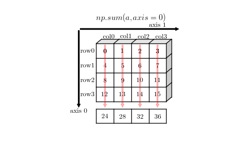

numpy
================

NumPy（Numerical Python 的简称），是 Python 语言的一个扩展程序库，提供了高效存储和操作密集数据缓存的接口。 支持大量的维度数组与矩阵运算，此外也针对数组运算提供大量的数学函数库。

NumPy 的前身 Numeric 最早是由 Jim Hugunin 与其它协作者共同开发，2005 年，Travis Oliphant 在 Numeric 中结合了另一个同性质的程序库 Numarray 的特色，并加入了其它扩展而开发了 NumPy。NumPy 为开放源代码并且由许多协作者共同维护开发。

在某些方面， NumPy 数组与Python 内置的列表类型非常相似。 但是随着数组在维度上变大， NumPy 数组提供了更加高效的存储和数据操作。 NumPy 数组几乎是整个Python 数据科学工具生态系统的核心。 

NumPy 是一个运行速度非常快的数学库，主要用于多维数组计算，包含：

- 一个强大的N维核心数组对象 ndarray，对大量矩阵运算提供支撑
- 广播功能函数
- 线性代数、傅里叶变换、随机数生成等功能

NumPy 通常与 SciPy（Scientific Python）和 Matplotlib（绘图库）一起使用， 这种组合广泛用于替代 MatLab，是一个强大的科学计算环境，有助于通过 Python 学习数据科学或者机器学习。

SciPy 是一个开源的 Python 算法库和数学工具包，包含的模块有最优化、线性代数、积分、插值、特殊函数、快速傅里叶变换、信号处理和图像处理、常微分方程求解和其他科学与工程中常用的计算。

Matplotlib 是 Python 编程语言及其数值数学扩展包 NumPy 的可视化操作界面。它为利用通用的图形用户界面工具包，如 Tkinter, wxPython, Qt 或 GTK+ 向应用程序嵌入式绘图提供了应用程序接口（API）。

.. code-block:: python
  :linenos:
  :lineno-start: 0
  
  # pip install NumPy
  import NumPy as np # 通常的导入方式
  
  print(np.__version__)
  
  >>>
  1.13.1

数组属性和类型
-----------------

从打印的 nparray 结果看，ndarray 类型的数组与Python 列表类似， 但是它是一个 ndarray 对象，它为高效地存储和操作大型数组提供了数据存储的支撑。

.. code-block:: python
  :linenos:
  :lineno-start: 0
  
  list0 = [1,2,3]
  nparray = np.array(list0)
  print(nparray)
  print(type(list0).__name__, type(nparray).__name__)
  
  >>>
  [1 2 3]
  list ndarray

ndarray（n dimention array，多维数组）对象是 NumPy 的数据承载核心。 

数组属性
~~~~~~~~~

首先使用 zeros() 生成1-3不同维度的全0数组：

.. code-block:: python
  :linenos:
  :lineno-start: 0
  
  X1 = np.zeros(2)           # 生成 1 维数组
  X2 = np.zeros((2,2))       # 生成 2 维数组
  X3 = np.zeros((2,2,2))     # 生成 3 维数组

  print("{}{}{}".format(X1, X2, X3),sep='\n')

  >>>
  [ 0.  0.]    # 1 维数组
  [[ 0.  0.]   # 2 维数组
   [ 0.  0.]]
  [[[ 0.  0.]  # 3 维数组
    [ 0.  0.]]
  
   [[ 0.  0.]
    [ 0.  0.]]]  

我们可以通过数第一行开始连续左中括号 "[" 的个数来判断数组的维数。而判断数组的各个维的维数，则可以从内向外进行，也即从最内层向最外层数：

- 如下所示的数组，首先查看最内层元素 [ 0.  0.]，元素个数为 2 个，所以最后一维的维数为 2
- 接着把 [ 0.  0.] 看做一个整体单元，查看外层括号包含多少个此单元，显然为 2 个
- 然后再把 [[ 0.  0.] [ 0.  0.]]，看做一个整体单元，继续查看外层外寒多少个此单元，显然只有 1 个
- 以此类推，直至遍历完所有中括号，显然下面代码中的数组的 shape 为 (1,2,2)。

.. code-block:: python
  :linenos:
  :lineno-start: 0
  
  [[[ 0.  0.]  
    [ 0.  0.]]]      

描述数组大小的属性有三个：

- nidm：描述数组的维度，也被称为轴数（axes），为整数，对于三维数组来说它有 3 个轴，通常记为 x,y,z，这与真实世界的三维空间坐标轴是一致的。
- shape：由每个轴（axis，也即每个维）的大小组成的元组类型，一个轴上的元素数称为这个轴的维数，注意和数组维度区别。
- size：数组的元素总个数，整数。

.. code-block:: python
  :linenos:
  :lineno-start: 0
  
  for i in range(1,4,1):
      x = eval('X' + str(i))
      print('X' + str(i), "ndim: {} shape: {} size: {}".format(x.ndim, x.shape, x.size))
  
  >>>
  X1 ndim: 1 shape: (2,) size: 2
  X2 ndim: 2 shape: (2, 2) size: 4
  X3 ndim: 3 shape: (2, 2, 2) size: 8

用于描述存储相关大小的属性有两个：

- itemsize：表示每个数组元素字节大小。
- nbytes：表示数组总字节大小，一般 nbytes = itemsize * size

.. code-block:: python
  :linenos:
  :lineno-start: 0
  
  for i in range(1,4,1):
      x = eval('X' + str(i))
      print('X' + str(i), "itemsize: {} nbytes: {}".format(x.itemsize, x.nbytes))
  
  >>>  
  X1 itemsize: 8 nbytes: 16
  X2 itemsize: 8 nbytes: 32
  X3 itemsize: 8 nbytes: 64

可以看到每个元素的大小为 8 个字节，zeros() 默认使用 float64 类型。可以通过 dtype 属性获取：

.. code-block:: python
  :linenos:
  :lineno-start: 0
  
  print(X1.dtype)
  X1 = np.zeros(2, dtype='int32') # 指定元素类型
  
  >>>
  float64

数组类型
~~~~~~~~~

上例中我们分别生成了 1,2,3维度的数组，一些常用的维度数组在数学科学领域有专门的术语：

- 单个数值，输出不被包含在 [] 中，例如 1，0.1等被称为标量(scalar)，它们自身不是数组，但可以与数组进行数学运算。
- 1维数组，如 [1,2,3]，被称为向量（vector），只有一个轴。
- 2维数组，可以看作是向量组成的数组叫作矩阵（matrix），有两个轴，第一个轴称为行（row），第二个轴称为列（column）。
- 3维数组，多个矩阵组合成一个新的数组，可以得到一个 3D 矩阵。

以上各类量有一个专门的名词，统称为张量（Tensor）。张量的维度（dimension）也叫作轴（axis）。张量轴的个数也叫作阶 （rank）。

dimension 或 axis 或 rank 的个数在 NumPy 用 ndim 属性表示。
每个维度的大小在 NumPy 中用 shape 属性表示。

标量不是数组，而是数值，维度为 0，它在 NumPy 不用 ndarray 对象表示，没有 ndim 和 shape 属性。


  1D 向量和 2D 矩阵

图中可以看出：

- 1D 向量只有 0 轴，也即只有一个方向，所以不存在转置操作，在 numpy 没有行向量和列向量之分，向量的转置还是自身。
- 2D 矩阵具有 0 轴和 1 轴，注意 0 轴的方向和 1D 向量 0 轴方向的区别，0 轴上的每个元素构成一行（row），1 轴上的每个元素构成一列（column）
- 每个轴均具有索引属性，从 0 开始。

理解轴的概念是理解 numpy 提供的很多操作，例如聚合，拼接等操作的基础。

元素类型
~~~~~~~~~~~

NumPy标准数据类型：

  ========== ==================
  数据类型   描述
  ========== ==================
  bool       布尔值 bool\_ 别名
  bool\_      布尔值（真、 True 或假、 False） ， 用一个字节存储
  int         int\_ 别名
  int\_       默认整型（类似于 C 语言中的 long， 通常情况下是 int64 或 int32）
  intc       同 C 语言的 int 相同（通常是 int32 或 int64）
  intp       用作索引的整型（和 C 语言的 ssize_t 相同， 通常情况下是 int32 或int64）
  int8       字节（byte， 范围从–128 到 127）
  int16      整型（范围从–32768 到 32767）
  int32      整型（范围从–2147483648 到 2147483647）
  int64      整型（范围从–9223372036854775808 到 9223372036854775807）
  uint8      无符号整型（范围从 0 到 255）uint16 无符号整型（范围从 0 到 65535）
  uint32     无符号整型（范围从 0 到 4294967295）
  uint64     无符号整型（范围从 0 到 18446744073709551615）
  float      float64 的简化形式
  float\_     float64 的简化形式
  float16    半精度浮点型：1 符号位，5 比特位指数(exponent)，10 比特位尾数(mantissa)
  float32    单精度浮点型：1 符号位，8 比特位指数，23 比特位尾数
  float64    双精度浮点型：1 符号位，11 比特位指数，52 比特位尾数
  complex\_   complex128 的简化形式
  complex64  复数， 由两个 32 位浮点数表示
  complex128 复数， 由两个 64 位浮点数表示
  ========== ==================

更多的信息可以在 NumPy 文档（http://NumPy.org/） 中查看。NumPy 也支持复合数据类型。创建数组时，如果不指定元素类型，元素默认类型为 float64。

类型转换
~~~~~~~~~

数组的类型转换，不可直接修改 dtype，dtype 只是用于对内存进行解读的方式，但是内存空间的内容不会有任何改变，类似 C 语言中的指针类型转换：

.. code-block:: python
  :linenos:
  :lineno-start: 0
  
  np.random.seed(0)
  a = np.random.random(2)
  print(a.dtype)
  print(a)
  a.dtype = 'int32'
  print(a.dtype)
  print(a)

  >>>  
  float64   # 默认类型为 float64
  [ 0.5488135   0.71518937]
  int32
  [1449071272 1071747041 -815757517 1072095956]

示例随机生成包含 2 个默认的 float64 元素的数组，直接修改类型为 ‘int32’，发现数组元素个数增加，这不是我们期待的结果。显然 dtype 用于对内存块的解读。

类型转换需要使用 numpy 提供的 astype 方法：

.. code-block:: python
  :linenos:
  :lineno-start: 0
  
  a = a.astype(np.int32)
  print(a.dtype)
  print(a)

  >>>
  int32
  [0 0]

数组视窗
~~~~~~~~~~~~

NumPy 中提供了大量的对数组进行处理的函数，这些函数返回的新数组中的元素和原数组元素具有两种关系：

- 引用，也即不对原数组中元素复制，修改元素会相互影响。
- 复制，拷贝副本，修改不会互相影响。包含简单索引（例如简单索引和切片组合使用）的引用方式，均会进行复制。

一个数组被称为数组包含的数据的一个视窗，所以如果是引用返回的数组，则称为数据的另一个视窗。不同视窗是对数据的不同观察方式，体现在数组上就是形式的变形，不会拷贝任何东西。视窗也被称为视图（view）。

创建数组
------------

除了以下介绍的几种创建数组的方法外，也可以从迭代对象创建数组，参考 :ref:`iter_array`。 

全新创建
~~~~~~~~~~~

zeros 和 empty
``````````````````

.. parsed-literal::

    zeros(shape, dtype=float, order='C')
    empty(shape, dtype=float, order='C')
    
数组创建函数，通常具有类似的参数，例如 shape 指定各轴元素个数：

- 单个整数指定 1 维数组的大小。
- 一个元组或者序列类型来生成多维数组。

dtype 指定元素类型，默认 float64。order 指定存储类型，默认即可。

zeros() 生成全 0 数组， empty 生成未初始化值的数组。

.. code-block:: python
  :linenos:
  :lineno-start: 0
  
  print(np.zeros(2, dtype='bool'))   # 全 0 数组
  print(np.empty((2, 5), dtype=int)) # 值未初始化的数组，不是随机元素

  >>>
  [False False]
  [[         0          0          0 1070596096          0]
   [1071644672          0 1072168960          0 1072693248]]

like 生成函数
`````````````

有些用于创建数组的函数名后缀为 _like，它与原函数功能类似，只是第一个参数是一个现成的数组，参考它的 shape 来生成特定数组。类似的函数有：

  ================ ===================
  Like 函数        描述
  ================ ===================
  empty_like       元素未初始化的数组
  zeros_like       全 0 数组
  ones_like        全 1 数组
  full_like        填充给定的数字
  ================ ===================

.. code-block:: python
  :linenos:
  :lineno-start: 0
  
  print(np.zeros_like([[1,1],[2,2]]))
  
  >>>
  [[0 0]
   [0 0]]

全1数组
``````````

ones() 与 zeros() 恰恰相反，创建全 1 数组。

.. parsed-literal::

  ones(shape, dtype=None, order='C')

.. code-block:: python
  :linenos:
  :lineno-start: 0
  
  print(np.ones(2, dtype='int'))   # 全 1 数组  
  
  >>>
  [1 1]

单位矩阵
````````````

::
  
  eye(N, M=None, k=0, dtype='float')

创建 N*M 的 2 维度单位矩阵，如果不提供 M，则 M=N，k 为全1的对角线索引：

.. code-block:: python
  :linenos:
  :lineno-start: 0
  
  print(np.eye(2, dtype=int))
  print(np.eye(3, k=1))
  
  >>>
  [[1 0]
   [0 1]]
  [[ 0.  1.  0.]
   [ 0.  0.  1.]
   [ 0.  0.  0.]]

填充特定值
````````````

::

  full(shape, fill_value, dtype=None, order='C')

full() 根据 shape 生成特定维度的数组，所有元素默认值为 fill_value。

.. code-block:: python
  :linenos:
  :lineno-start: 0
  
  print(np.full((2, 2), np.inf))
  print(np.full((2, 2), 2))
  print(np.full((), 1)) # 返回标量 1
  
  >>>
  [[ inf  inf]
   [ inf  inf]]
  [[2 2]
   [2 2]]
  1 

随机数数组
~~~~~~~~~~~~

均匀分布
`````````````

rand 返回离散均匀分布（discrete uniform）的 [0, 1] 取值填充的数组。

.. code-block:: python
  :linenos:
  :lineno-start: 0

  # 单个随机值
  print(np.random.rand())
  
  >>>
  0.8257044198690662

  # 1 维数组
  print(np.random.rand(2))

  >>>
  [ 0.89012233  0.98822365]
  
  # 指定 shape 的数组
  print(np.random.rand(2,3))
  
  >>>
  [[ 0.58724409  0.17262095  0.29256442]
   [ 0.89758811  0.00469506  0.00793409]]

整型均匀分布
`````````````

randint 返回离散均匀分布（discrete uniform）的整型随机值填充的数组。

::

  randint(low, high=None, size=None, dtype='l')

如果提供 high 从 [low, high) 中取随机数，否则从 [0, low) 中取随机数。size 指定 shape，dtype 指定元素类型，默认 int32。low 必须提供。

.. code-block:: python
  :linenos:
  :lineno-start: 0
  
  # size=None 时默认返回单个随机数
  print(np.random.randint(10))
  
  >>>
  5
  
  # 从 [0-2) 中取随机数，含 10 个元素的一维数组
  print(np.random.randint(2, size=10))
  
  >>>
  [0 0 1 1 1 0 0 1 0 1]
  
  # 从 [1-5) 中取随机数，指定 shape 的数组
  print(np.random.randint(1, 5, size=(2, 4)))

  >>>
  [[1 3 4 1]
   [3 2 4 2]]

random() 返回连续型均匀分布（continuous uniform）的 [0, 1) 随机值填充的数组。

.. code-block:: python
  :linenos:
  :lineno-start: 0
  
  # 单个随机数
  print(np.random.random())

  >>>
  0.7490899812919358

  # 1 维数组
  print(np.random.random(1))
  
  >>>
  [ 0.08542616]
  
  # 指定 shape 的数组
  print(np.random.random((1,2)))
  
  >>>
  [[ 0.78634523  0.66910924]]
    
正态分布
`````````````

正态分布（Normal distribution）又名高斯分布（Gaussian distribution）。

randn 返回符合标准正态分布的随机值填充的数组。

.. code-block:: python
  :linenos:
  :lineno-start: 0
    
  print(np.random.randn())    # 返回一个随机值
  print(np.random.randn(1))   # 返回一维数组
  print(np.random.randn(2, 2)) # 返回二维数组

  >>>
  0.48496737321135236  # float 类型
  [-0.54254042]        # ndarray 类型
  [[-0.21879005  0.47782525]
   [-0.59249748  0.39013432]]

所谓标准正态分布，也即所有元素均值为 0，标准差为 1。

::

  normal(loc=0.0, scale=1.0, size=None)

np.random.normal() 是另一个支持更详细参数的正态分布函数，loc 指定均值，默认 0，scale 指定标准差，默认 1：

.. code-block:: python
  :linenos:
  :lineno-start: 0

  # 创建一个3×3的、 均值为0、 方差为2的正态分布随机数组
  A = np.random.normal(0, 2, (3, 3))
  print(A)

  >>>
  [[-0.04586759 -0.953187    5.27807227]
   [-1.74930541 -0.95083919 -1.50893838]
   [-0.15744789 -5.26709878 -3.04729709]]

泊松分布
``````````

.. code-block:: python
  :linenos:
  :lineno-start: 0
    
  # λ 为6，指定 shape 的泊松分布 
  print(np.random.poisson(6, (3 ,3)))
  
  >>>
  [[4 5 1]
   [6 1 8]
   [3 2 8]]

乱序操作
``````````````

random.shuffle 可以对序列类型，例如 list 或者一维数组进行乱序操作，操作直接作用在参数对象上：

.. code-block:: python
  :linenos:
  :lineno-start: 0
  
  # 一维数组乱序
  narray = np.arange(10)
  np.random.shuffle(narray)
  print(narray)
  
  >>>
  [6 4 8 3 1 9 0 5 2 7]
  
  # 列表乱序
  list0 = [0,1,2,3]
  np.random.shuffle(list0)
  print(list0)
  
  >>>
  [1, 3, 0, 2]

元素范围映射
``````````````

有时我们希望元素分布在任意指定的 [a, b) 区间，而不是 [0, 1) 之间，可以通过如下方式映射到 [a, b) 空间：(b - a) * random() + a。

.. code-block:: python
  :linenos:
  :lineno-start: 0

  # 映射到 [-5, 0)
  print(5 * np.random.random((2, 2)) - 5)
  
  >>>
  [[-4.02260888 -1.18260402]
   [-0.75450539 -1.48321213]]  

随机种子
``````````

如果设置了随机种子，可以保证每次生成相同的随机值，np.random.seed(seed=None)，种子是一个无符号 int32 整型。

.. code-block:: python
  :linenos:
  :lineno-start: 0

  np.random.seed(0) # 设置随机数种子
  x1 = np.random.randint(10, size=6)
  print(x1)
  
  >>>
  [5 0 3 3 7 9]

从已有元素创建数组
~~~~~~~~~~~~~~~~~~

list 转数组
````````````

::

  array(object, dtype=None, copy=True, order='K', subok=False, ndmin=0)
 
array() 可以实现列表向数组的转换，自动提升元素类型。它还用于索引和切片。copy 指定是复制原数组还是引用。
  
.. code-block:: python
  :linenos:
  :lineno-start: 0

  A = np.array([[1, 2], [3, 4]])
  print(A)
  print(np.array([1, 2, 3.0])) # 自动提升类型
  
  >>>
  [[1 2]
   [3 4]]
  [ 1.  2.  3.]

::
  
  asarray(a, dtype=None, order=None)

asarray() 与 array 功能类似，都可以转换其他类型到数组，唯一区别是当原类型是数组时，asarray 不对数据复制，只是标签引用，array 总是进行复制。

.. code-block:: python
  :linenos:
  :lineno-start: 0
  
  list0 = [[0,0,0]]
  A0 = np.array(list0)
  A1 = np.asarray(list0)
  
  list0[0][0] = 1
  print(list0)
  print(A0)
  print(A1)
  
  >>>
  [[1, 0, 0]]
  [[0 0 0]]
  [[0 0 0]]

上面示例对 list 转换为 ndarray 类型，所以首先会创建 ndarray，然后对元素进行复制。如果源类型为数组，则不会复制：

.. code-block:: python
  :linenos:
  :lineno-start: 0
  
  A0 = np.array([0,0,0])
  A1 = np.array(A0)
  A2 = np.asarray(A0)
  
  A0[0] = 1
  print(A0)
  print(A1)
  print(A2)
  
  >>>
  [1 0 0]
  [0 0 0]
  [1 0 0]

如果要对数组进行复制，一般使用 copy() 函数。array() 中的 copy 参数开关复制功能。

数组转 list
``````````````

ndarray 类型转为list类型使用对象的 tolist 方法即可。转 list 可以进行序列化存储。

.. code-block:: python
  :linenos:
  :lineno-start: 0
  
  A0 =  np.array([[1, 2], [3, 4]])
  print(A0.tolist())
  
  >>>
  [[1, 2], [3, 4]]

字节流转数组
``````````````

frombuffer。

迭代对象转数组
``````````````

参考 :ref:`iter_array`。 

数列数组
~~~~~~~~~~~~~~

等差数列 arange
````````````````

::

  arange([start,] stop[, step,], dtype=None)

从 [start, stop) 中每隔 step 取值，生成等差数列。不含 stop。不指定 dtype 则根据数据使用最小满足类型。
  
.. code-block:: python
  :linenos:
  :lineno-start: 0
  
  np.arange(0, 5, 2)  # 生成一个线性序列

  >>>
  [0 2 4 6 8]

默认 start = 0，step = 1，下面示例生成 0-7 组成的行向量。

.. code-block:: python
  :linenos:
  :lineno-start: 0
  
  np.arange(8)

  >>>
  [0 1 2 3 4 5 6 7]

等差数列 linespace
```````````````````

::

  linspace(start, stop, num=50, endpoint=True, retstep=False, dtype=None)

linspace() 通过个数自动推断 step，均匀地从 [start, stop] 中取等差数列。

endpoint 是否包含 stop 元素，如果为 True，则差值等于 (stop - start)/(num-1)，否则差值为  (stop - start)/(num)，如果 num 为 1，则直接取 start。

retstep 如果为 True，返回  ('等差数列', 'step')。

.. code-block:: python
  :linenos:
  :lineno-start: 0
    
  print(np.linspace(1, 10, 4, endpoint=True)) # 步长为 (10-1)/(4-1) = 3
  print(np.linspace(1, 10, 4, endpoint=False))# 步长为 (10-1)/4 = 2.25

  # 同时返回数组和步长
  A,step = np.linspace(1, 10, 4, endpoint=False, retstep=True)
  print(A, step)
  
  >>>
  [  1.   4.   7.  10.]
  [ 1.    3.25  5.5   7.75]
  [ 1.    3.25  5.5   7.75] 2.25

等比数列 logspace
``````````````````

::

  logspace(start, stop, num=50, endpoint=True, base=10.0, dtype=None)

logspace() 等价于先等差再对元素以底数 base 乘幂：

.. code-block:: python
  :linenos:
  :lineno-start: 0
       
  y = np.linspace(start, stop, num=num, endpoint=endpoint)
  power(base, y).astype(dtype)

生成比例为 2 的等比数列：

.. code-block:: python
  :linenos:
  :lineno-start: 0

  print(np.logspace(0, 5, num=6, endpoint=True, base=2.0))
  
  >>>
  [  1.   2.   4.   8.  16.  32.]

行列合并和扩展
--------------

合并行或列
~~~~~~~~~~~~~

np.r\_ 按列连接两个矩阵，就是把两矩阵上下相加，要求列数相等，类似于 pandas 中的 concat()。
np.c\_ 按行连接两个矩阵，就是把两矩阵左右相加，要求行数相等，类似于pandas 中的 merge()。

这两个方法是对 [] 运算符的扩展，调用是要用中括号 [], 而不是 ()。

.. code-block:: python
  :linenos:
  :lineno-start: 0
  
  import numpy as np
  a = np.array([1, 2, 3])
  b = np.array([4, 5, 6])
  c = np.c_[a,b]
  
  print(np.r_[a, b])
  print(np.c_[c, a])
  
  >>>
  [1 2 3 4 5 6]
  [[1 4]
   [2 5]
   [3 6]]
  
  print(np.hstack([a, b]))
  print(np.vstack([a, b])) 
  
  >>>
  [1 2 3 4 5 6]
  [[1 2 3]
   [4 5 6]]

可以看到 hstack 效果和 np.c\_ 效果一样，但是 vstack 堆叠和 np.r\_ 效果并不一致。

.. code-block:: python
  :linenos:
  :lineno-start: 0
  
  a = np.array([1, 2, 3])
  b = np.array([4, 5, 6])
  
  # 按列合并为二维数组
  print(np.column_stack([a, b]))
  
  >>>
  [[1 4]
   [2 5]
   [3 6]]
  
  # 按行合并为二维数组
  print(np.row_stack([a, b]))
  
  >>> 
  [[1 2 3]
   [4 5 6]]

扩展行或列
~~~~~~~~~~~~~

::
  
  numpy.insert(arr, obj, values, axis=None)
  
numpy.insert 接受四个参数，axis 是可选参数。返回一个插入向量后的数组。若axis=None，则返回一个扁平(flatten)数组。

- arr：要插入元素的数组
- obj：int，指定插入的位置，在第几行/列之前
- values： 要插入的数组
- axis：要插入的的轴，插入某一行(0)，列(1)

.. code-block:: python
  :linenos:
  :lineno-start: 0
  
  a = np.array([1, 2, 3])
  b = np.array([0,0])
  
  # 0 轴插入
  c = np.insert(a, 1, b, axis=0)
  print(c)
  
  >>>
  [1 0 0 2 3]

  a = np.array([1, 2, 3, 4]).reshape(2,2)
  b = np.array([0,0])
  print(a)

  >>>
  [[1 2]
   [3 4]]

行插入和列插入，通过 axis 指定插入轴：

.. code-block:: python
  :linenos:
  :lineno-start: 0
    
  # 行插入
  print(np.insert(a, 1, b, axis=0))
  
  >>>
  [[1 2]
   [0 0]
   [3 4]]
  
  # 列插入
  print(np.insert(a, 1, b, axis=1))

  >>>
  [[1 0 2]
   [3 0 4]]
 
索引和切片
-------------

数组索引
~~~~~~~~~

简单索引
```````````

类似 Python 列表， 在一维数组中，可以通过中括号指定索引获取某个元素，支持正负索引：

.. code-block:: python
  :linenos:
  :lineno-start: 0
  
  A = np.array([0,1,2])
  print(A[0], A[-1])
  
  >>>
  0 2

简单索引会把原数组元素拿出来（复制一份），并且会改变返回数组的维度。

在多维数组中， 可以用逗号分隔的索引元组获取元素：

.. code-block:: python
  :linenos:
  :lineno-start: 0
  
  A = np.arange(9).reshape(3,3)
  print(A)
  
  >>>
  [[0 1 2]
   [3 4 5]
   [6 7 8]]
 
  print(A[0,0], A[-1, -1])  # 逗号方式
  print(A[0][0], A[-1][-1]) # 类list方式

  >>>
  0 8
  0 8

列表索引
````````````

使用列表索引，结合切片索引，可以选择特定的多行或多列。切片索引参考  :ref:`array_slice` 。

.. code-block:: python
  :linenos:
  :lineno-start: 0
  
  print(A[[1,2], :]) # 选择 1,2 行

  >>>
  [[3 4 5]
   [6 7 8]]
   
  print(A[:, [1,2]]) # 选择 1,2 列 
  
  >>>
  [[1 2]
   [4 5]
   [7 8]]

如果要同时选择 1,2 行和 1,2 列需要分步进行：

.. code-block:: python
  :linenos:
  :lineno-start: 0

  # 此方式选择元素并组合为向量
  print(A[[1,2],[1,2]]) 
  print(A[[1,2], :][:,[1,2]])

  >>>
  [4 8]
  [[4 5]
   [7 8]]

第一种的方式，会选择 [1,2] 和 [1,2] 作为行列坐标，并生成向量 [A[1,1], A[2,2]]，注意它们的区别。

修改元素值
````````````

如果可以索引到某个元素，那么也可以通过索引赋值，来更新元素：

.. code-block:: python
  :linenos:
  :lineno-start: 0
  
  A = np.array([[0,1,2],[3,4,5]])
  print(A)
  A[0,0] = -1
  print(A)
  
  >>>
  [[0 1 2]
   [3 4 5]]
  [[-1  1  2]
   [ 3  4  5]]
  
  A[:, [1,2]] = -1 # 列表索引把 1,2 列所有元素赋值为 -1
  print(A)
  >>>
  [[ 0 -1 -1]
   [ 3 -1 -1]]  

.. admonition:: 注意

  ndarray 对象元素必须为相同类型，所以更新元素值时会自动转换类型，也即 A[index,...] = A.dtype(newval)。

.. _array_slice:

数组切片
~~~~~~~~~~

类似 Python 中的列表，也可以用切片（slice） 符号获取数组的多个元素， 切片符号用冒号（:） 表示。

切片操作支持指定步长，格式为 [start:stop:step]，步长可以为负数，此时如果 start 和 stop 如果没有提供默认值，则对应尾部索引和头部索引值。

如果以上 3 个参数都未指定， 那么它们会被分别设置默认值 start=0、stop= 维度的大小（size of dimension） 和 step=1。 

.. admonition:: 注意

  ndarray 切片操作不会复制数据，新数组是原数组的一个视图，这和 Python 切片浅拷贝有本质区别，简单索引会复制。可以使用 id() 函数查看对象是否为视图。

一维数组切片
``````````````

一维数组切片和列表切片操作完全相同：

.. code-block:: python
  :linenos:
  :lineno-start: 0
    
  A = np.array([0, 1, 2, 3, 4, 5, 6, 7, 8, 9])
  print(A[:2])   # 前2个元素
  print(A[2:])   # 索引 2 之后的元素
  print(A[3:5])  # 索引 [3-5) 子数组
  print(A[::2])  # 每隔一个元素
  print(A[4::2]) # 每隔一个元素， 从索引4开始
  
  >>>
  [0 1]
  [2 3 4 5 6 7 8 9]
  [3 4]
  [0 2 4 6 8]
  [4 6 8]

指定 step 为 -1，此时 start 指向尾部索引，stop 指向头部，如果指定 start 和 stop，则 start > stop：

.. code-block:: python
  :linenos:
  :lineno-start: 0
  
  print(A[::-1])   # 逆序
  print(A[5:1:-2]) # 从索引 [5,1) 逆序间隔取元素
  
  >>>
  [9 8 7 6 5 4 3 2 1 0]
  [5 3]

多维数组切片
```````````````

多维数组切片格式与一维数组一致，只是分别对每一个维度进行切片。

.. code-block:: python
  :linenos:
  :lineno-start: 0
  
  A = np.array([[ 0,  1,  2,  3], 
                [10, 11, 12, 13], 
                [20, 21, 22, 23]])
  print(A[:2, :2]) # 取第 0,1 行和第 0,1 列
  print(A[1:, 1:]) # 去掉第一行和第一列
  
  >>>
  [[ 0  1]
   [10 11]]
  [[11 12 13]
   [21 22 23]]

从示例中可以看出，使用切片很容易取左上角和右下角元素。当然也可按步间隔选取特定行或者列：

.. code-block:: python
  :linenos:
  :lineno-start: 0
    
  print(A[::2, :])  # 隔行选取行
  print(A[:, ::2])  # 隔列选取列

  >>>
  [[ 0  1  2  3]
   [20 21 22 23]]
  
  [[ 0  2]
   [10 12]
   [20 22]]

对多维数组进行逆序操作：

.. code-block:: python
  :linenos:
  :lineno-start: 0
  
  print(A[::-1, :]) # 逆序行
  
  >>>
  [[20 21 22 23]
   [10 11 12 13]
   [ 0  1  2  3]]
  
  print(A[:, ::-1]) # 逆序列
  
  >>>
  [[ 3  2  1  0]
   [13 12 11 10]
   [23 22 21 20]]
  
  print(A[:-1:, ::-1]) # 逆序行和列 
  
  >>>
  [[23 22 21 20]
   [13 12 11 10]
   [ 3  2  1  0]]

对于 3 维或以上的多维数组，可以进行如下简写：

.. code-block:: python
  :linenos:
  :lineno-start: 0
    
  A = np.arange(16).reshape((2, 2, 4))
  print(A)
  print(A[1, ...])  # 等价于 A[1,:,:]
  print(A[..., 1])  # 等价于 A[:,:,1]
  
  >>>
  [[[ 0  1  2  3]
    [ 4  5  6  7]]
  
   [[ 8  9 10 11]
    [12 13 14 15]]]
  [[ 8  9 10 11]
   [12 13 14 15]]
  [[ 1  5]
   [ 9 13]]

需要注意的是 A[1, ...] 中的 1 是简单索引，返回 A[1] 对应的元素，它是一个数组形状为 (2,4) 的数组。

A[..., 1] 则是先找到最后一维的元素，然后拿出其中索引为 [1] 的元素：

.. code-block:: python
  :linenos:
  :lineno-start: 0
  
  [ 0  1  2  3] # => 1
  [ 4  5  6  7] # => 5
  [ 8  9 10 11] # => 9
  [12 13 14 15] # => 13
  
  # 然后把拿出的元素放回原位置，替代最后一维的元素，也即 1 替代 [ 0  1  2  3]
  [[ 1  5]
   [ 9 13]]

注意：A[..., 1] 和 A[..., 1:] 不等价，A[..., 1:] 返回与原数组相同形状的数组。  

取行和列
`````````````````

使用切片操作可以选取任意行和列：

.. code-block:: python
  :linenos:
  :lineno-start: 0
  
  A = np.array([[ 0,  1,  2,  3], 
                [10, 11, 12, 13], 
                [20, 21, 22, 23]])
                  
  print(A[:, 0]) # 取第 0 列
  print(A[1, :]) # 取第 1 行
  
  >>>
  [ 0 10 20]
  [10 11 12 13]

需要注意的是，选取的列变成了行向量，而不是列向量，如果要返回 n*1 列向量则需要进行变形。

.. code-block:: python
  :linenos:
  :lineno-start: 0
  
  column = A[:, 0].reshape((3, 1))
  print(column)
  
  >>>
  [[ 0]
   [10]
   [20]]
  
在获取行时，可以省略二维索引，例如 A[1] 和 A[1, :] 是等价的。可以将行赋值给多个元素：

.. code-block:: python
  :linenos:
  :lineno-start: 0
  
  A = np.arange(4).reshape(2,2)
  a,b=A
  print(a)
  print(b)
  
  >>>
  [0 1]
  [2 3]
  
  # 以上操作等价于
  a = A[0]
  b = A[1]

为任意行列赋值
````````````````

我们可以任意选取行或列，当然也可以为这些行或列赋值：

.. code-block:: python
  :linenos:
  :lineno-start: 0
  
  A = np.arange(9).reshape(3,3)
  print(A)
  
  >>>
  [[0 1 2]
   [3 4 5]
   [6 7 8]]
  
  # 将行 1,2 元素赋值为 -1
  A[[1,2], : ] = -1
  print(A)
  
  >>>
  [[ 0  1  2]
   [-1 -1 -1]
   [-1 -1 -1]]
  
  # 将列 1,2 元素赋值为 -2
  A[:, [1,2]] = -2
  print(A)
  
  >>>
  [[ 0 -2 -2]
   [-1 -2 -2]
   [-1 -2 -2]] 

.. _slice_swap:

交换行和列
```````````

使用切片很容易交换任意行和列，例如：

.. code-block:: python
  :linenos:
  :lineno-start: 0
  
  A = np.arange(9).reshape(3,3)
  print(A)
  
  >>>
  [[0 1 2]
   [3 4 5]
   [6 7 8]]
  
  # 交换 1 行和 2 行   
  A[[1,2], : ] = A[[2,1], :]
  print(A)
  
  >>>
  [[0 1 2]
   [6 7 8]
   [3 4 5]]
  
  # 交换 1 列和 2 列 
  A[:, [1,2]] = A[:, [2,1]]
  print(A)
  
  >>>
  [[0 2 1]
   [6 8 7]
   [3 5 4]]
  
也可以使用置换矩阵进行交换，参考 :ref:`permutation_swap`。 

复制和层叠
--------------

复制数组
~~~~~~~~~~~

ndarray 对象 copy() 方法可以方便对数组对象的复制：

.. code-block:: python
  :linenos:
  :lineno-start: 0

  A = np.array([0, 1, 2])
  row = A[:2].copy()
  print(row) 
  print(A.copy())
  
  >>>
  [0 1]
  [0 1 2]

此时修改新数组，原数组不受影响。 

repeat
~~~~~~~~~~~~~

np.repeat 对数组进行 **逐元素** 重复以生成新数组，在深入介绍它之前，先看一个例子：

.. code-block:: python
  :linenos:
  :lineno-start: 0
  
  print(np.repeat(3, 4))
  
  >>>
  [3 3 3 3]

np.repeat 生成了向量，把 3 重复了 4 次。np.repeat 可以完成更复杂的功能：

::
  
  repeat(a, repeats, axis=None)
    Repeat elements of an array.

- a 可以是一个数，也可以是数组。
- axis=None，时会进行 a.flatten()，实际上就是变成一向量，否则在指定的轴上重复。
- repeats 可以为一个数，也可以为一个序列或数组，它会被广播以匹配要复制的轴的形状。

我们分析上面示例的实现过程：

1. 如果 a 不是数组，首先把 a  转换为 1 维数组，这里 a 为 3，转换为 [3] 
2. 由于 aixs = None，所以对 a 展平成一维数组，a.flatten() 也即 [3]
3. a.shape 为 (1,)，repeats 转换为 [4]，shape 为 (1,)，形状相同，如果不同按照广播规则扩展为相同
4. 最后元素 3 对应的重复次数为 4，也即 3 重复 4 次得到 [3 3 3 3]

再看一个稍微复杂的例子，可以看出最终重复是以单个元素为单位的：

.. code-block:: python
  :linenos:
  :lineno-start: 0
  
  # 等价于 np.repeat(np.array([1,2]), [2])
  print(np.repeat(np.array([1,2]), 2))

  >>>
  [1 1 2 2]

  # 由于 axis = None，所以先展平为一维数组再重复  
  print(np.repeat(np.array([[1,2],[3,4]]), [2]))
  
  >>>
  [1 1 2 2 3 3 4 4]

展平后的 shape 为 (4,)，而 repeat.shape 为 (1,)，所以广播扩展为 [2 2 2 2]，然后各元素按照对应的重复次数进行重复。 

下面的示例展示 axis = n 的作用，注意 axis 参数不可以超过指定的数组维数：

.. code-block:: python
  :linenos:
  :lineno-start: 0
  
  A = np.array([[1,2],[3,4]])
  B = np.repeat(A, [2], axis = 0)
  print(A.shape, B.shape)
  print(B)
  
  >>>
  (2, 2) (4, 2) # 只对 0 轴重复
  [[1 2]
   [1 2]
   [3 4]
   [3 4]]

当指定 axis = 0 时，只对 0 轴重复。A 的 shape[0] 为 2, repeat 的 shape 为 1，广播扩展为 [2 2]，然后对 0 轴各个元素重复，使得 A.shape[0] = 4。

再分析一个更复杂的例子，每个元素进行不同的重复：

.. code-block:: python
  :linenos:
  :lineno-start: 0
  
  A = np.repeat(np.array([[1,2],[3,4]]), [2,3], axis=1)
  print(A.shape)
  print(A)
  
  >>>
  (2, 5)
  [[1 1 2 2 2]
   [3 3 4 4 4]]

这里对 1 轴进行重复，步骤如下：

1. A.shape(2,2)，也即 A.shape[1] = 2，repeat.shape 也等于 2，不用扩展
2. 分别对 1 轴上的元素 1,2 重复 2,3 次，3,4 重复 2,3 次。

再看一个不符合广播规则的例子：

.. code-block:: python
  :linenos:
  :lineno-start: 0
  
  A = np.repeat(np.array([[1,2,3],[4,5,6]]), [2,3], axis=1)
  
  >>>
  ValueError: operands could not be broadcast together with shape (3,) (2,)

层叠
~~~~~~~~~~~~

::
  
  tile(A, reps)
      Construct an array by repeating A the number of times given by reps.

tile 英文原意为“用瓦片、瓷砖等覆盖”，这里引申为复制数组A，复制的过程很像瓦片层叠地铺开，返回一个新数组。

- A 可以是一个数，自动转换为 [A]。
- reps 是 repetitions 的缩写，描述如何进行复制，它是一个数或元组或一维数组，均会转变为一维数组。

新数组的维度大小由 max(d, A.ndim) 决定，其中 d 为元组 reps 的元素个数。由 d 和 A.ndim之间的大小关系，分三种情况讨论。

A.ndim < d
`````````````

1. A 在左侧添加新轴，以满足 A.ndim == d。
2. 根据reps中的值对A在相应维度的值进行复制。

.. code-block:: python
  :linenos:
  :lineno-start: 0
  
  print(np.tile(1, (2,3)))
  
  >>>
  [[1 1 1]
   [1 1 1]]

1. A = 1，转换为 [1]，A.ndim = 1；reps 对应一维数组 [2 3]，d = 2。
2. 由于 A.ndim < d，所以对 A.shape=(1,) 扩充为 A.shape=(1,1)
3. 此时 A 对应 [[1]]，然后各 axis 按照 reps[axis] 给定的重复次数重复元素
4. 首先重复 0 轴 2 次 [[1][1]]，再重复 1 轴 3次 [[1 1 1] [1 1 1]] 

A.ndim > d
````````````````

将 reps 按广播规则扩充至与A相同的维度：向reps元组中左侧添加1。

.. code-block:: python
  :linenos:
  :lineno-start: 0
  
  print(np.tile([[1,2]], (2)))
  
  >>>
  [[1 2 1 2]]

1. A.ndim = 2, reps.d = 1，将 reps 扩展为 [1 2]
2. 0 轴重复 1 次，1 轴重复 2 次

A.ndim = d 的情况比较简单，不用扩充，直接重复即可。

repeat 和 tile 的区别
````````````````````````

- repeat 只能对特定轴重复，repeats 参数广播匹配到该轴的任何一个元素
- tile 可以同时对多个轴重复，reps 广播到各个轴。

.. code-block:: python
  :linenos:
  :lineno-start: 0
  
  A = np.array([[1,2]])
  print(np.repeat(A, [2], axis=1))
  print(np.tile(A, [2]))

  >>>
  [[1 1 2 2]]
  [[1 2 1 2]]

tile 示例：

.. code-block:: python
  :linenos:
  :lineno-start: 0
  
  img = plt.imread("lena.png")
  
  # 分别在行和列重复 2,2 第3维RGB数据不重复
  mpl.image.imsave('tile.png', np.tile(img, [2,2,1]))

.. figure:: imgs/numpy/tile.png
  :scale: 100%
  :align: center
  :alt: tile

  np.tile 的直观示例

repeat 示例，每列均进行了插值，图像变宽：

.. code-block:: python
  :linenos:
  :lineno-start: 0
  
  # 对轴 1 进行重复
  mpl.image.imsave('repeat.png', np.repeat(img, [2], axis=1))


  np.repeat 的直观示例

数组变形
--------------

reshape
~~~~~~~~~~

::

  reshape(a, newshape, order='C')

reshape() 函数对输入数组使用新的 newshape 进行变形，返回新数组，数组元素是原数组引用，不会复制。

使用 reshape() 必须满足原数组的大小和变形后数组大小一致。 

.. code-block:: python
  :linenos:
  :lineno-start: 0

  A = np.array([0, 1, 2, 3, 4, 5, 6, 7, 8])
  newA = np.reshape(A, (3, 3))
  newA[0, 0] = -1
  print(newA)
  print(A)
  
  >>>
  [[-1  1  2]
   [ 3  4  5]
   [ 6  7  8]]
  [-1  1  2  3  4  5  6  7  8]

增加维度
~~~~~~~~~~

np.newaxis 的值被定义为 None，它可以作为索引值传递给 ndarray 对象，并返回一个添加了维度（轴）的新数组，不复制元素。

.. code-block:: python
  :linenos:
  :lineno-start: 0
  
  A = np.array([1, 2, 3])
  B = A[np.newaxis, :] # 添加行，变成 1*n 二维数组 
  C = A[:, np.newaxis] # 添加列，变成 n*1 二维数组
  print(B)
  print(C)
  
  >>>
  [[1 2 3]]
  [[1]
   [2]
   [3]] 

np.newaxis 放在第几个位置，就会在 shape 中相应位置增加一个维数。

.. code-block:: python
  :linenos:
  :lineno-start: 0
  
  A = np.arange(4).reshape(2,2)
  print(A.shape)
  print(A[:,np.newaxis,:].shape)
  
  >>>
  (2, 2)
  (2, 1, 2)

通常从二维数组里面抽取一列，取出来之后维度却变成了一维，如果我们需要将其还原为二维，就可以使用上述方法。

当然，也可以使用 reshape() 来实现这类变形。

扩展维度
~~~~~~~~~~~~

np.expand_dims 是另一个扩展维度函数，可以直接通过 axis 指定要扩展的维度的轴。

.. code-block:: python
  :linenos:
  :lineno-start: 0

  A = np.arange(4).reshape(2,2)
  print(A.shape)
  print(np.expand_dims(A, axis=0).shape)
  print(np.expand_dims(A, axis=1).shape)
  
  >>>
  (2, 2)
  (1, 2, 2)
  (2, 1, 2)

  # axis 大于当前维度时，在最后的轴上扩展维度
  print(np.expand_dims(A, axis=10).shape) 
  
  >>>  
  (2, 2, 1)

.. _flatten:

数组展平
~~~~~~~~~

数组展平，也即多维数组降为一维数组，np.ravel 和 ndarray.flatten 实现该功能，区别在于 ndarray.flatten 返回一份拷贝。

.. code-block:: python
  :linenos:
  :lineno-start: 0
    
  A = np.arange(4).reshape((2, 2))
  print(A)
  print(A.ravel()) # 返回视图
  print(A.flatten()) # 返回拷贝  
  
  >>>
  [[0 1]
   [2 3]]
  [0 1 2 3]
  [0 1 2 3]

拼接和分割
---------------

数组堆叠和拼接
~~~~~~~~~~~~~~~

堆叠和拼接操作会复制原数组元素。

垂直堆叠
`````````````````

vstack(tuple) 接受一个由数组组成的元组，每个数组在列上的元素个数必须相同：

.. code-block:: python
  :linenos:
  :lineno-start: 0
    
  A = np.array([1, 2, 3])
  B = np.array([[4, 5, 6], [7, 8, 9]])
  print(np.vstack((A, B, A)))

  >>>
  [[1 2 3]
   [4 5 6]
   [7 8 9]
   [1 2 3]]

vstack 依次处理各个数组，按第一个轴依次取数据，生成新数组。看起来像是在垂直方向上堆叠数据。

水平堆叠
`````````````````

hstack(tuple) 与 vstack(tuple) 类似，按第二个轴依次取数据，数组行数必须相同，看起来像是在水平方向堆叠数据。

.. code-block:: python
  :linenos:
  :lineno-start: 0

  A = np.array([1, 2, 3])
  B = np.array([4, 5, 6])
  print(np.hstack((A, B, A)))
  
  >>>
  [1 2 3 4 5 6 1 2 3]

任意轴拼接
``````````````

concatenate(tuple) 将相同轴数的数组元组进行拼接。结果数组不改变轴数。

.. code-block:: python
  :linenos:
  :lineno-start: 0
  
  A = np.array([1, 2, 3])
  B = np.array([4, 5, 6])
  AB = np.concatenate((A, B))
  print(AB)
  
  >>>
  [1 2 3 4 5 6]

拼接二维数组可以指定要拼接的轴，默认 axis = 0。

.. code-block:: python
  :linenos:
  :lineno-start: 0
  
  A = np.array([[1, 2, 3]])
  B = np.array([[4, 5, 6]])
  C = np.concatenate((A, B), axis=0) # 增加行数
  print(C)
  D = np.concatenate((A, B), axis=1) # 增加列数
  print(D)
  
  >>>
  [[1 2 3]
   [4 5 6]]
  [[1 2 3 4 5 6]]

数组分割
~~~~~~~~~~~~~~~

与数组拼接对应的是分割操作。垂直分割和水平分割均作用在 0 轴上，也即 axis = 0。

分割不会复制原数组元素。

垂直分割
```````````````

::
  
  vsplit(ary, indices_or_sections)

vsplit() 在垂直方向上对 ary 进行分割，indices_or_sections 有两种方式指定：

- 整数 n ，该整数在垂直方向必须可以均分各行，也即 shape[0] % n == 0。
- [indeices]，逗号分割的索引值，也即行的索引值，n 个索引分割出 n + 1 个新数组。

.. code-block:: python
  :linenos:
  :lineno-start: 0

  A = np.arange(6).reshape(6, 1)
  print(A)
  subs = np.vsplit(A, 2) # 垂直 2 等分
  for i in subs:
      print(i)
  
  >>>
  [[0]
   [1]
   [2]
   [3]
   [4]
   [5]]
  [[0]
   [1]
   [2]]
  [[3]
   [4]
   [5]]  
  
  # 使用索引分割，各个数组对应索引范围 [0:2] [2:4] [4:]
  subs = np.vsplit(A, [2,4])
  for i in subs:
      print(i)
  
  >>>
  [[0]
   [1]]
  [[2]
   [3]]
  [[4]
   [5]]
  
水平分割
```````````````

::
  
  hsplit(ary, indices_or_sections)

hsplit() 在水平方向上对 ary 进行分割，indices_or_sections 有两种方式指定：

- 整数 n ，该整数在水平方向必须可以均分各列，也即 shape[0] % n == 0。
- [indeices]，逗号分割的索引值，也即列的索引值，n 个索引分割出 n + 1 个新数组。

.. code-block:: python
  :linenos:
  :lineno-start: 0
  
  A = np.arange(10)
  print(A)
  
  >>>
  [0 1 2 3 4 5 6 7 8 9]
  
  subs = np.hsplit(A, 2) # 2 等分
  for i in subs:
      print(i)

  >>>
  [0 1 2 3 4]
  [5 6 7 8 9]  
  
  # 使用索引分割，各个数组对应索引范围 [0:4] [4:6] [6:]
  subs = np.hsplit(A, [4,6])
  for i in subs:
      print(i)
    
  [0 1 2 3]
  [4 5]
  [6 7 8 9]

任意轴分割
````````````````

:: 
  
  split(ary, indices_or_sections, axis=0)

split() 可以指定用于分割的轴，其余参数与 vsplit() 和 hsplit() 一致。
  
.. code-block:: python
  :linenos:
  :lineno-start: 0
    
  A = np.arange(16).reshape(4, 4)
  print(A)

  >>>
  [[ 0  1  2  3]
   [ 4  5  6  7]
   [ 8  9 10 11]
   [12 13 14 15]]

  subs = np.split(A, 2, axis=0) # 行 2 等分
  for i in subs:
      print(i)
      
  >>>
  [[0 1 2 3]
   [4 5 6 7]]
  [[ 8  9 10 11]
   [12 13 14 15]]    
   
  subs = np.split(A, 2, axis=1) # 列 2 等分
  for i in subs:
      print(i)
  
  >>>
  [[ 0  1]
   [ 4  5]
   [ 8  9]
   [12 13]]
  [[ 2  3]
   [ 6  7]
   [10 11]
   [14 15]]

非均匀分割
`````````````````

split 函数只能进行均匀分割，例如上例中 A 有 4 行，那么分为 3 个数组就会报异常，此时可以使用 array_split，它不是均分，它尝试把多余部分依次塞入子数组中。

.. code-block:: python
  :linenos:
  :lineno-start: 0
  
  subs = np.split(A, 3, array_split=1) # 非均匀分割
  for i in subs:
      print(i)

  >>>
  [[0 1 2 3]
   [4 5 6 7]]  # 第一个子数组行数为 2
  [[ 8  9 10 11]]
  [[12 13 14 15]]

数组运算
--------------

.. _array_scalar:

算术运算
~~~~~~~~~~~~

算术运算符
``````````````

数组和标量之间的运算类似 Python 中的算术运算，支持运算符 + - \* / //（地板除），\*\* （幂） %（取余）等。

数组中所有元素均和标量发生对应运算。数组和标量运算符合交换律。

.. code-block:: python
  :linenos:
  :lineno-start: 0
    
  A = np.arange(1, 5).reshape(2,2)
  print(A)
  
  >>>
  [[1 2]
   [3 4]]
  
  print(A + 1)  # 加
  >>>
  [[2 3]
   [4 5]]
  
  print(A - 1)  # 减
  
  >>>
  [[0 1]
   [2 3]]
    
  print(A * 2)  # 乘
  
  >>>
  [[2 4]
   [6 8]]
  
  print(A / 2)  # 除
  
  >>>
  [[ 0.5  1. ]
   [ 1.5  2. ]]

.. code-block:: python
  :linenos:
  :lineno-start: 0
  
  print(A // 2) # 地板除 
  
  >>>
  [[0 1]
   [1 2]]
  
  print(A ** 2) # 求平方
  
  >>>
  [[ 1  4]
   [ 9 16]]
  
  print(A % 2) # 取余
  
  >>>
  [[1 0]
   [1 0]]


我们可以将以上运算符任意组合，注意运算符的优先级，必要时需要添加小括号改变运算顺序:

.. code-block:: python
  :linenos:
  :lineno-start: 0
  
  print(A)
  print(2 + (A ** 2 - 1) * 5)
  
  [[1 2]
   [3 4]]
  [[ 2 17]
   [42 77]]

算术运算符和函数
`````````````````

所有算术运算符在 NumPy 中都有内置函数的函数实现， 例如 + 运算符对应 np.add 函数，这和 Python 中的 operator 模块类似。

  ======== ================ ===============
  运算符   对应函数         描述
  ======== ================ ===============
  \+        np.add           加法运算
  \-        np.subtract      减法运算
  \-        np.negative      负数运算
  \*       np.multiply       星乘，表示矩阵内各对应位置相乘，注意和外积内积区分
  /        np.divide        除法运算
  //       np.floor_divide  地板除法运算（floor division，即 5 // 2 = 2）
  \*\*       np.power         指数运算（即 2 \*\* 3 = 8）
  %        np.mod           模 / 余数（即 5 % 2 = 1）
  ======== ================ ===============

其他数学函数
~~~~~~~~~~~~~~

数值修约
```````````

数值修约，又称数字修约，是指在数值进行运算前, 按照一定的规则确定一致的位数，然后舍去某些数字后面多余的尾数的过程。比如 4 舍 5 入就属于数值修约中的一种。

  ================== ===============
  函数名称           描述
  ================== ===============
  np.around(A,n,out) 四舍五入到指定的小数位 n，默认 0
  np.round(A,n,out)  等价于 np.around 
  np.rint(A)         圆整每个元素到最接近的整数，保留dtype
  np.fix(A,out)      向原点 0 舍入到最接近的整数，out可选，拷贝返回值
  np.floor(A)        上取整，取数轴上右侧最接近的整数
  np.ceil(A)         下取整，取数轴上左侧最接近的整数
  np.trunc(A,out)    截断到整数，直接删除小数部分，与 np.fix 效果等同
  ================== ===============

由于 python2.7 以后的 round 策略使用的是 decimal.ROUND_HALF_EVEN，也即整数部分为偶数则舍去，奇数则舍入，这有利于更好地保证数据的精确性。numpy 的四舍五入同样使用此策略。

.. code-block:: python
  :linenos:
  :lineno-start: 0
  
  print(round(2.55, 1))  # 2.5
  
  import decimal
  from decimal import Decimal
  context = decimal.getcontext() 
  context.rounding = decimal.ROUND_05UP
  print(round(Decimal(2.55), 1))         # 2.6
  
  >>>
  2.5
  2.6

以上是 python 自带的 round 函数示例，可以通过调整 decimal 四舍五入策略，并数值转化为 Decimal 对象来获取通常意义的四舍五入数值。

.. code-block:: python
  :linenos:
  :lineno-start: 0
  
  # 四舍五入，round 等价于 around 函数
  print('np.around([1.43,-1.55]):\t', np.around([1.43,-1.55]), 1)
  print('np.round(1.43,-1.55):\t\t', np.round([1.43,-1.55], 1))
  
  # 圆整每个元素到最接近的整数
  print('np.rint([0.5,1.5)):\t\t', np.around([0.5,1.5]))
  
  # 向原点 0 舍入到最接近的整数
  print('np.fix([-0.9,1.9)):\t\t', np.fix([-0.9, 1.9]))
  
  >>>
  np.around([1.43,-1.55]):         [ 1. -2.] 1
  np.round(1.43,-1.55):            [ 1.4 -1.6]
  np.rint([0.5,1.5)):              [ 0.  2.]
  np.fix([-0.9,1.9)):              [-0.  1.]

上下取整示例：

.. code-block:: python
  :linenos:
  :lineno-start: 0
  
  print('np.ceil([-0.9,1.9)):\t\t', np.ceil([-0.1, 1.9]))
  print('np.floor([-0.9,1.9)):\t\t', np.floor([-0.1, 1.9]))
  
  >>>
  np.ceil([-0.9,1.9)):             [-0.  2.]
  np.floor([-0.9,1.9)):            [-1.  1.]

截断到整数，直接删除小数部分，与 np.fix 效果等同：

.. code-block:: python
  :linenos:
  :lineno-start: 0
  
  print('np.trunc([-0.9,1.9)):\t\t', np.trunc([-0.1, 1.9]))  
  
  >>>
  np.trunc([-0.9,1.9)):            [-0.  1.]
  
三角函数
```````````

  ================ ===============
  函数名称         描述
  ================ ===============
  np.sin(A)        正弦函数
  np.cos(A)        余弦函数
  np.tan(A)        正切函数
  np.arcsin(A)     反正弦函数
  np.arccos(A)     反余弦函数 
  np.arctan(A)     反正切函数
  np.hypot(A1,A2)  直角三角形求斜边
  np.degrees(A)    弧度转换为度
  np.rad2deg(A)    弧度转换为度 
  np.radians(A)    度转换为弧度
  np.deg2rad(A)    度转换为弧度 
  ================ ===============

示例中使用的均是数值，不要忘记，在 numpy 中这些函数自然是支持数组的。

.. code-block:: python
  :linenos:
  :lineno-start: 0
  
  print('np.sin(np.pi):\t', np.sin(np.pi/2))
  print('np.cos(np.pi/2):\t', np.cos(np.pi/2))
  print('np.tan(np.pi/4):\t', np.tan(np.pi/4))

  >>>
  np.sin(np.pi):   1.0
  np.cos(np.pi/2):         6.12323399574e-17
  np.tan(np.pi/4):         1.0
  
  print('np.arcsin(1):\t', np.sin(1))
  print('np.arccos(-1):\t', np.cos(-1))
  print('np.arctan(1):\t', np.tan(1))

  >>>
  np.arcsin(1):    0.841470984808
  np.arccos(-1):   0.540302305868
  np.arctan(1):    1.55740772465
  
  # 直角三角形求斜边
  print('np.hypot(3,4):\t', np.hypot(3,4))
  
  >>>
  np.hypot(3,4):   5.0
    
  # 弧度转换为度，两函数等价 
  print('np.rad2deg(np.pi/2):\t', np.rad2deg(np.pi/2))
  print('np.degrees(np.pi/2):\t', np.degrees(np.pi/2))
  
  # 度转换为弧度，两函数等价 
  print('np.radians(180):\t', np.radians(180))
  print('np.deg2rad(180):\t', np.deg2rad(180)) 
  
  >>>
  np.rad2deg(np.pi/2):     90.0
  np.degrees(np.pi/2):     90.0
  np.radians(180):         3.14159265359
  np.deg2rad(180):         3.14159265359  

双曲函数
``````````````

  ================ ===============
  函数名称         描述
  ================ ===============
  np.sinh(A)       双曲正弦
  np.cosh(A)       双曲余弦
  np.tanh(A)       双曲正切
  ny.arcsinh(A)    反双曲正弦
  np.arccosh(A)    反双曲余弦
  np.arctanh(A)    反双曲正切
  ================ ===============

其他数学函数
```````````````

有些数学函数没有对应的运算符，例如：

  ================ ===============
  数学函数         描述
  ================ ===============
  np.abs(A)        绝对值，np.absolute() 的缩写
  np.reciprocal(A) 求倒数，和 1/A 有区别，默认不做类型转换，也即 1/2 = 0
  np.exp(A)        以 e 为底的指数运算 e**A
  np.exp2(A)       以 2 为底的指数运算 2**A
  np.power(2, A)   通用指数函数
  np.log(A)        以 e 为底的对数运算 ln(A)
  np.log2(A)       以 2 为底的对数运算 log2(A)
  np.log10(A)       以 2 为底的对数运算 log10(A)
  ================ ===============

np.reciprocal(A) 和 1/A 并不等同，它默认的结果数组和原数组类型相同：

.. code-block:: python
  :linenos:
  :lineno-start: 0
  
  print(1/A)                    # 浮点数组
  print(np.reciprocal(A))       # 整数数组
  print(np.reciprocal(A * 1.0)) # 对原数组浮点转换

  >>>
  [[ 1.          0.5       ]
   [ 0.33333333  0.25      ]]
  [[1 0]
   [0 0]]
  [[ 1.          0.5       ]
   [ 0.33333333  0.25      ]]
 
如果对任意底数求对数，则需用到换底公式，例如以 3 为底的 4 的对数求法： np.log(4)/np.log(3)。

.. code-block:: python
  :linenos:
  :lineno-start: 0
  
  print(np.log(A)/np.log(3))
  
  >>>
  [[ 0.          0.63092975]
  [ 1.          1.26185951]]

NumPy 还提供了很多通用函数， 包括比特位运算、 比较运算符等等。

通用函数特性
~~~~~~~~~~~~~~~

通用函数有两种存在形式： 一元通用函数（unary ufunc） 对单个输入操作， 例如 np.abs(A)。 二元通用函数（binary ufunc） 对两个输入操作，例如 add(A, B)。 

指定输出数组
`````````````

在进行大量运算时，将结果输出到特定的用于存放运算结果的数组是非常有用的。 不同于创建临时数组， 可以用这个特性将计算结果直接写入到你期望的存储位置。 所有的通用函数都可以通过 out 参数来指定计算结果的存放位置：

.. code-block:: python
  :linenos:
  :lineno-start: 0
  
  A = np.arange(3)
  B = np.empty(3)
  np.multiply(A, 2, out=B)
  print('{}\n{}'.format(A, B))
  
  >>>  
  [0 1 2]
  [ 0.  2.  4.]

通过为 out 指定输出数组的切片可以将计算结果写入指定数组的特定位置：

.. code-block:: python
  :linenos:
  :lineno-start: 0
  
  A = np.zeros(10)
  np.add(2, np.arange(5), out=A[::2])
  print(A)
  
  >>>
  [ 2.  0.  3.  0.  4.  0.  5.  0.  6.  0.]

聚合 Reduce
``````````````

二元通用函数具有聚合功能，这些聚合可以直接在对象上计算。 如果我们希望用一个特定的运算 reduce 一个数组， 那么可以用任何通用函数的 reduce 方法。

例如对 add 通用函数调用 reduce 方法会返回数组中所有元素的和：

.. code-block:: python
  :linenos:
  :lineno-start: 0
  
  A = np.arange(1, 5)
  np.add.reduce(A)

  >>>
  10

如果需要存储每次计算的中间累积结果，可以使用 accumulate，以累乘为例：

.. code-block:: python
  :linenos:
  :lineno-start: 0
  
  A = np.arange(1, 5)
  B = np.multiply.accumulate(A)
  print('{}\n{}'.format(A, B))
  
  >>>
  [1 2 3 4]
  [ 1  2  6 24]

NumPy 也提供了专用的统计函数（np.sum、 np.prod、 np.cumsum、 np.cumprod ）来实现这类聚合。

.. _outer_product:

外积
`````````````

任何通用函数都可以用 outer 方法获得两个不同输入数组所有元素对的函数运算结果。 这意味着你可以用一行代码实现一个乘法表：

.. code-block:: python
  :linenos:
  :lineno-start: 0
  
  A = np.arange(1, 4)
  B = np.multiply.outer(A, [2,3])
  print(B)
  
  >>>
  [[2 3]
   [4 6]
   [6 9]]

一个列向量乘以一个行向量称作向量的外积（Outer product），外积是一种特殊的克罗内克积，结果是一个矩阵，任意矩阵之间均可进行外积运算。A * B 实现步骤如下：

1. 依次使用 A[i,j...] 元素与 B 乘得到和B形状相同的矩阵 C，使用 C 替换 A 中的 [i,j...] 元素
2. 生成的矩阵维数为 A.ndim + B.ndim

分析上面例子中的计算步骤：

1. A 为 [1 2 3]，B 为 [2 3]，首先使用 A[0,0] 1 乘以 B，得到 C = [2 3]
2. C 替换 A 中的 A[0,0]，得到 [[2 3] 2 3]
3. 依次重复以上步骤，直至所有 A 中元素被替换完毕

np.multiply.outer(A, 2) 等同于 A * 2，不会改变维度。

更规范的方法是使用 np.outer 求外积，np.outer 和 np.multiply.outer 有区别，它会把标量 b 转换为向量 [b]，这一点说明 NumPy 实现上有些混乱，不如 octave 简明：

.. code-block:: python
  :linenos:
  :lineno-start: 0
  
  A = np.arange(1, 4)
  # 等价于print(np.outer(A, 2))
  print(np.outer(A, [2]))
  
  >>>
  [[2]
   [4]
   [6]]
  
  print(np.outer(A, [2,3]))
  
  >>>
  [[2 3]
   [4 6]
   [6 9]]

一个行向量乘以一个列向量称作向量的内积，又叫作点积，结果是一个标量，矩阵间点积需要满足 A 的列等于 B 的行，结果为矩阵。参考 :ref:`dot_product` 。

.. _converge:

聚合统计
~~~~~~~~~~~~~

聚合在信息科学中是指对有关的数据进行内容挑选、分析、归类，最后分析得到人们想要的结果，主要是指任何能够从数组产生标量值的数据转换过程。

常用统计方法由下表列出，它们也被称为聚合。

  =============== ================ ====================
  方法名称        NaN安全版本      描述
  =============== ================ ====================
  np.sum          np.nansum        计算元素的和
  np.prod         np.nanprod       计算元素的积
  np.cumsum       np.nancumsum     从 0 元素开始的累计和。
  np.cumprod      np.nancumprod    从 1 元素开始的累计乘。
  np.mean         np.nanmean       计算元素的平均值
  np.average      N/A              计算加权平均数
  np.std          np.nanstd        计算元素的标准差
  np.var          np.nanvar        计算元素的方差
  np.min          np.nanmin        求最小值
  np.max          np.nanmax        求最大值
  np.argmin       np.nanargmin     找出最小值的索引
  np.argmax       np.nanargmax     找出最大值的索引
  np.median       np.nanmedian     计算元素的中位数
  np.percentile   np.nanpercentile 计算基于元素排序的统计值，百分位数
  np.any          N/A              验证任何一个元素是否为真
  np.all          N/A              验证所有元素是否为真
  =============== ================ ====================

这些方法通常支持 axis 参数指定需要聚合（统计）的轴，默认对整个数组进行聚合。对某个轴进行聚合操作后，这个轴就会被移除（collapsed）。

使用聚合函数时通常直接通过对象引用，可以让代码更简洁。某些函数，例如 average 和 NaN 安全版本不可使用对象引用，只能通过 np. 调用，它们在聚合时忽略 NaN 元素。

.. code-block:: python
  :linenos:
  :lineno-start: 0
  
  a = np.arange(16).reshape(4,4)
  sum = np.sum(a, axis=0)
  print(sum.shape, sum)
  
  >>>
  (4,) [24 28 32 36]



  axis = 0 上的加法聚合示例

可以看到当指定 axis = 0 时，会在 0 轴方向进行聚合，聚合后的结果数组中 0 轴就消失了。

.. code-block:: python
  :linenos:
  :lineno-start: 0
  
  a = np.arange(16).reshape(4,4)
  sum = np.sum(a, axis=1)
  print(sum.shape, sum)
  
  >>>
  (4,) [ 6 22 38 54]


  axis = 1 上的加法聚合示例

上图中尽管画成了列向量，实际上在 numpy 中就是向量，这只是为了方便理解聚合如何作用在 1 轴上。当指定 axis = 1 时，会在 1 轴方向进行聚合，聚合后的结果数组中 1 轴就消失了。

聚合函数均支持 keepdims 布尔开关选项，指明是否保留结果数组的维度不变：

.. code-block:: python
  :linenos:
  :lineno-start: 0
  
  a = np.arange(16).reshape(4,4)
  sum = np.sum(a, axis=1, keepdims=True)
  print(sum.shape)
  print(sum)
  
  >>>
  
  (4, 1)
  [[ 6]
   [22]
   [38]
   [54]]

求和与积
```````````

sum() 方法默认求所有元素和，可以指定求和的轴：

.. code-block:: python
  :linenos:
  :lineno-start: 0
  
  A = np.arange(1,7).reshape(2,3)
  print(A)
  print(A.sum())
  print(A.sum(axis=0))
  
  >>>
  [[1 2 3]
   [4 5 6]]
  21         # 1+2+3+...+6
  [5 7 9]    # [1+4 2+5 3+6]

prod() 方法求元素乘积，可以指定特定轴：

.. code-block:: python
  :linenos:
  :lineno-start: 0
  
  print(A.prod())
  print(A.prod(axis=0))

  >>>  
  720         # 1*2*3*...*6
  [ 4 10 18]  # [1*4 2*5 3*6]

最大最小值
```````````

max() 和 min() 方法统计最大最小值：

.. code-block:: python
  :linenos:
  :lineno-start: 0
  
  A = np.arange(1,7).reshape(2,3)
  print(A)
  print(A.max(), A.min()) # 对整个数组求最大最小值
  
  >>>
  [[1 2 3]
   [4 5 6]]
  6 1
  
  print(A.max(axis=0))    # 对 0 轴统计最大值
  >>>
  [4 5 6]
  
  print(A.max(axis=1))    # 对 1 轴统计最大值
  
  >>>
  [3 6]

最大最小值索引
``````````````

argmax() 和 argmin() 求最大最小值对应的索引。

.. code-block:: python
  :linenos:
  :lineno-start: 0
    
  A = np.arange(1,7).reshape(2,3)
  print(A)
  print(A.argmax(), A.argmin()) # 对整个数组求最大最小值的索引
  print(A.argmax(axis=0), A.argmin(axis=0)) # 对特定轴求做大最小索引
  
  >>>
  [[1 2 3]
   [4 5 6]]
  5 0
  [1 1 1] [0 0 0]

求均值
```````````

平均数：一组数据的总和除以这组数据个数所得到的商叫这组数据的平均数，也即均值。

mean() 用于求元素和的均值，等价于 sum()/size。

.. code-block:: python
  :linenos:
  :lineno-start: 0

  A = np.arange(1,7).reshape(2,3)
  print(A.mean())         # 所有元素均值
  print(A.mean(axis = 0)) # 0 轴元素均值
  
  >>>
  3.5
  [ 2.5  3.5  4.5]
  
  print(A.mean() == A.sum()/A.size)
  print(A.mean(axis=0) == A.sum(axis=0)/A.shape[0])
  
  >>>
  True
  [ True  True  True]

中位数
````````````

中位数：将数据按照从小到大或从大到小的顺序排列，如果数据个数是奇数，则处于最中间位置的数就是这组数据的中位数；如果数据的个数是偶数，则中间两个数据的平均数是这组数据的中位数。

.. code-block:: python
  :linenos:
  :lineno-start: 0
    
  A = np.arange(1, 10).reshape(3, 3)
  print(A)
  print(np.median(A))
  print(np.median(A,axis=0))

  >>>
  [[1 2 3]
   [4 5 6]
   [7 8 9]]
  5.0
  [ 4.  5.  6.]

median() 不是对象方法，只能通过 np. 引用。

加权均值
``````````````

np.average() 只能通过 np. 调用，不是对象的方法，如果不提供 weights 则等同于 np.mean()。

.. code-block:: python
  :linenos:
  :lineno-start: 0

  print(A)
  
  >>>
  [[1 2 3]
   [4 5 6]]
   
  print(np.average(A))
  print(np.average(A, axis=0))
  
  >>>
  3.5
  [ 2.5  3.5  4.5]
  
  # 3 = (1*1 + 4*2) / (1+2) 
  print(np.average(A, axis=0, weights=([1,2]))) # 加权平均
  
  >>>
  [ 3.  4.  5.]

方差和标准差
````````````

方差（Variance）在概率统计中，用于描述样本离散程度。 标准差（Standard Deviation） = sqrt(var)。

.. code-block:: python
  :linenos:
  :lineno-start: 0

  def var(A):
      return np.sum((A - A.mean()) ** 2) / A.size
  def std(A):
      return var(A) ** 0.5

.. role:: raw-latex(raw)
    :format: latex html
    
方差和标准差的实现如上，方差公式如下，其中 :raw-latex:`\(\rho\)` 为标准差， :raw-latex:`\(\rho^2\)` 为方差，:raw-latex:`\(X\)` 为样本值，:raw-latex:`\(N\)` 为样本数，:raw-latex:`\(\mu\)` 为样本均值。

.. raw:: latex html
  
  \[ \rho^{2}=\frac{\sum(X - \mu)^2}{N}\]

均值相同的两组数据，标准差/方差未必相同，越大说明数据离散程度越大。

.. code-block:: python
  :linenos:
  :lineno-start: 0
  
  A = np.arange(0,2)  
  print(A)
  
  >>>
  [0 1]
  
  print(var(A), A.var()) # 方差
  print(A.var(axis=0))   # 特定轴方差
  
  >>>
  0.25 0.25
  0.25
  
  print(A.std(), std(A)) # 标准差
  
  >>>
  0.5 0.5
  
矩阵转换
~~~~~~~~~~~  

numpy 库提供了 matrix 类，它对应 matrix 对象。matrix 类继承了 ndarray，因此它们和 ndarray 有相同的属性和方法。

np.mat 实现从 2 维的 ndarray 转换为 matrix。同时可以接受一个字符串参数，形如 '1 2 3; 4 5 6'

转矩阵
``````````````

字符串参数转矩阵：

.. code-block:: python
  :linenos:
  :lineno-start: 0

  M = np.mat('1 2 3; 4 5 6')
  print(M)
  print(type(M).__name__) 
  
  >>>
  [[1 2 3]
   [4 5 6]]
  matrix

二维数组转矩阵：

.. code-block:: python
  :linenos:
  :lineno-start: 0
  
  A = np.arange(1,5).reshape(2,2)
  M = np.mat(A)  # 等价于 np.asmatrix
  print(M)
  print(M.shape)
  
  >>>
  [[1 2]
   [3 4]]
  (2, 2)

np.mat 不接受更高维 ndarray 作为参数。

矩阵属性
````````````

矩阵对象具有一些特性：

- 只有两个维度，也即 ndim 永远为 2
- M.ravel 和 M.flatten 展平操作返回的还是二维数组，只是第一维为 shape 为 1，形如 [[1 2 3 4]]
- matrix 重载了 * (星乘) 运算符，实现矩阵的乘积，M * M 等同于 np.dot(ndarray)
- matrix 重载了 ** (乘幂) 的运算，M ** 2 等价于 M * M
- matrix 具有一些特殊使用，让矩阵计算更方便，例如 M.T（转置），M.I（逆矩阵），M.H（共轭矩阵）和 M.A（以 ndarray 对象返回）

矩阵乘积：

.. code-block:: python
  :linenos:
  :lineno-start: 0
  
  # 等价于 print(M.dot(M))
  print(M * M)  
   
  >>>
  [[ 7 10]
   [15 22]]

矩阵展平：

.. code-block:: python
  :linenos:
  :lineno-start: 0
  
  print(M.ravel)  
   
  >>>
  [[1 2 3 4]]
   
矩阵乘幂：

.. code-block:: python
  :linenos:
  :lineno-start: 0
  
  # 等价于 M * M 也即 M.dot(M)
  print(M ** 2)
   
  >>>
  [[ 7 10]
   [15 22]]

矩阵内置属性：

.. code-block:: python
  :linenos:
  :lineno-start: 0

  # 矩阵转置
  print(M.T)
  
  >>>
  [[1 3]
   [2 4]]  
  
  # 逆矩阵，等价于 la.inv(M)
  print(M.I) 
  
  >>>
  [[-2.   1. ]
   [ 1.5 -0.5]]  
  
  # 共轭矩阵
  print(M.H) 
  
  >>>
  [[1 3]
   [2 4]]  

  # 以 ndarray 对象返回
  print(M.A)
  print(type(M.A).__name__)
  
  >>>
  [[1 2]
   [3 4]]
  ndarray

置换矩阵
````````````

我们使用使用切割和拼接的方式来调换数组的行或者列，但是对于矩阵来说，我们可以根据矩阵的性质，使用置换矩阵来快速交换和行或列。

置换矩阵（permutation matrix）在矩阵理论中定义为一个方形0/1矩阵，它在每行和每列中只有一个1，而在其他地方则为0。

我们可使用单位矩阵逆序取得一个常规的置换矩阵，它的斜对角线元素均为 1：

.. code-block:: python
  :linenos:
  :lineno-start: 0
  
  A = np.eye(3, dtype='uint8')
  P = A[:, ::-1]  # 行逆序取得置换矩阵
  print(P)
  
  >>>
  [[0 0 1]
   [0 1 0]
   [1 0 0]]

一个矩阵左点乘一个置换矩阵，交换的是该矩阵的行；一个矩阵右点乘一个置换矩阵，交换的是该矩阵的列。

.. code-block:: python
  :linenos:
  :lineno-start: 0

  A = np.arange(9).reshape(3,3)
  print(A)
  
  >>>
  [[0 1 2]
   [3 4 5]
   [6 7 8]]
  
  # 交换行
  print(P.dot(A))
  
  >>>
  [[6 7 8]
   [3 4 5]
   [0 1 2]]

  # 交换列
  print(A.dot(P))
  
  >>>
  [[2 1 0]
   [5 4 3]
   [8 7 6]]  

置换矩阵扩展
`````````````

置换矩阵的一般性推广，通过观察可以发现：

- 如果置换矩阵 P i 行元素全为0，AP 中的 i 行被清 0，PA 则 i 列被清 0
- 如果置换矩阵元素 P[i,j] = 1，P[i,^j] = 0, 如果被左乘则表示用 j 行填充到 i 行上。
- 如果被右乘则表示用 j 列填充到 i 列上。
- 交行置换矩阵的行或列，等同于交换矩阵的行或列。

这样就理解了为何单位矩阵乘以任何矩阵和任何矩阵乘以单位矩阵不会改变原矩阵了。

清0行或列
```````````````

根据置换矩阵的性质，进行扩展，可以实现清0特定行或列

.. code-block:: python
  :linenos:
  :lineno-start: 0
  
  P = np.eye(3, dtype='uint8')
  P[1,1] = 0  # 清 0 行或列 1
  
  # 等价于 A[1,:] = 0，清 0 行 1
  print(P.dot(A))
  
  >>>
  [[0 1 2]
   [0 0 0]
   [6 7 8]]
  
  # 等价于 A[:,1] = 0，清 0 列 1
  print(A.dot(P))
  
  >>>
  [[0 0 2]
   [3 0 5]
   [6 0 8]]

这种方法没有切片赋值方式简便，只是用来理解置换矩阵的本质。 我们使用切片方式封装为一个函数，用于清零特定的行或列：

.. code-block:: python
  :linenos:
  :lineno-start: 0
  
  def zerorows(A, rows, val=0):
      arr = np.array([rows]).ravel()
      A[arr, :] = val
      return A
  
  def zerocols(A, cols, val=0):
      arr = np.array([cols]).ravel()
      A[:, arr] = val
      return A

  # 对行 0,2 清0
  print(zerorows(A, [0,2]))

  >>>
  [[0 0 0]
   [3 4 5]
   [0 0 0]]

  # 对列 0,2 清0
  print(zerocols(A, [0,2]))
  >>>
  [[0 0 0]
   [0 4 0]
   [0 0 0]]  

使用以上函数不仅仅可以清零任意行和列，还可以赋任何值。

.. _permutation_swap:

交换行或列
```````````

交换行或列可以使用切片，参考 :ref:`slice_swap`。这里作为理解置换矩阵的方法。由于只要交换置换矩阵的行 a 和 行 b 就可以实现矩阵行列的交换。由于置换矩阵只有斜对角线上的元素为 1，交换等同于把行上的 1 移动位置。

.. code-block:: python
  :linenos:
  :lineno-start: 0
  
  # 交换 a,b 行等同于 P[a,b] = 1 P[b,a] = 1
  def swaprow(P, rowa, rowb):
      P[rowa, rowa] = 0
      P[rowb, rowb] = 0
      
      P[rowa, rowb] = 1
      P[rowb, rowa] = 1
      
      return P
      
  P = swaprow(P, 1, 2) # 交换行 1 和行 2
  print(P)
  print(P.dot(A))

  >>>
  [[1 0 0]
   [0 0 1]
   [0 1 0]]
  [[0 1 2]
   [6 7 8]
   [3 4 5]]

我们可以扩展以上函数，以完成任意行列之间的交换：

.. code-block:: python
  :linenos:
  :lineno-start: 0
  
  # swap=1 swap cols
  def swaprowcols(A, vecm, vecn, swap=0):
      P = np.eye(A.shape[0], dtype='uint8')
      
      M = np.array([vecm]).ravel()
      N = np.array([vecn]).ravel()
      
      if M.shape != N.shape:
          print("vecm and vecn must have same dims")
          return
      
      # swap permutation matrix
      P[M, M] = 0
      P[N, N] = 0
      
      P[M, N] = 1
      P[N, M] = 1
  
      if swap == 0:
          return P.dot(A)
      return A.dot(P)
  
  A = np.arange(16).reshape(4, 4)  
  print(swaprowcols(A, 0, 2)) # 交换行 0 和 行 2

  >>>
  [[ 8  9 10 11]
   [ 4  5  6  7]
   [ 0  1  2  3]
   [12 13 14 15]]

  # 交换列 0 和 列 2，列 1 和 列 3
  print(swaprowcols(A, [0,1], [2,3], 1)) 

  >>>
  [[ 2  3  0  1]
   [ 6  7  4  5]
   [10 11  8  9]
   [14 15 12 13]]
   
线性代数
~~~~~~~~~~

线性代数是数学的一个分支，它的研究对象是向量，向量空间（或称线性空间），线性变换和有限维的线性方程组。

常用运算有矩阵乘法，分解，变换，行列式等，对任何一个数组库来说都是重要的部分。

以下函数直接使用 np 引用：

  ======= =======
  函数    描述
  ======= =======
  diag    数组和对角线向量互转
  trace   计算对角线上元素的和
  dot     行列式乘积
  ======= =======

numpy.linalg 有一个关于矩阵分解和像转置和行列式等的一个标准集合。常用 numpy.linglg 函数如下表所示：

  =============== ==========================================================
  基本函数        描述
  =============== ==========================================================
  norm            向量或矩阵的范数
  inv             方阵逆矩阵
  pinv            方阵 Moore-Penrose pseudo-inverse 广义逆矩阵
  solve           求解线性系统方程 Ax = b 的x，其中A是一个方阵
  det             求行列式
  slogdet         行列式的符号和自然对数
  lstsq           计算Ax=b的最小二乘解
  matrix_power    矩阵乘幂
  matrix_rank     基于奇异值分解法(SVD)求矩阵的秩
  =============== ==========================================================
  
特征值相关函数如下：

  =============== ==========================================================
  特征值与分解    描述
  =============== ==========================================================
  eig             向量或方阵的特征值和特征向量
  eigh            自共轭矩阵的特征值和特征向量
  eigvals         Eigenvalues of a square matrix
  eigvalsh        Eigenvalues of a Hermitian matrix
  qr              计算 QR 分解
  svd             计算奇异值分解（SVD）
  cholesky        Cholesky 矩阵分解
  =============== ==========================================================

引用以上函数，需要导入 linalg：

.. code-block:: python
  :linenos:
  :lineno-start: 0
  
  from numpy import linalg as la

矩阵对角线
``````````````

np.diag 在数组和对角线向量互转，传入参数必须是向量或者矩阵。

.. code-block:: python
  :linenos:
  :lineno-start: 0
  
  A = np.arange(9).reshape(3,3)
  print(A)

  >>>  
  [[0 1 2]
   [3 4 5]
   [6 7 8]]
  
  print(np.diag(A)) # 返回对角线向量
  
  >>>
  [0 4 8]
  
  # 如果参数为向量，则返回以该向量为对角线的方阵
  print(np.diag([1,2,3]))
  
  >>>
  [[1 0 0]
   [0 2 0]
   [0 0 3]]

如果不是方阵，也会返回“对角线”向量：

.. code-block:: python
  :linenos:
  :lineno-start: 0
  
  A = np.arange(8).reshape(2,4)
  print(A)
  print(np.diag(A))
  
  >>>
  [[0 1 2 3]
   [4 5 6 7]]
  [0 5]

对角线元素和
``````````````

np.trace 返回对角线元素和，等价于 np.sum(np.diag(A)):

.. code-block:: python
  :linenos:
  :lineno-start: 0
  
  A = np.arange(1,10,1).reshape(3,3)
  print(A)
  print(A.trace(), np.sum(np.diag(A)))

  >>>
  [[1 2 3]
   [4 5 6]
   [7 8 9]]
  15 15    # 15 = 1+5+9

.. _dot_product:

点积
`````````

注意点积(Dot product) 和 :ref:`outer_product` 的区别。 

::
  
  dot(a, b, out=None)
  
np.dot 实现向量点积或矩阵乘积，如果 b 为标量则等同为 a * b，返回标量值：

- 点积：用于向量相乘，表示为C = A.*B，A 与 B均为向量，C 为标量，也称标量积（scalar product）、内积、数量积等。两个向量a = [a1, a2,..., an]和b = [b1, b2,..., bn]的点积定义为:a.*b = a1b1 + a2b2 + ... + anbn。
- 乘积： 用于矩阵相乘，表示为C=A*B，A的列数与B的行数必须相同，C 也是矩阵，C 的行数等于 A 的行数，C 的列数等于 B 的列数。Cij 为 A 的第 i 行与 B 的第 j 列的点积。

向量点积：

.. code-block:: python
  :linenos:
  :lineno-start: 0
  
  print(np.dot(np.array([1,2]), np.array([3,4])))

  >>>
  11 # 1*3 + 2*4 

标量乘标量，向量乘标量，以及矩阵乘标量，均等于各个元素与标量相乘：

.. code-block:: python
  :linenos:
  :lineno-start: 0
  
  # 等同 2 * 2
  print(np.dot(2, 2))
  
  >>>
  4
  
  # 等同 [1 2] * 2
  print(np.dot(np.array([1,2]), 2))
   
  >>>
  [2 4]
  
  A = np.arange(4).reshape(2,2)
  print(A)
  
  >>>
  [[0 1]
   [2 3]]  

  print(A.dot(2))
  
  >>>
  [[0 2]
   [4 6]]

矩阵乘积，注意 np.dot 和 * （星乘）的区别：

.. code-block:: python
  :linenos:
  :lineno-start: 0

  print(A.dot([1,2]))
  
  >>>
  [2 8]
  
还有一个 np.inner 函数在向量乘的时候与 np.dot 行为一致，但是在矩阵乘时行为不一致，通常应该使用 np.dot。  

矩阵乘向量
```````````

由于向量是 1 维的，所以它转置之后还是自身。通常我们使用矩阵和向量相乘，均是指列向量，而 np.dot 把一维向量自动作为行向量，并且结果还是行向量。

.. code-block:: python
  :linenos:
  :lineno-start: 0

  A = np.arange(4).reshape(2,2)
  print(A)
  
  >>>
  [[0 1]
   [2 3]]
  
  # 矩阵点乘行向量
  V = np.array([1,2]) # V 为 [1 2]，shape 为 (2,)
  print(A.dot(V))
  
  >>>
  [2 8]

np.dot 乘以列向量，实际上执行的是矩阵点乘，列向量是 shape 为 (n, 1) 的二维矩阵，结果还是shape 为 (n, 1) 的二维矩阵（列向量）。

.. code-block:: python
  :linenos:
  :lineno-start: 0
    
  # 矩阵点乘列向量 
  V = B.reshape(2,1)
  print(A.dot(V))
  
  >>>
  [[2]
   [8]]

所以 np.dot 可以根据向量类型自动计算矩阵和向量的点积，并生成对应的向量。

叉乘
```````````

向量积，数学中又称叉积，物理中称矢积、叉乘，是一种在向量空间中向量的二元运算。与点积不同，它的运算结果是一个向量而不是一个标量。并且两个向量的叉积与这两个向量和垂直。

向量积 ≠ 向量的积（向量的积一般指点乘）。

.. code-block:: python
  :linenos:
  :lineno-start: 0
  
  print(np.cross([1,0,0], [0,1,0]))

  >>>
  [0 0 1]

在物理学光学和计算机图形学中，叉积被用于求物体光照相关问题。

逆矩阵和多项式求解
```````````````````

:raw-latex:`\(np.dot(A,A^{-1})=I\)` 单位矩阵，则称 :raw-latex:`\(A^{-1}\)` 为 A的逆矩阵，A 必须为方阵。如果 A 没有逆矩阵，则称 A 为奇异矩阵 (Sigular matrix)。

.. code-block:: python
  :linenos:
  :lineno-start: 0
  
  from numpy import linalg as la
  A = np.array([[1, 1], [2, 3]])
  print(la.inv(A))
  
  >>>
  [[ 3. -1.]
   [-2.  1.]]
  
  # A 的逆矩阵点乘 A 等于单位矩阵
  print(la.inv(A).dot(A))
  
  >>>
  [[ 1.  0.]
   [ 0.  1.]]
 
逆矩阵类似一个矩阵的倒数，AB = C，已知 A 和 C 求 B，则左侧同时乘以 :raw-latex:`\(A^{-1}\)`，则 :raw-latex:`\(B = A^{-1}C\)`。最简单的应用是用来求线性方程组的解：

.. code-block:: python
  :linenos:
  :lineno-start: 0

  # 求如下多项的解
  x + y = 10
  2x + 3y = 25
  
  A = np.array([[1, 1], [2, 3]])
  C = np.array([10, 25])
  print(np.dot(la.inv(A), C))
  
  >>>
  [ 5.  5.]

实际上 linglg 中提供了 solve 函数用于求解线性方程组的解，以上解法等价于：

.. code-block:: python
  :linenos:
  :lineno-start: 0
  
  print(la.solve(A, C))  
  
  >>>
  [ 5.  5.]

实际上很少使用逆矩阵求解线性返程组，因为它的计算量大约使用行变换方法的3倍，而且行变换方法更为精确。

伪逆 pinv 
``````````````

la.pinv （pseudo-inverse）和 la.inv 不同，pinv是求广义逆，也即伪逆。

对于方阵A，若有方阵B，使得：AB = BA = I，则称B为A的逆矩阵。

如果矩阵 A 不是一个方阵，或者 A 是一个非满秩的方阵时（奇异矩阵），矩阵 A 没有逆矩阵，但可以找到一个与 A 的转置矩阵同型的矩阵 B，使得：
ABA = A 并且 BAB = B，此时称矩阵 B 为矩阵 A 的伪逆，即广义逆矩阵。因此伪逆阵与原阵相乘不一定是单位阵。

满足上面关系的 A, B 矩阵，有很多和逆矩阵相似的性质。

当 A 可逆时，B 就是 A 的逆矩阵，pinv 结果和 inv 的结果相同，否则 pinv 返回伪逆。和 inv 相比，pinv 会消耗大量的计算时间。

行列式
``````````

二阶的行列式计算方式如下，行列式 det 如果为0，说明矩阵是奇异矩阵，不可逆：

::

  [[a b]
   [c d]] = a*d - b*c

linalg 中的 det 函数用于计算行列式：

.. code-block:: python
  :linenos:
  :lineno-start: 0
  
  from numpy import linalg as la    
  A = np.arange(4).reshape(2,2)
  print(A)
  print(la.det(A))
  
  >>>
  [[0 1]
   [2 3]]
  -2.0   # 0*3 - 1*2

slogdet 用于求行列式的符号和以自然数 e 为底的对数：

  # 等价于 print(np.log(np.abs(la.det(A))))
  print(la.slogdet(A))
  
  >>>
  (-1.0, 0.69314718055994529)

QR 因式分解
``````````````

QR 分解是将矩阵分解为一个正交矩阵与上三角矩阵的乘积。A = Q.dot(R)，如果 A.shape(m,n)，则 Q.shape(m,n)，R.shape(n,n)。

Q 的各列由 A 的一组标准正交基构成，并且 Q 的转置点乘 Q 等于单位矩阵。R 则是上三角矩阵。

.. code-block:: python
  :linenos:
  :lineno-start: 0
    
  from numpy import linalg as la    
  A = np.arange(6).reshape(2,3)
  print(A)
  
  >>>
  [[0 1 2]
   [3 4 5]]
  
  Q,R = la.qr(A)
  print(Q)
  print(R)
  
  >>>
  [[ 0. -1.]
   [-1.  0.]]
  [[-3. -4. -5.]
   [ 0. -1. -2.]]
   
  # 使用 A = Q.dot(R) 验证
  print(Q.dot(R))

  >>>   
  [[ 0.  1.  2.]
   [ 3.  4.  5.]]  

验证 Q 的转置点乘 Q 等于单位矩阵：

.. code-block:: python
  :linenos:
  :lineno-start: 0
    
  print(Q.T.dot(Q))
  
  >>>
  [[ 1.  0.]
   [ 0.  1.]]

QR 求最小二乘解
```````````````````

QR 分解常用于求取 Ax = b 的最小二乘解（结果差值的平方和的开方根最小），求取公式为 x = inv(R) * (Q.T) * b：

.. code-block:: python
  :linenos:
  :lineno-start: 0

  # 求解 Ax = b 的最小二乘解 x = [[Xa],[Xb]]
  A = np.array([[0, 1], [1, 1], [1, 1], [2, 1]])
  b = np.array([[1], [0], [2], [1]])
  
  Q, R = la.qr(A)
  lst = la.inv(R).dot(Q.T.dot(b))
  print(lst)

  >>>
  [[  2.22044605e-16] # Xa = 0 Xb = 1 是最小二乘解
   [  1.00000000e+00]]  
  
  print(la.norm(A.dot(lst) - b)) # 最小二乘解的误差值
  
  >>>
  1.41421356237

以上过程等同于求解以下线性方程组的最小二乘解：

.. code-block:: python
  :linenos:
  :lineno-start: 0
  
  0Xa + 1Xb = 1
  1Xa + 1Xb = 0
  1Xa + 1Xb = 2
  2Xa + 1Xb = 1

也可以理解为对 A 中的列向量如何进行 X1 和 X2 的权重组合来最接近向量 b。矩阵理论证明 b 距离 X1 和 X2 构成的空间的最短距离是向该空间的正交投影点，所以 X1 和 X2 组合成的向量如果构成 b 的正交投影向量，那么 X1 和 X2 就是最小二乘解。

最小二乘法拟合
``````````````````

lstsq （LeaST SQuare 的缩写）函数用最小二乘法拟合数据，得到一个形如 y = mx + c 的线性函数，也即目标是求出参数 m 和 c。 

求得的结果 m 和 c 满足所有点距直线的距离的平方和的平方根最小。

.. code-block:: python
  :linenos:
  :lineno-start: 0
  
  # 以 y = m*x + c 直线为例 
  x = np.array([0, 1, 2, 3, 4])
  y = np.array([-1, 0.2, 0.9, 2.1, 3])

  # 增加对应常数项 c 的列
  A = np.vstack([x, np.ones(x.shape[0])]).T 
  m, c = np.linalg.lstsq(A, y)[0]

为了查看效果，我们把 x,y 构成的点，和返回的拟合直线画出来：

.. code-block:: python
  :linenos:
  :lineno-start: 0
  
  plt.rcParams['font.sans-serif']=['SimHei']
  plt.rcParams['axes.unicode_minus'] = False
  plt.title('最小二乘解', fontsize=20)
  plt.plot(x, y, 'o', label='原数据', markersize=8)
  plt.plot(x, m*x + c, 'r', label='拟合直线')
  plt.legend(fontsize=16)
  plt.show()


  最小二乘解示例

在一些应用中，必须将数据点拟合为非直线形式，例如 y = ax^2 + bx + c：

.. code-block:: python
  :linenos:
  :lineno-start: 0
  
  # 以 y = 2x^2 + 10x + 2 曲线为例 
  x = np.array([1,2,3,4,5,6,7,8])
  #y = 2*x*x + 10*x + 2 # 如果使用此 y 值，则会精确拟合到指定的参数，可用于测试
  y = np.array([13,28,49,75,102,134,170,215]) # 观测值
  
  # 增加对应常数项 c 的列
  A = np.vstack([x**2, x, np.ones(x.shape[0])]).T
  a, b, c = np.linalg.lstsq(A, y)[0]
  print(a, b, c)

  >>>
  2.14285714286 9.35714285714 1.5

画图方式相同，只要改变拟合曲线的 y 坐标生成方式为 a * x**2 + b * x + c：

.. code-block:: python
  :linenos:
  :lineno-start: 0
    
  plt.title('最小二乘解', fontsize=20)
  plt.plot(x, y, 'o', label='原数据', markersize=8)
  plt.plot(x, a * x**2 + b * x + c, 'r', label='拟合曲线')
  plt.legend(fontsize=16)
  plt.show()


  最小二乘解曲线示例

傅里叶逼近
```````````

傅里叶逼近是曲线逼近的一种，当使用傅里叶逼近的函数阶数越高，均方误差可以趋近于 0。

傅里叶级数形式：f(t) = A0/2 + sum(Am*cos(mt) + Bm*sin(mt)) m 取 1 到无穷，这里以 2 阶傅里叶级数拟合曲线：

.. code-block:: python
  :linenos:
  :lineno-start: 0
  
  # 2 阶傅里叶逼近
  x = np.array(np.linspace(0, np.pi * 2, 40))
  
  # 直接使用函数值并对其中的项微调，作为观察值进行测试
  y = 3.0 - 2.0*np.sin(x) + 5.0*np.sin(2.0*x) - 5.0*np.cos(2.0*x) 
  y[0] = -1  # 微调第一项的值
  
  # 生成 A 矩阵
  A = np.vstack([np.ones(x.shape[0]), np.sin(x), np.sin(2.0*x), np.cos(2.0*x)]).T
  a, b, c, d = np.linalg.lstsq(A, y)[0]
  print(a, b, c, d)
  
  >>>
  3.02380952381 -2.0 5.0 -4.95238095238
  
  plt.title('最小二乘解', fontsize=20)
  plt.plot(x, y, 'o', label='原数据', markersize=8)
  plt.plot(x, a + b*np.sin(x) + c*np.sin(2.0*x) + d*np.cos(2.0*x), 'r', label='拟合曲线')
  plt.legend(fontsize=16)
  plt.show()


  最小二乘解傅里叶级数拟合曲线

范数
````````````

范数（Norm）是对向量或矩阵大小的度量。通常有 0,1,2 和无穷范数。la.norm 中的 ord 参数可以指定要求的范数的类型：

  =====  ============================  ==========================
  ord    矩阵的范数类型                向量的范数类型
  =====  ============================  ==========================
  None   Frobenius norm                2-norm 向量长度
  'fro'  Frobenius norm                --
  'nuc'  nuclear norm                  --
  inf    max(sum(abs(x), axis=1))      max(abs(x))
  -inf   min(sum(abs(x), axis=1))      min(abs(x))
  0                                    sum(x != 0)
  1      max(sum(abs(x), axis=0))      as below
  -1     min(sum(abs(x), axis=0))      as below
  2      2-norm (largest sing. value)  as below
  -2     smallest singular value       as below
  other  --                            sum(abs(x)**ord)**(1./ord)
  =====  ============================  ==========================

以上范数解释如下：

- 0 范数，向量中非零元素的个数，sum(x \!= 0)。
- 1 范数，各个元素的绝对值之和。
- 2 范数，Frobenius norm 称为弗罗贝尼乌斯，也即矩阵或者向量各个元素的平方和的开方，对于向量来说就是 2 范数，也即向量的长度（模）。
- 正无穷范数，就是取向量的各元素绝对值的最大值。
- 负无穷范数，就是取向量的各元素绝对值的最小值。

一个向量各类范数的示例：

.. code-block:: python
  :linenos:
  :lineno-start: 0
  
  from numpy import linalg as la
  
  A = np.array([0,3,4,-1])
  print("Norm0:", la.norm(A, 0))  # 非0元素个数
  print("Norm1:", la.norm(A, 1))  # 各元素绝对值之和
  print("Norm2:", la.norm(A, 2))  # 欧氏距离
  print("NormInf:", la.norm(A, np.inf))  # 绝对值的最大值
  print("Norm-Inf:", la.norm(A, -np.inf))# 绝对值的最小值
  
  >>>
  Norm0: 3.0
  Norm1: 8.0
  Norm2: 5.09901951359
  NormInf: 4.0
  Norm-Inf: 0.0

向量距离和角度
````````````````

由于 u.dot(v) = \|u\|\|u\|cosa， 可以借助 2 范数求两个向量的夹角 a：

.. code-block:: python
  :linenos:
  :lineno-start: 0
  
  def vector_angle(V0, V1):
      V0 = np.array(V0)
      V1 = np.array(V1)

      cos_rad = V0.dot(V1) / (la.norm(V0, 2)*la.norm(V1, 2))
      return np.rad2deg(np.arccos(cos_rad))

  print(vector_angle([0,1], [1,0]))
  
  >>>
  90.0

cosa 在统计学中也被称为 u 和 v 的相关系数，它越大说明夹角越小，相关性越大。

范数也可以用来计算两个向量间的距离，即两个向量相减得到的新向量的 2 范数：

.. code-block:: python
  :linenos:
  :lineno-start: 0
  
  def vector_dist(V0, V1):
      V0 = np.array(V0)
      V1 = np.array(V1)
          
      return la.norm(V1 - V0)
  
  print(vector_dist([0,1],[0,3]))
  
  >>>  
  2.0

向量正交投影
````````````````


  二维向量正交投影

图中的 Vproj 为 Vy 在 Vu 上的投影，点 Vproj 是 Vy 到 Vu 所在直线上的最短距离点，经过 Vy 和 Vproj 点的直线 L 垂直于 Vu。

如果把 L 看做一个向量，那么 Vy = Vproj + L。由于 L 垂直于 Vu，这是两个正交向量。所以 (Vy - Vproj)Vu = 0，其中 Vproj = cVu，c 为以常数，从而得出 c = (VyVu)/VuVu。

.. code-block:: python
  :linenos:
  :lineno-start: 0
  
  from numpy import linalg as la
  
  # 计算Vy 在 Vu 上的正交投影，返回的是投影向量
  def vector_proj(Vu, Vy):
      Vu = np.array(Vu)
      Vy = np.array(Vy) 
      
      # Vproj = cVu，系数 c = (VyVu)/VuVu
      c = Vy.dot(Vu)/Vu.dot(Vu)
      return c * Vu
  
  # 返回最短距离
  def vector_proj_dist(Vu, Vy):
      Vproj = vector_proj(Vu, Vy)
      return la.norm(Vproj - Vy)

  Vu = np.array([4,2])
  Vy = np.array([7,6])
  Vproj = vector_proj(Vu, Vy) 
  print(Vproj)
  print(vector_proj_dist(Vu, Vy))
  
  >>>
  [ 8.  4.]
  2.2360679775

向量投影可以推广到多维空间。对于 n 维向量来说这意味着 Vy 可以被投影到 n 维的各个正交基上，同时 Vy 等于各个正交基上投影的和。对于 Rn 空间的子空间，Vy 到子空间的投影点就是 Vy 到子空间的最短距离。

使用向量投影原理，可以找到垂直于某个向量的向量，例如 L 和 Vu，所以可以将一个空间中不相关的基转换为正交基，格拉姆施密特方法基于向量投影原理来进行矩阵的 QR 分解。

著名的最小二乘法也是基于向量投影原理实现的。

广播和迭代
-------------

数据间运算
~~~~~~~~~~~~

相同形状数组
`````````````````

相同形状的数组间运算，作用在对应的元素之间，例如：

.. code-block:: python
  :linenos:
  :lineno-start: 0
  
  A = np.array([1, 1, 1])
  B = np.array([2, 2, 2])
  print(A + B)
  print(A - B)
  print(A * B)
  print(A / B)
  print(A % B)
  print(A // B)

  >>>
  [3 3 3]
  [-1 -1 -1]
  [2 2 2]
  [ 0.5  0.5  0.5]
  [1 1 1]
  [0 0 0]

广播可视化
``````````````

参考 :ref:`array_scalar`，数组和标量之间的运算，相当于把标量扩展为相同形状的数组，然后再进行运算。 

.. code-block:: python
  :linenos:
  :lineno-start: 0
  
  >>>
  A = np.array([1, 1, 1])
  print(A + 5) # 等价于 print(A + [5,5,5])

  >>>
  [6 6 6]

NumPy 这种对数据扩展以适应操作的行为被称为广播。实际上这种对数组的重复实际上并没有发生，但是这是一种很好用的理解广播的模型。

`Broadcast Visualization <http://www.astroml.org/book_figures/appendix/fig_broadcast_visual.html>`_ 中提供了一张理解广播扩展的图片。


  广播扩展可视化

广播规则
~~~~~~~~~~~~

NumPy 的广播遵循一组严格的规则，设定这组规则是为了决定两个数组间的操作，从规则1到规则3依次尝试：

1. 规则1，如果两个数组的维度（ndim，轴数）不相同，那么小轴数的数组形状在最左边补 1 以使得维度（轴数）相同。
#. 规则2，如果两个数组的形状在各轴的维数（元素数）不匹配， 那么数组的形状会沿着元素个数为 1 的轴扩展以匹配另外一个数组的形状。
#. 规则3，扩展后两个数组的形状不匹配并且任何一个数组都没再有维度为 1 的轴， 报错处理，否则继续规则 2。

来看两个数组均需要广播的示例：

.. code-block:: python
  :linenos:
  :lineno-start: 0

  A = np.arange(3).reshape((3, 1))
  B = np.arange(3)
  print(A)
  print(B)
  print(A.ndim, A.shape)
  print(B.ndim, B.shape)
  
  >>>
  [[0]
   [1]
   [2]]
  [0 1 2]
  2 (3, 1)
  1 (3,)

由于两个数组的轴数 2 != 1，按照规则1 对小数组 B 在最左边补 1，也即 B.shape 变为 (1,3)。

此时按照规则2，发现 A.shape = (3,1) 与 B.shape = (1,3) 在各轴的元素数目不同，需要更新这两个数组的各轴的维度来相互匹配，也即 A 在维度为 1 的轴上扩展为 A.shape  = (3,3)，B 在元素数为 1 的轴上扩展，B.shape 变为 (3,3)。

扩展以后 A 和 B 的 shape 是相等的，此时完成对应元素的相应操作。

.. code-block:: python
  :linenos:
  :lineno-start: 0
  
  print(A + B)

  >>>
  [[0 1 2]
   [1 2 3]
   [2 3 4]]

这里再看一个两个数组不能进行广播扩展的例子。

.. code-block:: python
  :linenos:
  :lineno-start: 0
 
  A = np.arange(4).reshape((2, 2))
  B = np.arange(3)
  print(A, A.shape)
  print(B, B.shape)
  print(A + B)

  >>>
  [[0 1]
   [2 3]] (2, 2)
  [0 1 2] (3,)

  ValueError: operands could not be broadcast together with shapes (2,2) (3,) 
  
B 的维度小于 A，把 B.shape 扩展为 (1, 3)，然后按照 A 的第0轴扩展为 (2, 3)，此时两个数组没有维数为 1 的轴，但是形状不同，无法进行扩展操作。

这些广播规则对于任意二元通用函数都是适用的。 例如 power(a, b) 函数。

广播实现
````````````

np.broadcast_to 函数提供广播实现，我们可以使用它观察数组广播的行为，只需提供 shape 参数即可：

.. code-block:: python
  :linenos:
  :lineno-start: 0
  
  a = np.array([1, 2, 3])
  print(np.broadcast_to(a, (3, 3)))

  >>>
  [[1 2 3]
   [1 2 3]
   [1 2 3]]

此外 np.broadcast_arrays 可以直接对多个数组进行广播扩展：

.. code-block:: python
  :linenos:
  :lineno-start: 0
  
  x = np.array([[1,2,3]])
  y = np.array([[4],[5]])
  a, b = np.broadcast_arrays(x, y)
  print(a)
  print(b)

  >>>
  [[1 2 3]
   [1 2 3]]
  [[4 4 4]
   [5 5 5]]

当参数不止 2 个时，可以使用列表扩展来返回多个数组，这样更方便：

.. code-block:: python
  :linenos:
  :lineno-start: 0
  
  [np.array(a) for a in np.broadcast_arrays(x, y)]

广播应用
~~~~~~~~~~~~

数据中心化
````````````

中心化也成为零均值化（Zero-centered 或 Mean-subtraction），所有数据减去均值，中心化后的数据均值为零。中心化在坐标轴上看起来是把数据移动到了原点附近。

我们的样本空间有 4 个样本，每个样本有 5 个特征值，我们对每个特征值进行中心化：

.. code-block:: python
  :linenos:
  :lineno-start: 0
  
  A = np.random.randint(0,10,20).reshape(4,5)
  print(A, A.mean(0))
  
  >>>
  [[3 5 2 4 7]
   [6 8 8 1 6]
   [7 7 8 1 5]
   [9 8 9 4 3]] [ 6.25  7.    6.75  2.5   5.25]

对特征值（每列）中心化的过程就是减去 0 轴上的均值：

.. code-block:: python
  :linenos:
  :lineno-start: 0
  
  A_centered = A - A.mean(0)
  print(A_centered, A_centered.mean()) # 中心化后数据均值为 0 
  
  [[-3.25 -2.   -4.75  1.5   1.75]
   [-0.25  1.    1.25 -1.5   0.75]
   [ 0.75  0.    1.25 -1.5  -0.25]
   [ 2.75  1.    2.25  1.5  -2.25]] 0.0

这里以第一个特征为例（第一列），通过 matplob 画图，可以看出数据（Y方向）中心化后向原点聚集。

.. code-block:: python
  :linenos:
  :lineno-start: 0
  
  import matplotlib.pyplot as plt
  import matplotlib as mpl
  
  print(A[:, 0:1])
  plt.figure(figsize=(6,4))
  
  X = np.arange(A.shape[0])
  plt.xlim(-4, 5)
  plt.rcParams['font.sans-serif']=['SimHei']
  plt.rcParams['axes.unicode_minus'] = False
  plt.scatter(X, A[:, 0:1], label='原数据')
  plt.scatter(X, A_centered[:, 0:1], label='中心化数据')
  plt.scatter(0,0, s=500, c='r', marker='+')
  plt.legend(loc='upper left', fontsize='large')
  plt.show()


  数据中心化

数据标准化
``````````````

标准化（Standardization）处理又称为正态化，是指数值减去均值（中心化）后，再除以标准差。标准化处理后，得到均值为0，标准差为1的服从标准正态分布的数据。

在一些实际问题中，我们得到的样本数据都是多个维度的，即一个样本是用多个特征来表征的。很显然，这些特征的量纲和数值得量级都是不一样的，而通过标准化处理，可以使得不同的特征具有相同的尺度（Scale）。这样，在学习参数的时候，不同特征对参数的影响程度就一样了。简言之，当原始数据不同维度上的特征的尺度（单位）不一致时，需要标准化步骤对数据进行预处理。

.. code-block:: python
  :linenos:
  :lineno-start: 0
  
  A_standard = A_centered / A.std(0)
  print(A_standard)
  print("A_standard mean:", A_standard.mean())
  print("A_standard std:", A_standard.std())
  
  >>>
  [[-1.5011107  -1.63299316 -1.71317231  1.          1.18321596]
   [-0.11547005  0.81649658  0.45083482 -1.          0.50709255]
   [ 0.34641016  0.          0.45083482 -1.         -0.16903085]
   [ 1.27017059  0.81649658  0.81150267  1.         -1.52127766]]
  A_standard mean: -2.22044604925e-17
  A_standard std: 1.0

通过 matplob 画图，可以看出数据（Y方向）标准化后向原点继续被压缩靠拢。

.. code-block:: python
  :linenos:
  :lineno-start: 0

  plt.figure(figsize=(6,4))
  X = np.arange(A.shape[0])
  plt.xlim(-4, 5)
  plt.rcParams['font.sans-serif']=['SimHei']
  plt.rcParams['axes.unicode_minus'] = False  # 解决保存图像是负号'-'显示为方块的问题
  plt.scatter(X, A[:, 0:1], label='原数据')
  plt.scatter(X, A_centered[:, 0:1], label='中心化数据')
  plt.scatter(X, A_standard[:, 0:1], label='标准化数据', c='m')
  plt.scatter(0,0, s=500, c='r', marker='+')
  plt.legend(loc='upper left', fontsize='large')
  plt.show()


  数据标准化

数据归一化
``````````````

数据归一化（Normalization）是一种数据预处理方法，就是把待处理数据经某种算法限制在需要的一定范围内，为了后面数据处理的方便，其次是保正程序运行时收敛加快，一般指将数据限制在[0,1]之间。

比如说，对于奇异样本数据(奇异样本数据数据是相对于其他输入样本特别大或特别小的样本矢量)，该数据引起的网络训练时间增加，并可能引起网络无法收敛，所以对于训练样本存在奇异样本数据的数据集在训练之前，最好先进形归一化，若不存在奇异样本数据，则不需要事先归一化。

数据归一化另一个作用是将一个有量纲的表达式转化为无量纲的表达式，成为一个纯量，避免具有不同物理意义和量纲的输入变量不能平等使用。而且在统计学中，数据归一化的具体作用是归纳统一样本的统计分布性。归一化在 0-1 之间是统计的概率分布，归一化在[-1, 1]之间是统计的坐标分布。

数据归一化的方法有:

- 若是区间上的值，则可以用区间上的相对位置来归一化，即选中一个相位参考点，用相对位置和整个区间的比值或是整个区间的给定值作比值，得到一个归一化的数据，比如概率值范围[0,1]。
- 若是物理量，则一般可以统一度量衡之后归一，实在没有统一的方法，则给出一个自定义的概念来描述亦可。
- 若是数值，则可以用很多常见的数学函数进行归一化，使它们之间的可比性更显然，比如对数归一，指数归一，三角或反三角函数归一等，归一的目的可能是使得没有可比性的数据变得具有可比性，同时还会保持相比较的两个数据之间的相对关系，如大小关系，或是为了作图，原来很难在一张图上作出来，归一化后就可以很方便的给出图上的相对位置等，通用的有线性函数转换(最大最小值转换法)、对数函数转换和反余切函数转换等。

1. 线性函数转换(最大最小值转换法)

.. code-block:: python
  :linenos:
  :lineno-start: 0
  
  y = (x-min)/(max-min)

x、y 分别表示输入、输出值，max、min表示样本中的最大、最小值。

2. 对数函数转换

.. code-block:: python
  :linenos:
  :lineno-start: 0
  
  y = log(x) or log2(x) or log10(x)

x、y 分别表示输入、输出值，y 为 x 的以 e，2 或 10 为底的对数函数转换值。

3. 反余切函数转换 

.. code-block:: python
  :linenos:
  :lineno-start: 0
  
  y = atan(x)*2/pi

此外，从集合的角度来看，有些数据或者对象不具备可比性，但是可以通过做维度的维一，即抽象化归一，把不重要的，不具可比性的集合中的元素的属性去掉，保留人们关心的那些属性，这样，本来不具有可比性的对象或是事物，就可以实现归一，即归为一类，然后就可以比较了。并且，人们往往喜欢用相对量来比较，比如人和牛，身高体重都没有可比性，但“身高/体重”的值，就可能有了可比性，这些，从数学角度来看，可以认为是把有纲量变成了无纲量了。

这里使用线性函数进行归一化：

.. code-block:: python
  :linenos:
  :lineno-start: 0
  
  A_normal = (A - A.min(0)) / (A.max(0) - A.min(0))
  print(A_normal)
  
  [[ 0.          0.          0.          1.          1.        ]
   [ 0.5         1.          0.85714286  0.          0.75      ]
   [ 0.66666667  0.66666667  0.85714286  0.          0.5       ]
   [ 1.          1.          1.          1.          0.        ]]

显然归一化后的数据均落在 [0-1] 之间，使用 matplotlib 作图：

.. code-block:: python
  :linenos:
  :lineno-start: 0
  
  plt.figure(figsize=(6,4))
  X = np.arange(A.shape[0])
  plt.xlim(-4, 5)
  plt.rcParams['font.sans-serif']=['SimHei']
  plt.rcParams['axes.unicode_minus'] = False  # 解决保存图像是负号'-'显示为方块的问题
  plt.scatter(X, A[:, 0:1], label='原数据')
  plt.scatter(X, A_centered[:, 0:1], label='中心化数据')
  plt.scatter(X, A_standard[:, 0:1], label='标准化数据', c='m')
  plt.scatter(X, A_normal[:, 0:1], label='归一化数据', c='r')
  plt.scatter(0,0, s=500, c='r', marker='+')
  plt.plot([-4,5], [0,0], c='gray', linewidth=1)
  plt.plot([-4,5], [1,1], c='gray', linewidth=1)
  plt.legend(loc='upper left', fontsize='large')
  plt.show() 
  
.. figure:: imgs/numpy/normal.png
  :scale: 100%
  :align: center
  :alt: Normalization

  数据归一化

二维函数作图
```````````````

广播另外一个非常有用的地方在于， 它能基于二维函数显示图像。

我们希望定义一个函数 z = f(x, y)， 可以用广播沿着数值区间计算该函数：

.. code-block:: python
  :linenos:
  :lineno-start: 0
  
  X = np.linspace(0, np.pi * 4, 250)
  Y = np.linspace(0, np.pi * 4, 250)[:, np.newaxis]
  Z = np.sin(X) + np.cos(Y)
  
  fig = plt.figure() 
  ax = plt.axes(projection='3d') 
  ax.set_title('sin(X) + cos(Y)')
  ax.plot_surface(X, Y, Z, rstride=1, cstride=1, cmap='viridis')
  ax.set_xlabel('x') 
  ax.set_ylabel('y') 
  ax.set_zlabel('z')
  ax.view_init(30, -60)


  
  二维函数图

数组迭代
~~~~~~~~~~~~

如果我们要一次取元素，并对元素进行特殊的处理，就会用到数组迭代。

首先我们看下默认 Python 的 for 循环，如何返回数组元素：

.. code-block:: python
  :linenos:
  :lineno-start: 0
  
  A = np.arange(4).reshape((2, 2))
  print(A)
  
  for i in A:
      print('->', i)
  
  >>>
  [[0 1]
   [2 3]]
  -> [0 1]
  -> [2 3]

可以看到默认的 for 循环，始终从第一维取元素，也即逐行取。

我们可以使用 ndarry 的 data 属性来遍历一维数组：

.. code-block:: python
  :linenos:
  :lineno-start: 0
  
  A = np.arange(4)
  for i in A.data:    # A的视图，仅支持1维
      print(i, end=' ')
  
  >>>
  0 1 2 3 
      
flat
````````````

参考 :ref:`flatten`，np.flatten 将数组转换为一维数组，而 np.flat 将数组转换为 1-D的迭代器。可以用for访问迭代器中每一个元素。

.. code-block:: python
  :linenos:
  :lineno-start: 0
  
  A = np.arange(4).reshape((2, 2))
  print(A)
  
  >>>
  [[0 1]
   [2 3]]
   
  A_flat = A.flat
  print(type(A_flat).__name__)
  
  for i in A_flat:
      print('->', i)
  
  flatiter
  -> 0       # 逐个返回元素
  -> 1
  -> 2
  -> 3

可以看出 flat 迭代器按照索引大小顺序来生成返回的元素。

广播迭代
`````````````

np.nditer 可以同时对多个数组进行迭代，如果数组形状不匹配，则使用广播规则进行扩展。

.. code-block:: python
  :linenos:
  :lineno-start: 0
  
  A = np.arange(4).reshape(2, 2) 
  B = np.array([1, 2]) 
  
  >>>
  [[0 1]
   [2 3]]
  [1 2]
  
  # 数组 B 广播扩展到 A 的大小
  print(A)
  print(B)
  for x,y in np.nditer([A, B]): 
      print('({},{})'.format(x,y))
  
  >>>
  (0,1)
  (1,2)
  (2,1)
  (3,2)

可以通过 op_flags 传递一些标志，例如 no_broadcast 禁止广播，此时 A 和 B的形状必须相同，否则报错。

.. code-block:: python
  :linenos:
  :lineno-start: 0
  
  for x,y in np.nditer([A, B], op_flags = ['readonly', 'no_broadcast']): 
      print('({},{})'.format(x,y))

.. _iter_array:

迭代对象创建数组
`````````````````

::
 
  np.fromiter(iterabe, dtype, count=-1) 

np.fromiter 从可迭代对象中建立1维数组，可以指定个数。

.. code-block:: python
  :linenos:
  :lineno-start: 0

  iterator = iter(range(10))
  print(np.fromiter(iterator, dtype=int, count=2))
  print(np.fromiter(iterator, dtype=int, count=3))

  >>>
  [0 1]
  [2 3 4]

布尔数组和掩码
---------------

如果我们有大量数据需要进行统计，比如大于某值的数据有多少个如何处理呢？

比较操作
~~~~~~~~~~~

和算数运算类似，Numpy 同时支持比较运算符和内置函数：

  ========== =====================
  比较运算符 对应通用函数
  ========== =====================
  ==         np.equal
  !=         np.not_equal
  <          np.less
  <=         np.less_equal
  >          np.greater
  >=         np.greater_equal
  ========== =====================

.. code-block:: python
  :linenos:
  :lineno-start: 0
  
  A = np.arange(4).reshape(2, 2)
  print(A)
  print(A > 1) # 符合交换律
  print(1 < A)

  >>>
  [[0 1]
   [2 3]]
  [[False False]
   [ True  True]]
  [[False False]
   [ True  True]]

对应的函数操作如下：

.. code-block:: python
  :linenos:
  :lineno-start: 0
  
  print(np.greater(A, 1))

可以看出比较运算返回的结果是一个布尔数组：所有元素都是布尔值 True 或 False，每个元素只有 1 个 bit 的存储空间。

布尔数组统计
~~~~~~~~~~~~~~

布尔数组的统计函数如下表所示，它们均支持指定轴 axis 参数。此外必须通过 np. 引用。

  ================= =====================
  统计函数          描述
  ================= =====================
  np.count_nonzero  统计布尔数组中 True 记录的个数
  np.sum            等价于 np.count_nonzero
  np.any            有没有值满足条件，只要有一个满足就返回 True
  np.all            所有值都满足条件时返回 True
  ================= =====================

.. code-block:: python
  :linenos:
  :lineno-start: 0
  
  A = np.arange(4).reshape(2, 2)
  print(A)
  print(np.count_nonzero(A > 1), np.sum(A > 1))
  print(np.any(A > 1), np.all(A > 1))

  >>>
  [[0 1]
   [2 3]]
  2 2
  True False

逻辑运算
~~~~~~~~~~~~~~

NumPy 借用了 Python 的位运算符 &、 \|、 ~ 和 ^ 来实现逻辑运算，对应 Python 中的 and，or，not，\^ 是异或，没有对应的符号。

布尔数组可以被当作是由比特字符组成的， 其中 1 = True、 0 = False。 这样在数组上使用上面介绍的位运算符操作就易于理解了。

  ================= =====================
  运算符             对应通用函数
  ================= =====================
  \&                  np.bitwise_and
  \|                  np.bitwise_or
  \^                  np.bitwise_xor
  \~                  np.bitwise_not
  ================= =====================

有了逻辑运算符，我们就可以进行指定多个过滤条件：

.. code-block:: python
  :linenos:
  :lineno-start: 0
  
  A = np.arange(4).reshape(2, 2)
  print(A)
  print(np.sum((A >= 1) & (A < 4))) # 统计 [1,4) 之间值的个数
  
  >>>
  [[0 1]
   [2 3]]
  3 

需要注意的是布尔数组的每个元素只有 1 个 bit 的存储空间，所以 A & (A > 0) 返回的是 A 中每个元素的最后一位组成的数组：

.. code-block:: python
  :linenos:
  :lineno-start: 0
  
  print(A & (A > 0))
  
  >>>
  [[0 1]
   [0 1]]
 
布尔数组作为掩码
~~~~~~~~~~~~~~~~~

布尔数组不仅可以用于统计个数，还可以用于掩码来提取数据值。

.. code-block:: python
  :linenos:
  :lineno-start: 0
  
  A = np.arange(4).reshape(2, 2)
  print(A)

  # 等价于 A_mask = (np.bitwise_and(A >= 1, A < 4))  
  A_mask = (A >= 1) & (A < 4)
  print(A_mask)
  print(A[A_mask]) # 布尔数组作为索引，提取 True 对应的值
  
  >>>
  [[0 1]
   [2 3]]
  [[False  True]
   [ True  True]]
  [1 2 3]

返回的是一个一维数组，所有的这些值是掩码数组对应位置为 True 的值。

如果我们不需要查看 A_mask，可以直接把比较表达式作为索引，例如：

.. code-block:: python
  :linenos:
  :lineno-start: 0
  
  print(A[(A >= 1) & (A < 4)]) 

保留形状筛选
~~~~~~~~~~~~~~~~~

以上示例可以看到，布尔数组直接作为索引，返回的是一个一维数组。使用布尔数组也可以在保留原数组形状的情况下提取特定数据。

首先使用布尔数组乘以 1 转换为整型的 0/1 筛选数组，然后使用乘法进行筛选：

.. code-block:: python
  :linenos:
  :lineno-start: 0
  
  A = np.array([[0, 1], [2, 3]])
  print(A)
  
  >>>
  [[0 1]
   [2 3]]
  
  # 提取所有数据为 1 的元素，其余元素置为 0
  print(A * (A==1)*1)
  
  >>>
  [[0 1]
   [0 0]]

筛选数组中每个 1 对应的元素被保留，每个 0 对应的数组被过滤掉，只留下 0。当然也可以使用逻辑运算来组合生成布尔数组：

.. code-block:: python
  :linenos:
  :lineno-start: 0
  
  # 返回 (0, 3) 之间的所有元素
  B = ((A > 0) & (A < 3)) * 1
  print(A * B)
  
  [[0 1]
   [2 0]]

保留形状筛选同样可以使用 np.where 实现。

where条件筛选
~~~~~~~~~~~~~~~

当元素满足条件(condition)时，输出 x 中对应元素，不满足输出 y 中对应元素。x, y 和 condition 自动进行广播扩展，以进行筛选。

.. code-block:: python
  :linenos:
  :lineno-start: 0
  
  A = np.array([0,0,1,2]).reshape(2,2)
  print(A)
  
  >>>
  [[0 0]
   [1 2]]
  
  # 0 元素(False)被替换为 -1, (True)被替换为 1
  print(np.where(A, 1, -1))
  
  >>>
  [[-1 -1]
   [ 1  1]]

此时 1 和 -1 会自动根据 A 的形状进行广播扩展。下面的这个示例更清晰的看到了这一点：

.. code-block:: python
  :linenos:
  :lineno-start: 0
  
  A = np.array([0,1])
  print(np.where(True, A, -1))
  
  >>>
  [0 1]
  
  print(np.where(False, A, -1))
  
  >>>
  [-1 -1]

只有条件 (condition)参数，没有x和y，等价于numpy.nonzero。这里的坐标以元组的形式给出，通常原数组有多少维，输出的元组中就包含几个数组，分别对应符合条件元素的各维坐标。

.. code-block:: python
  :linenos:
  :lineno-start: 0
  
  A = np.array([0,1,2,3]).reshape(2,2)
  print(A)
  
  >>>
  [[0 1]
   [2 3]]
  
  B = np.where(A)
  print(type(B).__name__) # 元组
  print(len(B))           # 2个数组，对应各个维度的索引  
  print(B)
  
  >>>
  tuple
  2
  (array([0, 1, 1], dtype=int64), array([1, 0, 1], dtype=int64))

A[0,1]，A[1,0] 和 A[1,1] 对应元素均大于 0。A[B] 等价于 A[np.where(A)]。

花式索引和组合索引
-------------------

我们已经了解了如何利用简单的索引值（A[0]） 切片（A[:5]） 和布尔掩码（A[A > 0]） 获得数组元素。

花式索引（fancy indexing）提供更复杂的索引方式：索引数组。

花式索引
~~~~~~~~~~~~~~~~

花式索引指的是用整数列表或者整数数组进行索引。

直接提取元素
````````````

通过表达式 [A[index], A[index],...] 直接提取元素。生成 list 类型。

.. code-block:: python
  :linenos:
  :lineno-start: 0
  
  A = np.arange(4).reshape(2, 2)
  print(A)
  B = [A[0,0] A[1,1]]
  print(B)
    
  >>>
  [[0 1]
   [2 3]]
  [0, 3]   # list 类型

索引列表
`````````````

传递索引的单个列表，用于提取一维数组：

.. code-block:: python
  :linenos:
  :lineno-start: 0
  
  A = np.arange(4)
  print(A)
  
  >>>
  [0 1 2 3]
  
  # 使用列表进行索引
  print(A[[0, 3]])
  
  >>>
  [0 3]

更高维度的数组需要传递每个维度上的索引列表：

.. code-block:: python
  :linenos:
  :lineno-start: 0
  
  A = np.arange(4).reshape(2, 2)
  print(A)
  
  >>>
  [[0 1]
   [2 3]]
  
  row = [0, 1]
  column = [0, 1]
  print(A[row, column])

  >>>
  [0 3]   # 对应 [A[0,0] A[1,1]]

使用列表作为索引的结果均是一维数组。 
  
索引数组
``````````

一个更简单的方式是使用索引数组。生成的数组形状与索引数组相同，与原数组无关。

.. code-block:: python
  :linenos:
  :lineno-start: 0
  
  A = np.arange(9)
  print(A)
  
  index_array = np.array([[3, 7], [4, 5]])
  print(A[index_array])
  
  >>>
  [0 1 2 3 4 5 6 7 8]
  [[3 7]
   [4 5]]

再看一个更复杂的例子，可以更明确这里的 index_array 指定的是对第一维的索引值：

.. code-block:: python
  :linenos:
  :lineno-start: 0
  
  A = np.arange(4).reshape(2, 2)
  print(A)
  index_array = np.array([[0,1],[1,0]]) 
  print(index_array)

  >>>
  [[0 1]    # 原数组
   [2 3]]
  [[0 1]    # 索引数组
   [1 0]]
   
  print(A[index_array])
  
  >>> 
  [[[0 1]
    [2 3]]
  
   [[2 3]
    [0 1]]]

依次根据索引数组中的值 index = index_array[i][j] 取 A[index] 放在索引数组的 [i][j] 位置，最终生成新的数组。

我们已经看到索引数组对多维度数组同样适用，如果只提供一个索引数组则对应第一维的索引，如果为每一个轴指定一个索引向量（1维数组），就可以索引到特定元素。

.. code-block:: python
  :linenos:
  :lineno-start: 0

  A = np.arange(9).reshape((3, 3))
  print(A)
  row = np.array([0, 1, 2]) # 0 轴索引向量
  col = np.array([2, 1, 2]) # 1 轴索引向量
  print(A[row, col])

  >>>
  [[0 1 2]
   [3 4 5]
   [6 7 8]]
  [2 4 8]   # 2 对应 A[0,2]，也即 A[row[0], col[0]]

在花式索引中，索引值的配对遵循广播规则。 因此当我们将一个列向量和一个行向量组合在一个索引中时， 会得到一个二维的结果：

.. code-block:: python
  :linenos:
  :lineno-start: 0
  
  A = np.arange(9).reshape((3, 3))
  print(A)
  row = np.array([0, 1, 2])
  col = np.array([2, 1, 2])
  print(A[row[:, np.newaxis], col])

  >>>
  [[0 1 2]
   [3 4 5]
   [6 7 8]]
  [[2 1 2]
   [5 4 5]
   [8 7 8]]

在 A[row[:, np.newaxis], col] 进行索引时，会根据广播规则自动生成对应 0 轴的索引数组和 1 轴的索引数组：

.. code-block:: python
  :linenos:
  :lineno-start: 0
  
  # 0 轴索引
  [[0 0 0]
   [1 1 1] 
   [2 2 2]]
   
  # 1 轴索引
  [[2 1 2]
   [2 1 2] 
   [2 1 2]]  

  # 生成的数组对应的索引
  [[[0,2] [0,1] [0,2]]
   [[1,2] [1,1] [1,2]]
   [[2,2] [2,1] [2,2]]]
  
用于索引的数组形状如下所示，花式索引返回的值反映的是广播后的索引数组的形状， 而不是被索引的数组的形状。

.. code-block:: python
  :linenos:
  :lineno-start: 0
  
  print(row[:, np.newaxis] * col)   
  
  >>>
  [[0 0 0]
   [2 1 2]
   [4 2 4]]

组合索引
~~~~~~~~~

花式索引可以和其他索引方案结合起来形成更强大的索引操作。

和简单的索引组合使用：

.. code-block:: python
  :linenos:
  :lineno-start: 0
  
  A = np.arange(9).reshape((3, 3))
  print(A)
  print(A[2, [0,1,2]]) # 进行广播，也即[[2,2,2], [0,1,2]]
  
  >>>
  [[0 1 2]
   [3 4 5]
   [6 7 8]]
  [6 7 8]
  
和切片组合使用：

.. code-block:: python
  :linenos:
  :lineno-start: 0
  
  # 切片选择多行 1: 等价于 [[1],[2]]
  print(A[1:, [0,1,2]])
  
  >>>
  [[3 4 5]
   [6 7 8]]

和掩码组合使用：

.. code-block:: python
  :linenos:
  :lineno-start: 0

  mask = np.array([1, 0, 0])
  row = np.array([0, 1, 2])
  print(A[row[:, np.newaxis], mask])

  >>>
  [[1 0 0]
   [4 3 3]
   [7 6 6]]
 
索引选项的组合可以实现非常灵活的获取和修改数组元素的操作。

各类索引总结
~~~~~~~~~~~~~

- 简单索引：返回的数组元素是原数组的拷贝
- 切片：返回原数组视图
- 花式索引：返回数组拷贝，提供几个索引数组，它所在的位置决定了它的值要索引的维。几个索引数组通过广播规则进行扩展，扩展后的形状必须相同。

花式索引中的索引数组个数小于被索引数组维数时，则取到的元素为一个数组，此时生成的新数组维数将大于索引数组的维数。

.. code-block:: python
  :linenos:
  :lineno-start: 0
  
  A = np.arange(8).reshape(2, 2, 2)
  print(A)
  index_array = np.array([[0,1],[1,0]]) 
  print(index_array)
  C = A[index_array, index_array]
  print(C)

  >>>
  [[[0 1]   # 原数组
    [2 3]]
  
   [[4 5]
    [6 7]]] 
  [[0 1]    # 索引数组，shape(2,2)
   [1 0]]
  [[[0 1]   # 结果，shape(2,2,2)
    [6 7]]
  
   [[6 7]
    [0 1]]]

转置和滚动
-----------

数组转置
~~~~~~~~~~~~~

np.transpose 实现数组的形状逆序，例如 shape(1,2,3,4) 的数组经 transpose 处理后返回 shape(4,3,2,1) 的数组视图。所以对于 1 维数组来说，转换后还是其自身。
 
.. code-block:: python
  :linenos:
  :lineno-start: 0
  
  A = np.arange(6).reshape((2, 3, 1))
  print(A.transpose().shape)
  print(A.T)  # A.transpose() 的快捷方式
  
  >>>
  (1, 3, 2)
  [[[0 3]
    [1 4]
    [2 5]]]

transpose() 可以直接使用对象引用它。作用在二维数组（矩阵）上，相当于对矩阵进行转置：

.. code-block:: python
  :linenos:
  :lineno-start: 0

  A = np.arange(4).reshape((2, 2))
  print(A)
  print(A.transpose()) # 转置矩阵
  
  >>>
  [[0 1]  
   [2 3]]
  [[0 2]
   [1 3]]

对于更高维数组的转换，我们继续第一个例子，来了解元素是怎么被转换的：

.. code-block:: python
  :linenos:
  :lineno-start: 0
  
  A = np.arange(6).reshape((2, 3, 1))
  print(A)   # A.shape(2,3,1)
  print(A.T) # A.T.shape(1,3,2)
  
  >>>
  [[[0]
    [1]
    [2]]
  
   [[3]
    [4]
    [5]]]
  [[[0 3]
    [1 4]
    [2 5]]]

转换的第一步是以元组方式从大到小列出 A 中元素的所有索引，接着按照转换规则调换索引。

根据 A.T.shape(1,3,2) 我们列出转换后数组的元素索引：

::

  |  0  |  1  |  2  |  3  |  4  |  5  | 索引对应的值 
  ---------------------------------------------------
  | 000 | 010 | 020 | 100 | 110 | 120 | A元素的索引
  ---------------------------------------------------
  | 000 | 010 | 020 | 001 | 011 | 021 | A调换0/2轴的索引
  ---------------------------------------------------
  | 000 | 001 | 010 | 011 | 020 | 021 | A.T元素的索引

可以发现 A 数组调换0/2轴的索引和 A.T 元素的索引的组合是一致的，由排列组合可知它们一一对应。

根据 A调换0/2轴的索引对应的元素，填入到 A.T 相同索引处。例如 001 对应 3，放到 A.T[0,0,1]处。

指定转换索引
~~~~~~~~~~~~~

np.transpose 默认对所有轴按中心对称方式交换。我们也可以通过 axes 参数指定转换索引。

.. code-block:: python
  :linenos:
  :lineno-start: 0
  
  A = np.arange(6).reshape((2, 3, 1))
  AT = A.transpose((2,0,1)) # 索引交换规则：2->0, 0->1, 1->2
  print(A, AT.shape)
  print(AT) 
  
  >>>
  [[[0]
    [1]
    [2]]
  
   [[3]
    [4]
    [5]]] (1, 2, 3)
  [[[0 1 2]
    [3 4 5]]]

按照以上转换规则，我们可以列出如下索引，按照交换后的索引，找到对应元素。

::

  |  0  |  1  |  2  |  3  |  4  |  5  | 索引对应的值 
  ---------------------------------------------------
  | 000 | 010 | 020 | 100 | 110 | 120 | A元素的索引
  ---------------------------------------------------
  | 000 | 001 | 002 | 010 | 011 | 012 | 2->0, 0->1, 1->2
  ---------------------------------------------------
  | 000 | 001 | 002 | 010 | 011 | 012 | A.transpose元素的索引

按轴滚动
~~~~~~~~~~~  

np.roll(a, shift, axis=None) 将数组  a 沿着 axis 的方向，滚动 shift 长度可以向后滚动特定的轴到一个指定位置。如果不指定 axis 则默认先进行展平操作，然后按照向量滚动，最后按原 shape 返回。

.. code-block:: python
  :linenos:
  :lineno-start: 0
  
  # a 为向量
  a = np.arange(10)
  print(a)
  
  >>>
  [0 1 2 3 4 5 6 7 8 9]
  
  # shift 为正数表示向右滚动
  b = np.roll(a, 2)
  print(b)
  
  >>>
  [8 9 0 1 2 3 4 5 6 7]
  
  # shift 为负数表示向左滚动
  c = np.roll(a, -2)
  print(c)
  
  >>>
  [2 3 4 5 6 7 8 9 0 1]

a 为向量，只有一个轴，滚动操作默认 axis = 0，可以不指定。shift 正负决定了滚动方向。多维矩阵：

.. code-block:: python
  :linenos:
  :lineno-start: 0
  
  a = np.reshape(np.arange(12), (4,3))
  print(a)
  
  >>>
  [[ 0  1  2]
   [ 3  4  5]
   [ 6  7  8]
   [ 9 10 11]]
  
  # 沿着 0 轴（垂直方向滚动 1 行）
  print(np.roll(a, 1, axis=0))
  
  >>>
  [[ 9 10 11]
   [ 0  1  2]
   [ 3  4  5]
   [ 6  7  8]]

  # 沿着 1 轴（水平方向滚动 1 行）
  print(np.roll(a, 1, axis=1))

  >>>
  [[ 2  0  1]
   [ 5  3  4]
   [ 8  6  7]
   [11  9 10]]
  
  # 展平后滚动再按原 shape 返回
  print(np.roll(a, 1))
  
  >>>
  [[11  0  1]
   [ 2  3  4]
   [ 5  6  7]
   [ 8  9 10]]

对于二维或者多维矩阵，shift 和 axis 可以指定滚动某一维，也可以通过 tuple 指定多维。

.. code-block:: python
  :linenos:
  :lineno-start: 0
    
  # 相当于多次滚动操作，先在 0 轴滚动 1 次，然后再在 1 轴滚动 1次
  print(np.roll(a, (1,1), axis=(0,1)))

  >>>
  [[11  9 10]
   [ 2  0  1]
   [ 5  3  4]
   [ 8  6  7]]

滚动轴
~~~~~~~~~~~  

np.rollaxis 可以向后滚动特定的轴到一个指定位置，格式如下：

::

  numpy.rollaxis(A, axis, start=0)  

.. code-block:: python
  :linenos:
  :lineno-start: 0
  
  A = np.ones((3,4,5,6))
  print(np.rollaxis(A, 2).shape)    # 轴2放到shape[0]，其他轴顺序不变
  print(np.rollaxis(A, 3, 1).shape) # 轴3放到shape[1]，其他轴顺序不变
  print(np.rollaxis(A, 1, 4).shape) # 轴1放到shape[4]，其他轴顺序不变

  >>>
  (5, 3, 4, 6)
  (3, 6, 4, 5)
  (3, 5, 6, 4)

类似 np.transpose 的处理流程，我们可以根据索引交换规则，来写出交换后的索引然后把元素映射到新的数组视图中。

交换轴
~~~~~~~~~~~  

np.swapaxes() 交换两个指定的轴。

::
  
  swapaxes(a, axis1, axis2)
      Interchange two axes of an array.

.. code-block:: python
  :linenos:
  :lineno-start: 0
  
  A = np.arange(6).reshape((2, 3, 1))
  print(A.shape)
  print(np.swapaxes(A, 0, 2).shape, np.swapaxes(A, 0, 1).shape)
  
  >>>
  (2, 3, 1)
  (1, 3, 2) (3, 2, 1)

类似 np.transpose 的处理流程，我们可以根据索引交换规则，来写出交换后的索引然后把元素映射到新的数组视图中。

数组排序
----------

在进行大数据排序时，NumPy 提供的排序函数要比 Python 提供的 sort 和 sorted 函数高效得多。

  ============== ======================
  排序函数       说明
  ============== ======================
  np.sort()      快速排序，返回复制的新数组
  A.sort()       对象内置排序，作用在数组上
  np.argsort()   原数组排好序的索引值 
  ============== ======================

快速排序
~~~~~~~~~~~~

排序函数默认使用快速排序，并作用在最后一个轴上。

.. code-block:: python
  :linenos:
  :lineno-start: 0
  
  A = np.array([1, 3, 2, 4])
  print(A)
 
  >>>
  [1 3 2 4]
  [1 2 3 4]
  
np.sort() 返回复制元素的新数组，尝试修改 B 中元素，不影响 A。 

.. code-block:: python
  :linenos:
  :lineno-start: 0
  
  A = np.array([1, 3, 2, 4])
  print(A)
  B = np.sort(A)  # B 中元素是拷贝
  print(B)
  
  >>>
  [1 3 2 4]
  [1 2 3 4]
  
  B[0] = -1       # 不影响 A
  print(A)
  
  >>>  
  [1 3 2 4]

为了节省空间，可以直接在 ndarray 上排序：

.. code-block:: python
  :linenos:
  :lineno-start: 0
  
  A = np.array([1, 3, 2, 4])
  print(A)
  A.sort() # 无返回
  print(A)
  
  >>>
  [1 3 2 4]
  [1 2 3 4]

获取排序的索引数组，并使用索引数组获取排序后的数组。

.. code-block:: python
  :linenos:
  :lineno-start: 0
  
  A = np.array([1, 3, 2, 4])
  print(A)
  I = np.argsort(A)
  print(I, A[I])
  
  >>>
  [1 3 2 4]
  [0 2 1 3] [1 2 3 4]

归并排序和堆排序
~~~~~~~~~~~~~~~~~

以上排序函数均支持 kind 参数来指定排序方法：'quicksort', 'mergesort' 和 'heapsort'，默认为快速排序。

.. code-block:: python
  :linenos:
  :lineno-start: 0

  A = np.array([1, 3, 2, 4])
  B = A.copy()
  print(A)
  A.sort(kind='mergesort')
  B.sort(kind='heapsort')
  print(A, B)
  
  >>>
  [1 3 2 4]
  [1 2 3 4] [1 2 3 4]

指定轴排序
~~~~~~~~~~~

指定轴，可以沿着行或列排序。以上排序函数均支持 axis 参数。axis 默认为 -1，也即作用在最后一个轴上。

.. code-block:: python
  :linenos:
  :lineno-start: 0
  
  A = np.array([[4, 1], [2, 3]])
  B = A.copy()
  print(A)
  print(np.sort(A)) # 作用在最后一维上，对于二维数组也即行排序
  
  >>>
  [[4 1]
   [2 3]]
  [[1 4]
   [2 3]]

指定 axis = 0，进行列排序：

.. code-block:: python
  :linenos:
  :lineno-start: 0
  
  print(np.sort(A, axis=0))
  
  >>>
  [[2 1]
   [4 3]]

若要进行逆序排序，排序函数为提供对应参数，可以对结果进行切片逆序实现：

.. code-block:: python
  :linenos:
  :lineno-start: 0
  
  print(np.sort(A, axis=0)[::-1])
  
  >>>
  [[4 3]
   [2 1]]

部分排序
~~~~~~~~~~~~~~~

有时候我们不希望对整个数组进行排序， 仅仅希望找到数组中第 K 小的值， NumPy 的 np.partition 函数提供了该功能。 

np.partition 函数的输入是数组和数字 kth， 输出结果是一个新数组， 最左边是前 kth 索引的排序， 往右是任意顺序的其他值：

.. code-block:: python
  :linenos:
  :lineno-start: 0
  
  A = np.array([2, 0, 3, 1, 6, 5, 4])
  print(A)
  print(np.partition(A, 1))
  print(np.partition(A, 3))
  
  >>>
  [2 0 3 1 6 5 4]
  [0 1 3 2 6 5 4] # 索引[0],[1] 排序 2 个最小元素
  [0 1 2 3 4 5 6] # 索引[0],[1],[2],[3] 排序 4 个最小元素

与排序类似，也可以沿着多维数组任意的轴进行分隔，默认 axis=-1：

.. code-block:: python
  :linenos:
  :lineno-start: 0
  
  A = np.array([[2, 0, 3, 5], [1, 6, 5, 4]])
  print(A)
  print(np.partition(A, 1, axis=1)) # 对行排序，2个最小元素
  
  >>>
  [[2 0 3 5]
   [1 6 5 4]]
  [[0 2 3 5]
   [1 4 5 6]]

与 np.partition 对应，np.argpartition 返回部分排序的索引：

.. code-block:: python
  :linenos:
  :lineno-start: 0
  
  print(np.argpartition(A, 1, axis=1))
  
  >>>
  [[1 0 2 3]
   [0 3 2 1]]

结构化数据
-------------

大多数时候， 我们的数据可以通过一个异构类型值组成的数组表示， 但有时却并非如此。 本节介绍 NumPy 的结构化数组和记录数组， 它们为复合的、 异构的数据提供了非常有效的存储。 尽管这里列举的模式对于简单的操作非常有用， 但是这些场景通常也可以用 Pandas 的 DataFrame 来实现。

假定现在有关于一些学生的分类数据（如姓名、 年龄和体重） ， 我们需要存储这些数据用于 Python 项目， 那么一种可行的方法是将它们存在三个单独的数组中。

.. code-block:: python
  :linenos:
  :lineno-start: 0
  
  name = ['Tom', 'Bob', 'John', 'George']
  age = [18, 25, 22, 19]
  weight = [58.0, 65.5, 68.0, 61.5]

但是这种方法有点笨， 因为并没有任何信息告诉我们这三个数组是相关联的。 如果可以用一种单一结构来存储所有的数据， 那么看起来会更自然。 NumPy 可以用结构化数组实现这种存储，这些结构化数组是复合数据类型的。

结构化数组
~~~~~~~~~~~~~~

通过 dtype 参数可以生成复合数据类型的结构化数组：

.. code-block:: python
  :linenos:
  :lineno-start: 0
  
  # 使用复合数据结构的结构化数组
  data = np.zeros(4, dtype={'names':('name', 'age', 'weight'), 
                  'formats':('U10', 'i4', 'f8')})
  print(data.dtype)
  
  >>>
  [('name', '<U10'), ('age', '<i4'), ('weight', '<f8')]

这里 U10 表示“长度不超过 10 的 Unicode 字符串”， i4 表示“4 字节（即32 比特） 整型”， f8 表示“8 字节（即 64 比特） 浮点型”。 

现在生成了一个空的数组容器， 可以将列表数据放入数组中：

.. code-block:: python
  :linenos:
  :lineno-start: 0
  
  data['name'] = name
  data['age'] = age
  data['weight'] = weight
  print(data)
  print(data.shape)
  
  >>>
  [('Tom', 18,  58. ) ('Bob', 25,  65.5) ('John', 22,  68. )
  ('George', 19,  61.5)]
  (4,)
  
结构化数组的方便之处在于，可以通过索引或名称查看相应的值：

.. code-block:: python
  :linenos:
  :lineno-start: 0
  
  print(data['name'])     # 获取所有名字
  print(data[0])          # 获取数据第一行
  print(data[-1]['name']) # 获取最后一行的名字
  
  >>>
  ['Tom' 'Bob' 'John' 'George']
  ('Tom', 18,  58.)
  George

利用布尔掩码， 还可以做一些更复杂的操作， 如按照年龄进行筛选：

.. code-block:: python
  :linenos:
  :lineno-start: 0
  
  # 获取年龄大于20岁的人的名字
  print(data[data['age'] > 20]['name'])
  
  >>>
  ['Bob' 'John']

如果你希望实现比上面更复杂的操作， 那么你应该考虑使用 Pandas。

定制数据类型
~~~~~~~~~~~~~~

结构化数组的数据类型有多种制定方式。 此前我们看过了采用字典的方法：

.. code-block:: python
  :linenos:
  :lineno-start: 0
  
  np.dtype({'names':('name', 'age', 'weight'),
           'formats':('U10', 'i4', 'f8')})

数值数据类型可以用 Python 类型或 NumPy 的 dtype 类型指定：

.. code-block:: python
  :linenos:
  :lineno-start: 0
  
  np.dtype({'names':('name', 'age', 'weight'),
           'formats':((np.str_, 10), int, np.float32)})

复合类型也可以通过元组列表指定： 

.. code-block:: python
  :linenos:
  :lineno-start: 0
  
  np.dtype([('name', 'S10'), ('age', 'i4'), ('weight', 'f8')])          

如果类型的名称对你来说并不重要， 那你可以仅仅用一个字符串来指定它。 在该字符串中数据类型用逗号分隔：

.. code-block:: python
  :linenos:
  :lineno-start: 0
  
  np.dtype('S10,i4,f8')

简写的字符串格式的代码可能看起来令人困惑， 但是它们其实基于非常简单的规则。

- 第一个（可选） 字符是 < 或者 >， 分别表示“低字节序”（little endian） 和“高字节序”（bid endian），表示字节（bytes）类型的数据在内存中存放顺序的习惯用法。 
- 后一个字符指定的是数据的类型： 字符、 字节、 整型、 浮点型， 等等（如下表所示）。 
- 最后一个字符表示该对象的字节大小。
  
  ======== =================== ====================
  类型符号 描述                示例
  ======== =================== ====================
  'b'      字节型              np.dtype('b')
  'i'      有符号整型          np.dtype('i4') == np.int32
  'u'      无符号整型          np.dtype('u1') == np.uint8
  'f'      浮点型              np.dtype('f8') == np.int64
  'c'      复数浮点型          np.dtype('c16') == np.complex128
  'S','a'  字符串              np.dtype('S5')
  'U'      Unicode 编码字符串  np.dtype('U') == np.str\_
  'V'      原生数据(raw data)  np.dtype('V') == np.void
  ======== =================== ====================

高级复合类型
~~~~~~~~~~~~~~

NumPy 中也可以定义更高级的复合数据类型。 例如， 你可以创建一种类型， 其中每个元素都包含一个数组或矩阵。 我们会创建一个数据类型，该数据类型用 mat 组件包含一个 3×3 的浮点矩阵：

.. code-block:: python
  :linenos:
  :lineno-start: 0
  
  tp = np.dtype([('id', 'i8'), ('mat', 'f8', (3, 3))])
  X = np.zeros(1, dtype=tp)
  print(X[0])
  print(X['mat'][0])
  
  >>>
  (0, [[ 0.,  0.,  0.], [ 0.,  0.,  0.], [ 0.,  0.,  0.]])
  [[ 0.  0.  0.]
   [ 0.  0.  0.]
   [ 0.  0.  0.]]
   
现在 X 数组的每个元素都包含一个 id 和一个 3×3 的矩阵。 为什么我们宁愿用这种方法存储数据， 也不用简单的多维数组， 或者 Python 字典呢？ 原因是 NumPy 的 dtype 直接映射到 C 结构的定义， 因此包含数组内容的缓存可以直接在 C 程序中使用。 如果你想写一个 Python 接口与一个遗留的 C 语言或 Fortran 库交互， 从而操作结构化数据， 你将会发现结构化数组非常有用！

NumPy 还提供了 np.recarray 类。 它和前面介绍的结构化数组几乎相同， 但是它有一个独特的特征： 域可以像属性一样获取， 而不是像字典的键那样获取。 前面的例子通过以下代码获取年龄：

.. code-block:: python
  :linenos:
  :lineno-start: 0
  
  print(data['age'])
  
  >>>
  [18 25 22 19]

如果将这些数据当作一个记录数组， 我们可以用更简短的方式来获取这个结果：

.. code-block:: python
  :linenos:
  :lineno-start: 0
  
  data_rec = data.view(np.recarray)
  print(data_rec.age)

  >>>
  [18 25 22 19]

记录数组的不好的地方在于， 即使使用同样的语法， 在获取域时也会有一些额外的开销。

应用实例
---------------

更复杂和专业的图像处理应该使用 PIL，PIL(Python Image Library)是python的第三方图像处理库，由于其强大的功能与众多的使用人数，几乎已经被认为是python官方图像处理库了。图形处理相关模块还有 OpenCV, SciKit-Image 和 Pillow。

矩阵和图像变换
~~~~~~~~~~~~~~~

在图像处理软件中对图像的变换均是通过矩阵操作来完成的，这种矩阵被称为变换矩阵。

基本的常用矩阵变换操作包括平移、缩放、旋转、斜切。每种变换都对应一个变换矩阵，通过矩阵乘法，可以把多个变换矩阵相乘得到复合变换矩阵。矩阵乘法不支持交换律，因此不同的变换顺序得到的变换矩阵也是不相同的。

首先，我们使用四个坐标点来生成一个正方形，然后基于它进行各类变换：

.. code-block:: python
  :linenos:
  :lineno-start: 0
  
  P = np.array([[0,1,1,0],  # x 轴坐标
                [0,0,1,1]]) # y 轴坐标
                
  plt.figure(figsize=(7,7))
  plt.title('Square', fontsize=16)
  plt.xlim(-2, 2)
  plt.ylim(-2, 2)
  plt.fill(P[0], P[1], facecolor='r', alpha=0.5)


  原始正方形

可以看到该正方形左下角为坐标原点，单位边长为 1，使用矩阵进行线性变换，原点是不会移动的，所以平移操作并不是线性的，后面在平移小结会介绍。

旋转
`````````````

首先看一个围绕原点旋转的示例，然后分析为何乘以某个矩阵就会实现旋转的效果。

.. code-block:: python
  :linenos:
  :lineno-start: 0
  
  # P 为二维数组，包含需要转换的坐标点数据，angle 为转换角度
  def rotate(P, angle):
      rad = angle/180 * np.pi
      
      # 2D 旋转变换矩阵
      R = np.array([[np.cos(rad), -np.sin(rad)],
                    [np.sin(rad), np.cos(rad)]])
      return R.dot(P)

rotate 函数实现逆时针旋转，当然只要把参数 angle 改为 -angle 就可以实现顺时针旋转。

.. code-block:: python
  :linenos:
  :lineno-start: 0
  
  plt.figure(figsize=(7,7))
  plt.title('Rotate', fontsize=16)
  plt.xlim(-2, 2)
  plt.ylim(-2, 2)
  plt.fill(P[0], P[1], facecolor='r', alpha=0.5)
  
  # 依次旋转 45 度
  for i in range(1,5,1):
      rr = rotate(P, i*45)
      plt.fill(rr[0], rr[1], alpha=1) # 自动填充不同颜色


  矩阵旋转变换

从图中可以看出，原始位置的正方形围绕原点向左逆时针依次旋转 45 度，这里旋转了四次。

缩放
`````````````

缩放通过缩放变换矩阵完成：

.. code-block:: python
  :linenos:
  :lineno-start: 0
  
  # scalex 和 scaley 分别对应 x 轴和 y 轴缩放系数
  def scale(P, scalex, scaley):
    # 2 维缩放矩阵
    S = np.array([[scalex, 0],
                  [0, scaley]])
    return S.dot(P)
    
  plt.figure(figsize=(7,7))
  plt.xlim(-2, 2)
  plt.ylim(-2, 2)
  plt.title('Scale', fontsize=16)
  plt.fill(P[0], P[1], facecolor='r', alpha=0.5)
  
  for i in range(1,5,1):
      rr = scale(P, 1/i, 1/i)
      rr = rotate(rr, -i*45) # 为了查看缩放效果，同时进行旋转
      plt.fill(rr[0], rr[1], alpha=1)


  矩阵缩放变换

镜像
````````

所谓镜像，也即关于某根线进行对称映射。

.. code-block:: python
  :linenos:
  :lineno-start: 0
  
  # x 轴镜像
  def xmirror(P):
      MX = np.array([[1, 0],
                     [0, -1]])
      return MX.dot(P)
  
  # y 轴镜像
  def ymirror(P):
      MY = np.array([[-1, 0],
                     [0, 1]])
      return MY.dot(P)
  
  # 关于 y=x 镜像
  def xymirror(P):
      XY = np.array([[0, 1],
                     [1, 0]])
      return XY.dot(P)
  
  # 关于 y=-x 镜像 
  def nxymirror(P):
      XY = np.array([[0, -1],
                     [-1, 0]])
      return XY.dot(P)
  
  # 关于原点镜像 
  def omirror(P):
      XY = np.array([[-1, 0],
                     [0, -1]])
      return XY.dot(P)

使用以上镜像函数生成一组效果图：

.. code-block:: python
  :linenos:
  :lineno-start: 0
  
  dic =  {'XMirror'  : xmirror(P),
          'YMirror'  : ymirror(P),
          'Y=x Mirror' : xymirror(P),
          'Y=-x Mirror' : nxymirror(P),
          'OriginMirror'  : omirror(P)
          }
  
  # 调整坐标轴位置
  def set_axis(plt):
      ax = plt.gca()
      ax.spines['left'].set_color('none')
      ax.spines['top'].set_color('none')
      ax.xaxis.set_ticks_position('bottom')
      ax.spines['bottom'].set_position(('data', 0))
      ax.yaxis.set_ticks_position('right')
      ax.spines['right'].set_position(('data', 0))
  
      plt.xlim(-2, 2)
      plt.ylim(-2, 2)
      plt.xticks([-2,-1,0,1,2])
      plt.yticks([-2,-1,0,1,2])
      
  index = 0
  plt.figure(figsize=(12, 8))
  for i in dic:
      plt.subplot(2,3,index+1)
      plt.title(i, fontsize=16)
      set_axis(plt)
      
      plt.fill(P[0], P[1], facecolor='r', alpha=0.5)
      T = dic[i]
      plt.fill(T[0], T[1], facecolor='g', alpha=0.5)
      index += 1


  矩阵镜像变换

斜切
```````

图像斜切是一种变形：

.. code-block:: python
  :linenos:
  :lineno-start: 0

  def oblique(P, shearx, sheary):
      S = np.array([[1, shearx],
                    [sheary, 1]])
      return S.dot(P)
  
  dic =  {'X Oblique'  : oblique(P, -1, 0),
        'Y Oblique'  : oblique(P, 0, -1)}
  
  index = 0
  plt.figure(figsize=(8, 4))
  for i in dic:
      plt.subplot(1,2,index+1)
      plt.title(i, fontsize=16)
      set_axis(plt)
      
      plt.fill(P[0], P[1], facecolor='r', alpha=0.5)
      M = dic[i]
      plt.fill(M[0], M[1], facecolor='m', alpha=0.5)
  
      index += 1


  矩阵斜切变换

位移
`````````

位移变换不是线性变换，需要借助第三个维度的齐次坐标实现。

.. code-block:: python
  :linenos:
  :lineno-start: 0
  
  # x 和 y 参数表示在 x 和 y 轴上的位移距离
  def move(P, x, y):
      S = np.array([[1, 0, x],
                    [0, 1, y],
                    [0, 0, 1]])
      
      # 填充第三维坐标以适配矩阵点乘
      P = np.vstack([P, np.ones((P.shape[1]))])
      return S.dot(P)
  
  plt.figure(figsize=(8,8))
  set_axis(plt)
  plt.fill(P[0], P[1], facecolor='r', alpha=0.5)
  M = move(P, -1, -2)
  plt.fill(M[0], M[1], facecolor='m', alpha=0.5)
  plt.show()


  矩阵位移变换

组合变换
```````````````

组合变换即将多个变换组合在一起，例如旋转和位移。

由于所有的线性变换都是基于原点的（针对整个坐标系的），图像的处理先把原图移动到原点，然后基于原点缩放剪切处理后再移动到原位置
，如果包含了移动，那么就要使用齐次坐标，所有的其他矩阵也要变为齐次坐标，这样可以得到复合变换矩阵，然后一次性点乘需要变换的坐标矩阵即可。

.. code-block:: python
  :linenos:
  :lineno-start: 0
  
  def homo_rotate(P, angle):
      rad = angle/180 * np.pi
  
      P = np.vstack([P, np.ones((P.shape[1]))])
      
      m0 = move_matrix(-P[0][0], -P[1][0])
      m1 = move_matrix(P[0][0], P[1][0])
      
      # 齐次坐标组合旋转变换
      R = np.array([[np.cos(rad), -np.sin(rad), 0],
                    [np.sin(rad), np.cos(rad),  0],
                    [0,           0,            1]])
     
      T = m1.dot(R).dot(m0)
      return T.dot(P)
      
  P = np.array([[0.5,1.5,1.5,0.5],
                [0.5,0.5,1.5,1.5]])
  
  plt.figure(figsize=(8,8))
  set_axis(plt)
  plt.fill(P[0], P[1], facecolor='r', alpha=0.5)
  M = homo_rotate(P, 45)
  plt.fill(M[0], M[1], facecolor='m', alpha=0.5)
  plt.show()

.. figure:: imgs/numpy/mr.png
  :scale: 80%
  :align: center
  :alt: mr

  矩阵非原点旋转组合变换

缩放和斜切的组合变换实现如下：

.. code-block:: python
  :linenos:
  :lineno-start: 0
  
  def homo_scale(P, scalex, scaley):
      S = np.array([[scalex, 0, 0],
                    [0, scaley, 0],
                    [0,      0, 1]])
      return S.dot(P)
  
  def homo_shear(P, shearx, sheary):
      S = np.array([[1, shearx, 0],
                    [sheary, 1, 0],
                    [0,      0, 1]])
      return S.dot(P)
 
镜像变换的基准线如果通过原点，那么无需移动到原点，直接变换即可。

简单图像处理
~~~~~~~~~~~~~

一个图像由若干个像素组成，rows * cols 就是像素数。以著名的手写图片数据集 `MNIST <http://yann.lecun.com/exdb/mnist/>`_ 为例：

::

  TEST SET IMAGE FILE (t10k-images-idx3-ubyte):
  [offset] [type]          [value]          [description]
  0000     32 bit integer  0x00000803(2051) magic number
  0004     32 bit integer  10000            number of images
  0008     32 bit integer  28               number of rows
  0012     32 bit integer  28               number of columns
  0016     unsigned byte   ??               pixel
  0017     unsigned byte   ??               pixel
  ........
  
  Pixel values are 0 to 255. 0 means background (white), 255 means foreground (black). 

这里使用 t10k-images-idx3-ubyte 数据集，它的格式如上所示，一共有 1W 张图片，每个图片有 28*28 = 784 个像素，每个像素占用 1字节，值在 [0-255] 之间，0 表示白色背景，其他值表示灰度。
  
.. code-block:: python
  :linenos:
  :lineno-start: 0
  
  import struct
  def load_mnist(fname): 
      with open(fname, 'rb') as imgpath: 
          magic, num, rows, cols = struct.unpack('>IIII', imgpath.read(16))
          print("image number:", num)
          print("image rows:", rows)
          print("image columns:", cols)
  
          images = np.fromfile(imgpath, dtype=np.uint8)
      return images.reshape(num, rows * cols), rows, cols

使用 struct 模块读取文件头部，并返回 images 数组，shape 为 (10000,784)，rows 和 cols 为 28。

使用 images[0] 这一行数据，并转换为 shape 为 (28,28) 的二维像素数组 img0。

.. code-block:: python
  :linenos:
  :lineno-start: 0
  
  images,rows,cols  = load_mnist('t10k-images.idx3-ubyte')
  img0 = images[0].reshape(28, 28)  

接下来使用 numpy 提供的各类函数，对数组进行操作，并使用 matplotlib 作图，比较它们的不同效果：

.. code-block:: python
  :linenos:
  :lineno-start: 0

  def xrotate(img0, step=1):
      splits = np.hsplit(img0, [step]) 
      return np.hstack((splits[1], splits[0]))
  
  def yrotate(img0, step=1):
      splits = np.vsplit(img0, [step]) 
      return np.vstack((splits[1], splits[0]))
  
  dic =  {'Original'  : img0, 
          'Transpose' : img0.transpose(),
          'SwapXY'    : np.swapaxes(img0, 0, 1), 
          'HalfRows'  : img0[0:int(cols/2+1)],
          'HalfCols'  : img0[:, 0:int(rows/2+1)], 
          'ReverseX'  : img0[:, ::-1], 
          'ReverseY'  : img0[::-1, :],
          'ReverseXY' : img0[::-1, ::-1],
          'Leftupper' : img0[0:int(cols/2+1), 0:int(rows/2+1)],
          'Rightlower': img0[int(cols/2+1):, int(rows/2+1):],
          'CompressX' : img0[:, ::2],
          'CompressY' : img0[::2, :],
          'Bolded'    : (img0 > 0) * 255,
          'Lighted'   : img0 >> 7,
          'Reverse'   : 255 - img0,
          'XRotate'   : xrotate(img0, cols >> 1), # 向右平移 1/2 宽
          'YRotate'   : yrotate(img0, rows >> 1), # 向上平移 1/2 高
          'XYRotate'  : yrotate(xrotate(img0, cols >> 1), rows >> 1), # 右上平移 1/2宽高
          }

  index = 0
  plt.figure(figsize=(12, 6))
  for i in dic:
      plt.subplot(2,5,index+1)
      plt.title(i, fontsize=16)
      plt.imshow(dic[i], cmap='binary')
      index += 1
  
  plt.show()


  NumPy 图片操作示例
  
常规图像处理
~~~~~~~~~~~~~~

通常不会直接使用 NumPy 来作为图像处理工具，但是使用 NumPy 操作图像数据却是最直观了解和学习 NumPy 各类操作的方式。

这里使用256*256的 Lena.png 样图。


  标准 Lena 样图(256x256x3)

对于普通像素图像的加载，通常借助 matplotlib 模块：

.. code-block:: python
  :linenos:
  :lineno-start: 0
  
  img = plt.imread("lena.png")
  print(type(img).__name__)
  print(img.shape) 

  >>>
  ndarray
  (256, 256, 3)

令人欣喜的是 plt.imread 返回的是 ndarray 对象，它的形状 (256, 256, 3) 分别表示 x,y 轴的像素数为 256，图像通道数为 3，通常为 RGB，如果为 4 通常为 RGBA。

裁剪图片
`````````````

水平裁剪相当于取特定的行数：

.. code-block:: python
  :linenos:
  :lineno-start: 0
  
  mpl.image.imsave('horizontal.png', img[:128, :,:]) # 水平裁剪


  水平裁剪

垂直裁剪相当于取特定的列数：

.. code-block:: python
  :linenos:
  :lineno-start: 0
  
  mpl.image.imsave('vertical.png', img[:, :128])     # 垂直裁剪
  
.. figure:: imgs/numpy/vertical.png
  :scale: 100%
  :align: center
  :alt: vertical smaple

  垂直裁剪

分离通道
`````````````

分离通道是对第三维 RGB 数据进行操作，分离 R 通道相当于把 G,B 通道赋值为0。

.. code-block:: python
  :linenos:
  :lineno-start: 0

  R,G,B = img.copy(),img.copy(),img.copy()
  R[:,:,[1,2]] = 0
  G[:,:,[0,2]] = 0
  B[:,:,[0,1]] = 0
  
  # R 通道
  mpl.image.imsave('R.png', R)  
  # RGB 三通道图片保存到在一个张图片中
  mpl.image.imsave('RGB.png', np.hstack([R,G,B]))


  RGB 分离通道
  
灰阶  
`````````````

如何把彩色图片转换成灰度图？每个彩色像素由三通道（R,G,B）的强度描述，如何把一个像素映射到一个单独的数字作为的灰度值？通常有三种算法：

- lightness方法：是取最突触颜色和最不突出颜色的平均值：(max(R, G, B) + min(R, G, B)) / 2。
- average方法：最简单取R,G,B的平均值：(R + G + B) / 3。
- luminosity方法：它通过加权平均来解释人类感知。我们对绿色比其他颜色更敏感，所以绿色加权最大。其计算公式为亮度为0.21 R + 0.72 G + 0.07 B。

这里使用第三种方式转换为 8 bits 的灰度图片。

.. code-block:: python
  :linenos:
  :lineno-start: 0
  
  rgb2grey = [0.21, 0.72, 0.07]
  grey = img * rgb2grey   # 权重相乘
  print(grey.shape)
  grey = grey.sum(axis=2) # 求和后变为 256*256 二维数组
  print(grey.shape)
  mpl.image.imsave('grey.png', grey, cmap='Greys')  # 灰度形式输出
  
  >>>
  (256, 256, 3)
  (256, 256)


  灰度图
