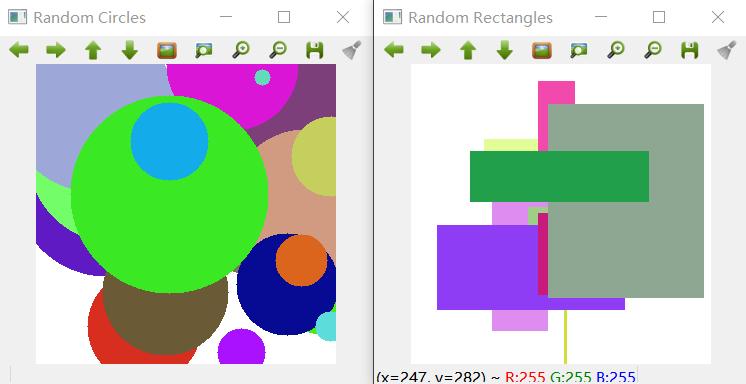

opencv
================

OpenCV 的全称是：Open Source Computer Vision Library，是一个基于BSD许可（开源）发行的跨平台计算机视觉库，可以运行在 Linux、Windows 和 Mac OS 操作系统上。它轻量级而且高效——由一系列 C 函数和少量 C++ 类构成（所以移植到嵌入式平台，例如ARM上当然是可行的 ^.^），同时提供了 Python、Ruby、MATLAB 等语言的接口（所以这就为 Python 在人工智能视觉处理领域提供了底层的强力支撑）。

它实现了图像处理和计算机视觉方面的很多通用算法（据官方出版物《学习 OpenCV》宣称支持多达一千多种算法（头大），并且新算法还在不停从 Paper 中实现验证并加入进来，而老算法在被不停迭代）。

OpenCV 主要用C/C++语言编写，它的主要接口由 C++ 提供，但是依然保留了大量的C语言接口。该库也有大量的Python, Java and MATLAB/OCTAVE 的接口。这些语言的API接口函数可以通过 `OpenCV 在线文档 <https://docs.opencv.org/>`_ 获得。

最新版本的 4.0 文档压缩后竟然还有 78MB，可见信息“熵”之大，兴不兴奋（头不头大）？

环境安装
---------

安装 opencv
~~~~~~~~~~~

这里以 Anaconda 环境安装 opencv 为例。

.. code-block:: sh
  :linenos:
  :lineno-start: 0
  
  conda install -c menpo opencv

如果安装速度很慢，可以添加 `Anaconda 清华镜像源 TUNA <https://mirrors.tuna.tsinghua.edu.cn/help/anaconda/>`_，（这里必须给清华点赞，和网易公开课一样都是功德无量的事！）

.. code-block:: sh
  :linenos:
  :lineno-start: 0
  
  conda config --add channels https://mirrors.tuna.tsinghua.edu.cn/anaconda/pkgs/free/
  conda config --add channels https://mirrors.tuna.tsinghua.edu.cn/anaconda/pkgs/main/
  conda config --add channels https://mirrors.tuna.tsinghua.edu.cn/anaconda/cloud/menpo/
  conda config --set show_channel_urls yes

添加 TUNA 镜像源后再安装 opencv 就会发现速度飞了起来：

.. code-block:: sh
  :linenos:
  :lineno-start: 0
  
  ......
  opencv-4.0.1-p 100% |###############################| Time: 0:00:43   1.35 MB/s
  requests-2.21. 100% |###############################| Time: 0:00:00   2.38 MB/s
  conda-4.6.8-py 100% |###############################| Time: 0:00:00   5.72 MB/s

通过查看 opencv 版本，验证安装是否成功，同时可以发现 TUNA 镜像源是实时同步的：

.. code-block:: python
  :linenos:
  :lineno-start: 0
  
  import cv2  
  print(cv2.__version__)
  
  >>>
  4.0.1

TUNA 镜像源还提供了一些 Anaconda 三方源，有兴趣可以移步 `Anaconda 清华镜像源 TUNA <https://mirrors.tuna.tsinghua.edu.cn/help/anaconda/>`_。

安装 cuda
~~~~~~~~~~~~

在 `CUDA安装包归档 <https://developer.nvidia.com/cuda-toolkit-archive>`_ 可以找到所有版本，在 `CUDA使用文档 <https://docs.nvidia.com/cuda/index.html>_` 中查看CUDA的使用说明。
`在Windows 上安装CUDA <https://docs.nvidia.com/cuda/cuda-installation-guide-microsoft-windows/index.html#axzz410A2xbq6>_` 一文对安装环境要求和开发环境（Visual Studio）均进行了详细说明。

安装步骤如下：

- 在  `支持 CUDA 的 GPU列表 <https://developer.nvidia.com/cuda-gpus>_` 中查看所用机器的 GPU 是否支持 CUDA。
- 在 `CUDA安装包归档 <https://developer.nvidia.com/cuda-toolkit-archive>`_ 可以找到所需 CUDA 版本
- 根据操作系统类型和版本下载并安装 CUDA
- 下载开发环境，对于 Windows 平台需要安装 Visual Studio

基础操作
-----------

加载和显示
~~~~~~~~~~~~

.. figure:: imgs/opencv/beach.jpg
  :scale: 100%
  :align: center
  :alt: beach

  示例原图

.. code-block:: python
  :linenos:
  :lineno-start: 0
  
  fname = 'beach.jpg'
  image = cv2.imread(fname)  # 读取图片
  
  if image is None:
      print("load image %s failed!" % fname)
  else:
      print(type(image).__name__, image.dtype)
      print(image.shape)
      cv2.imshow("Image", image) # 打开新窗口并显示
      cv2.waitKey(0)             # 等待，直至按键事件发生再继续执行
  
  >>>
  ndarray uint8
  (333, 500, 3)

imread 返回的 image 对象是一个 numpy.ndarray 数组：

- 类型为 uint8，每个通道值范围 0-255
- 333 表示高度为 333 个像素，500 为宽度像素数
- 3 表示 RGB 3 个颜色通道，需要注意的是在 OpenCV 中顺序为 BGR

图像坐标：每张图片左上角为坐标 0,0 点，如果向右为 x 轴，向下为 y 轴。 由于 ndarray 第一维是行，第二维是列，所以 (x,y) 坐标指定的像素对应到 image[y,x]。

.. admonition:: 注意

  image 对象[0,0] 元素对应图片左上角坐标 0,0 点，每个像素值顺序为 BGR。

.. code-block:: python
  :linenos:
  :lineno-start: 0
  
  # 获取[0,0] 坐标对应的 RGB 值
  B,G,R = image[0,0] 
  print(R,G,B)

  >>>
  2 51 128

将 image 对象保存为图片对应 imwrite 方法：

.. code-block:: python
  :linenos:
  :lineno-start: 0
  
  cv2.imwrite("newbeach.jpg", image)  

像素操作
~~~~~~~~~~~

通过 ndarray 可以读取像素值，当然也可以对数组赋值来更改像素值：

.. code-block:: python
  :linenos:
  :lineno-start: 0
  
  # 截取左上角 100*100 像素并显示
  corner = image[0:100, 0:100]
  cv2.imshow("Corner", corner) 
  cv2.waitKey(0)

我们可以通过数组操作来更新任意像素点，像素块。

.. figure:: imgs/opencv/corner.png
  :scale: 100%
  :align: center
  :alt: corner
  
  截取左上角 100*100 像素并显示

.. code-block:: python
  :linenos:
  :lineno-start: 0
  
  # 左上角 100*100 像素填充为蓝色
  image[0:100, 0:100] = (255, 0, 0)
  cv2.imshow("Updated", image)
  cv2.waitKey(0)
    
.. figure:: imgs/opencv/Blue_Corner.png
  :scale: 100%
  :align: center
  :alt: beach

  左上角 100*100 像素填充蓝色

基本绘图
~~~~~~~~~~~~~

像素操作等价于对数组各个元素的操作，那么绘制一个背景为白色的画布，就等于填充一个全 255 的数组。

.. code-block:: python
  :linenos:
  :lineno-start: 0
  
  import numpy as np
  
  # 创建画布
  canvas = np.ones((200, 300, 3), dtype = "uint8") * 255
  cv2.imshow("Canvas", canvas)
  
  # 从右上角到右下角画一条绿色直线
  green = (0, 255, 0)
  cv2.line(canvas, (0, 0), (300, 200), green)
  cv2.imshow("Green Line", canvas)
  
  cv2.waitKey(0)

.. figure:: imgs/opencv/canvas.png
  :scale: 100%
  :align: center
  :alt: canvas

  直线效果

.. code-block:: python
  :linenos:
  :lineno-start: 0
  
  canvas = np.ones((200, 300, 3), dtype = "uint8") * 255
  
  # 绘制线宽为 3pixels 的红色直线
  red = (0, 0, 255)
  cv2.line(canvas, (300, 0), (0, 200), red, 3)
  
  # 绘制绿色的矩形
  green =(0, 255, 0)
  cv2.rectangle(canvas, (10, 10), (60, 60), green)
  
  # 绘制填充蓝色的矩形
  blue = (255, 0, 0)
  cv2.rectangle(canvas, (200, 50), (240, 100), blue, -1) # -1 表示进行内部填充
  cv2.imshow("Rectangle", canvas)
  
  cv2.waitKey(0)

.. figure:: imgs/opencv/rectangle.png
  :scale: 100%
  :align: center
  :alt: rectangle

  矩形效果

.. code-block:: python
  :linenos:
  :lineno-start: 0

  canvas = np.ones((300, 300, 3), dtype = "uint8") * 255
  centerX, centerY = (canvas.shape[1] // 2, canvas.shape[0] // 2)
  red = (0, 0, 255)
  
  for r in range(0, 150, 25):
      cv2.circle(canvas, (centerX, centerY), r, red, 3)
  
  cv2.imshow("Bulleye", canvas)

绘制线宽为 3 的多个圆环，圆心为图形正中心，半径分别为 0,25,50,75,100,125。
  


  圆形效果

.. code-block:: python
  :linenos:
  :lineno-start: 0
  
  # 随机画圆形
  canvas = np.ones((300, 300, 3), dtype = "uint8") * 255
  for i in range(0,25):
      radius = np.random.randint(5, high=100)
      color = np.random.randint(0, high=256, size=(3,)).tolist()
      centre = np.random.randint(0, high=300, size=(2,))
      cv2.circle(canvas, tuple(centre), radius, color, -1)
      
  cv2.imshow("Random Circles", canvas)
  
  # 随机画矩形
  canvas = np.ones((300, 300, 3), dtype = "uint8") * 255
  for i in range(0, 10):
      color = np.random.randint(0, high=256, size=(3,)).tolist()
      corner0 = np.random.randint(0, high=200, size=(2,))
      corner1 = np.random.randint(50, high=300, size=(2,))
      cv2.rectangle(canvas, tuple(corner0), tuple(corner1), color, -1)
  
  cv2.imshow("Random Rectangles", canvas)



  随机画圆形和矩形并填充随机颜色
  
图像处理
~~~~~~~~~~~~~

平移
```````````

图像在坐标轴方向平移。涉及到平移齐次坐标变换矩阵，我们构造矩阵 M：

.. code-block:: python
  :linenos:
  :lineno-start: 0

  image = cv2.imread("beach.jpg")
  cv2.imshow("Original", image)
  
  # 向右平移 50 像素，向下平移 100 像素
  M = np.float32([[1, 0, 50], [0, 1, 100]])
  shifted = cv2.warpAffine(image, M, (image.shape[1], image.shape[0]))
  cv2.imshow("Shifted Down and Right", shifted)

  cv2.waitKey(0)

.. figure:: imgs/opencv/translation.png
  :scale: 80%
  :align: center
  :alt: translation

  图片平移

.. code-block:: python
  :linenos:
  :lineno-start: 0
  
  ......
  M = np.float32([[1, 0, -50], [0, 1, -100]])
  ......
  
如果要对图像向左，向上平移，将平移参数调整为负数即可。


  图片向左向上平移

为了以后方便使用，把它封装为 translation 函数：

.. code-block:: python
  :linenos:
  :lineno-start: 0
  
  def translation(image, x, y):
      '''move image at x-axis x pixels and y-axis y pixels'''
      
      M = np.float32([[1, 0, x], [0, 1, y]])
      return cv2.warpAffine(image, M, (image.shape[1], image.shape[0]))

旋转
`````````

与平移类似，我们需要构造旋转矩阵来实现图形的旋转变换：

.. code-block:: python
  :linenos:
  :lineno-start: 0
  
  # 以图片中心作为旋转基点
  def rotate(image, angle):
      '''roate image around center of image'''
      
      h, w = image.shape[:2]
      center = (w // 2, h // 2)
      
      M = cv2.getRotationMatrix2D(center, angle, 1.0)
      return cv2.warpAffine(image, M, (w, h))
  
  image = cv2.imread("beach.jpg")
  cv2.imshow("Original", image)
  rotated = rotate(image, 45)
  cv2.imshow("Rotate 45 degree", rotated)
  cv2.waitKey(0)

.. figure:: imgs/opencv/rotate.png
  :scale: 80%
  :align: center
  :alt: translation

  图片逆时针旋转45度

如果我们需要顺时针旋转，只需要传入负值即可。

缩放
``````````

OpenCV 提供了缩放操作（Resizing）接口 resize：

.. code-block:: python
  :linenos:
  :lineno-start: 0

  # 按照宽度参数扩折高度参数进行线性缩放
  def resize(image, width=None, height=None, inter=cv2.INTER_AREA):
      '''linear scale with width or height size'''
      h, w = image.shape[:2]
      
      if width is None and height is None:
          return image
      
      if width:
          ratio = width / float(w)
          dim = (width, int(h * ratio))
      else:
          ratio = height / float(h)
          dim = (int(w * ratio), height)
          
      return cv2.resize(image, dim, interpolation = cv2.INTER_AREA)
      
  image = cv2.imread("beach.jpg")
  cv2.imshow("Original", image)
  
  resized = resize(image, 200)
  cv2.imshow("Resized width to 200", resized)
  
  resized = resize(image, height=200)
  cv2.imshow("Resized height to 200", resized)
  
  cv2.waitKey(0)


  线性缩放效果
  
翻转
```````

翻转（Flip）操作又称为镜像操作，图像按照 x 中轴线，或者 y 中轴线进行镜像，实现左右或者上下翻转。

.. code-block:: python
  :linenos:
  :lineno-start: 0

  def flip(image, flip='h'):
      '''h/H:horizontally; v/V: vertically; b/B:both'''
      flip_type = 1
      
      if flip == 'v' or flip == 'V':
          flip_type = 0
      elif flip == 'b' or flip == 'B':
          flip_type = -1
          
      return cv2.flip(image, flip_type)
  
  image = cv2.imread("beach.jpg")
  cv2.imshow("Original", image)
  
  cv2.imshow("Horizontally flipped", flip(image, 'h'))
  cv2.imshow("Vertically flipped", flip(image, 'v'))
  cv2.imshow("Both direction flipped", flip(image, 'b'))
  
  cv2.waitKey(0)

.. figure:: imgs/opencv/flipped.png
  :scale: 80%
  :align: center
  :alt: flipped

  翻转效果对比图

剪切
``````````

剪切（Cropping）可以直接通过切片来进行操作，即在图片坐标范围内选择子区域：

.. code-block:: python
  :linenos:
  :lineno-start: 0
  
  # 传入左上角坐标和右下角坐标
  def crop(image, start=(0,0), end=(0,0)):
      return image[start[1]:end[1] + 1, start[0]:end[0] + 1]
      
  image = cv2.imread("beach.jpg")
  cv2.imshow("Original", image)
  
  cv2.imshow("Cropped", crop(image, (200,200),(300,300)))
  cv2.waitKey(0)


  
  剪切效果图

加减运算
```````````

我们可以对像素进行加减以改变图像的整体颜色强度：变浅或变深。

OpenCV 提供的加减运算方法进行截断操作，也即总是保证数值不大于 255，且不小于 0，这与 numpy 不同，numpy 操作可能会溢出：

.. code-block:: python
  :linenos:
  :lineno-start: 0
  
  print("max of 255: {}".format(cv2.add(np.uint8([200]), np.uint8([100]))))
  print("min of 0: {}".format(cv2.subtract(np.uint8([50]), np.uint8([100]))))
  
  print("wrap around: {}".format(np.uint8([200]) + np.uint8([100])))
  print("wrap around: {}".format(np.uint8([50]) - np.uint8([100])))
  
  >>>
  max of 255: [[255]]
  min of 0: [[0]]
  wrap around: [44]
  wrap around: [206]

所以通常我们使用 cv2.add 和 cv2.subtract 进行像素加减操作。

.. code-block:: python
  :linenos:
  :lineno-start: 0
  
  def light(image, light):
      '''light can be positive or negative'''
      if abs(light) > 255:
          light = int((light/light) * 255)
  
      if light < 0:
          M = np.ones(image.shape, dtype = "uint8") * (-light)
          return cv2.subtract(image, M)
      else:
          M = np.ones(image.shape, dtype = "uint8") * light
          return cv2.add(image, M)
  
  image = cv2.imread("beach.jpg")
  cv2.imshow("Original", image)
  cv2.imshow("Brighten", light(image, 30))
  cv2.imshow("Darken", light(image, -30))
  cv2.waitKey(0)
  
.. figure:: imgs/opencv/light.png
  :scale: 80%
  :align: center
  :alt: light
  
  调整像素值明暗效果图

位操作
`````````

位操作（Bitwise）主要包括 AND, OR, XOR, 和 NOT 布尔运算。

.. code-block:: python
  :linenos:
  :lineno-start: 0
  
  # 生成矩形
  rectangle = np.ones((300, 300), dtype = "uint8") * 255
  cv2.rectangle(rectangle, (25, 25), (275, 275), 0, -1)
  cv2.imshow("Rectangle", rectangle)
  
  # 生成圆形
  circle = np.ones((300, 300), dtype = "uint8") * 255
  cv2.circle(circle, (150, 150), 150, 0, -1)
  cv2.imshow("Circle", circle)
  cv2.waitKey(0)

.. figure:: imgs/opencv/bitwise.png
  :scale: 80%
  :align: center
  :alt: bitwise
  
  用于测试位运算的两幅灰度图

注意图中黑色部分像素值为 0，白色部分像素值为 255。此外两幅进行位运算的图像必须大小相同（宽，高和通道数）。

.. code-block:: python
  :linenos:
  :lineno-start: 0
  
  bitwiseAnd = cv2.bitwise_and(rectangle, circle)
  cv2.imshow("AND", bitwiseAnd)
  cv2.waitKey(0)
  
  bitwiseOr = cv2.bitwise_or(rectangle, circle)
  cv2.imshow("OR", bitwiseOr)
  cv2.waitKey(0)
  
  bitwiseXor = cv2.bitwise_xor(rectangle, circle)
  cv2.imshow("XOR", bitwiseXor)
  cv2.waitKey(0)
  
  bitwiseNot = cv2.bitwise_not(circle)
  cv2.imshow("NOT", bitwiseNot)
  cv2.waitKey(0)

.. figure:: imgs/opencv/bool.png
  :scale: 80%
  :align: center
  :alt: bool
  
  AND, OR, XOR, 和 NOT 位运算效果图

