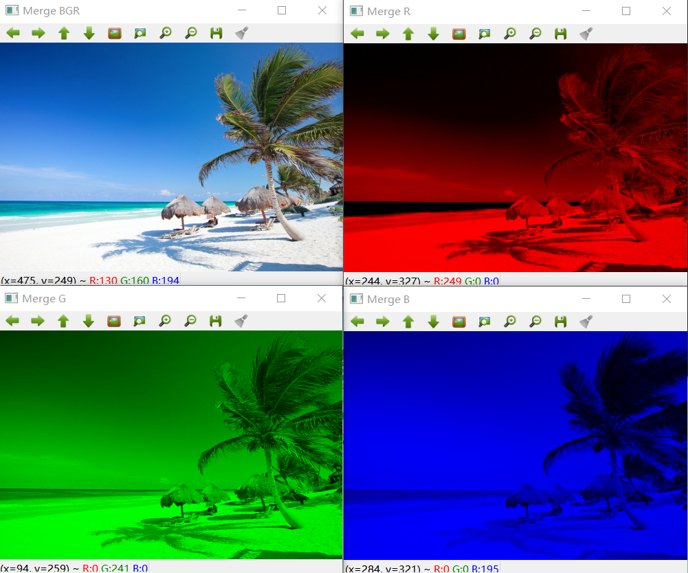

opencv
================

OpenCV 的全称是：Open Source Computer Vision Library，是一个基于BSD许可（开源）发行的跨平台计算机视觉库，可以运行在 Linux、Windows 和 Mac OS 操作系统上。它轻量级而且高效——由一系列 C 函数和少量 C++ 类构成（所以移植到嵌入式平台，例如ARM上当然是可行的 ^.^），同时提供了 Python、Ruby、MATLAB 等语言的接口（所以这就为 Python 在人工智能视觉处理领域提供了底层的强力支撑）。

它实现了图像处理和计算机视觉方面的很多通用算法（据官方出版物《学习 OpenCV》宣称支持多达一千多种算法（头大），并且新算法还在不停从 Paper 中实现验证并加入进来，而老算法在被不停迭代）。

OpenCV 主要用C/C++语言编写，它的主要接口由 C++ 提供，但是依然保留了大量的C语言接口。该库也有大量的Python, Java and MATLAB/OCTAVE 的接口。这些语言的API接口函数可以通过 `OpenCV 在线文档 <https://docs.opencv.org/>`_ 获得。

最新版本的 4.0 文档压缩后竟然还有 78MB，可见信息“熵”之大，兴不兴奋（头不头大）？

环境安装
---------

安装 opencv
~~~~~~~~~~~

这里以 Anaconda 环境安装 opencv 为例。

.. code-block:: sh
  :linenos:
  :lineno-start: 0
  
  conda install -c menpo opencv

如果安装速度很慢，可以添加 `Anaconda 清华镜像源 TUNA <https://mirrors.tuna.tsinghua.edu.cn/help/anaconda/>`_，（这里必须给清华点赞，和网易公开课一样都是功德无量的事！）

.. code-block:: sh
  :linenos:
  :lineno-start: 0
  
  conda config --add channels https://mirrors.tuna.tsinghua.edu.cn/anaconda/pkgs/free/
  conda config --add channels https://mirrors.tuna.tsinghua.edu.cn/anaconda/pkgs/main/
  conda config --add channels https://mirrors.tuna.tsinghua.edu.cn/anaconda/cloud/menpo/
  conda config --set show_channel_urls yes

添加 TUNA 镜像源后再安装 opencv 就会发现速度飞了起来：

.. code-block:: sh
  :linenos:
  :lineno-start: 0
  
  ......
  opencv-4.0.1-p 100% |###############################| Time: 0:00:43   1.35 MB/s
  requests-2.21. 100% |###############################| Time: 0:00:00   2.38 MB/s
  conda-4.6.8-py 100% |###############################| Time: 0:00:00   5.72 MB/s

通过查看 opencv 版本，验证安装是否成功，同时可以发现 TUNA 镜像源是实时同步的：

.. code-block:: python
  :linenos:
  :lineno-start: 0
  
  import cv2  
  print(cv2.__version__)
  
  >>>
  4.0.1

TUNA 镜像源还提供了一些 Anaconda 三方源，有兴趣可以移步 `Anaconda 清华镜像源 TUNA <https://mirrors.tuna.tsinghua.edu.cn/help/anaconda/>`_。

安装 cuda
~~~~~~~~~~~~

在 `CUDA安装包归档 <https://developer.nvidia.com/cuda-toolkit-archive>`_ 可以找到所有版本，在 `CUDA使用文档 <https://docs.nvidia.com/cuda/index.html>_` 中查看CUDA的使用说明。
`在Windows 上安装CUDA <https://docs.nvidia.com/cuda/cuda-installation-guide-microsoft-windows/index.html#axzz410A2xbq6>_` 一文对安装环境要求和开发环境（Visual Studio）均进行了详细说明。

安装步骤如下：

- 在  `支持 CUDA 的 GPU列表 <https://developer.nvidia.com/cuda-gpus>_` 中查看所用机器的 GPU 是否支持 CUDA。
- 在 `CUDA安装包归档 <https://developer.nvidia.com/cuda-toolkit-archive>`_ 可以找到所需 CUDA 版本
- 根据操作系统类型和版本下载并安装 CUDA
- 下载开发环境，对于 Windows 平台需要安装 Visual Studio

基础操作
-----------

加载和显示
~~~~~~~~~~~~


  示例原图

.. code-block:: python
  :linenos:
  :lineno-start: 0
  
  fname = 'beach.jpg'
  image = cv2.imread(fname)  # 读取图片
  
  if image is None:
      print("load image %s failed!" % fname)
  else:
      print(type(image).__name__, image.dtype)
      print(image.shape)
      cv2.imshow("Image", image) # 打开新窗口并显示
      cv2.waitKey(0)             # 等待，直至按键事件发生再继续执行
  
  >>>
  ndarray uint8
  (333, 500, 3)

imread 返回的 image 对象是一个 numpy.ndarray 数组：

- 类型为 uint8，每个通道值范围 0-255
- 333 表示高度为 333 个像素，500 为宽度像素数
- 3 表示 RGB 3 个颜色通道，需要注意的是在 OpenCV 中顺序为 BGR

图像坐标：每张图片左上角为坐标 0,0 点，如果向右为 x 轴，向下为 y 轴。 由于 ndarray 第一维是行，第二维是列，所以 (x,y) 坐标指定的像素对应到 image[y,x]。

.. admonition:: 注意

  image 对象[0,0] 元素对应图片左上角坐标 0,0 点，每个像素值顺序为 BGR。

.. code-block:: python
  :linenos:
  :lineno-start: 0
  
  # 获取[0,0] 坐标对应的 RGB 值
  B,G,R = image[0,0] 
  print(R,G,B)

  >>>
  2 51 128

将 image 对象保存为图片对应 imwrite 方法：

.. code-block:: python
  :linenos:
  :lineno-start: 0
  
  cv2.imwrite("newbeach.jpg", image)  

像素操作
~~~~~~~~~~~

通过 ndarray 可以读取像素值，当然也可以对数组赋值来更改像素值：

.. code-block:: python
  :linenos:
  :lineno-start: 0
  
  # 截取左上角 100*100 像素并显示
  corner = image[0:100, 0:100]
  cv2.imshow("Corner", corner) 
  cv2.waitKey(0)

我们可以通过数组操作来更新任意像素点，像素块。

.. figure:: imgs/opencv/corner.png
  :scale: 100%
  :align: center
  :alt: corner
  
  截取左上角 100*100 像素并显示

.. code-block:: python
  :linenos:
  :lineno-start: 0
  
  # 左上角 100*100 像素填充为蓝色
  image[0:100, 0:100] = (255, 0, 0)
  cv2.imshow("Updated", image)
  cv2.waitKey(0)
    


  左上角 100*100 像素填充蓝色

绘制棋盘
`````````````

基于像素操作，就很容易绘制一个类似九宫格的棋盘，颜色相互交错：

- 首先构造一个基本的颜色块：base，由于要绘制各种颜色，所以使用 RGB 颜色空间，第三维为 3，为了后序操作方便，所有颜色通道填充为 0，即一个小的黑色块
- 然后构造水平的黑色块和一个指定的颜色色块，共同构造成 block0 
- 使用 block0 在水平方向上反向得到 block1
- block0 和 block1 在垂直方向上堆叠，生成一个色块交错的“田”字形
- 在水平和垂直方向对“田”字形各堆叠 size 次，得到最终的棋盘

.. code-block:: python
  :linenos:
  :lineno-start: 0
  
  # 绘制不同颜色的棋盘图
  def chessboard(square=10, size=15, color=(255,0,0)):
      '''Create a chessboard color means RGB'''
      color = color[::-1]
      base = np.zeros((square, square, 3), dtype='uint8')
      block0 = np.hstack(((base, (base + 1) * color))).astype(np.uint8)
      block1 = block0[:, ::-1, :]
      canvas = np.vstack((block0, block1))
  
      return np.tile(canvas, (size, size, 1))
      
  cv2.imshow("Red Chessboard", chessboard())
  cv2.imshow("White Chessboard", chessboard(color=(255,255,255)))
  
  cv2.waitKey(0)


  绘制棋盘
  
基本绘图
~~~~~~~~~~~~~

像素操作等价于对数组各个元素的操作，那么绘制一个背景为白色的画布，就等于填充一个全 255 的数组。

.. code-block:: python
  :linenos:
  :lineno-start: 0
  
  import numpy as np
  
  # 创建画布
  canvas = np.ones((200, 300, 3), dtype = "uint8") * 255
  cv2.imshow("Canvas", canvas)
  
  # 从右上角到右下角画一条绿色直线
  green = (0, 255, 0)
  cv2.line(canvas, (0, 0), (300, 200), green)
  cv2.imshow("Green Line", canvas)
  
  cv2.waitKey(0)


  直线效果

.. code-block:: python
  :linenos:
  :lineno-start: 0
  
  canvas = np.ones((200, 300, 3), dtype = "uint8") * 255
  
  # 绘制线宽为 3pixels 的红色直线
  red = (0, 0, 255)
  cv2.line(canvas, (300, 0), (0, 200), red, 3)
  
  # 绘制绿色的矩形
  green =(0, 255, 0)
  cv2.rectangle(canvas, (10, 10), (60, 60), green)
  
  # 绘制填充蓝色的矩形
  blue = (255, 0, 0)
  cv2.rectangle(canvas, (200, 50), (240, 100), blue, -1) # -1 表示进行内部填充
  cv2.imshow("Rectangle", canvas)
  
  cv2.waitKey(0)

.. figure:: imgs/opencv/rectangle.png
  :scale: 100%
  :align: center
  :alt: rectangle

  矩形效果

.. code-block:: python
  :linenos:
  :lineno-start: 0

  canvas = np.ones((300, 300, 3), dtype = "uint8") * 255
  centerX, centerY = (canvas.shape[1] // 2, canvas.shape[0] // 2)
  red = (0, 0, 255)
  
  for r in range(0, 150, 25):
      cv2.circle(canvas, (centerX, centerY), r, red, 3)
  
  cv2.imshow("Bulleye", canvas)

绘制线宽为 3 的多个圆环，圆心为图形正中心，半径分别为 0,25,50,75,100,125。
  
.. figure:: imgs/opencv/bulleye.png
  :scale: 100%
  :align: center
  :alt: bulleye

  圆形效果

.. code-block:: python
  :linenos:
  :lineno-start: 0
  
  # 随机画圆形
  canvas = np.ones((300, 300, 3), dtype = "uint8") * 255
  for i in range(0,25):
      radius = np.random.randint(5, high=100)
      color = np.random.randint(0, high=256, size=(3,)).tolist()
      centre = np.random.randint(0, high=300, size=(2,))
      cv2.circle(canvas, tuple(centre), radius, color, -1)
      
  cv2.imshow("Random Circles", canvas)
  
  # 随机画矩形
  canvas = np.ones((300, 300, 3), dtype = "uint8") * 255
  for i in range(0, 10):
      color = np.random.randint(0, high=256, size=(3,)).tolist()
      corner0 = np.random.randint(0, high=200, size=(2,))
      corner1 = np.random.randint(50, high=300, size=(2,))
      cv2.rectangle(canvas, tuple(corner0), tuple(corner1), color, -1)
  
  cv2.imshow("Random Rectangles", canvas)

.. figure:: imgs/opencv/random.png
  :scale: 100%
  :align: center
  :alt: random

  随机画圆形和矩形并填充随机颜色
  
图像处理
~~~~~~~~~~~~~

平移
```````````

图像在坐标轴方向平移。涉及到平移齐次坐标变换矩阵，我们构造矩阵 M：

.. code-block:: python
  :linenos:
  :lineno-start: 0

  image = cv2.imread("beach.jpg")
  cv2.imshow("Original", image)
  
  # 向右平移 50 像素，向下平移 100 像素
  M = np.float32([[1, 0, 50], [0, 1, 100]])
  shifted = cv2.warpAffine(image, M, (image.shape[1], image.shape[0]))
  cv2.imshow("Shifted Down and Right", shifted)

  cv2.waitKey(0)

.. figure:: imgs/opencv/translation.png
  :scale: 60%
  :align: center
  :alt: translation

  图片平移

.. code-block:: python
  :linenos:
  :lineno-start: 0
  
  ......
  M = np.float32([[1, 0, -50], [0, 1, -100]])
  ......
  
如果要对图像向左，向上平移，将平移参数调整为负数即可。

.. figure:: imgs/opencv/t2.png
  :scale: 60%
  :align: center
  :alt: translation

  图片向左向上平移

为了以后方便使用，把它封装为 translation 函数：

.. code-block:: python
  :linenos:
  :lineno-start: 0
  
  def translation(image, x, y):
      '''move image at x-axis x pixels and y-axis y pixels'''
      
      M = np.float32([[1, 0, x], [0, 1, y]])
      return cv2.warpAffine(image, M, (image.shape[1], image.shape[0]))

旋转
`````````

与平移类似，我们需要构造旋转矩阵来实现图形的旋转变换：

.. code-block:: python
  :linenos:
  :lineno-start: 0
  
  # 以图片中心作为旋转基点
  def rotate(image, angle):
      '''roate image around center of image'''
      
      h, w = image.shape[:2]
      center = (w // 2, h // 2)
      
      M = cv2.getRotationMatrix2D(center, angle, 1.0)
      return cv2.warpAffine(image, M, (w, h))
  
  image = cv2.imread("beach.jpg")
  cv2.imshow("Original", image)
  rotated = rotate(image, 45)
  cv2.imshow("Rotate 45 degree", rotated)
  cv2.waitKey(0)


  图片逆时针旋转45度

如果我们需要顺时针旋转，只需要传入负值即可。

缩放
``````````

OpenCV 提供了缩放操作（Resizing）接口 resize：

.. code-block:: python
  :linenos:
  :lineno-start: 0

  # 按照宽度或高度参数进行线性缩放
  def resize(image, width=None, height=None, inter=cv2.INTER_AREA):
      '''linear scale with width or height size'''
      h, w = image.shape[:2]
      
      if width is None and height is None:
          return image
      
      if width:
          ratio = width / float(w)
          dim = (width, int(h * ratio))
      else:
          ratio = height / float(h)
          dim = (int(w * ratio), height)
          
      return cv2.resize(image, dim, interpolation = cv2.INTER_AREA)
      
  image = cv2.imread("beach.jpg")
  cv2.imshow("Original", image)
  
  resized = resize(image, 200)
  cv2.imshow("Resized width to 200", resized)
  
  resized = resize(image, height=200)
  cv2.imshow("Resized height to 200", resized)
  
  cv2.waitKey(0)

.. figure:: imgs/opencv/resize.png
  :scale: 100%
  :align: center
  :alt: resize

  线性缩放效果
  
翻转
```````

翻转（Flip）操作又称为镜像操作，图像按照 x 中轴线，或者 y 中轴线进行镜像，实现左右或者上下翻转。

.. code-block:: python
  :linenos:
  :lineno-start: 0

  def flip(image, flip='h'):
      '''h/H:horizontally; v/V: vertically; b/B:both'''
      flip_type = 1
      
      if flip == 'v' or flip == 'V':
          flip_type = 0
      elif flip == 'b' or flip == 'B':
          flip_type = -1
          
      return cv2.flip(image, flip_type)
  
  image = cv2.imread("beach.jpg")
  cv2.imshow("Original", image)
  
  cv2.imshow("Horizontally flipped", flip(image, 'h'))
  cv2.imshow("Vertically flipped", flip(image, 'v'))
  cv2.imshow("Both direction flipped", flip(image, 'b'))
  
  cv2.waitKey(0)


  翻转效果对比图

剪切
``````````

剪切（Cropping）可以直接通过切片来进行操作，即在图片坐标范围内选择子区域：

.. code-block:: python
  :linenos:
  :lineno-start: 0
  
  # 传入左上角坐标和右下角坐标
  def crop(image, start=(0,0), end=(0,0)):
      return image[start[1]:end[1] + 1, start[0]:end[0] + 1]
      
  image = cv2.imread("beach.jpg")
  cv2.imshow("Original", image)
  
  cv2.imshow("Cropped", crop(image, (200,200),(300,300)))
  cv2.waitKey(0)

.. figure:: imgs/opencv/cropped.png
  :scale: 100%
  :align: center
  :alt: cropped
  
  剪切效果图

加减运算
```````````

我们可以对像素进行加减以改变图像的整体颜色强度：变浅或变深。

OpenCV 提供的加减运算方法进行截断操作，也即总是保证数值不大于 255，且不小于 0，这与 numpy 不同，numpy 操作可能会溢出：

.. code-block:: python
  :linenos:
  :lineno-start: 0
  
  print("max of 255: {}".format(cv2.add(np.uint8([200]), np.uint8([100]))))
  print("min of 0: {}".format(cv2.subtract(np.uint8([50]), np.uint8([100]))))
  
  print("wrap around: {}".format(np.uint8([200]) + np.uint8([100])))
  print("wrap around: {}".format(np.uint8([50]) - np.uint8([100])))
  
  >>>
  max of 255: [[255]]
  min of 0: [[0]]
  wrap around: [44]
  wrap around: [206]

所以通常我们使用 cv2.add 和 cv2.subtract 进行像素加减操作。

.. code-block:: python
  :linenos:
  :lineno-start: 0
  
  def light(image, light):
      '''light can be positive or negative'''
      if abs(light) > 255:
          light = int((light/light) * 255)
  
      if light < 0:
          M = np.ones(image.shape, dtype = "uint8") * (-light)
          return cv2.subtract(image, M)
      else:
          M = np.ones(image.shape, dtype = "uint8") * light
          return cv2.add(image, M)
  
  image = cv2.imread("beach.jpg")
  cv2.imshow("Original", image)
  cv2.imshow("Brighten", light(image, 30))
  cv2.imshow("Darken", light(image, -30))
  cv2.waitKey(0)
  
.. figure:: imgs/opencv/light.png
  :scale: 60%
  :align: center
  :alt: light
  
  调整像素值明暗效果图

位操作
`````````

位操作（Bitwise）主要包括 AND, OR, XOR, 和 NOT 布尔运算。

.. code-block:: python
  :linenos:
  :lineno-start: 0
  
  # 生成矩形
  rectangle = np.ones((300, 300), dtype = "uint8") * 255
  cv2.rectangle(rectangle, (25, 25), (275, 275), 0, -1)
  cv2.imshow("Rectangle", rectangle)
  
  # 生成圆形
  circle = np.ones((300, 300), dtype = "uint8") * 255
  cv2.circle(circle, (150, 150), 150, 0, -1)
  cv2.imshow("Circle", circle)
  cv2.waitKey(0)


  
  用于测试位运算的两幅灰度图

注意图中黑色部分像素值为 0，白色部分像素值为 255。此外两幅进行位运算的图像必须大小相同（宽，高和通道数）。

.. code-block:: python
  :linenos:
  :lineno-start: 0
  
  bitwiseAnd = cv2.bitwise_and(rectangle, circle)
  cv2.imshow("AND", bitwiseAnd)
  cv2.waitKey(0)
  
  bitwiseOr = cv2.bitwise_or(rectangle, circle)
  cv2.imshow("OR", bitwiseOr)
  cv2.waitKey(0)
  
  bitwiseXor = cv2.bitwise_xor(rectangle, circle)
  cv2.imshow("XOR", bitwiseXor)
  cv2.waitKey(0)
  
  bitwiseNot = cv2.bitwise_not(circle)
  cv2.imshow("NOT", bitwiseNot)
  cv2.waitKey(0)


  
  AND, OR, XOR, 和 NOT 位运算效果图

遮罩
``````````

遮罩又称为蒙版（Masking）或者掩模，基于位操作，常用于提取图片的部分内容。遮罩的基本原理就是布尔运算操作。

首先构造一个遮罩图层，构造需要提取的图层区域，填充为 255，其余区域填充为 0，通过与运算就可以把白色区域的图像提取出来。

.. code-block:: python
  :linenos:
  :lineno-start: 0

  image = cv2.imread("beach.jpg")
  cv2.imshow("Orignal", image)
  
  # 创建遮罩图层
  mask = np.zeros(image.shape[:2], dtype='uint8')
  
  # 在遮罩图层创建填充矩形
  cX, cY = (image.shape[1] // 3, image.shape[0] // 2)
  length = 150 >> 1
  cv2.rectangle(mask, (cX - length, cY - length), (cX + length , cY + length), 255, -1)
  cv2.imshow("Rectangle Mask", mask)
  
  # 在遮罩图层创建填充圆形
  radius = 80
  cv2.circle(mask, (cX * 2, cY), radius, 255, -1)
  cv2.imshow("Circle and Rectangle Mask", mask)
  
  # 遮罩：位与操作
  masked = cv2.bitwise_and(image, image, mask=mask)
  cv2.imshow("Masked", masked)
  cv2.waitKey(0)


  
  遮罩效果图

通道分离和合并
```````````````

如果一张图片有多个通道，它对应到 ndarray 数组的第三维。通常图片使用 RGB 颜色空间，第三个通道分别对应 BGR。

cv2.split 方法实现通道的分离：

.. code-block:: python
  :linenos:
  :lineno-start: 0

  image = cv2.imread("beach.jpg")
  cv2.imshow("Orignal", image)
  B,G,R = cv2.split(image)
  
  print(image.shape, B.shape)
  
  >>>
  (333, 500, 3) (333, 500)
  
  cv2.imshow("Red", R)
  cv2.imshow("Green", G)
  cv2.imshow("Blue", B)
  
  cv2.waitKey(0)

为何分离通道后的图像显示为灰度图？可以发现分离后的 B，G 和 R 没有第三个维度，所以每一通道数据均被解释为了灰度数据：图像越明亮，则该通道颜色分量越大，图像越暗淡，对应通道的颜色分量越小。

示例图中包含了大量的蓝色区域：天空，大海，所以 B 通道看起来就明亮得多，而 R 通道就很暗淡。


  
  通道分离效果图

通道合并是通道分离的逆操作，通过 cv2.merge 完成。

.. code-block:: python
  :linenos:
  :lineno-start: 0
  
  # 合并三通道，就变成了原始图片
  merged = cv2.merge([B, G, R])
  cv2.imshow("Merge BGR", merged)
  
  # 合并单个通道，其余通道置为 0
  merged = cv2.merge([B * 0, G * 0, R])
  cv2.imshow("Merge R", merged)
  merged = cv2.merge([B * 0, G, R * 0])
  cv2.imshow("Merge G", merged)
  merged = cv2.merge([B, G * 0, R * 0])
  cv2.imshow("Merge B", merged)

  cv2.waitKey(0)


  
  通道合并效果图

颜色空间转换
`````````````

由于不同领域对图像处理的需求侧重点不同，颜色空间有很多种：

- 灰度颜色空间可以降低图片存储大小，在进行模式识别时，降低计算量。
- RGB(red,green,blue) 颜色空间最常用于显示器系统。在RGB颜色空间中，任意色光F都可以用R、G、B三色不同分量的相加混合而成：F=r[R]+r[G]+r[B]。RGB色彩空间还可以用一个三维的立方体来描述。当三基色分量都为0(最弱)时混合为黑色光；当三基色都为k(最大，值由存储空间决定)时混合为白色光。
- HSV(hue,saturation,value) 表示色相、饱和度和亮度。色相是色彩的基本属性，就是平常说的颜色的名称，如红色、黄色等。饱和度（S）是指色彩的纯度，越高色彩越纯，低则逐渐变灰，取0-100%的数值。明度（V），取0-max(计算机中HSV取值范围和存储的长度有关)。
- LAB 颜色空间中的L分量（明度通道）用于表示像素的亮度，取值范围是[0,100],表示从纯黑到纯白；a表示从红色到绿色的范围，取值范围是[127,-128]；b表示从黄色到蓝色的范围，取值范围是[127,-128]。LAB中的L 通道专门负责整张图的明暗度，简单的说就是整幅图的黑白基调，a 通道和 b 通道只负责颜色的多少。

.. code-block:: python
  :linenos:
  :lineno-start: 0
  
  image = cv2.imread("beach.jpg")
  cv2.imshow("Orignal", image)
  
  gray = cv2.cvtColor(image, cv2.COLOR_BGR2GRAY)
  cv2.imshow("Gray", gray)
  
  hsv = cv2.cvtColor(image, cv2.COLOR_BGR2HSV)
  cv2.imshow("HSV", hsv)
  
  lab = cv2.cvtColor(image, cv2.COLOR_BGR2LAB)
  cv2.imshow("L*a*b*", lab)
  
  print(gray.shape)
  print(hsv.shape, lab.shape)
  cv2.waitKey(0)
  
  >>>
  (333, 500) # 灰度颜色空间没有第三维（颜色通道）
  (333, 500, 3) (333, 500, 3)


  
  不同颜色空间效果图

直方图
--------

直方图常常用于统计特定的数据，并以直观的方式给出特定数据的特征分布。在图像处理领域，常用于统计图像（或感兴趣的区域）的像素分布或者边缘轮廓分布，以用于图像搜索和物体识别。

像素分布
~~~~~~~~~~~~

直方图的 x 轴被称为 bin，它是一个个统计数据的分类桶，每个桶代表不同的数据分布区间，它的高度就表示落在该区间中的数据个数。

数据分布区间大小可以自由定义，但是如果定义太小，则细节数据增多，不易于发现图像的主要特征，且计算量增大，如果定义太大，就会忽略掉我们关心的细节信息。

::
 
  cv2.calcHist(images,channels,mask,histSize,ranges)
  
cv2.calcHist 用于绘制图像的直方图：

- images: 指定处理的图像 ndarray 数组，可以指定多个图像
- channels：颜色通道的索引列表，如果是灰度图，则指定 [0]，否则指定 [0,1,2] 表示 BRG 通道
- mask: 指定计算直方图的遮罩数组，如果没有则为 None
- histSize: bins 的数目，也即统计区间的个数，它的数据类型应该和 channels 匹配，如果 channels 指定 [0,1,2]，则 bins 可指定为 [16,16,16]，通常使用 1D 或者 2D 通道来生成直方图，较少用到 3D。
- ranges：像素值的范围，对于 RGB 空间就是 [0,256]。

灰度直方图
````````````

.. code-block:: python
  :linenos:
  :lineno-start: 0
  
  import matplotlib.pyplot as plt
  
  image = cv2.imread("beach.jpg")
  gray = cv2.cvtColor(image, cv2.COLOR_BGR2GRAY)
  hist = cv2.calcHist([gray], [0], None, [256], [0, 256])
  
  plt.figure()
  plt.title("Grayscale Histogram")
  plt.xlabel("Bins")
  plt.ylabel("Pixels")
  plt.plot(hist)
  plt.xlim([0, 255])
  plt.show()

首先我们把图像转变为灰度图，然后指定按照 256 个分类桶来对像素值在 [0-256] 的所有像素进行分类统计：

.. figure:: imgs/opencv/grayhist.png
  :scale: 60%
  :align: center
  :alt: grayhist
  
  灰度像素分布直方图
  
从图中可以 x 轴为分类桶，y 轴为像素值分布，大像素值占比比较大，小像素值占比比较少，整个灰度图像偏明亮。

RGB直方图
````````````

.. code-block:: python
  :linenos:
  :lineno-start: 0
  
  image = cv2.imread("beach.jpg")
  channels = cv2.split(image)
  
  plt.figure(figsize=(12,4))
  
  # 绘制原图
  plt.subplot(1,2,1)
  plt.title("Original")
  plt.imshow(cv2.merge(channels[::-1]))

  # 绘制RGB直方图
  plt.subplot(1,2,2)
  plt.title("RGB Color Histogram")
  plt.xlabel("Bins")
  plt.ylabel("Pixels")
  plt.xlim([0, 255])
  
  for chan, color in zip(channels, 'bgr'):
      hist = cv2.calcHist([chan], [0], None, [256], [0, 256])
      plt.plot(hist, color=color)
      
  plt.show()

图中使用RGB颜色绘制三个通道的像素分布，可以观察到：

- 红色通道在 0 值附近和 255 值附近各出现一个尖峰，对应椰子树的树干枯叶和茅草屋上的枯草
- 绿色区域在 100 处出现一个峰值对应浅绿色的海水，在 200 附近的峰值对应深绿色的椰子树叶
- 蓝色通道在 255 附近有很高的尖峰，对应深蓝色的天空和远处的海水


  
  RGB像素分布直方图

最终把绘制灰度直方图和RGB彩色直方图封装在一个函数中：

.. code-block:: python
  :linenos:
  :lineno-start: 0
  
  def histogram_rgbshow(fname, channel=0):
      '''channel: 0-> gray, 1->RGB'''
      import matplotlib.pyplot as plt
      
      image = cv2.imread(fname)
      if image is None:
          return
      
      plt.figure(figsize=(12,4))
      plt.subplot(1,2,1)
      plt.title(fname)
      
      # 转换为灰度图
      if channel == 0:
          image = cv2.cvtColor(image, cv2.COLOR_BGR2GRAY)
          channels = [image]
          plt.imshow(image, cmap='gray', vmin = 0, vmax = 255)
      else:
          channels = cv2.split(image)
          plt.imshow(cv2.merge(channels[::-1]))
      
      plt.subplot(1,2,2)
      plt.title("%s Histogram" % ('Gray' if channel == 0 else 'RGB'))
      plt.xlabel("Bins")
      plt.ylabel("Pixels")
      plt.xlim([0, 255])
      
      colors = (['gray'] if channel == 0 else 'bgr')
      for chan, color in zip(channels, colors):
          hist = cv2.calcHist([chan], [0], None, [256], [0, 256])
          plt.plot(hist, color=color)
          
      plt.show()
  
  # 1: 绘制RGB直方图 0: 绘制灰度直方图
  histogram_rgbshow('beach.jpg', 1)

2D 直方图
````````````

我们可以分别统计任意两个颜色通道组成的 2D 直方图，来分析图片中不同颜色之间的关联关系。

.. code-block:: python
  :linenos:
  :lineno-start: 0
  
  def histogram2d_rgbshow(fname):
    '''Draw 2D histogram'''
    import matplotlib.pyplot as plt

    image = cv2.imread(fname)
    if image is None:
        print("Failed to open file %s!" % fname)
        return
    
    if image.shape[2] != 3:
        print("Image %s don't have RGB channels!", fname)
        return
    
    plt.figure(figsize=(10, 8))
    plt.subplot(2, 2, 1)
    plt.title("Original")

    chans = cv2.split(image)
    plt.imshow(cv2.merge(chans[::-1]))
     
    index = 2
    for c0, c1 in zip('GGB', 'BRR'):
        chan0 = 'BGR'.index(c0)
        chan1 = 'BGR'.index(c1)
        
        hist = cv2.calcHist([chans[chan0], chans[chan1]], [0, 1], 
                            None, [32] * 2, [0, 256] * 2)
        ax = plt.subplot(2, 2, index)
        index += 1
        p = ax.imshow(hist, interpolation="nearest", cmap='Blues')
        plt.colorbar(p)
        ax.set_title("2D Color Histogram for %s and %s" % (c0, c1))

    plt.show()

分析 G 和 B 颜色通道可以发现，在 G=30，B=30 附近像素点数分布很多，这一区域对应图中的绿色海洋和蓝色天空。
而分析 G 和 R 颜色通道可以发现，在 G=1，R = 12 附近像素分布很多，这一区域对应茅草屋和椰子树的枯叶部分。


  
  RGB像素2D分布直方图


区域直方图
``````````

更多时候我们只关心图像的某个区域，如果我们已经识别出一张人脸，再去识别这个人的眼睛，那么我们就无需关心其他区域了。

以上我们均是统计的整个图像的直方图，calcHist 提供了 mask 参数，可以用于选取部分区域。

.. code-block:: python
  :linenos:
  :lineno-start: 0
  
  def histogram_rgbshow(fname, channel=0, mask=None):
      '''channel: 0-> gray, 1->RGB'''
      import matplotlib.pyplot as plt
      
      image = cv2.imread(fname)
      if image is None:
          return
  
      plt.figure(figsize=(12,4))
      plt.subplot(1,2,1)
      plt.title(fname)
        if mask is not None:
          image = cv2.bitwise_and(image, image, mask=mask)
  
      if channel == 0:
          image = cv2.cvtColor(image, cv2.COLOR_BGR2GRAY)
          channels = [image]
          
          plt.imshow(image, cmap='gray', vmin = 0, vmax = 255)
      else:
          channels = cv2.split(image)
          plt.imshow(cv2.merge(channels[::-1]))
      
      plt.subplot(1,2,2)
      plt.title("%s Histogram %s" % ('Gray' if channel == 0 else 'RGB', 
                                     'with mask' if mask is not None else ''))
      plt.xlabel("Bins")
      plt.ylabel("Pixels")
      plt.xlim([0, 255])
      
      colors = (['gray'] if channel == 0 else 'bgr')    maxy = 0
      for chan, color in zip(channels, colors):
          hist = cv2.calcHist([chan], [0], mask, [256], [0, 256])
          if maxy < np.max(hist):
              maxy = np.max(hist)
          plt.plot(hist, color=color)
      
      plt.ylim([0, maxy + 1])   
      plt.show()

首先更新 histogram_rgbshow 函数，支持 mask 参数。

.. code-block:: python
  :linenos:
  :lineno-start: 0
  
  image = cv2.imread('beach.jpg')
  
  # 生成遮罩
  mask = np.zeros(image.shape[:2], dtype = "uint8")
  cv2.rectangle(mask, (20, 20), (150, 150), 255, -1)
  histogram_rgbshow('beach.jpg', channel=1, mask=mask)

这里截取了部分蓝色天空，显然这部分的红色分量异常少，高数值的像素多数集中在蓝色和绿色通道。显然如果我们通过某种算法识别出来一张人脸，但是该区域直方图却集中分布在蓝色或者绿色区域，那么很可能就是误识别。

另一方面也说明，如果我们要搜索相似图片，那么它们的直方图分布就是近似的。


  
  区域直方图

直方图均衡
~~~~~~~~~~~~

直方图均衡常用于提高灰度图的对比度，经过均衡化后的图片看起来更锐利，而直方图分布更均匀。原图向像素分布可能集中分布在某一部分，这样整幅图的灰阶就比较窄，看起来就是模糊一团，均衡化的根本原理就是把原来集中分布在一个范围内的像素均衡到整个灰阶区域，这样整个灰阶空间的对比度就会上升：乌压压的人群挤在一起很难分辨谁是谁，当他们分开散去的时候就很容易认出谁是谁来。

.. code-block:: python
  :linenos:
  :lineno-start: 0
  
  image = cv2.imread('beach.jpg')
  image = cv2.cvtColor(image, cv2.COLOR_BGR2GRAY)
  eq = cv2.equalizeHist(image)
  cv2.imshow("Histogram Equalization", np.hstack([image, eq]))
  
  cv2.imwrite('beach_eq.jpg', eq)
  histogram_rgbshow('beach_eq.jpg', channel=0)
  
  cv2.waitKey(0)


  
  直方图均衡化前后对比

从两幅图对比中可以发现：右图的黑色更黑，白色更白，也即灰阶向低处和高处空间扩散了，均匀张开到了整个灰度空间。当从模糊图片中识别物体时常常需要进行对比度提升，以突出前景中的物体。


  
  直方图均衡化后像素分布

图像平滑
------------

与直方图均衡提高图像对比度不同，“平滑处理“（Smoothing）也称“模糊处理”（Bluring），平滑处理常用来减少图像上的噪点或者失真。平滑处理体现在频域上，就是对高频成分进行滤波处理。

在涉及物体边缘检测时，平滑处理是非常重要的方法。平滑或者滤波处理的目的有两个：

- 抽出对象的特征作为图像识别的特征模式
- 是为适应计算机处理的要求，消除图像数字化时所混入的噪声。

同时在滤波处理后不能损坏图像轮廓及边缘等重要信息。典型的，中值滤波常用于去除椒盐噪声，双边滤波可以保边去噪。

可以想见如何对图像进行模糊处理：每个像素用周边像素的均值或者加权值（高斯模糊）替代。OpenCV 提供了四种模糊技术。

均值模糊
~~~~~~~~~~~~~

均值模糊是一种典型的线性滤波算法，它以目标象素为中心的周围 n 个像素，构成一个滤波器，即去掉目标像素本身，用像素窗口中的全体像素的平均值来代替原来像素值。平均由一个归一化卷积框完成的，只是用卷积框覆盖区域所有像素的平均值来代替中心元素。

均值模糊本身存在着固有的缺陷：在图像去噪的同时破坏了图像的细节部分，从而使图像变得模糊，由于噪声点的信息也被平均到周围像素中了，所以它也不能很好地去除噪声。

.. code-block:: python
  :linenos:
  :lineno-start: 0
  
  image = cv2.imread('beach.jpg')
  blurred = np.hstack([cv2.blur(image, (5, 5)),
                       cv2.blur(image, (7, 7))])
  cv2.imshow("Averaged", blurred)
  cv2.waitKey(0)
  
  cv2.imwrite("beach_blur.jpg", cv2.blur(image, (7, 7)))
  histogram_rgbshow('beach_blur.jpg', channel=1)


  
  均值模糊效果 像素范围：5/7

通过模糊图像的对比，可以发现均值采用的像素范围越大，图像越模糊，但是均值模糊不改变像素直方图的相对分布。


  
  均值模糊后像素直方图分布

高斯模糊
~~~~~~~~~~

高斯模糊也是一种线性平滑滤波，适用于消除高斯噪声，它是对整幅图像的像素进行加权平均：每一个像素点的值，都由其本身和邻域内的其他像素值经过加权平均后得到。用一个窗口（或称卷积、掩模）扫描图像中的每一个像素，用邻域内像素的加权平均灰度值去替代模板中心像素点的值，离中心像素越近权重越高。
 
相对于均值滤波（mean filter）它的平滑效果更柔和，而且边缘保留的也更好。高斯滤波器的窗口尺寸越大，标准差越大，处理过的图像模糊程度越大。

.. code-block:: python
  :linenos:
  :lineno-start: 0
  
  image = cv2.imread('beach.jpg')
  
  # 参数 3 设置高斯方差，为 0 则根据高斯窗口尺寸自动计算
  blurred = np.hstack([cv2.GaussianBlur(image, (3, 3), 0),                    
                       cv2.GaussianBlur(image, (5, 5), 0),
                       cv2.GaussianBlur(image, (7, 7), 0)])
  
  cv2.imshow("Gaussian", blurred)


  
  高斯模糊效果图

中值模糊
~~~~~~~~~~~~

中值（Median）模糊滤波法是一种非线性平滑技术，它将每一像素点的灰度值设置为该点某邻域窗口内的所有像素点灰度值的中值。

中值模糊是基于排序统计理论的一种能有效抑制噪声的非线性信号处理技术，基本原理是把数字图像或数字序列中一点的值用该点的一个邻域中各点值的中值代替，让周围的像素值接近的真实值，从而消除孤立的噪声点，比如椒盐噪声。

它用某种结构的二维滑动窗口，将窗口内像素按照像素值的大小进行排序，生成单调上升（或下降）的为二维数据序列。二维中值滤波输出为 g（x,y）= med{f(x-k,y-l),(k,l∈W)} ，其中 f(x,y)，g(x,y) 分别为原始图像和处理后图像。W 为二维窗口，通常为 3*3，5*5 区域，也可以是不同的的形状，如线状，圆形，十字形，圆环形等。

窗口尺寸越大越能有效消除噪声，但是会使边界模糊，因此对窗口的选择直接影响图片的质量。

.. code-block:: python
  :linenos:
  :lineno-start: 0
  
  image = cv2.imread('beach.jpg')
  blurred = np.hstack([cv2.medianBlur(image, 3),                    
                       cv2.medianBlur(image, 5),
                       cv2.medianBlur(image, 7)])
  
  cv2.imshow("Median", blurred)


  
  中值模糊效果图

双边模糊
~~~~~~~~~~~~~~~~

双边（Bilateral ）模糊是一种非线性的滤波方法，它是结合图像的空间邻近度和像素值相似度的一种折衷处理，同时考虑空域信息和灰度相似性，达到保边去噪的目的。具有简单、非迭代、局部的特点。 

双边滤波器的好处是可以做边缘保存（Edge Preserving），维纳（Wiener）滤波或者高斯滤波去降噪，都会较明显地模糊边缘，对于高频细节的保护效果并不明显。

高斯滤波器只考虑像素之间的空间关系，而不会考虑像素值之间的关系（像素的相似度）。所以这种方法不会考虑一个像素是否位于边界。因此边界也被模糊掉，这不是我们想要的。双边滤波同时使用空间高斯权重和灰度值相似性高斯权重。空间高斯函数确保只有邻近区域的像素对中心点有影响，灰度值相似性高斯函数确保只有与中心像素灰度值相近的才会被用来做模糊运算。所以这种方法会确保边界不会被模糊掉，因为边界处的灰度值变化比较大。

双边滤波操作与其他滤波器相比运算量大，处理速度比较慢。

.. code-block:: python
  :linenos:
  :lineno-start: 0
  
  image = cv2.imread('beach.jpg')
  
  # 5 表示窗口直径，21 分别是空间高斯函数标准差和灰度值相似性高斯函数标准差
  blurred = np.hstack([cv2.bilateralFilter(image, 5, 21, 21),
                       cv2.bilateralFilter(image, 7, 31, 31),
                       cv2.bilateralFilter(image, 9, 41, 41)])
  
  cv2.imshow("Bilateral", blurred)


  
  双边模糊效果图

.. code-block:: python
  :linenos:
  :lineno-start: 0
  
  def bluring_suit(image):
      blurred = np.hstack([cv2.GaussianBlur(image, (5, 5), 0),
                           cv2.medianBlur(image, 5),
                           cv2.bilateralFilter(image, 5, 21, 21)])
  
      cv2.imshow("Gauss, Median and Bilateral filter", blurred)
  
  image = cv2.imread('texture.jpg')
  bluring_suit(image)
  cv2.waitKey(0)

正对需要保留边缘信息的图片处理，图中可以看出高斯模糊和中值模糊都不能很好保留边缘信息，双边模糊恰恰相反：


  
  材质文理原图
  

  
  双边模糊保边效果

椒盐噪声
~~~~~~~~~~

椒盐噪声（Salt-and-Pepper Noise）是由图像传感器，传输信道，解码处理等产生的黑白相间的亮暗点噪声，也称为脉冲噪声。

胡椒通常是黑色的，盐是白色的，椒盐噪声在图像体现为随机出现黑色白色的像素噪点。它是一种因为信号脉冲强度引起的噪声，成因可能是影像讯号受到突如其来的强烈干扰而产生、类比数位转换器或位元传输错误等。例如失效的感应器导致像素值为最小值，饱和的感应器导致像素值为最大值。

我们可以使用随机算法模拟椒盐噪声：

.. code-block:: python
  :linenos:
  :lineno-start: 0

  def saltnoise_add(image, snr=0.999):
      noiseSize = int(image.size * (1 - snr))
      for i in range(0, noiseSize):
          x = int(np.random.uniform(0, image.shape[1]))
          y = int(np.random.uniform(0, image.shape[0]))
         
          if (x + y) % 2:
              image[x, y] = 255
          else:
              image[x, y] = 0
      return image
        
  image = cv2.imread('beach.jpg')
  cv2.imshow("Saltnoise", saltnoise_add(image))


  
  添加椒盐噪声的图片

我们分别使用高斯模糊，中值模糊和双边模糊来进行滤波，可以很清晰的看到中值滤波效果最好：


  
  针对椒盐噪声滤波

根据卷积原理，通常滤波的窗口尺寸（卷积核）需要设置为奇数，比如中值滤波，如果是偶数取到的中值误差就很大。

阈值化
----------

所谓阈值化（Thresholding），简单理解就是针对一数组，当数组元素值在某一范围时给与保留或归零处理。在图像处理领域，就是针对像素值（或者多通道像素值的组合）进行阈值处理。这样做的效果相当于把关心区域或物体从图片中抠取出来。

OpenCV 提供了多种阈值化算法。

二值化图像
~~~~~~~~~~~~~

在介绍二值化图向前，首先生成一个用于测试的渐变灰度图：

.. code-block:: python
  :linenos:
  :lineno-start: 0
  
  def gradual(height=256):
      '''Create a gradual gray graph'''
      base = np.linspace(0, 255, 256, endpoint=True).astype(np.uint8).reshape(1,256)
      return np.tile(base, (height, 1))

  image = gradual(256)
  hgimg_rgbshow(image, channel=0)

下图是一个宽为 256 个像素，并且像素值从0-255递增的渐变灰度图，从直方图可以看出所有像素值点数（图像高度像素数，这里为 256）均匀分布：


  
  渐变灰度图

cv2.threshold 方法提供对灰度图的阈值化操作，cv2.THRESH_BINARY 指定阈值化类型为二值化。

.. code-block:: python
  :linenos:
  :lineno-start: 0
  
  # 当像素值 >127 时置为 255，否则置为 0 
  (ret, thresh) = cv2.threshold(image, 127, 255, cv2.THRESH_BINARY)
  hgimg_rgbshow(thresh, channel=0)

二值化之后，可以看到直方图中像素集中到 0 和 255 两端处，图像一边为纯黑色（原像素值<=127），一边为纯白色（原像素值>127）：

.. figure:: imgs/opencv/THRESH_BINARY.png
  :scale: 60%
  :align: center
  :alt: THRESH_BINARY
  
  THRESH_BINARY 二值化
  
如果我们把示例中的第三个参数改为 200，那么高于 127 的像素就被修改为 200：


  
  THRESH_BINARY 二值化200

.. code-block:: python
  :linenos:
  :lineno-start: 0
  
  (ret, threshInv) = cv2.threshold(image, 127, 255, cv2.THRESH_BINARY_INV)
  hgimg_rgbshow(threshInv, channel=0)

二值化反操作 THRESH_BINARY_INV 与 THRESH_BINARY 正好相反，大于 > 127 则设置为 0，否则设置为 255:


  
  THRESH_BINARY 二值化反操作
  
各类阈值化方法如下：

- cv2.THRESH_BINARY ： 二值阈值化
- cv2.THRESH_BINARY_INV：反向二值阈值化
- cv2.THRESH_TRUNC: 截断阈值化
- cv2.THRESH_TOZERO：超过阈值被置 0
- cv2.THRESH_TOZERO_INV：低于阈值被置 0


  
  各类阈值化图示（源自学习 OpenCV 中文版）

阈值化抠图
~~~~~~~~~~~

首先将原图转化为灰度图，然后观察像素分布情况：

.. code-block:: python
  :linenos:
  :lineno-start: 0
  
  image = cv2.imread('coin.jpg')
  image = cv2.cvtColor(image, cv2.COLOR_BGR2GRAY)
  hgimg_rgbshow(image, channel=0)


  
  一张待抠图的图片和直方图
  
通过观察可以发现：带抠图区域颜色较深，也即像素值较低，背景颜色相似，像素集中分布在130-200，可以使用阈值化将高亮度像素归 0，然后使用遮罩方式抠取图片。

.. code-block:: python
  :linenos:
  :lineno-start: 0
  
  # 首先进行高斯模糊，抠图更完整
  blurred = cv2.GaussianBlur(image, (7, 7), 0)
  cv2.imshow("Blurred", blurred)
  
  # 这里的阈值设置为 125
  (ret, thresh) = cv2.threshold(blurred, 125, 255, cv2.THRESH_BINARY)
  cv2.imshow("Threshold Binary", thresh)
  
  (ret, threshInv) = cv2.threshold(blurred, 125, 255, cv2.THRESH_BINARY_INV)
  cv2.imshow("Threshold Binary Inverse", threshInv)
  
  # 使用遮罩方式抠取图片
  cv2.imshow("Coins", cv2.bitwise_and(image, image, mask=threshInv))


  
  使用高斯模糊的图像抠取

对比两幅抠取到的图像，采用高斯模糊抠取的图像更完整，孔洞较少。


  
  不使用高斯模糊的图像抠取

同时注意到阈值的设置对图像的抠取至关重要，但是在机器视觉领域要为每一张图片都人为设置阈值进行区域提取(ROI，Region Of Interest)是不现实的。

自适应阈值
~~~~~~~~~~~

上例中我们在抠取图片时整幅图像采用同一个数作为阈值：全局阈值。如果同一幅图像上的不同部分具有不
同亮度时，这种方法就不适用了。此时就要采用自适应阈值（Adaptive Thresholding）。此时阈值需要根据图像上的每一个小区域计算得到。

因此在同一幅图像上的不同区域采用的是不同的阈值，这就可以在亮度不同的情况下得到期望的效果。

Adaptive Thresholding 指定计算阈值的方法：

- cv2.ADPTIVE_THRESH_MEAN_C：阈值取自相邻区域的平均值。

- cv2.ADPTIVE_THRESH_GAUSSIAN_C：阈值取值相邻区域的加权和，权重为一个高斯窗口。

- Block Size：邻域大小（用来计算阈值的窗口大小）。

- C：常数，阈值等于平均值或者加权平均值减去这个常数。

.. code-block:: python
  :linenos:
  :lineno-start: 0
    
  image = cv2.imread('coin.jpg')
  image = cv2.cvtColor(image, cv2.COLOR_BGR2GRAY)
  blurred = cv2.GaussianBlur(image, (5, 5), 0)
  
  cv2.imshow("Blurred", blurred)
  
  thresh = cv2.adaptiveThreshold(blurred, 255, cv2.ADAPTIVE_THRESH_MEAN_C, 
                                 cv2.THRESH_BINARY_INV, 11, 5)
  cv2.imshow("Mean Thresh", thresh)
  
  thresh = cv2.adaptiveThreshold(blurred, 255, cv2.ADAPTIVE_THRESH_GAUSSIAN_C, 
                                 cv2.THRESH_BINARY_INV, 15, 5)
  cv2.imshow("Gaussian Thresh", thresh)
  cv2.waitKey(0)


  
  自适应阈值效果图

对比自适应阈值和全阈值方法的效果，可以发现，自适应方法可以在不同明暗情况下很好地保留物体边缘信息，并且在相同参数时高斯方式能去除更多的噪点，图像更干净。
通常需要提取的物体越大，那么窗口尺寸也应越大，保留细节越少则 C 常数越大。


  
  自适应阈值和全阈值对比图

Otsu’s 二值化
~~~~~~~~~~~~~

在二值化阈值中，通过查看直方图的方式来猜测应该设置的阈值。但是我们不知道选取的这个参数的好坏，只能不停尝试。如果在直方图上是一副双峰图像（图像直方图中存在两个峰）呢？应该怎样选择这个阈值？Otsu 二值化自动对一副双峰图像根据其直方图自动计算出一个阈值。（对于非双峰图像，这种方法得到的结果可能会不理想）。

注意到前面在使用 cv2.threshold 方法时会返回两个值，其中的 ret 没有用到。它就是用于返回最优阈值的。此时传入参数需附加上 cv2.THRESH_OTSU 标志，且阈值设置为 0。
如果不使用 Otsu 二值化，返回的 ret 值与设定的阈值相等。

.. code-block:: python
  :linenos:
  :lineno-start: 0
  
  image = cv2.imread('coin.jpg')
  image = cv2.cvtColor(image, cv2.COLOR_BGR2GRAY)
  
  # 全局阈值，返回 125
  ret1,thresh = cv2.threshold(image, 125, 255, cv2.THRESH_BINARY_INV)
  
  # Otsu's 自动阈值，传入阈值必须设置为 0
  ret2,thresh = cv2.threshold(image, 0, 255, cv2.THRESH_BINARY_INV + cv2.THRESH_OTSU)
  print(ret1, ret2)
  
  >>>
  125.0 112.0

仔细观察硬币图片，在 50 处有一峰值（对应前景中的硬币），在 150 处有一峰值（对应占据图像大面积的灰色背景），Otsu 可以找到更优化的阈值：

.. code-block:: python
  :linenos:
  :lineno-start: 0
  
  # global thresholding
  ret1,thresh = cv2.threshold(image, 125, 255, cv2.THRESH_BINARY_INV)
  cv2.imshow("Global 125 Thresh", thresh)
  
  # Otsu's thresholding
  ret2,thresh = cv2.threshold(image, 0, 255, cv2.THRESH_BINARY_INV + cv2.THRESH_OTSU)
  cv2.imshow("OTSU Thresh", thresh)
  cv2.waitKey(0)


  
  Otsu’s 二值化效果图

图像切割
-----------

分水岭算法
~~~~~~~~~~~~~

任何一副灰度图像都可以被看成拓扑平面，灰度值高的区域可以被看成是山峰，灰度值低的区域可以被看成是山谷。我们向每一个山谷中灌不同颜色的水。随着水的位的升高，不同山谷的水就会相遇汇合，为了防止不同山谷的水汇合，我们需要在水汇合的地方构建起堤坝。不停的灌水，不停的构建堤坝知道所有的山峰都被水淹没。我们构建好的堤坝就是对图像的分割。这就是分水岭算法的背后哲理。

图像梯度
---------

梯度的方向是函数 f(x, y) 变化最快的方向。在图像处理领域，当图像中存在边缘时，一定有较大的梯度值，处于边缘上的像素只与邻近的边缘像素差别小，而与任何一个非边缘方向像素值差别很大，特别是垂直方向，差别最大，此时梯度最大，当图像中有比较平滑的部分时，像素值变化较小，则相应的梯度也较小，图像处理中把梯度的模简称为梯度。

经典的图像梯度算法是考虑图像的每个像素的某个邻域内的灰度变化，利用边缘临近的一阶或二阶导数变化规律，对原始图像中像素某个邻域设置梯度算子，通常我们用小区域模板进行卷积来计算，有Sobel算子、Robinson算子、Laplace算子等。

Sobel Scharr 算子
~~~~~~~~~~~~~~~~~~

Sobel，Scharr 其实就是求一阶或二阶导数。Scharr 是对 Sobel（使用小的卷积核求解求解梯度角度时）的优化。

Sobel 算子是高斯平滑与微分操作的结合体，所以它的抗噪声能力很好。可以设定求导的方向（xorder 或 yorder）。还可以设定使用的卷积核的大小（ksize）。

如果 ksize=-1，会使用 3x3 的 Scharr 滤波器，它的的效果要比 3x3 的 Sobel 滤波器好（而且速度相同，所以在使用 3x3 滤波器时应该尽量使用 Scharr 滤波器）。 

.. code-block:: python
  :linenos:
  :lineno-start: 0
  
  def sobel(fname, scharr=0):
      image = cv2.imread(fname)
      image = cv2.cvtColor(image, cv2.COLOR_BGR2GRAY)
      cv2.imshow("Blurred", image)
      
      if (scharr): # ksize = -1 使能 scharr 算法
          sobelX = cv2.Sobel(image, cv2.CV_64F, 1, 0, ksize=-1)
          sobelY = cv2.Sobel(image, cv2.CV_64F, 0, 1, ksize=-1)
      else:
          # 参数 1,0 为只在 x 方向求一阶导数，最大可以求 2 阶导数
          sobelX = cv2.Sobel(image, cv2.CV_64F, 1, 0)
          # 参数 0,1 为只在 y 方向求一阶导数，最大可以求 2 阶导数
          sobelY = cv2.Sobel(image, cv2.CV_64F, 0, 1)
    
      # 类型转回 uint8
      sobelX = np.uint8(np.absolute(sobelX))
      sobelY = np.uint8(np.absolute(sobelY))
      
      sobelCombined = cv2.bitwise_or(sobelX, sobelY)
      
      if (scharr):
          cv2.imshow("Scharr X", sobelX)
          cv2.imshow("Scharr Y", sobelY)
          cv2.imshow("Scharr Combined", sobelCombined)
      else:
          cv2.imshow("Sobel X", sobelX)
          cv2.imshow("Sobel Y", sobelY)
          cv2.imshow("Sobel Combined", sobelCombined)
      
      cv2.waitKey(0)
      
  sobel("dave.jpg")

可以看到对 x，y 方向求导分别提取垂直和水平线条：


  
  Sobel 算子处理效果图
  
.. code-block:: python
  :linenos:
  :lineno-start: 0

  def scharr(fname):
      sobel(fname, scharr=1)
  
  scharr("dave.jpg")  

对比可以发现 Scharr 算子保留了更多细节轮廓：
  

  
  Scharr 算子处理效果图

cv2.CV_64F 设置输出图像的深度：一个从黑到白的边界的导数是整数，而一个从白到黑的边界点导数却是负数。如果原图像的深度是 np.uint8 时，所有的负值都会被截断变成 0，换句话说就是把把边界丢失掉。

所以如果这两种边界都想检测到，最好的的办法就是将输出的数据类型设置的更高，比如 cv2.CV_16S， cv2.CV_64F 等。取绝对值然后再把它转回到 cv2.CV_8U。

Laplacian 算子
~~~~~~~~~~~~~~~~

拉普拉斯算子使用二阶导数的形式定义，可假设其离散实现类似于二阶 Sobel 导数，我们看一下它的处理效果：

.. code-block:: python
  :linenos:
  :lineno-start: 0
  
  def laplacian(fname, ksize=3):
      image = cv2.imread(fname)
      image = cv2.cvtColor(image, cv2.COLOR_BGR2GRAY)
      cv2.imshow("Blurred", image)
      lap = cv2.Laplacian(image, cv2.CV_64F, ksize=ksize)
      lap = np.uint8(np.absolute(lap))
      cv2.imshow("Laplacian", lap)
      
      cv2.waitKey(0)
  
  laplacian("dave.jpg")

.. figure:: imgs/opencv/lap.png
  :scale: 60%
  :align: center
  :alt: lap
  
  拉普拉斯算子处理效果图

可以发现这些算子在滤波后，都会将非边缘区域转为黑色，边缘区域转为白色（饱和色），但是，噪声也很容易被错误地识别为边缘轮廓，可以在处理前考虑加入模糊处理。

边缘检测
~~~~~~~~~~

边缘检测通常使用 Canny 算法。它是 John F.Canny 在1986 年提出的。它是一个有很多步构成的算法：包括噪声去除，计算图像梯度，非极大值抑制（NMS）和滞后阈值几部分。

在 OpenCV 中只需 cv2.Canny() 一个函数就可以完成以上几步:

- 第一个参数是输入图像。
- 第二和第三个分别是 threshold1 和 threshold2，大于 threshold2 的值被认为是边缘，小于 threshold1 的值不被认为是边缘 。位于中间的像素由连接性判断是否为边缘。
- 第三个参数设置用来计算图像梯度的 Sobel卷积核的大小，默认值为 3。取值为 3-7，越大边缘细节越多。
- 最后一个参数是 L2gradient，它可以用来设定求梯度大小的方程，默认为 False。

.. code-block:: python
  :linenos:
  :lineno-start: 0

  def canny(fname, ksize=3):
      image = cv2.imread(fname)
      image = cv2.cvtColor(image, cv2.COLOR_BGR2GRAY)
      cv2.imshow("Original", image)
  
      canny = cv2.Canny(blurred, 30, 150, apertureSize = ksize)
      cv2.imshow("Canny", canny)
      
      cv2.waitKey(0)
  
  canny("dave.jpg", 3)


  
  Canny 算法边缘检测

Canny 两个阈值的设置对结果影响很大，如何自动适配这两个阈值呢？

边缘自动检测
~~~~~~~~~~~~~

基于对多数图像的统计计算来得出通用的边缘上下限计算规律。

识别和绘制轮廓
~~~~~~~~~~~~~~

轮廓可以简单认为成将连续的点（连着边界）连在一起的曲线，具有相同的颜色或者灰度。轮廓在形状分析和物体的检测和识别中很有用。

- 为了更加准确，要使用黑白二值图。在寻找轮廓之前，要进行阈值化处理或者 Canny 边界检测。
- 查找轮廓的函数会修改原始图像。如果在找到轮廓之后还想使用原始图像的话，应该将原始图像存储到其他变量中。
- 在 OpenCV 中，查找轮廓就像在黑色背景中找白色物体：要找的物体应该是白色而背景应该是黑色。

cv2.findContours 用于在黑白二值图中查找轮廓，它接受三个参数：输入图像（二值图像），轮廓检索方式和轮廓近似方法：
  
  ================= =====
  轮廓检索方式        描述
  ================= =====
  cv2.RETR_EXTERNAL 只检测外轮廓
  cv2.RETR_LIST 	  检测的轮廓不建立等级关系
  cv2.RETR_CCOMP 	  建立两个等级的轮廓，上面一层为外边界，里面一层为内孔的边界信息
  cv2.RETR_TREE 	  建立一个等级树结构的轮廓
  ================= =====

  =========================== =====
  轮廓近似办法                描述
  =========================== =====
  cv2.CHAIN_APPROX_NONE 	    存储所有边界点
  cv2.CHAIN_APPROX_SIMPLE 	  压缩垂直、水平、对角方向，只保留端点
  cv2.CHAIN_APPROX_TX89_L1 	  使用teh-Chini近似算法
  cv2.CHAIN_APPROX_TC89_KCOS 	使用teh-Chini近似算法
  =========================== =====

在 OpenCV 3.4 以后版本返回两个参数：轮廓（list 类型）和轮廓的层析结构。

.. code-block:: python
  :linenos:
  :lineno-start: 0
  
  def edges(fname):
      image = cv2.imread(fname)
      gray = cv2.cvtColor(image, cv2.COLOR_BGR2GRAY)
      blurred = cv2.GaussianBlur(gray, (9, 9), 0)
      canny = cv2.Canny(blurred, 50, 180, apertureSize=3)
      cv2.imshow("canny", canny)
      cnts, hierarchy = cv2.findContours(canny, cv2.RETR_EXTERNAL, 
                                         cv2.CHAIN_APPROX_SIMPLE) 
      print(cnts) # 打印找到的轮廓数目
      image = cv2.drawContours(image, cnts, -1, (0,255,0), 2)
  
      cv2.imshow("Coins", image)
      cv2.waitKey(0)
      
  edges("coin.jpg")
  
  >>>
  6   # 第二枚硬币有 2 个不连续的轮廓

仔细观察发现，我们已经制定了 cv2.RETR_EXTERNAL 以只检测外轮廓，但是第二个硬币的轮廓明显不正确，仔细放大 canny 返回的二值图像，可以发现外层边界是有缺口的，也即不是闭合的。此种情况可以考虑腐蚀膨胀来使得轮廓联通，或者通过计算外接圆（依具体情况选择形状）是否重合来消除。


  
  查找轮廓

cv2.drawContours 用于在原始图像上绘制轮廓。五个输入参数：原始图像，轮廓（数组列表），轮廓的索引（当设置为 -1 时，绘制所有轮廓），画笔颜色，线条宽度，返回绘制轮廓后的图像。
