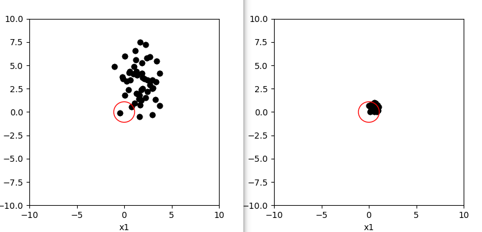
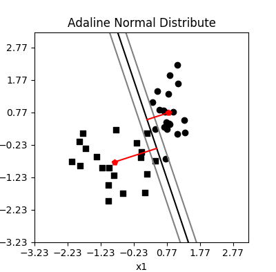
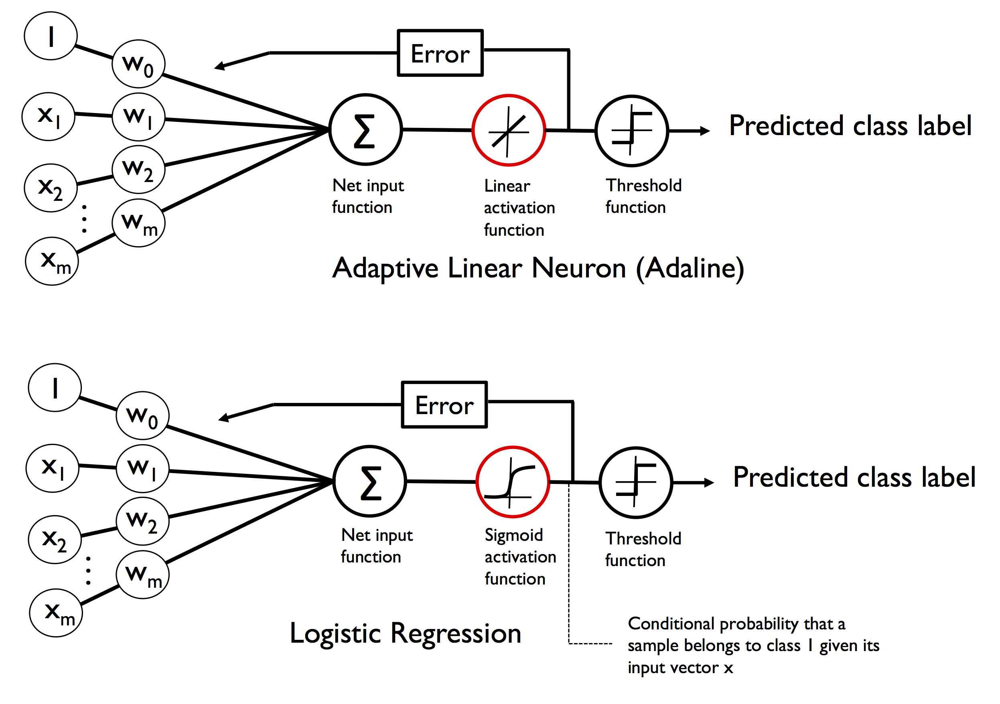
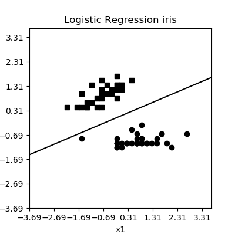

机器学习实战
=============

本部分实战用例主要是对 Adrian Rosebrock博客 `pyimagesearch <https://www.pyimagesearch.com>`_，OpenCV 官网，19Channel 等提供实例的总结和验证，主要集中在计算机视觉领域。

实战主要聚焦在如下几个部分：
- 模型的应用（目标检测(Object Detection)，多目标检测，实时检测）
- 模型的训练（数据收集，提取，归一化，训练，各类网络的识别）
- 模型性能对比和算法改进（比较耗时，占比较少）
- 嵌入式应用（树莓派/BeagleBoard，手机应用）

环境安装
-----------

caffe
~~~~~~~~~~

尽管 tensorflow 和 pytorch 渐渐成为深度学习框架的主流，如果你拿到一个模型是基于其他框架训练而来的，如果要进行验证就需要相应的环境。好在跨平台的 Anaconda 提供了这一方便（令人稍许轻松）。

和其他计算机应用领域类似，配置环境这种体力密集型劳动在人工智能领域也不能幸免（AI 就是 AI，不是真正的I ^>^），甚至更甚（由于AI的快速发展，硬件算力不停升级，驱动不停更新，各类算法也层出不穷，所以软件框架也就不停更新，同时类似 Python 的胶水语言也在不停变动，导致版本依赖很强）。

Caffe（Convolutional Architecture for Fast Feature Embedding）是一种常用的深度学习框架，主要应用在视频、图像处理方面的应用上。

这里以 WIN10 上的 Anaconda 为例（强烈建议使用 Linux 操作系统，特别是 Ubuntu，大部分开源社区的成员对 Opensource 系统怀有异常的热情，你将能得到更好的帮助），在 Python 环境中配置 caffe。

1. 使用 conda 创建 caffe 的 Python 应用环境，由于 caffe 指定依赖 Python 2.7 或者 Python 3.5，所以要为它另起炉灶（这也是为什么推荐 Anaconda 的原因：支持不同 Python 版本环境，且提供了各类机器学习库的源）。cmd 窗口查看当前 conda 的环境：

.. code-block:: sh
  :linenos:
  :lineno-start: 0
  
  > conda env list
  # conda environments:
  #
  base                     E:\Anaconda3

笔者环境存在 base 环境，支持较新的 Python3.6。所以不满足 caffe 对 Python 版本的需求。创建 caffe-py3.5 环境：

.. code-block:: sh
  :linenos:
  :lineno-start: 0
  
  > conda create -n caffe-py3.5 python=3.5
  > conda env list
  # conda environments:
  #
  base                     E:\Anaconda3
  # 新建的caffe-py3.5 环境，路径放置在 envs 目录下
  caffe-py3.5           *  E:\Anaconda3\envs\caffe-py3.5 

在环境创建过程中，会安装一些最基本的程序包。成功后切换到新建的环境 Python3.5 环境：

.. code-block:: sh
  :linenos:
  :lineno-start: 0
  
  > activate caffe-py3.5
  > python --version
  
  Python 3.5.4 :: Continuum Analytics, Inc.

2. 安装 caffe 依赖，必须要注意 protobuf==3.1.0 版本：

.. code-block:: sh
  :linenos:
  :lineno-start: 0
  
  > conda install --yes cmake ninja numpy scipy protobuf==3.1.0 six scikit-image pyyaml pydotplus graphviz

3. 安装Windows 版 git 以下载 caffe 源码，注意源码放置为位置不要过深，也不要包含特殊字符，比如空格或者 . 之类字符，为了避免陷入奇怪编译的问题，建议放置在系统盘根目录下：

.. code-block:: sh
  :linenos:
  :lineno-start: 0
  
  > d:
  > git clone https://github.com/BVLC/caffe.git
  > git branch -a
    * master
    remotes/origin/HEAD -> origin/master
    remotes/origin/gh-pages
    remotes/origin/intel
    remotes/origin/master
    remotes/origin/opencl
    remotes/origin/readme_list_branches
    remotes/origin/tutorial
    remotes/origin/windows    
  > git checkout windows   # 切换到 windows 分支
  
切换到 windows 分支非常重要，否则根本无法编译。

4. 打开 VS2015 x86 x64 兼容工具命令提示符，并使用 conda 切换到caffe-py3.5环境。进入 caffe 目录，执行 cmake .，配置编译环境。

.. code-block:: sh
  :linenos:
  :lineno-start: 0
  
  > cd caffe
  > cmake .

cmake 默认使用 Ninja 编译器（速度比较快），但是可能出现找不到头文件的问题。笔者就遭遇了这种陷阱。

5. 编译，进入 caffe 下的 scripts 目录，执行 build_win.cmd 。如果使用默认的 Ninja 编译器遭遇 ninja: build stopped: subcommand failed. 

.. code-block:: sh
  :linenos:
  :lineno-start: 0
  
  编辑 build_win.cmd 将所有
  if NOT DEFINED WITH_NINJA set WITH_NINJA=1
  
  替换为
  if NOT DEFINED WITH_NINJA set WITH_NINJA=0

然后删除掉 scripts 目录下的 build 和 caffe 下的 CMakeFiles 和 CMakeCache.txt 文件，重新执行第 4 步。

6. 编译完毕后，执行 caffe 依赖的其他安装包，requirements.txt 位于 caffe\python 目录：

.. code-block:: sh
  :linenos:
  :lineno-start: 0
  
  > pip install -r requirements.txt

安装出现 leveldb 无法编译，可以在 requirements.txt 删除它，该库用于读取 Matlab 数据库文件，如果确实需要则需要手动编译安装。

7. 安装 caffe 到 Anaconda 环境。 复制 python\caffe 文件夹到 E:\Anaconda3\envs\caffe-py3.5\Lib\site-packages。书写 test.py 引用 caffe 进行测试。

不建议使用老版本或者不稳定版本的数据包，除非迫不得已。requirements 中需要 >= 版本都应该取等于，否则会出现依赖循环问题。

conda
~~~~~~~~~

conda 用于管理 Anaconda3 科学计算环境软件包。

环境管理
```````````````

.. code-block:: sh
  :linenos:
  :lineno-start: 0
  
  # 环境相关
  # 下面是创建python=3.6版本的环境，取名叫py36
  conda create -n py36 python=3.6

  # 删除环境
  conda remove -n py36 --all

  # 激活 py36 环境，windows 无需 source 命令前缀
  activate py36

  # 退出当前环境
  deactivate
  
  # 复制（克隆）已有环境
  conda create -n py361 --clone py36

  # 查看当前所有环境
  conda env list
  
创建的环境路径位于 Anaconda 安装文件的 envs 文件夹下。

软件包管理
``````````````

.. code-block:: sh
  :linenos:
  :lineno-start: 0
  
  # 查看当前环境信息
  conda info

  # 查看安装软件列表
  conda list
  
  # 查看软件包信息，软件包名称支持模糊查询
  conda list python

  # 查找软件包通道 channel 
  anaconda search -t conda pyqt5
  
  # 安装软件包到 py36 环境，如果不指定环境，则作用到当前环境
  conda install --name py36 numpy -c 指定通道
  
  # 删除软件包，如果不指定环境，则作用到当前环境 
  conda remove --name py36 numpy
  
  # 查询 conda 版本号
  conda --version

在启动 Anaconda Navigator 或者 Sypder 遇如下问题时：

.. code-block:: sh
  :linenos:
  :lineno-start: 0
  
  # ModuleNotFoundError: No module named 'PyQt5.QtWebKitWidgets'
  conda update -c conda-forge qt pyqt

Numba
~~~~~~~~

Numba 是一个优化计算密集型 Python 代码的软件包，和 Anaconda 师出同门，基于 LLVM（Low Level Virtual Machine）编译器在运行时（JIT，Just in time）将 Python 代码编译为本地机器指令，而不会强制大幅度的改变普通的Python代码（使用装饰器修饰即可）。

Numba 的核心应用领域是 math-heavy（强数学计算领域）和 array-oriented（面向数组）功能，它们在 Python 中执行相当缓慢（实际上它是多层 for 循环的强力克星）。如果在 Python 中编写一个模块，必须循环遍历一个非常大的数组来执行一些计算，而不能使用向量操作来加速。所以“通常”这类库函数是用 C，C ++ 或Fortran编写的，编译后，在Python中作为外部库使用。Numba 使得这类函数也可以写在普通的 Python 模块中，而且运行速度的差别正在逐渐缩小（官方宣称可以达到原生代码的效率）。

.. code-block:: sh
  :linenos:
  :lineno-start: 0
  
  conda install numba

Numba 的使用异常简单，只需要在需要优化的函数前添加函数装饰器，Numba 提供多种装饰器和装饰器参数，最简单的应用如下所示：

.. code-block:: python
  :linenos:
  :lineno-start: 0
  
  # 导入运行时优化装饰器 jit
  from numba import jit
  
  @jit
  def test_numba(size=10000):
      total = 0.0
      bigmatrix = np.ones((size,size))
      
      start = time.time()
      for i in range(bigmatrix.shape[0]):
          for j in range(bigmatrix.shape[1]):
              total += bigmatrix[i, j]
      print("bigmatrix sum cost walltime {:.02f}s".format(time.time()-start))
      return total
  
  test_numba()

对比结果令人印象深刻，大约有100倍的时间差距，Numba 非常适用于优化大量 for 循环的情况，更深入的参数使用参考 `Numba 用户指南 <http://numba.pydata.org/numba-doc/latest/user/index.html/>`_ 。

.. code-block:: sh
  :linenos:
  :lineno-start: 0
  
  bigmatrix sum cost walltime 44.37s
  bigmatrix sum cost walltime 0.41s

注意被 Numba 修饰器修饰的函数中不可使用 import 或者 from 语句导入第三方软件包。

numexpr
~~~~~~~~~~~

安装 numexpr 非常简单，它是专门针对 numpy 表达式的加速包。

.. code-block:: sh
  :linenos:
  :lineno-start: 0
  
  conda install numexpr

numexpr 的使用也很简单：

.. code-block:: python
  :linenos:
  :lineno-start: 0
  
  import numpy as np
  import numexpr as ne
  
  # 矩阵越大效果越好
  a = np.arange(1e6)   
  
  >>> ne.evaluate("a + 1")

numpy 对矢量操作优化的一个缺陷是它一次只能处理一个操作。这意味着，当我们对 numpy 矢量进行 A * B + C 这样的操作时，首先要等待 A * B 操作完成，
数据保存在一个临时矢量中，然后将这个新的矢量和 C 相加。

numexpr 模块可以将整个矢量表达式编译成非常高效的代码，可以将缓存失效以及临时变量的数量最小化。

深入使用 numexpr 参考 `numexpr 官方指南 <https://numexpr.readthedocs.io/en/latest/>`_ 。

写在前面
----------

相关软硬平台
~~~~~~~~~~~~~~

Intel OpenVINO /RealSense / Movidius
ARM   Tengine

NumPy 可以配置为使用线程数字处理器库（如MKL）。

移动端迁移学习方案
Apple turicreate CoreML ->iOS
Google Tensorflow -> Android
Facebook PyText（文本分类），ParlAI（智能会话）

PyText是基于NLP深度学习技术、通过Pytorch构建的建模框架。PyText解决了既要实现快速实验又要部署大规模服务模型的经常相互冲突。它主要通过以下两点来实现上面的需求：

- 通过为模型组件提供简单且可扩展的接口和抽象，
- 使用PyTorch通过优化的Caffe2执行引擎导出模型，进行预测推理。


加速：cython or OpenMP https://www.openmp.org/

关于"AI应用"的歪思考
~~~~~~~~~~~~~~~~~~~~

使用模型训练（深度学习神经网络）的流程：采集数据，尽可能多的采集广泛的数据（采集范围根据需求确定，根据需要进行精确处理：数据清洗），并准确标注。训练，可以多模型调参，并对比性能，导出模型。在实际应用环境，采集到的数据必须进行同样的精确预处理，通过模型进行识别，大体流程：

- 数据采集，通常由程序自动完成，比如从大量不同类型的视频中采集人脸，然后通过人工剔除错误信息（否则再多数据都白给），关键点标注（关键点也可以由程序完成，但需要人工进行后期的精确调整）
- 数据处理，采集到的样本可能大小，颜色，所占图片位置不同，所以要进行精确处理。
- 选择合适的模型，或者多个模型以进行效果对比 
- 实际应用场景进行验证，性能，效果，然后把错误数据继续反馈到模型继续训练，提高模型的鲁棒性。

性能不达标：

- 错误率高 1.软调节：数据是否准确，规模是否足够大到能满足需求，训练数据够好，则更新算法 2.硬调节，更换更高更好的传感器，提高分辨率和响应速度
- 速度慢  1.软调节：升级模型算法（需要有所突破）或者根据具体场景，来缩小图片尺寸，代价是距离远了，识别率变差；或者并行改串行，多线程处理；硬调节，增加多传感器，对应多线程处理；升级CPU，升级GPU，升级DSP，升级FPGA，根据SOC厂家解决方案来定（工程量不小，开始原型预研就要估计好数据量，莫盲目乐观）。 

这看起来很有趣，但是有什么实际用处呢？这是一个好问题，一个关键问题！ 但是 Data talks！

我所居住的小区后面就是地铁口，巧合的是在北阳台透过窗户，就可以完全看到它，于是我就把一个摄像头对准了这个出入口，并统计从早上 6:00 到晚上 6:00 出入该地铁口的人流，尽管有些距离，通过调焦还是可以看清进出的每个人，这对于识别人群的个体很有帮助。通过收集的数据，可以轻松的获取这入口人流数据，可以想象如果可以统计多个地段出入口数据就可以大体估计出这个城市的通勤情况。如果有长期的数据统计，那么可以得到很多更有趣的统计信息，比如人流的潮汐现象，每天或者每个月不同时期进出人流情况。顺便可以分析下男女占比，甚至着装颜色，只要发挥想象力，甚至可以统计下多少人是从地铁口的早餐摊买食物，进而分析下这个摊点的盈利状况。

周末带着四螺旋桨遥控飞机陪着小朋友玩，无意中发现很多楼房的顶层都装有太阳能热水器，不妨统计下热水器的品牌分布。由于这一片都是新小区，所以这个分布能在一定程度上反应该品牌在该城市的受欢迎程度。如果能够对城市的不同区域的小区进行采样，这个数据的分布就要正确得多。

晚上带着小朋友在车库玩滑板车，通过遥控飞机在车库来回飞行，进行车辆品牌的识别，甚至车辆的型号，非常容易统计出各个品牌在该片区的销售情况，如果能把数据扩大到多个小区，那么这个分布就非常可信了。

突然湖边有一群野鸟从树丛中飞起，并向着对岸飞去，掏出手机拍照上传到我的微信小程序，它的后端就是云服务器，服务器上的识别程序告诉我一共有18只，虽然无法识别这是什么鸟类，却告诉了这一群飞鸟的数目，这在生态学研究中很重要（人工去统计种群数目成本昂贵）。如果要对一片野生动物栖息地里的动物进行数量统计，特别是草原地区，那么使用遥控飞机拍照识别是没有再简单省事的了。

远处是串流不息的大运河，并且过往船只繁多，在高楼上也可以看到，把数据采样分析，就可以知道这条水运路线的繁忙程度以及船只吨位的分布了，如果视频数据够清晰，还可以识别所载货物种类。我现在才知道很多加油站的燃油均是通过水路运输的。长期的数据积累将会反应出更有趣的真相，如果可以分析每条船的所属地区，那么就可以大概知道货物去往了哪里......

如果把这种应用放在人造卫星上，用途就更是大得多了（可以想见人造卫星上的大数据所能揭露的真相有多么惊人！）。当然在微观领域，也有很大的用途，比如识别和统计显微镜下的细胞或者细菌数量。

简单的颜色，形状甚至运动物体的识别无需人工智能的加持也可以工作得很好，但是复杂的事物识别就需要在大型机上训练好分类算法模型，比如手势，脸部识别，甚至表情识别，动态物体跟踪等等。更复杂环境下的识别就需要愈加复杂的模型和算力支持，并且要考虑实时性和耗能，比如智能驾驶和机器人领域。

当前阶段的人工智能远飞人们想象的智能，并且还相当遥远。大多数据的模型算法都是通过大量数据分析出其中的规律，所以只能算是统计模型。并且严重依赖严谨的准确的数据，而数学模型简单还是复杂对预测准确性并没有直接关系，只要模型正确，结果一定相差不大，都能正确反映出训练数据的模式规律。

无论简单还是复杂的人工智能算法都无法从不准确的大数据中分析出准确的规律，也不可能从准确大数据中分析出离谱的预测模型，否则这种模型早就被淘汰了。一定要相信能够在学术和应用领域流传至今的知名算法都是经过长期验证的。同时不要盲信那些准确率高达吓人地步的模型，没有透明的训练数据，测试数据，训练耗时以及算法的可控性，复杂度的同时对比，只有一个准确率有什么意义。

事实证明，不用的算法模型在准确性上除了与一些模型参数有关外，在相同的训练数据基础上，结果都是大同小异。很多准确率宣称 99% 的模型一旦拿到实际的应用环境，其结果就连作者自己都大跌眼镜。为什么会出现这种情况？它与训练数据的真实的有效值（ground truth）到底是多少有关。一个数据集常常使用相同的方式（局限于特定的采集软件或者人工来采样生成）来获取，一部分用来训练，一部分用来验证，其结果只在这非常局限的缺乏真实应用环境的有效值上表现很好，有什么用呢？

可以看到无数人拿 mnist 或者 kaggle 数据集来练手，并且得出很好的结果，但是很少人拿训练模型去真实环境去测试验证，其正确性能有 80% 都不错了。为什么？不同地域，人们的书写习惯会不同，同时书写习惯也会随时间而改变，不同年龄段的人书写的规范程度也不一样，这些还只是真实环境错误预测的一小部分因素。现实中的人类可以根据数字所处的上下文来猜测模糊数字，或者不同格式的数字，例如 2^3，不会被认为是 2 和 3 而是 2 的立方。如果数字序列 3 5 7 9 中的 5 模糊掉了，那么人可以通过常识规律推测 5，而这种数学模型通过图像的特征进行识别就无能为力了。

所以人工智能在现实应用中既有非常大的限制，又有很大的用途。总结下来有几点：必须限制应用环境，复杂的应用环境准确性将严重下降，直至不可接受。其次必须是接受预测误差的应用场景，如果要求百分百准确，那么人工智能应用就只可以作为辅助（即便是作为辅助，它的威力依然惊人，如果在某种工作环节上它的准确性可以达到98%，那么这个工种环节就可以节约 98% 的人力费用，原来需要 100 个人的工作只需要 2 个人专门处理低置信度的未决预测就可以了，并且可以把这些错误预测收集归纳来训练新的模型，这样错误率就会越来越低，直至错误率低到无需人工干预也是可以接受的了）。 此外要认识到训练数据的准确性极其重要，不要期望通过调整模型来从不准确的数据中得出准确的预测结果。另外如果需要人工介入，就使用人工介入，人机交互中，人类具有一定的容忍度：比如谷歌搜索引擎会提示用户你要找是不是“xxx”，而不是在那里胡乱用复杂算法去猜测用户的想法，那样只会让体验愈加糟糕。

算法不能产生不存在的信息，Data talks。

迁移学习的思考
~~~~~~~~~~~~~~~~~

如果已经训练过一些模型，比如人脸识别，而要识别驴脸（纳尼，什么应用？），可能就麻烦了。人脸图片容易找，狗脸数据还能马马马虎凑合找到，更复杂的要识别驴脸麻烦就大了。另一特殊的样本采集起来可能非常麻烦，比如野生动物，或者特殊应用领域：微观领域（细胞，比如饮用水水质监测），宏观领域（航空，深空）。

还有上文的示例：现实中的人类可以根据数字所处的上下文来猜测模糊数字，或者不同格式的数字，例如 2^3，不会被认为是 2 和 3 而是 2 的立方。人类识别一样物品，例如狗狗，并不需要看太多狗的图片，而能从已有知识来加速学习：动物，有毛，四条腿，有尾巴，有耳朵，比马小，比猫大，叫起来汪汪。

迁移学习的本质就是基于已建立的深度神经网络模型对其中的部分层使用新数据集调节部分网络层权重（再训练）。这一技术从根本上解决了增量分类的重复训练问题。

Google 发布的 Inception 或 VGG16 这样成熟的物品分类的网络，只训练最后的 softmax 层，你只需要几千张图片，使用普通的 CPU 就能完成，而且模型的准确性不差。
Apple Turicreate 也是基于迁移学习，从而可以快速训练 CoreML 模型并部署到 iOS 上。

尽管如此，一堆所谓的有向无环图的“节点”（神圣地被称为“神经元”）组成的网络离真正意义上的“智能”还差得太远。

如果最终高效的人工智能算法模型被少数大公司垄断，只提供一些 API 接口（基本上这是一个趋势），那么人工智能的未来又该如何发展？

一些有趣的实践
~~~~~~~~~~~~~~~~~~

尽管机器学习和深度学习被大多应用于计算机视觉和自然语言(NLP)领域，但是如果把它放在其它领域其结果也会令人感到不可思议：

最近在从某网抽取数据来分析招聘信息，只从非常宏观的角度，就可以明显看出一个地区的产业分布（企业），人才层次分布，从这一分布就不难预测未来该地区的发展趋势。（政策层面如何量化？这确实是一个很大的变数，从各大官媒新闻报道中提及某些关键词频率入手？）。稍微细致分析，就可以看出某些公司的发展方向，人才储备的趋势变化。跟踪特定地区和公司的招聘变化相信将会有更大的发现。

再从雪球网抽取证券相关的评论信息（个人认为对于金融相关的预测过于关心过去的指数变化意义不大，反而可能从人的言行情绪上是一个不错的切入点），发现在负面情绪（负面分词占比很大）非常严重时，市场就开始具有不错的参与度（在不就的将来的收益很可能是超预期的），当然还要结合实际的宏观经济数据模型，不过至少它可以作为一个不错的特征指标，来衡量市场的冷热度。

当前阶段，人工智能领域最应该关注的趋势就是，算法模型向实际应用场景的落地。过多资源流向了算法研究，耗费在一堆参数上，而这些算法模型如何应用在各行各业，各个细分领域来产生实际的价值？

实战
------------------

令人印象“深刻”的示例
~~~~~~~~~~~~~~~~~~~~

人脸识别
``````````````````

有一次和一个朋友一起坐火车，入站的验票口不知被何时升级成了人脸自动识别系统，作为非计算机领域工作的朋友自然大为惊讶，一直在感叹世界变化太快！

opencv 源码中自带了一些人体识别的相关模型（人脸，身体或者眼球），它们位于 Library/etc/haarcascades 文件夹下，格式为 xml 文件。
haarcascade_frontalface_default.xml 就是较常使用的人脸识别模型之一。

.. code-block:: python
  :linenos:
  :lineno-start: 0

  # face_detect_haar.py

  # load opencv to handle image
  import cv2

  # load haar model and get face classifier
  faceModel = FaceDetector(r"models/haarcascades/haarcascade_frontalface_default.xml")
  faceClassifier = cv2.CascadeClassifier(faceModel)

  # load jpg file from disk
  image = cv2.imread("imgs/face.jpg")
  gray = cv2.cvtColor(image, cv2.COLOR_BGR2GRAY)

  # get all faces returned in rects
  faceRects = faceClassifier.detectMultiScale(gray, 
                                              scaleFactor=1.5, 
                                              minNeighbors=5, 
                                              minSize=(30,30))
   
  print("I found %d face(s)" % (len(faceRects)))

  # draw rects on image and show up
  for x,y,w,h in faceRects:
      cv2.rectangle(image, (x,y), (x+w, y+h), (0, 255, 0), 2)
  cv2.imshow("Faces", image)
  cv2.waitKey(0)

短短几行代码就可以实现图片中人脸的识别：

- 首先导入 opencv，这里使用的版本为 4.0.1。这里 cv2 用于图片加载和保存，它是一个非常强大的图像处理库。
- 加载模型文件，并获取人脸分类器 faceClassifier。
- 从磁盘加载图片文件，由于 opencv 自带的人脸分类器只支持灰度图，这里先把 RGB 彩图转换为灰度图
- 使用分类器的 detectMultiScale 方法检测人脸，这里暂不讨论这些参数
- 打印识别到的人脸数目，同时在图像上绘制矩形并弹出显示窗口。

执行以上脚本：

.. code-block:: sh
  :linenos:
  :lineno-start: 0

  $ python face_detect_haar.py
  I found 2 face(s)

.. figure:: imgs/practice/face.png
  :scale: 100%
  :align: center
  :alt: face

  基于opencv模型的人脸识别

初次看到这类效果的人一定大为惊讶，并赞叹人工“智能”的神奇。

但是且慢，我们尝试对图片做一个最基本的缩放操作，再看看效果如何，为此我们增加一个缩放函数，并重新调整代码框架。

.. code-block:: python
  :linenos:
  :lineno-start: 0
  
  def img_resize(img, ratio=0.5, inter=cv2.INTER_AREA):
      w = img.shape[1] * ratio
      h = img.shape[0] * ratio
      
      return cv2.resize(img, (int(w), int(h)), interpolation=inter)

以上定义了一个缩放函数，ratio 指定了宽高缩放比，如果它小于1，图像将被缩小，否则将被放大。

接着定义处理参数的相关函数，以便传递参数：

.. code-block:: python
  :linenos:
  :lineno-start: 0
  
  import cv2
  import argparse 
  
  def args_handle():
      ap = argparse.ArgumentParser()
      ap.add_argument("-i", "--image", required=False, 
                      default=r"imgs/face.jpg",
                      help="path to input image")
                    
      ap.add_argument("-m", "--model", required=False,
                      default=r"models/haarcascades/haarcascade_frontalface_default.xml",
                      help="path to opencv haar pre-trained model")
      
      return vars(ap.parse_args())
  
  g_args = None
  def arg_get(name): # 获取参数
      global g_args
      
      if g_args is None:
          g_args = args_handle()
      return g_args[name]

这里的参数列表只定义了名为 --image 和 --model 的两个参数，分别指定要进行人脸识别的图像路径和模型路径。接着封装一个用于人脸识别的 FaceDetector 类：

.. code-block:: python
  :linenos:
  :lineno-start: 0

  class FaceDetector():
      def __init__(self, model):
          self.faceClassifier = cv2.CascadeClassifier(model)
      
      # handle cv2 image object
      def detect_img(self, img, gray=1):  
          gray = img if gray == 1 else cv2.cvtColor(img, cv2.COLOR_BGR2GRAY)
          return self.faceClassifier.detectMultiScale(gray, 
                                                      scaleFactor=1.5, 
                                                      minNeighbors=5, 
                                                      minSize=(30,30))
      # handle image file
      def detect_fimg(self, fimg, verbose=0):
          # load jpg file from disk
          image = cv2.imread(fimg)
          gray = cv2.cvtColor(image, cv2.COLOR_BGR2GRAY)
          
          faceRects = self.detect_img(gray, 1)
  
          # draw rects on image and show up
          for x,y,w,h in faceRects:
              cv2.rectangle(image, (x,y), (x+w, y+h), (0, 255, 0), 2) 
          
          return image
      
      def show_and_wait(self, image, title=' '):
          cv2.imshow(title, image)
          cv2.waitKey(0)

在 face_batchdetect_haar 中通过 img_resize 调整缩放比例从 10% 到 200% 以 10% 步长循环处理，然后对缩放过的图像进行人脸识别。

.. code-block:: python
  :linenos:
  :lineno-start: 0

  def face_batchdetect_haar_size(model_path, fimg):
      img = cv2.imread(fimg)
      FD = FaceDetector(model_path)
      for i in range(1, 21, 1):
          ratio = i * 0.1
          newimg = img_resize(img, ratio, inter=cv2.INTER_AREA)
          faceRects = FD.detect_img(newimg, gray=0)
          faces = len(faceRects)
          print("I found {} face(s) of ratio {:.2f} with shape{}".format(faces, 
                ratio, newimg.shape))
          for x,y,w,h in faceRects:
              cv2.rectangle(newimg, (x,y), (x+w, y+h), (0, 255, 0), 2)    
          if faces != 2 and faces != 0:
              FD.show_and_wait(newimg)
  
  model_path = arg_get('model')
  face_batchdetect_haar(model_path, 'imgs/face.jpg')

迫不及待等待结果。很可惜这个结果令人大跌眼镜，如果缩小图片另识别率降低可以情有可原（因为很小的图片，人眼也难以识别物体），竟然放大后的图片也会有问题，而且问题是各种各样，以示例图片的结果对此模型说明：

- 太小的分辨率无法识别图片，缩放到 20% 以下的图片已经无能为力
- 缩放到 50% 和 110% 的图片竟然能识别出 4 张人脸？
- 缩放到 80%，120%，160% 和 180% 的图片更神奇，识别出 3 张脸

不过可以看到图片的分辨率越小，越难以识别人脸，而不适当的分辨率也会导致识别出错，分辨率越大越不会丢失人脸，但是不要指望能保证正确率。


  基于opencv模型的人脸错误识别

.. code-block:: sh
  :linenos:
  :lineno-start: 0

  $ python face_detect_haar.py
  I found 0 face(s) of ratio 0.10 with shape(29, 60, 3)
  I found 0 face(s) of ratio 0.20 with shape(59, 120, 3)
  I found 2 face(s) of ratio 0.30 with shape(89, 180, 3)
  I found 2 face(s) of ratio 0.40 with shape(118, 240, 3)
  I found 4 face(s) of ratio 0.50 with shape(148, 300, 3)
  I found 2 face(s) of ratio 0.60 with shape(178, 360, 3)
  I found 2 face(s) of ratio 0.70 with shape(207, 420, 3)
  I found 3 face(s) of ratio 0.80 with shape(237, 480, 3)
  I found 2 face(s) of ratio 0.90 with shape(267, 540, 3)
  I found 2 face(s) of ratio 1.00 with shape(297, 600, 3)
  I found 4 face(s) of ratio 1.10 with shape(326, 660, 3)
  I found 3 face(s) of ratio 1.20 with shape(356, 720, 3)
  I found 2 face(s) of ratio 1.30 with shape(386, 780, 3)
  I found 2 face(s) of ratio 1.40 with shape(415, 840, 3)
  I found 2 face(s) of ratio 1.50 with shape(445, 900, 3)
  I found 3 face(s) of ratio 1.60 with shape(475, 960, 3)
  I found 4 face(s) of ratio 1.70 with shape(504, 1020, 3)
  I found 3 face(s) of ratio 1.80 with shape(534, 1080, 3)
  I found 2 face(s) of ratio 1.90 with shape(564, 1140, 3)
  I found 2 face(s) of ratio 2.00 with shape(594, 1200, 3)

到此我们对该模型的处理机制一无所知，它首先带来了惊喜，当然更多的是失望。这一模型被大家所诟病的问题不仅如此：它还会误识别，也即把根本不是人脸的图像识别为人脸；当人脸不是正面时，稍有角度不同识别率极度下降，正如模型的名称 frontalface 所讲。

不过从无到有总是困难的，这一模型至少说明人脸是可以通过计算机识别出来是可行的，而正确率是可以通过各种方式改善的。暂时忘记正确率吧，我们还可以在它上面继续挖掘一些有用的东西。

.. code-block:: python
  :linenos:
  :lineno-start: 0
  
  def face_batchdetect_haar(model_path, fimg):
      import time
      img = cv2.imread(fimg)
      FD = FaceDetector(model_path)
      for i in range(1, 21, 1):
          ratio = i * 0.1
          newimg = img_resize(img, ratio, inter=cv2.INTER_AREA)
          
          # time cost
          start = time.process_time()
          for i in range(0, 10):
              faceRects = FD.detect_img(newimg, gray=0)
          end = time.process_time()
          
          faces = len(faceRects)
          print("I found {} face(s) of ratio {:.2f} with shape{} cost time {:.2f}".format(faces, 
                ratio, newimg.shape, end - start))
          '''
          for x,y,w,h in faceRects:
              cv2.rectangle(newimg, (x,y), (x+w, y+h), (0, 255, 0), 2)    
          if faces != 2 and faces != 0:
              FD.show_and_wait(newimg, "{:.2f}".format(ratio))
          '''

以上代码对不同的图像大小统计人脸识别的耗时，这在实时处理的应用场景非要重要。对每种大小图片统计处理 10 次的时间：

.. code-block:: sh
  :linenos:
  :lineno-start: 0

  $ python face_detect_haar.py
  I found 0 face(s) of ratio 0.10 with shape(29, 60, 3) cost time 0.00
  I found 0 face(s) of ratio 0.20 with shape(59, 120, 3) cost time 0.03
  I found 2 face(s) of ratio 0.30 with shape(89, 180, 3) cost time 0.02
  I found 2 face(s) of ratio 0.40 with shape(118, 240, 3) cost time 0.11
  I found 4 face(s) of ratio 0.50 with shape(148, 300, 3) cost time 0.09
  I found 2 face(s) of ratio 0.60 with shape(178, 360, 3) cost time 0.33
  I found 2 face(s) of ratio 0.70 with shape(207, 420, 3) cost time 0.25
  I found 3 face(s) of ratio 0.80 with shape(237, 480, 3) cost time 0.12
  I found 2 face(s) of ratio 0.90 with shape(267, 540, 3) cost time 0.53
  I found 2 face(s) of ratio 1.00 with shape(297, 600, 3) cost time 0.62
  I found 4 face(s) of ratio 1.10 with shape(326, 660, 3) cost time 0.55
  I found 3 face(s) of ratio 1.20 with shape(356, 720, 3) cost time 0.86
  I found 2 face(s) of ratio 1.30 with shape(386, 780, 3) cost time 1.03
  I found 2 face(s) of ratio 1.40 with shape(415, 840, 3) cost time 0.84
  I found 2 face(s) of ratio 1.50 with shape(445, 900, 3) cost time 1.03
  I found 3 face(s) of ratio 1.60 with shape(475, 960, 3) cost time 1.14
  I found 4 face(s) of ratio 1.70 with shape(504, 1020, 3) cost time 1.41
  I found 3 face(s) of ratio 1.80 with shape(534, 1080, 3) cost time 1.58
  I found 2 face(s) of ratio 1.90 with shape(564, 1140, 3) cost time 1.64
  I found 2 face(s) of ratio 2.00 with shape(594, 1200, 3) cost time 1.80

上面的结果很令人满意：清楚的规律是，图像越大处理的耗时越长。笔者的笔记本 CPU 主频为 2.6GHz，常见的摄像头分辨率为 640*480，帧率 25-30，对应到上面的数据不难猜测大约为 1s，也即 1s 内处理 10 张 640*480 分辨率的图片，这似乎不是一个好消息。也即我们要丢到一半的帧率，如果对实时性要求很高，且不能丢帧，即便不从正确性上考虑，那么这个模型也有点悬。

如果要在嵌入式平台运行以上代码，并达到实时性要求，那么由于 ARM 之类的芯片主频没有笔记本主频这么高，那么就要考虑从硬件（DSP,FPGA,GPU）和软件(使用更高性能的编程语言/并行/图像缩小)两方面进行性能提升。

视频中识别人脸
```````````````

如果能从图片中识别出人脸，那么从视频数据中识别出人脸就不会很困难：由于视频流就是有多幅图片“组成的”，所以只要针对视频中的每一幅图片处理就可以达到目的了。

.. code-block:: python
  :linenos:
  :lineno-start: 0

  def face_detect_camera(model_path, show=0):
      import time
      frames = 0
      camera = cv2.VideoCapture(0)
      start = time.process_time()
      
      FD = FaceDetector(model_path)
      while(camera.isOpened()):
          grabbed, frame = camera.read()
          
          if not grabbed:
              print("grabbed nothing, just quit!")
              break
  
          faceRects = FD.detect_img(frame, gray=0)
          frames += 1
          
          fps = frames / (time.process_time() - start)
          print("{:.2f} FPS".format(fps), flush=True)
 
          if not show: # show video switcher
            contine
            
          cv2.putText(frame, "{:.2f} FPS".format(fps), (30, 30), 
                      cv2.FONT_HERSHEY_SIMPLEX, 0.5, (0, 255, 0), 1)

          cv2.imshow("Face", frame)          
          if cv2.waitKey(1) & 0xff == ord('q'):
              break

      camera.release()
      cv2.destroyAllWindows()
  
  model_path = arg_get('model')
  face_detect_camera(model_path)

我们从摄像头抓取视频帧，然后进行处理，首先跳过所有不必要的处理（这些处理我们可以放在其它线程或者进程中）：

.. code-block:: sh
  :linenos:
  :lineno-start: 0

  32.43 FPS
  32.00 FPS
  32.07 FPS
  32.14 FPS
  31.92 FPS
  ......

在最理想的情况下我们得到了以上结果，但是如果把笔记本的 2.6GHz 的算力换算到嵌入式平台上，情况依然不容乐观。到此为止我们打开视频流相关的代码，看看会发生什么：

.. code-block:: python
  :linenos:
  :lineno-start: 0
  
  model_path = arg_get('model')
  face_detect_camera(model_path, show=1)

.. figure:: imgs/practice/video.png
  :scale: 50%
  :align: center
  :alt: face

  基于opencv模型的视频流人脸识别

帧率大约是 16 FPS，当然我们可以从软件层面挽回这一大约一倍的时间损失。

haar 模型的进一步思考
``````````````````````````

既然可以从图片尺寸和耗时上来考虑一个算法模型，那么我们不妨走得更远一些，看看会发生什么。

我们可以将图片围绕中心旋转，这是非常容易做到的。另外为了在旋转时头像始终处在图片之中，这里使用只有一张梦露脸的图片，且脸部基本位于图片中央。


  图片旋转对人脸识别的影响用图

.. code-block:: python
  :linenos:
  :lineno-start: 0
    
  def rotate(image, angle):
      '''roate image around center of image'''
      h, w = image.shape[:2]
      center = (w // 2, h // 2)
      
      M = cv2.getRotationMatrix2D(center, angle, 1.0)
      return cv2.warpAffine(image, M, (w, h))
      
  # rotate a picture from 0-180 angle to check accuracy
  def face_batchdetect_haar_rotate(model_path, fimg):
      import time
      img = cv2.imread(fimg)
      FD = FaceDetector(model_path)
      for angle in range(0, 190, 10):
          newimg = rotate(img, angle)
          # time cost
          start = time.process_time()
          for i in range(0, 10):
              faceRects = FD.detect_img(newimg, gray=0)
          end = time.process_time()
          
          faces = len(faceRects)
          print("I found {} face(s) of rotate {} with shape{} cost time {:.2f}".format(faces, 
                angle, newimg.shape, end - start))
          
          for x,y,w,h in faceRects:
              cv2.rectangle(newimg, (x,y), (x+w, y+h), (0, 255, 0), 2)    
          if faces != 1 and faces != 0:
              FD.show_and_wait(newimg, "Rotate{}".format(angle))
          
  model_path = arg_get('model')
  face_batchdetect_haar_rotate(model_path, arg_get('image'))

结果令人大跌眼镜，旋转超过 10 度以后再难以识别出人脸，这令人不禁怀疑为何此模型的泛化能力如此之差？如果尝试在 -10到10度之间旋转，模型还是可以识别出人脸，这说明模型在训练之初使用的数据很可能没有考虑这种特殊情况。 

.. code-block:: sh
  :linenos:
  :lineno-start: 0
  
  $ python face_detect_haar.py  -i imgs/Monroe.jpg
  I found 1 face(s) of rotate 0 with shape(480, 640, 3) cost time 0.84
  I found 0 face(s) of rotate 10 with shape(480, 640, 3) cost time 0.48
  I found 0 face(s) of rotate 20 with shape(480, 640, 3) cost time 0.61
  ......
  I found 0 face(s) of rotate 130 with shape(480, 640, 3) cost time 0.53
  I found 1 face(s) of rotate 140 with shape(480, 640, 3) cost time 0.53
  I found 0 face(s) of rotate 150 with shape(480, 640, 3) cost time 0.50
  I found 0 face(s) of rotate 160 with shape(480, 640, 3) cost time 0.67
  I found 0 face(s) of rotate 170 with shape(480, 640, 3) cost time 0.52
  I found 0 face(s) of rotate 180 with shape(480, 640, 3) cost time 0.73

如果我们只是对图片进行水平和垂直方向的平移，那么识别率会怎么变化？理论上应该不会有影响。事实却非如此。

.. code-block:: python
  :linenos:
  :lineno-start: 0
  
  def translation(image, x, y):
      '''move image at x-axis x pixels and y-axis y pixels'''
      
      M = np.float32([[1, 0, x], [0, 1, y]])
      return cv2.warpAffine(image, M, (image.shape[1], image.shape[0]))
  
  def face_batchdetect_haar_move(model_path, fimg):
      import time
      img = cv2.imread(fimg)
      FD = FaceDetector(model_path)
      for move in range(0, 100, 10):
          newimg = translation(img, move, move)
          # time cost
          start = time.process_time()
          for i in range(0, 10):
              faceRects = FD.detect_img(newimg, gray=0)
          end = time.process_time()
          
          faces = len(faceRects)
          print("I found {} face(s) of move {} with shape{} cost time {:.2f}".format(faces, 
                move, newimg.shape, end - start))
          
          for x,y,w,h in faceRects:
              cv2.rectangle(newimg, (x,y), (x+w, y+h), (0, 255, 0), 2)    
          #if faces != 1 and faces != 0:
          FD.show_and_wait(newimg, "Move{}".format(move))
  
  model_path = arg_get('model')
  face_batchdetect_haar_move(model_path, arg_get('image'))

结果还是令人大跌眼镜，将图像向右下方以 10 像素每步移动，有时可以识别，有时失败，毫无规律可循。这说明此模型对背景敏感，由于我们在旋转和平移时背景均被填充为了黑色，这与原图的背景色并不完全一致。笔者尝试在识别前进行高斯模糊，效果就出现了改善。

.. code-block:: sh
  :linenos:
  :lineno-start: 0
  
  $ python face_detect_haar.py  -i imgs/Monroe.jpg
  I found 1 face(s) of move 0 with shape(480, 640, 3) cost time 0.66
  I found 1 face(s) of move 10 with shape(480, 640, 3) cost time 0.48
  I found 0 face(s) of move 20 with shape(480, 640, 3) cost time 0.53
  I found 1 face(s) of move 30 with shape(480, 640, 3) cost time 0.52
  I found 1 face(s) of move 40 with shape(480, 640, 3) cost time 0.48
  I found 0 face(s) of move 50 with shape(480, 640, 3) cost time 0.45
  I found 0 face(s) of move 60 with shape(480, 640, 3) cost time 0.64
  I found 1 face(s) of move 70 with shape(480, 640, 3) cost time 0.56
  I found 0 face(s) of move 80 with shape(480, 640, 3) cost time 0.55
  I found 0 face(s) of move 90 with shape(480, 640, 3) cost time 0.52

经历了漫长的测试验证，我们将该模型最为黑盒使用，依然对模型本身不甚了解，但是至少可以知道不要轻易对一个看起来令人“惊喜”的模型太过乐观，对它们的使用常常是有严格限制条件的。好吧，就从这里开始人工智能的实战之路。

距离和kNN分类
~~~~~~~~~~~~~~

勾股定理（毕达哥拉斯定理）是数学史上最伟大定理之一，除了因为它引入了无理数，还因为它使得几何距离在坐标中可以计算，它把坐标张开成面和3维空间，甚至高维空间。

人类生活的3维世界被形形色色的物体充满，有些还无色无味，为了描述这些物体，区分和应用，从感官层面人类发展出各类描述词汇，形状，颜色，味道，密度，重量等等。

所有事物似乎都可以用一棵树一样的形状进行从粗到细的分类，比如生物学上的界门科目属种。离根越近的分类，它们的共同点就越接近本质，而离树梢越近的分类就只有细微的区别，同一个末梢上的分支也就具有更多的相同特征，比如哈士奇和萨摩耶。人类在描述相近事物时彼此已经建立了共同的理解基础，所以只要说是犬类，大家都明白毛茸茸，有四条腿，有耳朵，有尾巴，叫起来汪汪。没有人会描述这些共同的特征来介绍一只狗，而是直接说出区别于其他犬种的细节，比如体型小，善狩猎等等。

我们不想一开始就区分两种犬类的图片，而是从更少特征值的区分上进行入手。

考虑数字 1 和 2，以及 10000，我们自然认为 1 和 2 非常接近，但是计算机没有这种感觉，它没法感觉远近，只不过是内存中存储的二进制而已。在计算机中所有的数据都是二进制数据，要感知距离就需要给计算机规则，从计算上来区分距离。

从主观猜测开始
```````````````

计算机中的数与数之间的距离可以用减法定义，而一组数和另一组数之间的距离就可以用向量距离来定义（这就用到了勾股定理）。一张图片就是一组像素值，是否可以把像素值直接展成一维向量，来计算它们之间的距离，如果对两张复杂图片适用，那么对于最简单的二值图像更会适用。这里不妨拿出最简的四个像素来组成一幅二值图。

只有 4 个像素的二值图图片依然可以表达非常丰富的信息，因为有 2^4 = 16 种组合。可以想见人们在一个 20*20 的像素方格内书写 0-9，相对于整个组合的情况是多么地稀疏。我们只使用了像素空间的很小部分，以便于人眼的识别，所以这里我们使用四个像素生成 3 幅图，分别对应符号 "\-\|\_"，这对于人眼一目了然。

.. code-block:: python
  :linenos:
  :lineno-start: 0
  
  import numpy as np
  import cv2
  
  def bitwise(imga, imgb=None, opt='not'):
      '''bitwise: and or xor and not'''
      if opt != 'not' and imga.shape != imgb.shape:
          print("Imgs with different shape, can't do bitwise!")
          return None
  
      opt = opt.lower()[0]
      if opt == 'a':
          return cv2.bitwise_and(imga, imgb)
      elif opt == 'o':        
          return cv2.bitwise_or(imga, imgb)
      elif opt == 'x':
          return cv2.bitwise_xor(imga, imgb)
      elif opt == 'n':
          return cv2.bitwise_not(imga)
  
      print("Unknown bitwise opt %s!" % opt)
      return None
  
  def vector_dist(V0, V1):
      from numpy import linalg as la
      V0 = np.array(V0).astype('float64')
      V1 = np.array(V1).astype('float64')
  
      return la.norm(V1 - V0)
  
  def show_simple_distance():
      gray0 = np.array([[0,0],[255,255]], dtype=np.uint8)
      gray1 = gray0.transpose()
      
      cv2.imshow('-', gray0)
      cv2.imshow('|', gray1)
      
      gray2 = bitwise(gray0, None, opt='not')
      cv2.imshow('_', gray2)
      
      g01 = vector_dist(gray0, gray1)
      g02 = vector_dist(gray0, gray2)
      print("distance between -| is {}, distance between -_ is {}".format(int(g01), int(g02)))
      
      cv2.waitKey(0)
  
  show_simple_distance()


  四像素的二值图

四像素的二值图无法表示复杂的数字形状，但是可以表示一横和一竖，从这个角度看左边两幅图应该距离更近，上边的两幅图应该距离更远，然而通过展开 2*2 的四像素成为 4 维向量，然后求取它们的向量距离：

.. code-block:: sh
  :linenos:
  :lineno-start: 0
  
  $ python vector_distance.py
  distance between -| is 360, distance between -_ is 510
  
显然左边两幅图距离为 510，比上边的两幅图距离更远，这不是我们所期待的，难道通过这种向量方式的距离求取来分类像素组成的几何形状根本不可行？

在人类的世界里面不存在任何像素，而只有事物映射到大脑的信息：大小，形状，颜色。如果看到一个数字，基于过往的视觉经验，首先人脑会不自主得进行中心视觉的处理：如果两个数字是黏连的，人脑会主动分割；如果数字是模糊的人脑也会根据边界自动区分；如果数字是歪斜的，甚至颠倒的，人脑会自动纠正（过滤干扰）。人脑对每一个数字形成一个完整的标准的数字形象，当视觉神经细胞接收一个类似数字的符号后，人脑自动与标准数字形象进行比较，哪个最相像，哪一个就是要识别的数字。

这一过程，计算机是完全无知的，但是可以从算法上模拟。如果只有 4 个像素，那么考虑“中心视觉”就不现实了，这犹如人眼盯着放大数字的一角。在一个 20*20 的像素空间内计算机就可以形成“中心视觉”了（此时的向量距离就能反馈数字相似性的信息），例如 1 的像素值总是集中在 7-12 列上，且前几行和后几行像素通常都是空白的。

mnist 数据集上的试验
```````````````````````

这里借用 mnist 手写数据集，每个数字由 28*28 个像素组成。

.. code-block:: python
  :linenos:
  :lineno-start: 0
    
  import dbload
  
  # imgs with shape(count,height,width)
  def show_gray_imgs(imgs, title=' '):
      newimg = imgs[0]
      for i in imgs[1:]:
          newimg = np.hstack((newimg, i))
      
      cv2.imshow(title, newimg)
      cv2.waitKey(0)
  
  train,labels = dbload.load_mnist(r"./db/mnist", kind='train', count=20)
  num1 = train[labels==1]
  print(len(num1))
  
  show_gray_imgs(num1, '1')
  
  >>>
  4

首先读取训练集中的前 20 个样本，然后取数数字 1，可以看到有 4 个数字 1 被取出，打印出来看看效果：

.. figure:: imgs/practice/41.png
  :scale: 80%
  :align: center
  :alt: Monroe

  手写数字 1

尽管对于人脑来说上面的数字（除非不限定在数字范围来考虑这些符号）一目了然，并且可以轻易的得出这四个1之间的“距离”（相似度），第一个 1 向左倾斜一个很大角度，和其他三个 1 距离最远，最后两个 1 之间距离最小。如果把问题聚焦在第一个1和其余三个1的距离比较上，显然距离第二个1距离最大，距离最后边的两个1距离差不多：

.. code-block:: python
  :linenos:
  :lineno-start: 0
  
  for i in range(1, len(num1)):
      print("distance between 0-{} {}".format(i, vector_dist(num1[0], num1[i])))
     
  >>>
  distance between 0-1 2354.3323894471655
  distance between 0-2 2152.188885762586
  distance between 0-3 2114.714401520924

结果和我们的预测如此吻合，很令人惊讶。如果第一个1是靠近左上角，或者右下角，或者某一侧，那么计算机就无法再形成“中心视觉”了，可以想见它距离中心视觉的1的距离就会很远。如何克服这一问题？符号处于空间的位置不影响人脑识别出这一符号，也即人脑能很好得过滤这些干扰，计算机无法自动识别（在这一简单的距离模型下）这一干扰，需要人为来构造建立“中心视觉”的环境。

可以想见这一“环境”是怎样的————令待识别的图像最接近理想的标准的数字形象：

- 位置：数字位置应该处于图像中心，以最完整的方式清晰展现出来
- 角度：数字不应该有较大的倾斜角度，而是端端正正的
- 扭曲：数字不应该有较大的扭曲，比如 1 应该是一条直线，而不是竖起来的波浪线
- 大小：数字所占的整个比例应该和整个画布比例一致，不应该太小或太大
- 亮度：对于灰度图，需要考虑亮度的影响，而对于二值图就可以忽略虑亮度的影响

尽管还有一些其它的次要因素，比如边缘应该平滑无毛刺，但这些不是主要因素。事实上 mnist 数据集在采集时已经做了这些处理，每一个数字看起来都能很好得获取到“中心视觉”。这也就是为何 mnist 数据集在很多简单的模型上都能获取很高的识别率的重要因素，如果使用这些模型来验证其他渠道采集来的数字图像，并且这些数字图像不进行以上处理，结果就会令人大跌眼镜。

我们继续验证第一个数字 1 和其他数字的距离：

.. code-block:: python
  :linenos:
  :lineno-start: 0

  for i in range(1, len(train)):
      print("distance between 0-{} {}".format(labels[i], vector_dist(num1[0], train[i])))
  
  >>>
  distance between 0-1 0.0
  distance between 0-9 2388.816652654615
  distance between 0-2 2525.059603256921
  distance between 0-1 2354.3323894471655
  distance between 0-3 2604.63471527199
  distance between 0-1 2152.188885762586
  distance between 0-4 2397.628203037327
  distance between 0-3 2499.4817462826168
  distance between 0-5 1916.8805387921282
  distance between 0-3 2850.328402131937
  distance between 0-6 2611.602190227294
  distance between 0-1 2114.714401520924
  distance between 0-7 2411.6311907088943
  distance between 0-2 2491.427703145327
  distance between 0-8 1914.8302796853825
  distance between 0-6 2259.1578076796673
  distance between 0-9 2019.5298957925827

这里的 0-x 中的 x 不再是其他 1 的索引，而是换成了数字的下标。这里与训练集中的 20 个数字进行了距离计算。

很容易看出来，1 与 其他数字的距离都比较远，离其他 1 距离较近。此时不难想出一个简单的数字分类算法：在样本上计算距离，找出最近的几个样本，查看它们的标签，最多标签标示的数字的就是最可能的数字。

注意：此时的计算机无法识别大角度旋转甚至倒立的数字，这需要数据的预处理。
 
kNN 邻近算法
`````````````

K 最近邻(kNN，k-NearestNeighbor)分类算法是数据挖掘分类技术中最简单的方法之一。相对于其他复杂的多参数机器学习模型，它非常简单，无需学习，直接通过强力计算来进行分类。

上一节已经揭示了 K 最邻近算法的本质：计算与已知样本的距离，选取 k 个距离最小（最邻近）的样本，统计这些最邻近样本的标签，占比最大的标签就是预期值。显然最邻近的 k 个样本具有投票权，哪种标签票数多，哪种标签就获胜。

.. code-block:: python
  :linenos:
  :lineno-start: 0
  
  # knn_mnist.py
  def kNN_predict(train, labels, sample, k=5):
      import operator
      
      # 使用矩阵方式计算 sample 和训练集上的每一样本的向量距离
      diff = train.astype('float64') - sample.astype('float64')
      distance = np.sum(diff ** 2, axis=2)
      distance = np.sum(distance, axis=1) ** 0.5
      
      # 对向量距离排序，获取排序索引，进而获取排序标签
      I = np.argsort(distance)
      labels = labels[I]
      
      max_labels = {}
      if len(train) < k:
          k = len(train)
      
      # 统计前 k 个投票的标签信息
      for i in range(0,k):
          max_labels[labels[i]] = max_labels.get(labels[i], 0) + 1
    
      # 返回从大到小票数排序的元组
      return sorted(max_labels.items(), key=operator.itemgetter(1), reverse=True)

kNN 算法实现非常简单，计算待预测样本与训练集上每一样本的向量距离，提取前 k 个距离最近的标签信息，统计标签列表，返回从大到小票数排序的元组。

从程序实现上可以感觉到，kNN 的计算非常耗时，训练集越大，计算量将线性增加，当然这可以通过多线程/进程采用分治法降低计算复杂度；但是另一个问题却无法解决，算法对磁盘空间和内存空间的占用。训练集越大，占用的磁盘空间和内存空间就越大，如果采用缓存方式就牺牲了计算性能。

实际验证可以发现，kNN 算法的效果非常好，可以轻易达到 98% 以上的准确度，且无需训练。当然准确度依赖性也很强，采用的训练集的样本数和分布，k 值的选择都对结果有影响。可以通过交叉验证来选择一个比较优的 k 值，默认值是5。

.. code-block:: python
  :linenos:
  :lineno-start: 0

  def kNN_test(train_entries=10000, test_entries=10000):
      k = 5
  
      train,labels = dbload.load_mnist(r"./db/mnist", kind='train', count=train_entries)
      test,test_labels = dbload.load_mnist(r"./db/mnist", kind='test', count=test_entries)
  
      error_entries = 0
      start = time.process_time()
      for i in range(0, test_entries):
          max_labels = kNN_predict(train, labels, test[i], k=k)
          predict = max_labels[0][0]
          if(predict != test_labels[i]):
              error_entries += 1
              #print(predict, test_labels[i], flush=True)
              #cv2.imshow("Predict:{} Label:{}".format(predict, test_labels[i]), test[i])
  
      print("Average cost time {:.02f}ms accuracy rate {:.02f}% on trainset {}".format(
            (time.process_time() - start) / test_entries * 1000,
            (test_entries - error_entries) / test_entries * 100,
            train_entries), flush=True)
      #cv2.waitKey(0)
  
  def kNN_batch_test():
      for i in range(10000, 70000, 10000):
          print("trains {}".format(i), flush=True)
          kNN_test(i, 1000)

采用批量方式在测试集上验证 1000 个样本，训练集从 10000-60000 以 10000 步递进：

.. code-block:: sh
  :linenos:
  :lineno-start: 0
  
  $ python knn_mnist.py
  Average cost time 135.38ms accuracy rate 92.00% on trainset 10000
  Average cost time 283.84ms accuracy rate 93.80% on trainset 20000
  Average cost time 417.44ms accuracy rate 94.40% on trainset 30000
  Average cost time 575.08ms accuracy rate 96.30% on trainset 40000
  Average cost time 722.20ms accuracy rate 98.00% on trainset 50000
  Average cost time 847.16ms accuracy rate 98.20% on trainset 60000

从结果上不难看出，数字识别平均耗时，与训练集的大小成线性增加，准确度在达到一定程度后就难以提升，但是输出预测结果很稳定，我们可以查看这些识别错误的字符，来分析一下可能性：两个数字看起来很像，体现在像素分布上应该差不多。

.. figure:: imgs/practice/err_num.png
  :scale: 80%
  :align: center
  :alt: face

  kNN 算法识别错误的数字示例

观察这些被错误识别的数字很有趣。我们可以把错误情况分为两类：

- 情有可原的一类，这类数字即便人工也难以辨别。上面的大部分情况属于这类。如果要对这类数字进行优化，可以想见将影响其他已经正确识别的数字的正确率。
- 右下角的 6 尽管书写很不规范，但是人脑很容易就识别出来，算法将它识别为 1， 显然是符合像素组成的向量距离最优的，但是这种最优和人脑识别数字的准确性出现了明显偏差。

经过以上分析，可能会意识到，人脑识别数字并不是靠像素构成的向量距离来判断相似性这么简单，而是使用更深层次的特征。人类认识 0-9 个符号，不需要看大量的图片，也不需要进行大量计算，而是会在大脑中形成标准的数字图像符号，此外人脑具有很行的过滤干扰的能力。这一切“智能”都是朴素的 kNN 算法所不具备的。

scikit-learn kNN算法
`````````````````````

scikit-learn 模块实现了传统机器学习的各类算法，并进行了大量优化，借此无需再制造不好用的轮子。这里对 scikit-learn kNN算法进行定量的性能分析。

.. code-block:: python
  :linenos:
  :lineno-start: 0

  def kNN_sklearn_predict(train, labels, test):
      from sklearn.neighbors import KNeighborsClassifier
      knn = KNeighborsClassifier()
      knn.fit(train, labels)
  
      return knn.predict(test)
      
  def kNN_sklearn_test(train_entries=10000, test_entries=1000):  
      train,labels = dbload.load_mnist(r"./db/mnist", kind='train', count=train_entries)
      test,test_labels = dbload.load_mnist(r"./db/mnist", kind='test', count=test_entries)
      
      train = train.reshape((train_entries, train.shape[1] * train.shape[2]))
      test = test.reshape((test_entries, test.shape[1] * test.shape[2]))
      
      start = time.process_time()
      predict = kNN_sklearn_predict(train, labels, test)
      error = predict - test_labels
      error_entries = np.count_nonzero(error != 0)
  
      print("Average cost time {:.02f}ms accuracy rate {:.02f}% on trainset {}".format(
            (time.process_time() - start) / test_entries * 1000,
            (test_entries - error_entries) / test_entries * 100,
            train_entries), flush=True)
  
  def kNN_sklearn_batch_test():
      for i in range(10000, 70000, 10000):
          kNN_sklearn_test(i, 1000)
          
  kNN_sklearn_batch_test()

采用同样的批量测试方法，来对比 scikit-learn 封装的 kNN 算法的性能，需要注意到 scikit-learn 对 kNN 算法进行了大量的技巧性的扩展：

- 距离度量 metric ：通常使用欧氏距离，默认的 minkowski 距离在 p=2 时就是欧氏距离
- algorithm ：4 种可选，‘brute’对应蛮力计算，‘kd_tree’对应 KD树 实现，‘ball_tree’ 对应球树实现， ‘auto’则会在上面三种算法中做权衡，选择一个拟合最好的最优算法。需要注意的是，如果输入样本特征是稀疏的时候，无论我们选择哪种算法，最后scikit-learn都会去用蛮力实现‘brute’。
- 并且处理任务书 n_jobs：用于多核CPU时的并行处理，加快建立KNN树和预测搜索的速度。一般用默认的 -1 就可以了，即所有的CPU核都参与计算。
- n_neighbors：最近邻个数，通常选择默认值 5。
- 近邻权 weights ：'uniform' 意味着最近邻投票权重均等。"distance"，则权重和距离成反比例，即距离预测目标更近的近邻具有更高的权重，更近的近邻所占的影响因子会更加大。 

.. code-block:: python
  :linenos:
  :lineno-start: 0
  
  # 默认 scikit-learn 封装的 kNN 算法参数
  KNeighborsClassifier(algorithm='auto', leaf_size=30, metric='minkowski',
                       metric_params=None, n_jobs=1, n_neighbors=5, p=2,
                       weights='uniform')

scikit-learn 封装的 kNN 算法计算速度有了很大的提升，比自实现算法速度快大约 7-8 倍。准确率上有所降低，但基本不相上下。

.. code-block:: sh
  :linenos:
  :lineno-start: 0
  
  $ python knn_mnist.py
  Average cost time 18.14ms accuracy rate 91.60% on trainset 10000
  Average cost time 36.64ms accuracy rate 93.70% on trainset 20000
  Average cost time 51.38ms accuracy rate 94.70% on trainset 30000
  Average cost time 77.83ms accuracy rate 96.00% on trainset 40000
  Average cost time 93.25ms accuracy rate 95.70% on trainset 50000
  Average cost time 109.94ms accuracy rate 96.10% on trainset 60000

kNN 并行参数
`````````````

在以上的各类参数中，有一个很吸引人的参数 n_jobs，它的默认值为 1，只使用了一个 CPU 核，在多核心的CPU上，这个参数对性能影响巨大。scikit-learn 并行操作使用 Joblib 的 Parallel 类实现。当笔者打开该参数时，发现性能不仅没有提升还略有降低，实际上是统计时间的代码问题。

time.process_time() 方法返回本进程或者线程的所有 CPU 核的占用时间，包括用户时间和系统时间，不包含 sleep 时间。所以算上启动多进程，以及数据多核心的分割和结果合并处理时间，占用的所有 CPU 核的时间就会略有上升。该函数对于性能瓶颈分析很有用。

统计相对于真实世界的耗时可以采用墙上时间函数 time.time()，修改代码如下：

.. code-block:: python
  :linenos:
  :lineno-start: 0
  
  def kNN_sklearn_test(train_entries=10000, test_entries=1000):  
      train,labels = dbload.load_mnist(r"./db/mnist", kind='train', count=train_entries)
      test,test_labels = dbload.load_mnist(r"./db/mnist", kind='test', count=test_entries)
      
      train = train.reshape((train_entries, train.shape[1] * train.shape[2]))
      test = test.reshape((test_entries, test.shape[1] * test.shape[2]))
      
      stime = time.process_time()
      wstime = time.time()        # 显示墙上时间
  
      predict = kNN_sklearn_predict(train, labels, test)
      error = predict.astype(np.int32) - test_labels.astype(np.int32)
      error_entries = np.count_nonzero(error != 0)
  
      print("Average cost cpu time {:.02f}ms walltime {:.02f}s"
            " accuracy rate {:.02f}% on trainset {}".format(
            (time.process_time() - stime) / test_entries * 1000,
            (time.time() - wstime),
            (test_entries - error_entries) / test_entries * 100,
            train_entries), flush=True)
  
  # Joblib 启动多线程时会检查脚本是否为主程序调用
  if __name__ == '__main__':
      kNN_sklearn_batch_test()

n_jobs = -1 使用所有核，可以通过 Windows 资源监视器查看 CPU 使用情况。

.. code-block:: sh
  :linenos:
  :lineno-start: 0
  
  # n_jobs = 1 时使用一个 CPU 核
  $ python knn_mnist.py
  Average cost cpu time 17.94ms walltime 17.97s accuracy rate 91.60% on trainset 10000
  Average cost cpu time 36.03ms walltime 36.08s accuracy rate 93.70% on trainset 20000
  Average cost cpu time 50.50ms walltime 50.52s accuracy rate 94.70% on trainset 30000
  Average cost cpu time 76.39ms walltime 76.51s accuracy rate 96.00% on trainset 40000
  Average cost cpu time 99.47ms walltime 99.74s accuracy rate 95.70% on trainset 50000
  Average cost cpu time 115.23ms walltime 115.41s accuracy rate 96.10% on trainset 60000
  
  # n_jobs = -1 使用所有核，笔者环境为 8 核心
  $ python knn_mnist.py
  Average cost cpu time 22.64ms walltime 4.58s accuracy rate 91.60% on trainset 10000
  Average cost cpu time 47.11ms walltime 10.15s accuracy rate 93.70% on trainset 20000
  Average cost cpu time 67.48ms walltime 16.25s accuracy rate 94.70% on trainset 30000
  Average cost cpu time 96.39ms walltime 23.10s accuracy rate 96.00% on trainset 40000
  Average cost cpu time 119.05ms walltime 30.40s accuracy rate 95.70% on trainset 50000
  Average cost cpu time 144.48ms walltime 41.26s accuracy rate 96.10% on trainset 60000

对比以上两组数据，可以非常清晰地看到，墙上时间（现实世界中的耗时）明显降低，大约降低了 3 倍。n_jobs 参数在多核环境是非常有效的提速工具。

kNN 近邻权参数
`````````````````

另一个令人关注的参数是近邻权 weights。思考待识别样本距离更近的样本点的投票权重更大，而不是简单的取平均，将会校正这样一个错误：由于书写的扭曲，模糊，等等不规范问题导致某个数字应该分布在距离很近的一个范围内，可以想象成大部分样本点聚集在一个圆内，现在某个待测样本落在了圆外，并且靠近（还未落入）了另外一个数字聚集的圆，这个圆内有很多样本具有了表决权，如何才能把它拉回正确的圆内？

显然只能增加正确的少数派的投票权重，当然这是一种人为干预：主观认为距离越近就越加相似（这也是 kNN 算法的思想，既然整体上是对的，那么它在细节上应该也是对的）。

.. code-block:: python
  :linenos:
  :lineno-start: 0
  
  def kNN_sklearn_predict(train, labels, test):
      from sklearn.neighbors import KNeighborsClassifier
      knn = KNeighborsClassifier(algorithm='auto', n_jobs=-1, weights='distance')
      knn.fit(train, labels)
  
      return knn.predict(test)

更新 kNN_sklearn_predict 函数，设置 weights 参数为 distance。来看一下效果，大约有 0.2%-0.4% 的微弱提升。

.. code-block:: sh
  :linenos:
  :lineno-start: 0
  
  $ python knn_mnist.py
  Average cost cpu time 22.12ms walltime 4.40s accuracy rate 91.90% on trainset 10000
  Average cost cpu time 44.66ms walltime 9.03s accuracy rate 93.80% on trainset 20000
  Average cost cpu time 65.02ms walltime 14.29s accuracy rate 94.50% on trainset 30000
  Average cost cpu time 94.42ms walltime 22.28s accuracy rate 96.30% on trainset 40000
  Average cost cpu time 118.08ms walltime 30.93s accuracy rate 96.30% on trainset 50000
  Average cost cpu time 142.30ms walltime 41.20s accuracy rate 96.40% on trainset 60000

算法特征
`````````````````

蛮力计算(brute)：计算预测样本和所有训练集中的样本的距离，然后计算出最小的k个距离即可，接着多数表决。这个方法简单直接，在样本量少，样本特征少的时候很有效。比较适合于少量样本的简单模型的时候用。

brute 算法在 mnist 数据集上，速度很快：

.. code-block:: python
  :linenos:
  :lineno-start: 0
  
  def kNN_sklearn_predict(train, labels, test):
      from sklearn.neighbors import KNeighborsClassifier
      knn = KNeighborsClassifier(algorithm='brute', n_jobs=-1)
      knn.fit(train, labels)
  
      return knn.predict(test)
      
.. code-block:: sh
  :linenos:
  :lineno-start: 0

  $ python knn_mnist.py
  Average cost cpu time 1.08ms walltime 7.77s accuracy rate 91.60% on trainset 10000
  Average cost cpu time 1.05ms walltime 5.62s accuracy rate 93.70% on trainset 20000
  Average cost cpu time 1.50ms walltime 4.61s accuracy rate 94.70% on trainset 30000
  Average cost cpu time 2.28ms walltime 18.43s accuracy rate 96.00% on trainset 40000
  Average cost cpu time 2.94ms walltime 22.10s accuracy rate 95.70% on trainset 50000
  Average cost cpu time 3.73ms walltime 16.73s accuracy rate 96.10% on trainset 60000

KD树（k-dimensional树的简称），是一种分割 k 维数据空间的数据结构，主要应用于多维空间关键数据的近邻查找(Nearest Neighbor)和近似最近邻查找(Approximate Nearest Neighbor)。本质上 KD 树就是二叉查找树（Binary Search Tree，BST）的变种。KD树实现和球树实现原理大体相同，均是对数据进行预分类。

更改参数 algorithm 分别为 "kd_tree" 和 "ball_tree"，以下是两种算法的效果对比，两者的预测准确率完全一致（在 mnist 数据集上），ball_tree 算法速度稍快：

.. code-block:: sh
  :linenos:
  :lineno-start: 0

  # kd_tree 算法效果
  Average cost cpu time 22.58ms walltime 4.36s accuracy rate 91.60% on trainset 10000
  Average cost cpu time 44.25ms walltime 8.23s accuracy rate 93.70% on trainset 20000
  Average cost cpu time 64.89ms walltime 13.19s accuracy rate 94.70% on trainset 30000
  Average cost cpu time 96.47ms walltime 22.21s accuracy rate 96.00% on trainset 40000
  Average cost cpu time 120.00ms walltime 28.58s accuracy rate 95.70% on trainset 50000
  Average cost cpu time 143.03ms walltime 37.58s accuracy rate 96.10% on trainset 60000

  # ball_tree 算法效果
  Average cost cpu time 17.91ms walltime 3.65s accuracy rate 91.60% on trainset 10000
  Average cost cpu time 38.00ms walltime 7.35s accuracy rate 93.70% on trainset 20000
  Average cost cpu time 59.30ms walltime 12.50s accuracy rate 94.70% on trainset 30000
  Average cost cpu time 84.50ms walltime 21.21s accuracy rate 96.00% on trainset 40000
  Average cost cpu time 110.95ms walltime 29.79s accuracy rate 95.70% on trainset 50000
  Average cost cpu time 133.73ms walltime 37.34s accuracy rate 96.10% on trainset 60000

kNN 算法启示
`````````````

下图可以看出错误率（评估算法准确性常用这一指标）随着训练集的样本的增大，在不停降低，但是下降速度越来越慢：

.. figure:: imgs/practice/knn_err_ratio.png
  :scale: 100%
  :align: center
  :alt: knn_err_ratio

  错误率和样本数关系曲线

为何下降速度越来越慢，一个启发性解释：训练样本的像素的向量终点在高维空间落在不同的区域，相同数字的向量终点会聚集在一个小的范围内（距离近，夹角小），这一范围内的点如果映射到平面上，就可以想象成一个圆形（当然也可以是其他可以描述一片聚集区域的图形）区域，越靠近圆心训练样本越密集，越靠近边界分布越稀少（如果从像素的直方图上统计相同数字的分布符合正态分布，那么映射到高维空间不会改变这一分布特性）。当训练样本很少时，这个圆的形状就不能完全体现出来，当样本越多，那么这个圆形就越加完美的展现出来，当到达一定程度后，更密集的训练样本就很难对圆形的表达力进行提高了。

使用正态分布（高斯分布）来模拟这种情况：

.. code-block:: python
  :linenos:
  :lineno-start: 0
  
  def draw_normal_distribution(points=100):
      import matplotlib.pyplot as plt
  
      np.random.seed(0)
      rand_num = np.random.normal(0, 1, (4, points))
      Ax, Ay = rand_num[0] - 3, rand_num[1] - 3
      Bx, By = rand_num[2] + 3, rand_num[3] + 3
       
      plt.figure()
      plt.title("Normal Distribution with {} points".format(points))
      plt.xlim(-10, 10) 
      plt.ylim(-10, 10) 
  
      plt.scatter(Ax, Ay, s=5, c='black')
      plt.scatter(Bx, By, s=5, c='black')
      plt.show()

这里为了模拟分类，分别绘制两个点聚集的区域：


  绘制 100 个正态分布点

当样本点比较少的时候，我们不易观察出这种分布的聚集规律，当样本点从100个增大100倍到10000个点时，就非常显著了：


  绘制 10000 个正态分布点

通常人书写时有某种倾向，比如向左倾斜，那么图形看起来就不会是正圆，就会被拉长成椭圆，当然其他倾向会对聚集的空间形状也有扭曲影响。如果我们把这种人书写的各种倾向进行泛化，比如对图片统一进行左倾，右倾，或者扭曲，抖动处理，那么这个圆形就接近正圆了。（这里假设人手写数字符合正态分布，当然也可以是其他分布，只是形状不同）。

经过优化的算法库的性能要远远优于未优化的代码，尝试不同软件包提供的同种算法，会发现性能上有很大区别。

另外从矩阵计算向量距离的方式上可以看到，使用任何一种方式把图像向量化（二维变一维）都是等价的，无论是从左上角开始，按行变换，还是按列或者 zig-zag，只要所有样本均进行这种处理，它们都是等价的，不会改变向量距离，也即单个点像素距离的累积。

这种二维变一维的转换丢失了很多二维信息，比如水平或垂直方向上像素之间的关系（例如轮廓信息），这与人识别数字的方式是本质不同的，人脑可以把握更本质的图像特征。

数据处理
----------------

特征缩放（peature scaling）是数据预处理过程中至关重要的一步。决策树和随机森林是机器学习算法中为数不多的无需数据特征缩放处理的算法。对于大多数机器学习和优化方法，将特征的值缩放到相同的区间可以使其性能更佳，它加速梯度下降，并能有效防止数据溢出。

特征缩放的重要性使用一个简单例子描述：假定某种微观粒子有两个特征：一个特征为速度，值的范围为1000～10000 米/秒；另一个特征为重量，值的范围为1e-10～1e-9 克。如果使用平方误差函数，算法将主要根据第二个特征上较大的误差进行权重的优化。另外还有k-近邻（k-nearest neighbor，KNN）算法，它以欧几里得距离作为相似性度量，样本间距离的计算也以第二个特征为主。

通常将不同的特征缩放到相同的区间有两个常用的方法：归一化（Normalization）和标准化（Standardization），数据标准化包括中心化和标准差归一两个步骤。

归一化
~~~~~~~~~~~~~

归一化（Normalization）指的是将特征的值缩放到区间[0,1]，当然也可以是其他小区间，比如[-1, 1]。它是最小最大缩放的一个实例。为了对数据进行规范化处理，可以简单地在每个特征列上使用min-max缩放：

.. code-block:: python
  :linenos:
  :lineno-start: 0

  # normalization into scope [0-1]
  def normalize(X):
      '''Min-Max normalization :(xi - min(xi))/(max(xi) - min(xi))'''
      min = np.min(X, axis=0) * 1.0
      max = np.max(X, axis=0) * 1.0
  
      return (X * 1.0 - min) / (max - min)

下图可以看出，归一化处理后，数据集中在半径为 1 的第一象限内，也即所有特征值被压缩到了[0-1]范围内。 



  归一化处理对比图

中心化
~~~~~~~~~~~~

数据中心化（Zero-Centered 或 Mean-subtraction）每个样本的特征值的均值为 0，也即原始样本的每个特征值减去所有样本在该特征上的均值。 反映在坐标上就是一个平移过程，平移后中心点是（0，0）。同时中心化后的数据对向量也容易描述，因为是以原点为基准的。

数据标准化处理中的第一步就是数据中心化，然后再进行标准差归一，所以通常数据中心化不单独使用。

.. code-block:: python
  :linenos:
  :lineno-start: 0
  
  # Mean-subtraction, move data around origin (0,0...)
  def zero_centered(self, X):
      return X - np.mean(X, axis=0)

中心化处理后，样本点整体被平移到原点周围，样本点相对距离不会改变：

.. figure:: imgs/practice/center.png
  :scale: 80%
  :align: center
  :alt: center

  中心化处理对比图

标准化
~~~~~~~~~~~

标准化（Standardization）处理包含两部，第一步进行中心化去均值，然后将中心化后的数据标准差归1，得到标准正态分布的数据，此时每个维度上的尺度是一致的（效果与归一化类似），各指标处于同一数量级，适合进行综合对比评价。

.. code-block:: python
  :linenos:
  :lineno-start: 0
  
  # Mean is 0, σ is 1
  def standard(X):
      assert(np.std(X, axis=0).any())
      return zero_centered(X) / np.std(X, axis=0)

.. figure:: imgs/practice/standard.png
  :scale: 80%
  :align: center
  :alt: standard

  标准化处理对比图

当遇到需将数值限定在一个有界区间的情况时，常采用最小最大缩放来进行有效的规范化。

但在大部分机器学习算法中，标准化的方法却更加实用。这是因为：许多线性模型，比如逻辑斯谛回归和支持向量机，在对它们进行训练的最初阶段，即权重初始化阶段，可将其值设定 0 或是趋近于 0 的随机的极小值。通过标准化，可以将特征列的均值设为0，方差为1，使得特征值的每列呈标准正态分布，这更易于权重的更新。此外，与最小最大缩放将值限定在一个有限的区间不同，标准化方法保持了异常值所蕴含的有用信息，并且使得算法受到这些值的影响较小。

随机化
~~~~~~~~~~~~

训练集的数据是否充分随机化对随机梯度下降影响很大，通常在模型训练前进行随机化，以获取更好的训练速度和预测结果。

.. code-block:: python
  :linenos:
  :lineno-start: 0
  
  def shuffle(X, y, seed=None):
      idx = np.arange(X.shape[0])
      
      np.random.seed(seed)
      np.random.shuffle(idx)
      
      return X[idx], y[idx]
    
sklearn 数据处理
~~~~~~~~~~~~~~~~~

sklearn 中的预处理 preprocessing 软件包中包含了 MinMaxScaler 和 StandardScaler 模块，分别对数据进行归一化和标准化处理。

.. code-block:: python
  :linenos:
  :lineno-start: 0
  
  class DataScaler():
      def __init__(self, X_train):
          from sklearn.preprocessing import MinMaxScaler
          from sklearn.preprocessing import StandardScaler
          
          # 使用训练集适配参数
          self.mms = MinMaxScaler()
          self.mms.fit(X_train)
          
          self.scaler = StandardScaler()
          self.scaler.fit(X_train)
  
      def sklearn_normalize(self, X):
          return self.mms.transform(X)
  
      def sklearn_standard(self, X):
          return self.scaler.transform(X)

在进行数据转化前，需要使用训练集进行适配 fit，以提取数据的特征，例如均值和标准差，以备后续对训练集，校验数据集和预测数据集进行处理。

.. admonition:: 注意

  如果对训练集进行了归一化或者标准化处理，那么一定要对校验数据集，测试数据集和实际应用中的数据进行相同处理。

分类数据的可视化
~~~~~~~~~~~~~~~~~

在验证一些分类算法效果时，通过可视化可以以更直观的方式观察分类效果，以及算法的特性，所以提供一个绘制分类算法的通用函数是必要的。

sklearn 官方文档中提供了很多类似源码，它是一个不折不扣的宝库，这里参考 sklearn 的实现。

.. code-block:: python
  :linenos:
  :lineno-start: 0
  
  # drawutils.py
  # resolution is step size in the mesh
  def plot_decision_regions(X, y, clf, test_idx=None, resolution=0.02):
      from matplotlib.colors import ListedColormap
      # setup marker generator and color map
      markers = ('s', 'x', '^', 'v')
      colors = ('red', 'blue', 'lightgreen', 'cyan')
      cmap = ListedColormap(colors[:len(np.unique(y))])
  
      # create a mesh to plot in
      x_min, x_max = X[:, 0].min() - 1, X[:, 0].max() + 1
      y_min, y_max = X[:, 1].min() - 1, X[:, 1].max() + 1
      xx, yy = np.meshgrid(np.arange(x_min, x_max, resolution),
                           np.arange(y_min, y_max, resolution))
      Z = clf.predict(np.array([xx.ravel(), yy.ravel()]).T)
      Z = Z.reshape(xx.shape)
      
      plt.title("Decision surface of multi-class")
      plt.contourf(xx, yy, Z, alpha=0.3, cmap=cmap)
      plt.xlim(xx.min(), xx.max())
      plt.ylim(yy.min(), yy.max())
  
      for idx, cl in enumerate(np.unique(y)):
          plt.scatter(x=X[y == cl, 0], y=X[y == cl, 1], alpha=0.8, c=colors[idx],
                      marker=markers[idx], label=cl, s=50,
                      edgecolor='black')
  
      if test_idx is None:
          return
      
      # plot all samples with cycles
      X_test = X[test_idx, :]
      plt.scatter(X_test[:, 0], X_test[:, 1], c='', edgecolor='black',
                  alpha=1.0, linewidth=1, marker='o', s=50, 
                  label='test dataset')

其中 X,y 表示绘制分割区域图形的数据，clf 是分类器，test_idx 是一个 range 类型，包含测试数据的索引，用于在图中标记训练集，resolution 是生成网格的精度。
这里使用鸢尾花数据集进行多分类的绘图：
  
.. code-block:: python
  :linenos:
  :lineno-start: 0

  def test_plot_decision_regions():
      import dbload
      from sklearn.linear_model import Perceptron
      from sklearn.metrics import accuracy_score
      
      X_train, X_test, y_train, y_test = dbload.load_iris_mclass()
      
      ppn = Perceptron(max_iter=100, eta0=0.01, random_state=1)
      ppn.fit(X_train, y_train)
      predict = ppn.predict(X_test)
      print("Misclassified number {}, Accuracy {:.2f}%".format((predict != y_test).sum(), 
             accuracy_score(y_test, predict)*100))
  
      X_all = np.vstack((X_train, X_test))
      y_all = np.hstack((y_train, y_test))
      print(y_all[0:20])
      plot_decision_regions(X_all, y_all, clf=ppn, 
                            test_idx=range(X_train.shape[0], X_all.shape[0]))
      plt.xlabel('petal length [standardized]')
      plt.ylabel('petal width [standardized]')
      plt.legend(loc='upper left')
  
      plt.tight_layout()
      plt.show()
  
  if __name__ == "__main__":
      test_plot_decision_regions()


  鸢尾花数据集分类图示

卷积
------------

图像卷积（Convolution）可以提取图像更多特征。卷积的本质就是大矩阵和小矩阵的元素对应乘法运算（不是点积）结果相加，使用结果值替换卷积核坐标元素值，并且滑动小矩阵遍历大矩阵所有可被卷积的元素。


  卷积示意图

如上图所示，卷积的运算步骤如下：

- 定义一个卷积核（小矩阵），上图中的红色窗口就是一个 3*3 的卷积核，之所以使用方阵是便于快速计算（底层库进行方阵运算速度更快）
- 从左上角开始（x=0,y=0）将卷积核对齐图片（大矩阵，这里认为是一张灰度图或者一张图片彩色图的单个颜色通道），卷积核矩阵元素与重合的对应元素相乘，乘积相加，结果替换卷积核中间的位置（这就是为何卷积核大小选取奇数的原因）的元素。注意替换是在图片矩阵的副本中进行。
- 每计算一次，向右滑动一次卷积核（红色窗口），直到卷积核对齐到最右侧，然后回到最左侧向下滑动一个像素
- 直至计算结束，可以看到蓝色窗口中的所有元素都被替换（卷积）了

对于蓝色窗口外部的元素，显然没有办法进行卷积运算，只能够根据需要人为设定，比如保持不变，或者清0（这基于边缘像素对物体识别影响很小的假设），或者采用艺术化处理。

.. code-block:: python
  :linenos:
  :lineno-start: 0
  
  # convolute.py
  def convolution_ignore_border(img, kernel):
      from skimage.exposure import rescale_intensity
      
      yksize, xksize = kernel.shape
      
      # kernel must with odd size
      if yksize % 2 == 0 or xksize % 2 == 0:
          print("kernel must with odd size")
          return None
  
      y_slide_count = img.shape[0] - kernel.shape[0]
      x_slide_count = img.shape[1] - kernel.shape[1]    
      if x_slide_count < 0 or y_slide_count < 0:
          print("img size too small to do convolution")
          return None
  
      newimg = img.copy().astype(np.float64)    
  
      # sliding kernel along y(right) and x(down) from left-top corner
      centery, centerx = yksize >> 1, xksize >> 1
      for y in range(0,y_slide_count+1):
          for x in range(0,x_slide_count+1):
              sum = (img[y:y+yksize,x:x+xksize] * kernel).sum()
              # round reducing truncation error float64 -> uint8
              newimg[y+centery, x+centerx] = round(sum)

      # rescale the output image in range [0, 255]
      newimg = rescale_intensity(newimg, in_range=(0, 255))
      return (newimg * 255).astype(np.uint8)
  
  np.random.seed(0)
  matrix = np.random.randint(0, 256, size=(8, 8), dtype=np.uint8)
  kernel = np.ones((3, 3)) * 1.0 / 9
  newimg = convolution_ignore_border(matrix, kernel)
  
下图中左侧马赛克图片就是上面的数字矩阵对应的灰度图像，这里使用 3*3 的平均模糊卷积核，经过卷积处理之后，图像明显变模糊了。但是由于我们没有对边缘像素进行任何处理，所以边缘显得非常突兀，一个可行的办法是对原图像边缘进行扩展处理，然后再进行卷积。


  卷积处理效果对比图

OpenCV 中的 copyMakeBorder 函数用来对边界进行插值（borderInterpolate）处理。使用copyMakeBorder将原图稍微放大，就可以处理边界的情况了。扩充边缘的插值处理有多种方式：

- BORDER_REPLICATE，复制边界值填充，形如：aaaaaa|abcdefgh|hhhhhhh，OpenCV 中的中值滤波medianBlur采用的边界处理方式。
- BORDER_REFLECT，对称填充，形如：fedcba|abcdefgh|hgfedcb
- BORDER_REFLECT_101，对称填充，以最边缘像素为轴，形如：gfedcb|abcdefgh|gfedcba，这种方式也是OpenCV边界处理的默认方式(BORDER_DEFAULT=BORDER_REFLECT_101)也是filter2D, blur, GaussianBlur, bilateralFilter 的默认处理方式，这种方式在边界处理中应用是最广泛的。
- BORDER_WRAP，对边镜像填充，形如：cdefgh|abcdefgh|abcdefg
- BORDER_CONSTANT，以一个常量像素值(由参数 value给定)填充扩充的边界值，这种方式多用在仿射变换，透视变换中。

在卷积神经网络（Convolutional Neural Networks）中通常采用清 0 处理，也即使用 BORDER_CONSTANT 方式，value 设置为 0。

.. figure:: imgs/practice/convol_append.png
  :scale: 80%
  :align: center
  :alt: convol

  边框扩展卷积示意图

支持边框扩展的卷积操作实现：

.. code-block:: python
  :linenos:
  :lineno-start: 0
  
  def convolution(img, kernel):
      from skimage.exposure import rescale_intensity
      
      yksize, xksize = kernel.shape
      # kernel must with odd size
      if yksize % 2 == 0 or xksize % 2 == 0:
          print("kernel must with odd size")
          return None
  
      newimg = img.copy().astype(np.float64)
      y_slide_count,x_slide_count = img.shape
  
      left_right = (xksize - 1) // 2
      top_bottom = (yksize - 1) // 2
      img = cv2.copyMakeBorder(img, top_bottom, top_bottom, 
                               left_right, left_right, cv2.BORDER_REFLECT_101)
  
      # sliding kernel along y(right) and x(down) from left-top corner
      for y in range(0,y_slide_count):
          for x in range(0,x_slide_count):
              sum = (img[y:y+yksize,x:x+xksize] * kernel).sum()
              # round reducing truncation error float64 -> uint8
              newimg[y, x] = round(sum)
      
      # rescale the output image in range [0, 255]
      newimg = rescale_intensity(newimg, in_range=(0, 255))
      return (newimg * 255).astype(np.uint8)

为了验证程序的正确性，这里与 OpenCV 实现的 filter2D 进行卷积的结果进行对比：

.. code-block:: python
  :linenos:
  :lineno-start: 0
  
  def verify_convolution(size=8):
      np.random.seed(0)
      matrix = np.random.randint(0, 256, size=(size, size), dtype=np.uint8)
      kernel = np.ones((3, 3)) * 1.0 / 9
      newimg = convolution(matrix, kernel)
      print(np.all(newimg == cv2.filter2D(matrix, -1, kernel)))
  
  verify_convolution()
  
  >>>
  True

实验证明我们的实现和 OpenCV 的实现结果完全相同，接下来我们使用不同的卷积核来检验图片的处理效果，并对比两种实现的性能差别。

图片卷积处理
~~~~~~~~~~~~~~~

首先定义一些常见的卷积核。例如均值模糊卷积核：

.. code-block:: python
  :linenos:
  :lineno-start: 0
  
  smallblur = np.ones((7, 7), dtype=np.float64) * (1.0 / (7 * 7))
  largeblur = np.ones((21, 21), dtype=np.float64) * (1.0 / (15 * 15))  

锐化卷积核：

.. code-block:: python
  :linenos:
  :lineno-start: 0
  
  sharpen = np.array(([0, -1, 0],
                      [-1, 5, -1],
                      [0, -1, 0]), dtype=np.int32)

用于边缘处理的拉普拉斯卷积核，Sobel 卷积核：

.. code-block:: python
  :linenos:
  :lineno-start: 0
  
  laplacian = np.array(([0, 1, 0],
                        [1, -4, 1],
                        [0, 1, 0]), dtype=np.int32)

  sobelX = np.array(([-1, 0, 1],
                     [-2, 0, 2],
                     [-1, 0, 1]), dtype=np.int32)
  sobelY = np.array(([-1, -2, -1],
                     [0, 0, 0],
                     [1, 2, 1]), dtype=np.int32)

浮雕图案卷积核：

.. code-block:: python
  :linenos:
  :lineno-start: 0
  
  emboss = np.array(([-2, -1, 0],
                     [-1, 1, 1],
                     [0, 1, 2]), dtype=np.int32)
                     


  各种卷积核卷积效果图

尽管已经验证我们手动实现的卷积函数和 OpenCV 的 filter2D 函数结果相同，然而对比一下运算效率更有意义：

.. code-block:: python
  :linenos:
  :lineno-start: 0
  
  def convolute_speed_cmp(count=100, type=0):
      image = cv2.imread(arg_get("image"))
      gray = cv2.cvtColor(image, cv2.COLOR_BGR2GRAY)
      kernel = np.ones((3, 3)) * 1.0 / 9
  
      start = time.time()
      if type == 0:
          for i in range(0,count):
              convolution(gray, kernel)
          print("convolution cost walltime {:.02f}s with loop {}".format(time.time()-start, count))
      else:
          for i in range(0,count):
              cv2.filter2D(gray, -1, kernel)
          print("filter2D cost walltime {:.02f}s with loop {}".format(time.time()-start, count))
          
  convolute_speed_cmp(10, 0)
  convolute_speed_cmp(10000, 1)

验证结果对比惊人，为了节省计算时间，不得不分成两个分支，以进行不同的循环。测试图片 640 * 480 的分辨率，竟然达到了 4000 倍的性能差距，笔者当然不相信 OpenCV 能进行如此强劲的优化，很显然我们只是对同一幅图片进行循环处理，OpenCV 内部进行了类似缓存的处理，但是即便每次循环都采用不同的图像，效果依然有 2000 倍之差。

.. code-block:: sh
  :linenos:
  :lineno-start: 0
  
  $ python convolute.py  --image imgs\Monroe.jpg
  convolution cost walltime 21.74s with loop 10
  filter2D cost walltime 5.42s with loop 10000

一个可行的优化方式是对卷积核进行扩展以代替 W*H（图片宽和高的像素数）次的窗口滑动，此时只需要向右向下滑动 kW 和 kH 次，这可以节约大量的循环处理时间。如果要深入理解 OpenCV 的效果为何如此强劲，就要从它的源码入手。

Fast 版本的卷积函数有些复杂，实现也要有些技巧，不过这种优化是值得的：

.. code-block:: python
  :linenos:
  :lineno-start: 0

  def convolution_fast(img, kernel):
      from skimage.exposure import rescale_intensity
      
      yksize, xksize = kernel.shape
      # kernel must with odd size
      if yksize % 2 == 0 or xksize % 2 == 0:
          print("kernel must with odd size")
          return None
  
      newimg = img.copy().astype(np.float64) * 0
  
      # extend four borders to convolute border pixels
      left_right = (xksize - 1) // 2
      top_bottom = (yksize - 1) // 2
      img = cv2.copyMakeBorder(img, top_bottom, top_bottom, 
                               left_right, left_right, 
                               cv2.BORDER_REFLECT_101)
    
      # extend kernel as big as the img size, but no bigger than img
      ytile = img.shape[0] // yksize
      xtile = img.shape[1] // xksize
      nkernel = np.tile(kernel, (ytile, xtile))
      
      # sliding kernel along y(right) and x(down) from left-top corner
      ynksize, xnksize = nkernel.shape

      for y in range(0, yksize):
          for x in range(0, xksize):
              # use nkernel convolute img, so have a cross window
              w_window = min([img.shape[0] - y, ynksize])
              h_window = min([img.shape[1] - x, xnksize])
              
              # resize the window round base kernel size
              (ny, ry) = divmod(w_window, yksize)
              (nx, rx) = divmod(h_window, xksize)
              
              w_window  -= ry
              h_window  -= rx
              
              tmp = img[y:w_window+y, x:h_window+x] * nkernel[:w_window, :h_window]
              tmp = tmp.reshape(ny, yksize, nx, xksize).sum(axis=(1, 3))
  
              for i in range(tmp.shape[0]):
                  for j in range(tmp.shape[1]):
                      newimg[y + i * yksize, x + j * xksize] = round(tmp[i,j])
  
      # rescale the output image in range [0, 255]
      newimg = rescale_intensity(newimg, in_range=(0, 255))
      return (newimg * 255).astype(np.uint8)

与此同时更新性能测试函数，type 为 0 和 2 时分别对应快速版本和普通版本。

.. code-block:: python
  :linenos:
  :lineno-start: 0
  
  def convolute_speed_cmp(image=None, count=100, type=0):
      if image is None:
          image = cv2.imread(arg_get("image"))
          gray = cv2.cvtColor(image, cv2.COLOR_BGR2GRAY)
      else:
          gray = image

      kernel = np.ones((3, 3)) * 1.0 / 9
      start = time.time()
      if type == 0:
          for i in range(0,count):
              convolution_fast(gray + count, kernel)
          print("convolution_fast cost walltime {:.02f}s with loop {}".format(time.time()-start, count))
      elif type == 1:
          for i in range(0,count):
              cv2.filter2D(gray + count, -1, kernel)
          print("filter2D cost walltime {:.02f}s with loop {}".format(time.time()-start, count))
      else:
          for i in range(0,count):
              convolution(gray + count, kernel)
          print("convolution cost walltime {:.02f}s with loop {}".format(time.time()-start, count))        
  
  convolute_speed_cmp(None, 10, 0)
  convolute_speed_cmp(None, 10, 2)

结果显示，快速版本比原函数提高了 4 倍左右的性能，但是距离 OpenCV 的优化版还是差了上千倍。这一结果令人异常深刻。如果直接采用底层语言，性能将会继续提升，采用分治法协同处理是加速的另一个选择。
显然 OpenCV 的代码实现一定经过大量的优化，读一读源码将受益匪浅。

.. code-block:: sh
  :linenos:
  :lineno-start: 0
  
  $ python convolute.py  --image imgs\Monroe.jpg
  convolution_fast cost walltime 5.95s with loop 10
  convolution cost walltime 20.47s with loop 10

我们无需直接编写底层代码，而能一窥底层代码能带来的近似的优化性能，numba 就可以实现，只需要在优化函数前添加装饰器：

.. code-block:: python
  :linenos:
  :lineno-start: 0
  
  from numba import jit
  
  @jit
  def convolution_fast(img, kernel):
  ......

效果很明显，性能大约提升了 13 倍：

.. code-block:: sh
  :linenos:
  :lineno-start: 0
  
  $ python convolute.py  --image imgs\Monroe.jpg
  # numba 优化版本
  convolution cost walltime 3.10s with loop 10
  
  # 维优化版本
  convolution cost walltime 40.57s with loop 10

使用 numba 时提升性能时是有前提条件的，通常当代码中有很多大的 for 循环时，优化效果很好，如果是小循环，或者逻辑处理代码，则可能效果差强人意，这里之所以选择优化 convolute 而不是 convolute_fast 就是基于这种原因，实际上 convolute_fast 优化后的效果反而没有 convolute 效果好。

实践中的优化要基于目标环境通过各个方面（瓶颈分析，软件优化，硬件增强）进行优化，没有一刀切的黄金策略。

感知器和梯度下降
--------------------

感知器原理
~~~~~~~~~~~

感知器（Perceptron）除在介绍神经网络时被偶然提到，很少再被郑重对待。然而对感知器的理解决定了对机器学习中的基本概念，比如代价函数，梯度下降和深度学习中的神经网络的理解。是机器学习领域的一块名副其实的基石（Footstone）。

弗兰克·罗森布拉特（Frank Rossenblatt）在1958年提出了感知器模型。这一模型的亮点在于他提出了一个自学习算法，此算法可以自动通过优化得到权重系数（Weights，简写为 w，向量形式，维数对应输入值x的个数），此系数与输入值(x,向量，表示输入可由多个特性组成)的乘积决定了神经元是否被激活，所谓激活在这个感知器模型中就是指：激活表示输出 1，未激活表示输出 -1，这样就实现了分类。


  Rossenblatt 感知器模型（图片来自 Python Machine Learning）

这幅图看起来很复杂，可本质上只是一个线性表达式，线性表达式可以方便地使用向量点乘（点积 Vector Dot Product）来实现。计算点乘的函数被称为净输入函数（本质就是输入向量 x 和权重向量 w 的点乘），使用 Z 表示，净输入就是对激活函数的激励，它被送到激活函数（阶跃函数）φ（z），当φ（z）>=0 时输出 1，否则输出 0。

注意到输入中总是有 1 存在，它的权重是 w0，它的输入分量就是 w0，被高深地称为神经元阈值，实际上就是线性表达式的常数项，看起来是非常数项 >= -w0 时，也即激励输入 >= 0 就被激活，看做阈值也是很形象的。

一个线性表达式如果是 2 元的（输入 x 有2个特征值，x向量维度为2），那么令这个表达式等于0，就成了平面坐标上直线方程，可以绘制出一条直线，直线上的所有点代入这个表达式结果就是 0，法线一侧代入结果 > 0，另一侧代入结果 < 0，所以感知器只能解决线性可分的问题。如果 x 维度为3，则是一个空间平面，维度再高就被称为超平面（因为已经超出人脑可以想象的平面了）。 

实际上整个神经网络的基石就是建立在感知器模型叠加各式各样的激活函数（通常是光滑可微容易实现梯度下降的非线性函数，实际上大部分神经网络的发展历史就是围绕这个激活函数的不停优化在前进）上，每每想到这点就感觉人工智能的真正实现还可能非常遥远，不免有些沮丧！

输入点乘权重代表线性部分，激活函数代表非线性部分，多层的线性和非线性函数的叠加组合就构成了所谓的进行深度学习神经网络，理解起来很简单，但是理论证明这个网络可以以任意精确度模拟任一复杂的多元连续函数。

感知器的亮点在于在给定的输入样本上，可以自动通过算法寻找实现分类的权重，也即向量 w。

这里选取两个输入的或运算为例，之所以选择它，不是随意的，而是基于如下考量：

- 它可以转化为一个线性分类问题，由于输出只有 0（用输出-1表示） 或 1，也即是分为 2 类
- 它的输入只有 2 个参数，也即特征值 x 向量参数只有 2 个，这可以很好地从图像上描绘分类的状况

.. code-block:: python
  :linenos:
  :lineno-start: 0
  
  # Bool or Train         x1  x2  y
  BoolOrTrain = np.array([[0, 0, -1],
                          [0, 1,  1],
                          [1, 0,  1],
                          [1, 1,  1]])

训练集简单到可以直接手写出来，这里使用矩阵表示，前两列表示 x 的输入向量（可以看做四个行向量组成，矩阵中实现向量行列变换非常容易，也不费解），并且可以在平面上将这些输入特征点画出来：


  异或的点图表示

直觉上就可以看到左下角原点处的点和其他三个点分为两类，这两类之间存在无数条从左上角到右下角的方向的直线可以把它们分割开。


  感知器的参数学习过程

.. role:: raw-latex(raw)
    :format: latex html
    
为了理解感知器对权重的更新过程，图中只画了简单的一个正样本的点，来分析下这个点对随机初始化权重 :raw-latex:`\(w_{old}\)` 的更新过程。

- :raw-latex:`\(w_{old}\)` 是直线的法向量，且方向指向直线正分类一侧（代入直线表达式 > 0），显然图中样本点被错误分类了。
- :raw-latex:`\(w_{old}\)` 加上错误分类样本点的向量，就得到了新的权重，实际编码中这个错误样本点的向量还要乘上一个被称为学习率的 :raw-latex:`\(\eta\)`， 取值范围 (0-1)。
- 显然此时直线的法线变成了 :raw-latex:`\(w_{new}\)` ，指向了样本点所在的一侧，此时样本点就被正确分类了。

实际上考虑到常数项 :raw-latex:`\(w_{0}\)` 的存在，直线在旋转时会向某个方向平移（由w0, w2的改变值决定）。如果是负样本点，就要减去错误分类样本点的向量，正样本对直线有顺时针旋转的吸引力，负样本对直线由逆时针旋转的推动力（斥力），在经过所有错误样本点的这种吸引和推动力作用下，直线最终会落在所有样本点均正确分类的位置上。无论是正样本还是负样本对权重的更新可以总结为:

.. math::

  \Delta w = \eta (y^{i} - {\hat{y}}^i)x^{i}

其中：

- :raw-latex:`\(y^{i}\)` 是标签值，也即真实的样本分类值
- :raw-latex:`\({\hat{y}}^i\)` 是预测值，也即净输入值对激励函数的作用后的输出

到这里就明白为何感知器在误分类时为何要求输出是 -1，而不是 0 了，这样才能保证实际值和预测值的差要么是 2 要么是 -2，否则正负样本对权重更新就是不平衡的了。

如果是线性不可分问题，那么算法将无法收敛，总是不停抖动（不停顺时针逆时针转动），无法得到准确结果。

上面的或运算例子可以使用手算来进行，步骤如下：

- 假设初始化时的权重为向量 [1,1,1]，第一个元素对应阈值，所以法向量为 [1,1]，它是一条位于所有点左下方的直线，
- 使用初始化权重计算所有样本点，找出所有错误分类样本点。由于(0,0)位于正分类一侧，所以是错误分类点
- 使用错误分类点[1,0,0]，第一个元素对应阈值的输入，总是 1，代入上面的公式计算调整量，设学习率为 0.2，则为 0.2 * [1,0,0] * (-1 - 1) = [-0.4,0,0]，新的法向量为 [1,1,1] + [-0.4,0,0] = [0.6,1,1]
- 使用新权重量计算所有样本点，找出所有错误分类样本点。继续调整，直至所有点被正确分类
- 最终会得到一个法向量 [-0.2,1,1] 使得所有样本点被正确分类

从以上的计算过程中可以发现，由于每次调整可能把已经正确分类的点分到错误一侧，每次都要对所有样本点计算错误分类；此外最终找到的直线不是最优的，只是刚刚好能完全分类的直线，这与初始化的权重值，学习率，也即训练时的样本点选取顺序都有关。

感知器实战
~~~~~~~~~~~

感知器的关键实现就在于权重的调整，可以每次调整一个错误的分类样本，直至分类正确，这被称为 Online 在线训练。注意权重向量被初始化为浮点型向量。

.. code-block:: python
  :linenos:
  :lineno-start: 0

  perceptron.py
  
  ''' Rosenblatt Perceptron Model '''
  class Perceptron(object):
      def __init__(self, eta=0.05, n_iter=100):
          self.eta = eta
          self.n_iter = n_iter
          self.complex = 0 # Statistical algorithm complexity
      
      def errors(self, X, y):
          '''Statistics all errors into self.errors_'''
  
          predicts = self.appendedX_.dot(self.w_)
          diffs = np.where(predicts >= 0.0, 1, -1) - y
          errors = np.count_nonzero(diffs)
          self.errors_.append(errors)
          
          return errors, diffs
      
      def fit_online(self, X, y):
          self.w_ = np.array([0, -1, 1]) * 1.0
          samples = X.shape[0]
          self.appendedX_ = np.hstack((np.ones(samples).reshape(samples, 1), X))
  
          self.errors_ = []
  
          # record every w during whole iterations
          self.wsteps_ = []
          self.wsteps_.append(self.w_.copy())
          
          errors, diffs = self.errors(X, y)
          if errors == 0:
              return
  
          for _ in range(self.n_iter):
              # pick all wrong predicts row (1 sample features) 
              errors_indexs = np.nonzero(diffs)[0]
              for i in errors_indexs:
                  xi = X[i, :]
                  target = y[i]
                  fitted = 0
  
                  # try to correct the classificaton of this sample
                  while True:
                      delta_w = self.eta * (target - self.predict(xi))
                      if (delta_w == 0.0):
                          break
  
                      fitted = 1
                      self.w_[1:] += delta_w * xi
                      self.w_[0] += delta_w * 1
                      self.complex += 1
  
                  if fitted == 1:
                      self.wsteps_.append(self.w_.copy())
                      errors, diffs = self.errors(X, y)
                      if errors == 0:
                          return
  
          if len(self.errors_) and self.errors_[-1] != 0:
              print("Warn: didn't find a hyperplane in %d iterations!" % self.n_iter)
          
          return self

类方法中的加权值计算和阶跃函数都非常简单：

.. code-block:: python
  :linenos:
  :lineno-start: 0
  
  # X is a vector including features of a sample 
  def net_input(self, X):
      '''Calculate net input'''
      return np.dot(X, self.w_[1:]) + self.w_[0] * 1
  
  # X is a vector including features of a sample 
  def sign(self, X):
      '''Sign function'''
      return np.where(self.net_input(X) >= 0.0, 1, -1)
  
  # X is a vector including features of a sample 
  def predict(self, X):
      '''Return class label after unit step'''
      return self.sign(X)

另一种更常用的方法称为批量训练，在所有错误分类上对权重进行调整，在上面的感知器类中添加如下函数：

.. code-block:: python
  :linenos:
  :lineno-start: 0
  
  def fit_batch(self, X, y):
      self.w_ = np.array([1, 1, 1]) * 1.0
      self.errors_ = []
      
      # record every w during whole iterations
      self.wsteps_ = []
      
      for _ in range(self.n_iter):
          errors = 0
          self.wsteps_.append(self.w_.copy())
          
          # pick every row (1 sample features) as xi and label as target
          for xi, target in zip(X, y):
              delta_w = self.eta * (target - self.predict(xi))
              if delta_w == 0.0:
                  continue

              # although update all w_, but for correct-predicted the delta_wi is 0
              self.w_[1:] += delta_w * xi
              self.w_[0] += delta_w * 1
              self.complex += 1
              errors += int(delta_w != 0.0)

          self.errors_.append(errors)
          if errors == 0:
              break
          
      if len(self.errors_) and self.errors_[-1] != 0:
          print("Warn: didn't find a hyperplane in %d iterations!" % self.n_iter)
      
      return self

这里在代码中嵌入了一些统计用的成员，比如 wsteps\_ 记录了每一步调整的权重值，errors\_ 则记录每一次调整后的错误分类的数目。complex 则用于统计算法的复杂度。这有助于对感知器的收敛速度提供量化的观察窗口：使用它们通过 matplotlib 作图可以得到非常直观的感受。

这里使用批量权重调整，并初始化权重为 [1,1,1]，学习率 eta 为 0.2，观察是否和手动计算得出的权重值相同：

.. code-block:: python
  :linenos:
  :lineno-start: 0
  
  def boolOrTrain():
      # Bool or Train         x11 x12 y1
      BoolOrTrain = np.array([[0, 0, -1],
                              [0, 1,  1],
                              [1, 0,  1],
                              [1, 1,  1]])
      X = BoolOrTrain[:, 0:-1]
      y = BoolOrTrain[:, -1]
      
      BoolOr = Perceptron(eta=0.2)
      BoolOr.fit_batch(X, y)
      
      print('Weights: %s' % BoolOr.w_)
      print('Errors: %s' % BoolOr.errors_)

  boolOrTrain()
  
  >>>
  Weights: [-0.2  1.   1. ]
  Errors: [1, 1, 1, 0]

最终的权重和手算是一致的，一共调整了四次，最后一次错误分类数为 0，从坐标图中可以看到整个收敛过程：


  感知器对或运算分类调整过程

图中分割平面的直线颜色由浅变深，反应了直线调整的过程，黑色实线就是完成分类的最终直线，这里一并把调整的向量也画出来：


  感知器对或运算分类向量调整过程

由于每次均是对阈值权重调整，这里无法看出二维向量的变换，它们总是 [1,1]，相互重合了。

尽管如此，为何这种收敛似乎带有偶然性，实际上 Block & Novikoff 定理证明了感知器在线性可分问题上的收敛性，并且计算是有限次的：感知器的收敛速度与样本数无关，而与两分类间的最小距离的平方成反比，与样本向量离原点最大距离的平方成正比。

Adaline 感知器
~~~~~~~~~~~~~~~~~

从感知器模型机制可知，由于预测差值总是 2 或者 -2，它的权重调整值 :raw-latex:`\(\Delta w\)` 总是离散的。所有的权重组合可以看成是一个连续的平面，而阶跃函数使得输出不再连续，这使得输出的代价函数
（通常使用所有标签值和预测值的误差平方和表示）是跳跃的，也即若干个 0，-2 或者 2 的平方和，反馈到参数的调整上就是不停的跳来跳去，而不是连续的缓慢移动。在线性不可分时就无法收敛。

自适应线性神经网络（Adaptive Linear Neuron，Adaline）改变了这一情况。Adeline 算法相当有趣，它阐明了代价函数的核心概念，并且对其做了最小化优化（梯度下降），这是理解逻辑回归（logistic regression）、支持向量机（support vector machine）以及神经网络的基础。

自此开辟了机器学习新的方向：引入代价函数，并使用梯度下降法调优。

所谓的“自适应线性神经元”，其实就是把返回调整值从激励值上取，而不是激活函数的输出上，它更合适的称谓是Adaline 感知器。


  Adaline 感知器模型（图片来自 Python Machine Learning）

机器学习中监督学习算法的一个核心组成在于：在学习训练阶段定义一个待优化的目标函数。这个目标函数通常是需要寻找最小化处理的代价函数，此时的参数就是要找的权重值。在Adaline中，可以将代价函数（Cost Function）J 定义为通过模型得到的输出与实际标签之间的误差平方和（即和方差，Sum of Squared Error，SSE）：

.. math::
  
  J(w) = \frac{1}{2}\sum_{i}{(y^{i}- \phi(z^i))}^2

通过公式可以看到，对于连续的权重组合（代价函数的自变量），代价函数的输出也是连续的，平面上它是一个U形的抛物线，三维空间则是下凹的凸面。无论是低维度还是高维度空间它都是连续的光滑的曲面，处处可微。

另一种常见的代价函数是标准差（即均方差 Mean squared error，MSE，也称为平方损失 Square loss），MSE = SSE / n，其中 n 为样本数，由于训练样本数为常数，实际上效果和SSE 一样。均方差对应了平均欧氏距离，基于 MSE 的最小化来进行模型求解的方法称为“最小二乘法”（LSM，Least square method）。线性回归中就使用了 LSM ，它最终找到一条直线，使得所有样本到直线的欧氏距离最小。

要找到 w 使得代价函数 J 取得最小值，显然就是从任一点沿着梯度反方向（对w中各个分量的偏导数）进行迭代，这就是梯度下降的本质，而要用梯度下降就要寻找一个光滑可导的函数。它们是相辅相成的。注意到上面公式中的1/2，它在求偏导时被消去，只是为了方便计算而已。此时的 :raw-latex:`\(\Delta w\)` 表示为：

.. math::

  \Delta w = -\eta \nabla J(w)

众所周知梯度方形是函数增长最快的方向，所以反方向就是学习速率最快的方向。

注意权重的更新是基于训练集中所有样本完成的（而不是每次一个样本渐进更新权重，理解这一点非常重要，注意代价函数中的求和符号，否则就不是批量梯度下降了），这也是此方法被称作“批量”梯度下降的原因。

Adaline 感知器实战
~~~~~~~~~~~~~~~~~~~

Adaline 模型和感知器模型的区别很小，只需要更新相关的 fit 函数即可。另外让标签不再被限制在 -1 和 1，这里需要对阶跃函数相关的函数进行更新。

正负类标签必须关于 0 对称，例如 1 和 -1, 2 和 -2，本质上只是直线（超平面）方程两侧同时乘以一个非 0 常数，w 实际上是直线的法向量，也即 w 同时乘以一个非 0 常数不影响直线在空间中的位置。

为了要关于 0 对称？实际上和感知器原因是一致的，直线（超平面）法线的转动幅度由固定值系数（2或-2乘以学习率）变成了实际误差乘以学习率来调节，正负分类应该对法线的驱动力是对等的，如果正类标签变为 0，负类标签还是 -1，那么分离直线就会向正类标签靠拢，从而无法得到最优的分离直线。 

.. code-block:: python
  :linenos:
  :lineno-start: 0
  
  # adaline.py

  class AdalineGD(object):
    #......
    def errors(self, X, y):
        predicts = self.appendedX_.dot(self.w_)
        diffs = np.where(predicts >= 0.0, self.positive, self.negtive) - y
        errors = np.count_nonzero(diffs)
        self.errors_.append(errors)
        
        return errors, diffs
        
    # 更新标签到正分类和父分类成员
    def update_labels(self, y):
      # for sign and predict
      self.positive = np.max(y)
      self.negtive = np.min(y)
  
    # 使用正负分类标签处理阶跃函数
    def sign(self, X):
      '''Sign function'''
      return np.where(self.net_input(X) >= 0.0, self.positive, self.negtive)
    
    def fit_adaline(self, X, y):
        samples = X.shape[0]
        x_features = X.shape[1]
        self.w_ = 1.0 * np.zeros(1 + x_features) + 1
        self.update_labels(y) # 更新标签信息
        
        self.appendedX_ = np.hstack((np.ones(samples).reshape(samples, 1), X))
        self.errors_ = []
        self.costs_ = []
        
        # record every w during whole iterations
        self.wsteps_ = []
        self.steps_ = 100  # every steps_ descent steps statistic one cose and error sample
        
        while(1):
            if (self.complex % self.steps_ == 0):
                errors, diffs = self.errors(X, y)
                self.wsteps_.append(self.w_.copy())
                cost = 1 / 2 * np.sum((y - self.appendedX_.dot(self.w_)) ** 2) 
                self.costs_.append(cost)

            self.complex += 1
            
            # minmium cost function with partial derivative wi
            deltaw = (y - self.appendedX_.dot(self.w_))
            deltaw = -self.eta * deltaw.dot(self.appendedX_)

            if np.max(np.abs(deltaw)) < 0.0001:
                print("deltaw is less than 0.0001")
                return self
            
            self.w_ -= deltaw
            if(self.complex > self.n_iter):
                print("Loops beyond n_iter %d" % self.n_iter)
                return self
        
        return self

这里增加了 costs\_ 成员用于统计代价函数值的变换。通常一个正确实现的算法，它应该具有下降的趋势。这里依然使用或运算进行测试，为了和感知器比较，注意到权重向量初始化为全 1。

.. code-block:: python
  :linenos:
  :lineno-start: 0

  def boolOrTrain():
      # Bool or Train         x11 x12 y1
      BoolOrTrain = np.array([[0, 0, -1],
                              [0, 1,  1],
                              [1, 0,  1],
                              [1, 1,  1]])
      X = BoolOrTrain[:, 0:-1]
      y = BoolOrTrain[:, -1]
      
      BoolOr = AdalineGD(0.01, 1000)
      BoolOr.fit_adaline(X, y)
  
      print('Weights: %s' % BoolOr.w_)
      print('Errors: %s' % BoolOr.errors_)

  boolOrTrain()

  >>>
  deltaw is less than 0.00001
  Weights: [-0.49840705  0.99865703  0.99865703]
  Errors: [1, 0, 0, 0, 0, 0, 0, 0, 0, 0]

这里当  :raw-latex:`\(\Delta w\)`  很小时就退出迭代， 通过作图可以查看看出误差函数下降非常之快：


  Adaline 感知器错误率下降过程图

Adaline 感知器获得的分割平面要比原始的阶跃激活函数感知器精确得多，应该观察到，从最初的直线（最浅色）到最后的黑色直线变化，开始变化很大，也即误差函数值下降很快，慢慢变慢，直至停止，也即基本达到了最小值。


  Adaline 感知器获得的分割平面

需要注意到不合适的学习率不仅不会让误差缩小还会导致无法收敛而产生震荡并扩散。通常使用较小的学习率来验证算法的正确性，然后不停调整学习率，在速度和正确性上获得平衡。

随机梯度下降
~~~~~~~~~~~~~

Adaline 算法采用批量梯度下降 BGD(Batch Gradient Descent)，BGD的特点是总是综合所有数据的梯度，下降过程很平滑。但是计算量比较大。

当数据上千万量级时可以随机取出部分数据进行随机梯度下降 SGD (Stochastic Gradient Descent)，每次使用一个样本计算梯度值，下降曲线看起来弯弯曲曲，具有较多噪声。但是随着当训练周期越来越大，在整体趋势上，它依然会收敛到最优值附近。这是由大数定律保证的。这样就可以方便查看中间的结果，否则采用 BGD 一个计算周期就耗费很长时间。

实际上要得到相同的精度结果，SGD 并不会比 BGD 降低整体的计算量，在训练周期上基本上是等价的。只是在大数据集上，我们并不需要得到最优值，而是使用 SGD 得到一个可以接受（可满足分类精度）的中间值，从而避免耗费大量时间去寻找最优值。

这里重新实现 AdalineSGD 类，shuffle 随机选择样本数据的开关，否则顺序选择（如果样本分布已经是比较随机的，那么这个操作是不需要）。random_state 用于设置随机种子，以便重现结果。

新增了 shuffle 函数用于对样本乱序处理。

.. code-block:: python
  :linenos:
  :lineno-start: 0
  
  # adaline.py
  
  class AdalineSGD(object):
    def __init__(self, eta=0.001, n_iter=1000,
                 shuffle=True, random_state=None):
 
        self.eta = eta
        self.n_iter = n_iter
        self.w_initialized = False
        self.shuffle_flag = shuffle
        if random_state:
            np.random.seed(random_state)

        self.complex = 0 # Statistical algorithm complexity
   
    def errors(self, X, y):
        '''Statistics all errors into self.errors_'''

        predicts = self.appendedX_.dot(self.w_)
        diffs = np.where(predicts >= 0.0, self.positive, self.negtive) - y
        errors = np.count_nonzero(diffs)
        self.errors_.append(errors)
        
        self.wsteps_.append(self.w_.copy())
        cost = 1 / 2 * np.sum((y - self.appendedX_.dot(self.w_)) ** 2)
        self.costs_.append(cost)
        
        return errors, diffs
    
    def shuffle(self, X, y):
        '''Shuffle training data'''
        r = np.random.permutation(X.shape[0])
        return X[r], y[r]
    
    def update_weights(self, xi, target):
        '''Apply Adaline learning rule to update the weights'''
        deltaw = self.eta * (target - self.net_input(xi))
        self.w_[1:] += xi.dot(deltaw)
        self.w_[0] += deltaw * 1
        
        return deltaw
    
    # 用于SGD的在线学习
    def partial_fit(self, X, y):
        '''Online update w after first training'''
        if not self.w_initialized:
            self.w_ = 1.0 * np.zeros(1 + X.shape[1])
            self.w_initialized = True

        for xi, target in zip(X, y):
            self.update_weights(xi, target)

    def update_labels(self, y):
        # for sign and predict
        self.positive = np.max(y)
        self.negtive = np.min(y)
        
    def fit_sgd(self, X, y):
        samples = X.shape[0]
        x_features = X.shape[1]
        self.w_ = 1.0 * np.zeros(1 + x_features)
        self.w_initialized = True
        self.update_labels(y)
        self.appendedX_ = np.hstack((np.ones(samples).reshape(samples, 1), X))
        self.errors_ = []
        self.costs_ = []
        
        # record every w during whole iterations
        self.wsteps_ = []
        self.steps_ = 1  # every steps_ descent steps statistic one cose and error sample
        
        while(1):            
            self.complex += 1
            if(self.complex > self.n_iter):
                print("Loops beyond n_iter %d" % self.n_iter)
                return self
            
            deltaws = []
            for xi, target in zip(X, y):
                deltaw = self.update_weights(xi, target)
                deltaws.append(deltaw)
                if (self.complex % self.steps_ == 0):
                    errors, diffs = self.errors(X, y)

            if np.max(np.abs(np.array(deltaws))) < 0.0001:
                print("deltaw is less than 0.0001")
                self.wsteps_.append(self.w_.copy()) # record last w
                return self

            if self.shuffle_flag:
                X, y = self.shuffle(X, y)
                self.appendedX_ = np.hstack((np.ones(samples).reshape(samples, 1), X))
            
        return self

    # X is a vector including features of a sample 
    def net_input(self, X):
        '''Calculate net input'''
        return np.dot(X, self.w_[1:]) + self.w_[0] * 1
    
    # X is a vector including features of a sample 
    def sign(self, X):
        '''Sign function'''
        return np.where(self.net_input(X) >= 0.0, self.positive, self.negtive)

    # X is a vector including features of a sample 
    def predict(self, X):
        '''Return class label after unit step'''
        return self.sign(X)

为了比较 BGD 和 SGD 在训练时的效果，这里使用比较大的数据集： Iris 鸢尾花数据集。

.. code-block:: python
  :linenos:
  :lineno-start: 0
  
  def irisTrainSGD(type=1):
      import pandas as pd
      '''
      Columns Information:
         1. sepal length in cm
         2. sepal width in cm
         3. petal length in cm
         4. petal width in cm
         5. class: 
            -- Iris Setosa
            -- Iris Versicolour
            -- Iris Virginica
  
      '''
      df = pd.read_csv('db/iris/iris.data', header=0)
      
      # get the classifications
      y = df.iloc[0:100, 4].values
      y = np.where(y == 'Iris-setosa', 1, -1)
      
      # get samples' features 2(sepal width) and 4(petal width)
      X = df.iloc[0:100, [1,3]].values

      if type:
          irisPerceptron = AdalineSGD(0.001, 40, 0) # 关闭 shuffle
          irisPerceptron.fit_sgd(X, y)
      else:
          irisPerceptron = AdalineGD(0.001, 40)
          irisPerceptron.fit_adaline(X, y)
  
      print('Weights: %s' % irisPerceptron.w_)
  
  irisTrainSGD(1)
  irisTrainSGD(0)

  >>>
  LastCost: 9.009440
  Weights: [ 0.39266545  0.1224748  -1.06803989]
  LastCost: 7.638876
  Weights: [ 0.39475523  0.16713579 -1.12436288]

注意这里关闭了随机梯度下降的 shuffle，也即按样本顺序学习，每次选取一个样本更新权重。 

.. figure:: imgs/practice/sgd.png
  :scale: 100%
  :align: center
  :alt: boolor

  SGD 代价函数下降曲线

对比两个曲线，它们的同样迭代 40 次，但是计算量是相同的，因为在 SGD 中我们循环处理了样本。SGD 允许我们在大数据时快速得到每次迭代的结果，由于 SGD 权重更新更频繁，通常它能更快收敛。由于梯度的计算是基于单个训练样本来完成的，因此其下降曲线不及批量梯度下降的平滑，另外在同样计算量下通常不能提供比 SGD 更精确的结果。这是一种折中。


  BGD 代价函数下降曲线

重复强调：实际上要得到相同的精度结果，SGD 并不会比 BGD 降低整体的计算量，在训练周期上基本上是等价的。只是在大数据集上，我们并不需要得到最优值，而是使用 SGD 得到一个可以接受（可满足分类精度）的中间值，从而避免耗费大量时间去寻找最优值。

如果打开 SGD 的 shuffle 选项，则会得到一个比较平滑的曲线，与此同时也得到了更精确的权重值。为了通过随机梯度下降得到更加准确的结果，让数据以随机的方式提供给算法是非常重要的，这也是每次迭代都要打乱训练集以防止进入循环的原因。

.. code-block:: sh
  :linenos:
  :lineno-start: 0
  
  LastCost: 8.044033
  Weights: [ 0.39865223  0.15436865 -1.08668558]


  SGD 乱序代价函数下降曲线

SGD 最大的优点是它的在线学习特性。即在对输入进行处理的时候，也可以不断学习，相比于之前的BGD，只是在训练的时学习并修正权重，等到对实际的预测数据进行处理时，是不能改变权重参数的。

但是由于 SGD 一次使用一个样本更新权重，使得输入很容易受噪声（错误样本）影响，这可以算缺点，也可以算优点，是缺点是因为噪声使得每次迭代不一定朝最优的方向，是优点是因为这样的情况有时可以避免网络（更复杂网络的代价函数可能是非凸函数）陷入局部最优。

SGD不会收敛到最小值，它只会在最小值附近不断的波动，它最大的缺点，就是不能通过向量化（并行化）来进行加速，因为每次都必须基于上个样本更新权重后才能进行下一个样本的迭代。

mini-batch 梯度下降
~~~~~~~~~~~~~~~~~~~~

- 当每次是对整个训练集进行梯度下降的时候，就是 BGD 梯度下降。
- 当每次只对一个样本进行梯度下降的时候，是 SGD 梯度下降。
- 当每次处理样本的个数在上面二者之间，就是 MBGD （mini batch）梯度下降，也即小批量梯度下降。

当数据集很大时，BGD 训练算法是非常慢的，使用 MBGD 梯度下降更新参数更快，有利于更鲁棒地收敛，避免局部最优。
和 SGD 梯度下降相比，使用 MBGD 的计算效率更高，可以帮助快速训练模型。

实现小批量梯度下降，只需要在类中添加 fit_batch 类方法即可：

.. code-block:: python
  :linenos:
  :lineno-start: 0
  
  def fit_mbgd(self, X, y, batchn=8):
      samples = X.shape[0]
      x_features = X.shape[1]
      self.w_ = 1.0 * np.zeros(1 + x_features) + 1
      
      self.appendedX_ = np.hstack((np.ones(samples).reshape(samples, 1), X))
      self.errors_ = []
      self.costs_ = []
      
      # record every w during whole iterations
      self.wsteps_ = []
      self.steps_ = 1  # every steps_ descent steps statistic one cose and error sample
      
      if samples <= batchn:
          batchn = samples
      elif batchn <= 0:
          batchn = 1
      
      batch_index = 0
      batches = samples // batchn
      
      print("Fit MBGD with batchn %d, batches %d." % (batchn, batches))
      while(1):
          self.complex += 1
          if(self.complex > self.n_iter):
              print("Loops beyond n_iter %d" % self.n_iter)
              return self

          # minmium cost function with partial derivative wi
          for i in range(batchn):
              start_index = batch_index * i
              batchX = self.appendedX_[start_index : start_index + batchn, :]
              batchy = y[start_index : start_index + batchn]
              deltaw = -self.eta * ((batchy - batchX.dot(self.w_))).dot(batchX)

              if np.max(np.abs(deltaw)) < 0.0001:
                  print("deltaw is less than 0.0001")
                  self.wsteps_.append(self.w_.copy()) # record last w
                  return self
              
              self.w_ -= deltaw
              if (self.complex % self.steps_ == 0):
                  errors, diffs = self.errors(X, y)
              
          # must do shuffle, otherwise may lose samples at tail
          X, y = self.shuffle(X, y)
          self.appendedX_ = np.hstack((np.ones(samples).reshape(samples, 1), X))
              
      return self

修改测试函数添加 fit_mbgd 测试分支：

.. code-block:: python
  :linenos:
  :lineno-start: 0
  
  def irisTrainSGD(type=0):
      ......
      elif type == 2:
          irisPerceptron = AdalineSGD(0.001, 40)
          irisPerceptron.fit_mbgd(X, y)  
  
  irisTrainSGD(2)
  
  >>>
  Fit MBGD with batchn 8, batches 12.
  Loops beyond n_iter 40
  LastCost: 6.712262
  Weights: [-0.12631779  0.28915588 -1.14584922]

结合下图可以看出曲线具有大波动特征，这就是小批量的典型的波浪特征，结果要批量下降要好，在于在小批量更新权重之后进行了样本的随机处理。

.. figure:: imgs/practice/mbgd.png
  :scale: 100%
  :align: center
  :alt: boolor

  MBGD 代价函数下降曲线

MBGD 的 batch 大小也是一个影响着算法效率的参数：

- 如果训练集较小，一般小于 2K，就直接使用 BGD。
- 一般 MBGD 的批量选择 2 的 n 次幂会运行得相对快一些。这个值设为 2 的 n 次幂，是为了符合 CPU/GPU 的内存访问的对齐要求。

Adaline 本质分析
~~~~~~~~~~~~~~~~~~~

对比感知器和 Adaline，它们在算法思想上是非常一致的，仅有的区别在于：

- 一个使用离散值调整权重，一个使用连续值调整权重，这使得 Adaline 下降比较平滑
- 感知器只采用错误样本调整权重，所以每次调整权重，所有样本对权重的影响不同，单个样本对权重影响很大，而 Adaline 每次调节权重都是从所有样本出发（尽管 sgd 和 mbgd 不是每次都考虑所有样本，但是由于随机调整，效果是一致的）。

综上分析，感知器在线性可分问题上总是能找到完全正确的分类权重，Adaline 模型找到的是全局的最优权重，但是有可能不会将所有样本全部分类正确。

另外感知器计算量不依赖于数据集大小，所以感知器可以用来对大数据快速验证数据集是否线性可分。

.. figure:: imgs/practice/nd.png
  :scale: 100%
  :align: center
  :alt: nd

  Adaline 存在不会全部分类正确的情况

示例中使用不同参数的正态分布生成两组线性可分的坐标点，并人为调整其中某个负分类样本点靠近正分类样本点，可以发现一个样本点对权重的影响将会变弱，以至于在训练时也未被正确分类，这类样本点常常被认为是异常样本点。

Adaline 显然对异常样本点具有很好的过滤作用，而不会像感知器一样很容易过拟合。


  2个样本点的分离平面

Adaline 模型表面上是寻找一组参数使得预测值与标签值最接近（实际是差的绝对值的平方最小，不过平方值和绝对值在整个实数域上拥有相同的极值点和增长趋势，直接以绝对值讨论不失准确性），实际上还可以在数学层面揭示更深刻的本质。

为了理解 Adaline 模型的 SSE 梯度下降的本质，首先画出 2 个样本点的情况，此时梯度下降很容易找到最优点，且代价函数为 0，显然就是经过两点连线间的中垂线，此时两点距离分割直线有着最大距离。我们把正负样本点分别扩大到 20 个点，会发生什么？


  80个样本点的分离平面  

图中红色点是正负样本点的坐标均值处，我们看到分离直线两侧灰色直线试图穿过均值坐标点（代价函数越小，越接近），为什么会有如此规律？显然这不是偶然的。我们尝试从数学的角度分析：

.. math::

  w^{T}x + w0 = 0  \qquad (0)\\
  w^{T}x + w0 = 1  \qquad (1)\\
  w^{T}x + w0 = -1 \qquad (2)

式 (0) 是分割直线（高维度为超平面）方程式，式 (1) 对应穿越正样本的灰色直线，而式 (2) 则对应穿越负样本的灰色直线。由代价函数可以知道，梯度下降的目标是找到一组参数 w，使得正样本与直线 (1) 的距离最小，负样本与直线 (2) 的距离最小，此时这两条直线中间的平行线就是 (0)，它使得正负样本与它的距离尽力保持（也即最优化）相等，等于：

.. math::

  \frac{1}{|w|}

如果对支持向量机 SVM 有所了解，那么就更容易理解支持向量机的本质了。Adaline 模型使用所有点计算分离超平面，而 SVM 使用支持向量来寻找分离超平面，这样计算量就大大降低了（算法实现的复杂度上升了）。

.. code-block:: python
  :linenos:
  :lineno-start: 0
  
  def update_weights(self, xi, target):
      if target > 0 and self.net_input(xi) > target:
          return 0
      if target < 0 and self.net_input(xi) < target:
          return 0

      deltaw = self.eta * (target - self.net_input(xi))
      self.w_[1:] += xi.dot(deltaw)
      self.w_[0] += deltaw * 1
      
      return deltaw

实际上我们可以在 Adaline 模型上稍微改动，由于我们是希望两个样本分类距离分离平面最大，那么对于正（负）样本预测值大于 1（小于\-1 ）的点可以不再用于更新权重，只使用其余点（距离分离平面距离在1/\|w\|之内的点）更新权重，那么将会获得与 SVM 类似的分离超平面：



  Adaline 模型模拟 SVM 

此时只要是线性可分的样本点就一定会找到全部正确分类的平面，但是却存在过拟合可能。这里的灰色直线靠近分离直线，是因为靠近分离直线的样本点权重更大了（也即实际的平均值向分离平面靠近了，由于正负样本靠近分离平面的点数不同，距离不同，平均值的移动大小也就不同了，看起来分离平面向某一分类的样本点靠拢了）。

同样如果正负样本点数量不是均衡的，而是有着较大的悬殊，那么较小样本点对权重的调整机会占比就会变小，从而误差增大，例如在一个正负样本6:1的分类情况如图所示：


  Adaline 模型样本比例失衡对分类的影响

数据标准化和梯度下降
~~~~~~~~~~~~~~~~~~~~~

数据标准化令特征值在各个维度上尺度基本一致，并且整体围绕原点，方差为 1，这时的代价函数曲面（这里以2元特征情况说明）看起来是一个最优值在原点附近，在 x1 和 x2 特征上都对称的抛物面，对于任意初始化值都能保证较快的下降速度，且下降曲线很平滑。标准化之后的数据围绕在原点，方差为1，所以权重不会是一个很大的值，否则很难满足点乘和为 1 或 -1，通常取 w 的初始化值为 0 附近的随机值。

注意：权重的初始化值意味着从代价函数曲面上选择一个点然后进行梯度下降。


  非标准化数据上的梯度下降

对比大部分的教科书示例，这两幅图更有说明意义，数据标准化并不能保证所有初始化值都能比未标准化数据更高效，而是能保证在标准化之后，可以将权重初始化为 0 附近的值，并确保能得到一个性能较好的梯度下降。


  标准化数据上的梯度下降  

如果数据量很大，特征值维数很高，那么未标准化的数据就很难找到一个像示例中下降如此之快的初始化值了，这完全取决于运气。

数据集划分和交叉验证
~~~~~~~~~~~~~~~~~~~~~

scikit-learn 中的 model_selection（原 cross_validation，0.20版本将被移除）模块提供了 train_test_split 函数，可以随机将数据样本集 X 与标签向量 y 按照比例划分为测试数据集和测试数据集。

.. code-block:: python
  :linenos:
  :lineno-start: 0
  
  from sklearn.model_selection import train_test_split

  X_train, X_test, y_train, y_test = train_test_split(X, \
      y, test_size=ratio, random_state=random_state)

test_size 是测试数据集的百分比，random_state 随机选择开关，random_state = 0 表示每次都随机取值，如果要复现结果，则需要设置为固定值的非 0 值。
这里把它封装为 data_split 函数中，并放在 crossvalid.py 文件中，方便使用：

.. code-block:: python
  :linenos:
  :lineno-start: 0
  
  # crossvalid.py 
  
  def data_split(X, y, ratio=0.3, random_state=0):
      from sklearn.model_selection import train_test_split
      
      # 'X_train, X_test, y_train, y_test = '
      return train_test_split(X, y, test_size=ratio, random_state=random_state)  

sklearn 感知器模型
~~~~~~~~~~~~~~~~~~~

Perceptron 模块位于 sklearn 的线性模型 linear_model 中。 

在 sklearn 的线性模型中，w0（阈值或者截距）对应模型的 intercept\_ 成员，而其他权重对应 coef\_ 成员。

.. code-block:: python
  :linenos:
  :lineno-start: 0
  
  def sklearn_perceptron_test():
      from sklearn.linear_model import Perceptron
      from sklearn.metrics import accuracy_score
      import pandas as pd
      import crossvalid,scaler
      
      # 加载鸢尾花数据
      df = pd.read_csv('db/iris/iris.data', header=0)
      
      y = df.iloc[0:100, 4].values
      y = np.where(y == 'Iris-setosa', 1, -1)
      
      # get samples' features 2(sepal width) and 4(petal width)
      X = df.iloc[0:100, [1,3]].values
      
      # 分割数据集：测试集和验证集
      X_train, X_test, y_train, y_test = crossvalid.data_split(X, y, ratio=0.3, random_state=0)
  
      # 标准化数据（使用梯度下降算法模型均需要标准化）
      ds = scaler.DataScaler(X_train)
      X_train = ds.sklearn_standard(X_train)
      X_test = ds.sklearn_standard(X_test)
      
      # 在数据初级训练阶段，可以把 random_state 设置为 0，以便不同算法的效果对比
      clf = Perceptron(max_iter=10, n_jobs=1, eta0=0.001, random_state=0)
      
      # 训练模型
      clf.fit(X_train, y_train)
      
      # 预测结果，并打印准确度
      predict = clf.predict(X_test)
      print("Misclassified number {}, Accuracy {:.2f}%".format((predict != y_test).sum(), 
                                                            accuracy_score(y_test, predict)*100))

  sklearn_perceptron_test()
  
  >>>
  Misclassified number 0, Accuracy 100.00%
  
- 首先实例化了一个新的Perceptron对象
- 并通过fit方法训练模型。
- 参数eta0设定学习速率
- 参数n_iter定义了迭代的次数（遍历训练数据集的次数）。
- 参数 n_jobs 可以设置是否多 CPU 处理。
- random_state参数在每次迭代后初始化重排训练数据集。

合适的学习速率需要通过实验来获取。如果学习速率太大，算法可能会跳过全局最优点，产生震荡（抖动）而无法收敛；如果学习速率太小，算法将需要更多次的迭代以达到收敛，这将导致训练速度变慢。

尽管这里的准确度达到了惊人的 100%，并不意味着模型能很好地预测未知数据，而很可能是过拟合了。通过交叉验证可以观察模型是否过拟合了。

感知器的底层实现等价于：

.. code-block:: python
  :linenos:
  :lineno-start: 0
  
  from sklearn.linear_model import SGDClassifier
  SGDClassifier(loss="perceptron", eta0=1, learning_rate="constant", penalty=None)

这里尝试使用我们实现的感知器模型和 sklearn 感知器模型进行性能对比，当然结果相当不容乐观：

.. code-block:: python
  :linenos:
  :lineno-start: 0
  
  # 采用相同的数据处理
  def iris_dataset_prepare(ratio=0.3, random_state=0):
      import pandas as pd
      import crossvalid,scaler
      
      df = pd.read_csv('db/iris/iris.data', header=0)
      
      # get the classifications
      y = df.iloc[0:100, 4].values
      y = np.where(y == 'Iris-setosa', 1, -1)
      
      # get samples' features 2(sepal width) and 4(petal width)
      X = df.iloc[0:100, [1,3]].values
      X_train, X_test, y_train, y_test = crossvalid.data_split(X, y, ratio=ratio, 
                                                               random_state=random_state)
  
      ds = scaler.DataScaler(X_train)
      X_train = ds.sklearn_standard(X_train)
      X_test = ds.sklearn_standard(X_test)

      return X_train, X_test, y_train, y_test
  
  # 测试手动实现的感知器模型
  def perceptron_test():
      X_train, X_test, y_train, y_test = iris_dataset_prepare()
  
      import time
      import perceptron
      irisPerceptron = perceptron.Perceptron(0.01, 50)
      start = time.time()
      irisPerceptron.fit_batch(X_train, y_train)
      print("time {:.4f}ms".format((time.time() - start) * 1000))
      
      predict = irisPerceptron.predict(X_test)
      errnum = (predict != y_test).sum()
      print("Misclassified number {}, Accuracy {:.2f}%".format(errnum, \
            (X_test.shape[0] - errnum)/ X_test.shape[0] * 100))

  # 测试 sklearn 感知器模型
  def sklearn_perceptron_test():
      from sklearn.linear_model import Perceptron
      from sklearn.metrics import accuracy_score
      import time
      X_train, X_test, y_train, y_test = iris_dataset_prepare()
      
      clf = Perceptron(max_iter=50, n_jobs=1, eta0=0.01, random_state=0)
      start = time.time()
      clf.fit(X_train, y_train)
      print("time {:.4f}ms".format((time.time() - start) * 1000))
      predict = clf.predict(X_test)
      print("Misclassified number {}, Accuracy {:.2f}%".format((predict != y_test).sum(), 
                                                            accuracy_score(y_test, predict)*100))

  perceptron_test()
  sklearn_perceptron_test()
                          
在相同数据集，相同参数情况下，都使用单 CPU ，对比结果同样令人深刻，大约相差了 13 倍，实际上在更大数据集上进行验证，sklearn 模块性能还要突出。所以如果不是要深入研究算法的特性，而是要应用到实际环境，那么选择已经高度优化（全球最顶级开发人员的智慧）的软件库绝对是明智的选择。

在后序的更复杂的模型实现中，我们不再进行这种无谓的对比，而是尝试不同算法之间的对比，这种对比对实际应用更有意义。

.. code-block:: python
  :linenos:
  :lineno-start: 0
                                       
  time 12.9986ms
  Misclassified number 0, Accuracy 100.00%
  time 0.9975ms
  Misclassified number 0, Accuracy 100.00%

另外不得不提，sklearn 中的大多数算法均使用一对多（One-vs-Rest，OvR）方法来支持多类别分类，并且分类标签可以为任意不同的整数值，算法内部会自动调整。

sklearn Adaline模型
~~~~~~~~~~~~~~~~~~~~

Adaline模型被实现在 SGDClassifier 中，只要指定代价函数类型为 squared_loss 即可。

.. code-block:: python
  :linenos:
  :lineno-start: 0
  
  from sklearn.linear_model import SGDClassifier
  clf = SGDClassifier(loss='squared_loss', max_iter=50, eta0=0.01, 
                     random_state=0, learning_rate="optimal", penalty=None, shuffle=False)

所有的基于随机梯度下降算法的模型均可在这里找到，比如 loss 指定为 'log' 即为逻辑回归分类算法。

逻辑回归
------------

之所以要亦步亦趋地实现逻辑回归代码，是为了深度理解逻辑回归为何会导致欠拟合，以及在神经网络中为何有梯度消失问题。并且在 Adaline 感知器的基础上，实现逻辑回归的改动很小。

逻辑回归也被称为逻辑斯谛回归（logistic regression），或者对数几率回归。大部分教科书都会强调它是一个分类模型，而不是回归模型（用于预测连续值的模型）。

逻辑回归模型原理
~~~~~~~~~~~~~~~~

一个事件发生的可能性被称为概率，记作 p，则它不发生的可能性就是 1-p，那么 p/(1-p) 被称为几率比（odd ratio），它指的是特定事件发生的几率。几率看起来比概率理解起来要困难，实际上它只不过是使用不发生的概率来放大发生的概率：

- 如果发生的概率为 0.9，显然发生几率就是 0.9/0.1 = 9，当然发生概率越大，几率就越大，并趋于无穷，所以当一个事件是必然事件时，那么几率就是无穷大。
- 如果发生的概率为 0.1，显然发生几率就是 0.1/0.9 = 0.11，显然此时的放大倍数就很小，随着发生概率减小，几率越来越小，直至当发生概率为 0 时，几率就是 0。

那么既然有了概率，为何还要进入几率？几率本身的用途并不大，用途大的是它的对数函数（log-odds，对数几率）以及反函数 sigmoid函数（逻辑回归函数）：

.. math::
  
  \ logit(p)=\frac{p}{1-p}

logit函数的输入值是事件发生的概率，所以范围总是介于区间[0,1]，它能将[0,1]输入转换到整个实数范围内。显然它的反函数可以把实数空间压缩到 [0,1] 区间：

.. math::
  
  \phi (z) = sigmoid(z)=\frac{1}{1+e^{-z}}

再观察 Adaline 模型中的线性表达式 :raw-latex:`\(z=w^{T}x\)`，对于不同的权重参数 w， z 的取值是整个实数空间，通过sigmoid 函数可以把它压缩到[0,1] 区间。这将 z 的取值和预测事件的准确性发生了关联:

- 如果样本标签为 1，而 z 的值很大，那么 sigmoid(z) 就会趋近于 1（几乎确信预测为1是正确的）.
- 如果样本标签值为 -1，而 z 的值很小，那么 sigmoid(z) 就会趋近与0（几乎确认预测为-1是正确的）。

 sigmoid 函数曲线如下所示：


  sigmoid 对数回归函数曲线图  

所以这里的激活函数就变成了 sigmoid 函数，所以量化器不再使用 >=0 预测为正样本，< 0 时预测为负样本，而是 >=0.5 时为正样本，< 0.5 时为负样本。在正负样本上预测正确的概率 p 和输入 z 的关系图：


  正确预测的概率 p

此时 z >= 0 时值就是预测为正样本的几率，z < 0 时它的绝对值就是预测为负样本的几率。图中的 p 表示当 z 等于 2 时，预测 x 为正样本的概率（似然概率）。负样本亦然，只不过是符号不同。

在 Adaline 中我们使用误差平方和 SSE 作为代价函数，然后使用梯度下降法寻找最优参数值。那么在逻辑回归中，是否可以继续采用 SSE 作为代价函数呢？

.. math::
  
  J(w) = \frac{1}{2}\sum_{i}{(y^{i}- \phi (z^i))}^2

这个代价函数有着不太好的特性，对它求导是一件很麻烦的情，实际上它根本不是一个严格凸函数（无法使用梯度下降法找寻最优值）。在 Adaline 模型中，我们的目标是找寻一组权重参数，使得正样本与它的点乘接近1，负样本接近 -1，直觉上，如果正样本的点乘值能够远远大于 1， 负样本的值能够远远小于 -1，那么对于量化函数似乎能够获得更好的效果。

在统计学上有个名词叫做似然（Likelihood），实际上它与概率的意思接近，只是专门用来称呼在给定的权重参数 w 时，对样本 x 预测为标签 y 的概率，显然它是一个条件概率，记作 :raw-latex:`\(P(y|x;w)\)`，其中的分号表示在给定权重参数 w 的限制下。

显然如果对于任一样本，如果都能使得这个概率很高（接近1），那么最终预测的结果的正确性整体上就会很高。这种算法就被称为极大似然估计（Maximum Likelihood Estimation，MLE，也被称为最大似然估计）。对于二分类问题，这里的正负样本标签要表示为 1 和 0，而不是 1 和 -1，我们很快就能看到为何要如此表示。

每一样本的似然概率可以表示为：

.. math::
    
  P(y^i|x^i;w) = \left\{ \begin{array}{ll}
                  \phi (z^i) & \textrm{($y^i=1$)}\\
                  1 - \phi (z^i) & \textrm{($y^i=0$)}\\
                  \end{array} \right.

由于这里的正负标签被表示为 1 和 0，上式可以表示为一个表达式：

.. math::
    
  P(y^i|x^i;w) = {\phi (z^i)}^{y^i}\cdot {(1-\phi (z^i))}^{1-y^i}

以上公式我们特地显示出中间的乘法小圆点，至此可以领略到正负样本标签表示为 1 和 0 的用意了。显然上式只是一个样本的似然概率，所有样本的似然概率就是每个样本似然概率相乘，我们称之为似然函数L：

.. math::
    
  L(w) = \prod_{i=1}^{n}P(y^i|x^i;w) = \prod_{i=1}^{n}{\phi (z^i)}^{y^i}\cdot {(1-\phi (z^i))}^{1-y^i}

由于连乘操作容易造成下溢出，通常对似然函数 L(w) 取自然底数 e 的对数，得到对数似然函数（Log-Likelihood）l(w)：

.. math::
    
  l(w) = \ln(L(w)) = \sum_{i=1}^{n}y^i\ln {(\phi (z^i))}+(1-y^i)\ln {(1-\phi (z^i))}

使用对数似然函数不仅解决了下溢出问题，还将复杂的乘法转换为了加法，可以更容易地对该函数求导（实际上该函数是严格凸函数）。该函数值最大化，就是最大似然估计，通常我们求代价函数的最小值，所以只要在在函数前加上负号就得到了最终的代价函数。

.. math::
    
  J(w) = \sum_{i=1}^{n}-y^i\ln {(\phi (z^i))}-(1-y^i)\ln {(1-\phi (z^i))}

为了更好地理解这一代价函数本质，可以从单个样本的预测代价入手：

.. math::

  j(w) = -y^i\ln {(\phi (z^i))}-(1-y^i)\ln {(1-\phi (z^i))}

通过观察不难发现上式可以分解为两部分：

.. math::

  j(w) = \left\{ \begin{array}{ll}
                  -\ln{(\phi (z^i))} & \textrm{($y^i=1$)}\\
                  \ln{(1 - \phi (z^i)))} & \textrm{($y^i=0$)}\\
                  \end{array} \right.


  单个样本关于权重的代价曲线

不要忘记其中 :raw-latex:`\(\phi (z^i)=sigmoid(z^i)\)`，而对数回归函数有个很好的特性：

.. math::

  sigmoid(x)' = sigmoid(x)(1-sigmoid(x))
  
同样以 e 为底的对数函数也具有类似的导数特性，也即导数是函数的倒数：

.. math::

  ln(x)' = \frac {1}{ln(x)}
  
有了以上的理论基础，梯度下降中的 :raw-latex:`\(\Delta w\)` 就很容易通过链式求导法则求出了：

.. math::

  \Delta w = -\eta \nabla J(w) =
   -\eta \frac {\partial {J(w)}}{\partial {\phi (z^i)}}
  \frac {\partial {\phi (z^i)}}{\partial {(z^i)}}
  \frac {\partial {(z^i)}}{\partial {(w)}}

其中：

.. math::

  \begin{eqnarray}
  \frac {\partial {J(w)}}{\partial {\phi (z^i)}} & = & \sum_{i=1}^{n} -\frac {y^i}{\phi (z^i)} + \frac {1-y^i}{1- \phi (z^i)}\\
  \frac {\partial {\phi (z^i)}}{\partial {(z^i)}} & = & \phi (z^i)(1-\phi (z^i)) \\
  \frac {\partial {(z^i)}}{\partial {(w)}} & = & x^i
  \end{eqnarray}

可以得出：

.. math::
  
  \nabla J(w) = \phi (z^i) - y^i

这一计算量要远小于 Adaline 模型的 SSE 代价函数。下面是 Adaline 模型和逻辑回归模型的对比图：



  Adaline 模型和逻辑回归模型对比图（来自 Python Machine Learning）

逻辑回归实战
~~~~~~~~~~~~~~

与 Adaline 模型的 AdalineGD 类极为相似，一些注意点在于：

- 激活函数使用 sigmoid，而不是直接采用 z
- 激活阈值不同，Adaline 模型激活阈值为 >=0，而 LogRegression 模型为 >=0.5
- LogRegression 模型可以提供每一预测类别的似然概率，所以增加一个名为 predict_proba() 的类方法

.. code-block:: python
  :linenos:
  :lineno-start: 0
  
  #logregress.py
  class LogRegressGD(object):
      def __init__(self, eta=0.001, n_iter=1000):
          self.eta = eta
          self.n_iter = n_iter
          self.complex = 0 # Statistic algorithm complexity
     
      def errors(self, X, y):
          '''Statistic all errors into self.errors_'''
          predicts = self.appendedX_.dot(self.w_)
          diffs = np.where(predicts >= 0.0, self.positive, self.negtive) - y
          errors = np.count_nonzero(diffs)
          self.errors_.append(errors)
          return errors, diffs
      
      def update_labels(self, y):
          # for ploting and predict
          self.positive = np.max(y)
          self.negtive = np.min(y)
          self.positive_num = np.count_nonzero(y == self.positive)
          self.negtive_num = np.count_nonzero(y == self.negtive)

      def fit(self, X, y):
          samples = X.shape[0]
          x_features = X.shape[1]
          self.w_ = 1.0 * np.zeros(1 + x_features)
          self.update_labels(y)
  
          self.appendedX_ = np.hstack((np.ones(samples).reshape(samples, 1), X))
          self.errors_ = []
          self.costs_ = []
  
          # record every w during whole iterations
          self.wsteps_ = []
          self.steps_ = 1  # every steps_ descent steps statistic one cose and error sample
          
          while(1):
              self.complex += 1
              
              # minmium cost function with partial derivative wi
              output = self.sigmoid(self.net_input(X))
              deltaw = (y - output) # J(W) 对 wi 的偏导数，并取负号
              deltaw = self.eta * deltaw.dot(self.appendedX_)
  
              if np.max(np.abs(deltaw)) < 0.00001:
                  print("deltaw is less than 0.00001")
                  return self
  
              self.w_ += deltaw
              
              if(self.complex > self.n_iter):
                  print("Loops beyond n_iter %d" % self.n_iter)
                  return self
  
              if (self.complex % self.steps_ == 0):
                  errors, diffs = self.errors(X, y)
                  self.wsteps_.append(self.w_.copy())
                  
                  # compute the cost of logistic  
                  cost = -y.dot(np.log(output)) - ((1 - y).dot(np.log(1 - output)))
                  self.costs_.append(cost)
  
          return self
      
      # X is a vector including features of a sample 
      def net_input(self, X):
          '''Calculate net input'''
          return np.dot(X, self.w_[1:]) + self.w_[0] * 1
      
      # 激活函数
      def sigmoid(self, z):
          """Compute logistic sigmoid activation"""
          return 1.0 / (1.0 + np.exp(-np.clip(z, -250, 250)))
  
      def predict(self, X):
          """Return class label after unit step"""
          return np.where(self.sigmoid(self.net_input(X)) >= 0.5, 1, 0)
  
      # 预测每种分类的概率，也即 sigmoid 函数的输出
      def predict_proba(self, x):
          p = self.sigmoid(self.net_input(x))
          return np.array([p, 1-p])

我们使用鸢尾花数据集来进行逻辑回归分类的测试：

.. code-block:: python
  :linenos:
  :lineno-start: 0

  def irisLogRegressGD():
      import dbload
      
      # 加载鸢尾花数据集，负类标签设置为 0
      X_train, X_test, y_train, y_test = dbload.load_iris_dataset(negtive=0)
      
      irisPerceptron = LogRegressGD(0.01, 100)
      irisPerceptron.fit(X_train, y_train)
      
      predict = irisPerceptron.predict(X_test)
      errnum = (predict != y_test).sum()
      print("Misclassified number {}, Accuracy {:.2f}%".format(errnum, \
            (X_test.shape[0] - errnum)/ X_test.shape[0] * 100))
  
      print("LastCost: %f" % irisPerceptron.costs_[-1])
      print('Weights: %s' % irisPerceptron.w_)

  irisLogRegressGD()
  
  >>>
  LastCost: 1.336864
  Weights: [ 0.67409685  1.32281698 -3.79640448]

.. figure:: imgs/practice/lgd.png
  :scale: 80%
  :align: center
  :alt: lgd

  逻辑回归模型代价函数下降曲线

由于在逻辑回归中使用了批量梯度下降，整个代价函数的下降曲线非常平滑。



  逻辑回归模型分割鸢尾花数据

这里的逻辑回归模型只能进行二分类，而 sklearn 中的线性分类模型均支持多分类。我们直接使用 sklearn 中的逻辑回归模型，来查看多分类的效果。

sklearn 逻辑回归模型
~~~~~~~~~~~~~~~~~~~~~

sklearn 中的逻辑回归模型位于线性分类模块中，这里使用它对鸢尾花数据进行多分类，并画图，其中 lbfgs 是一种梯度下降的优化方式：拟牛顿法的一种。

.. code-block:: python
  :linenos:
  :lineno-start: 0
  
  import drawutils
  def test_plot_decision_regions():
      import dbload
      from sklearn.linear_model import LogisticRegression 
      from sklearn.metrics import accuracy_score
      
      X_train, X_test, y_train, y_test = dbload.load_iris_mclass()
      lr = LogisticRegression(solver='lbfgs', random_state=0, multi_class='auto')
      lr.fit(X_train, y_train)
      predict = lr.predict(X_test)
      print("Misclassified number {}, Accuracy {:.2f}%".format((predict != y_test).sum(), 
             accuracy_score(y_test, predict)*100))
  
      X_all = np.vstack((X_train, X_test))
      y_all = np.hstack((y_train, y_test))
      drawutils.plot_decision_regions(X_all, y_all, clf=lr, 
                                      test_idx=range(X_train.shape[0], X_all.shape[0]))
      plt.xlabel('petal length [standardized]')
      plt.ylabel('petal width [standardized]')
      plt.legend(loc='upper left')
  
      plt.tight_layout()
      plt.show()

  test_plot_decision_regions()
  
  >>>
  Misclassified number 3, Accuracy 93.33%


  逻辑回归模型分类鸢尾花

