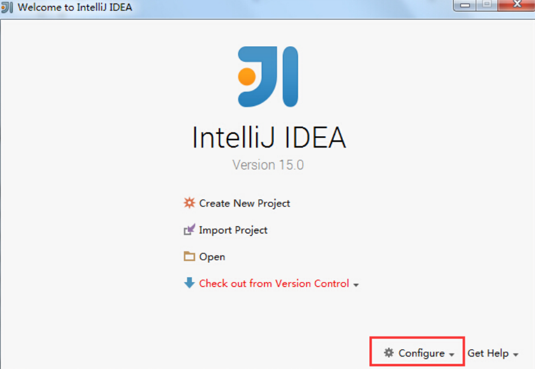

scala
================

Scala 是一种结合函数式编程和面向对象的纯面向对象语言，所以被称为多范式语言。它和 java 语言类似，需要进行编译并运行在 JVM 虚拟机上。

Scala 语言具有如下特点：

- 优雅：这是框架设计师第一个要考虑的问题，框架的用户是应用开发程序员，API是否优雅直接影响用户体验。
- 开发速度快：Scala 语言表达能力强，相对于 Java 开发速度快
- 运行速度快：Scala 是静态编译的，所以和 Python，Ruby 等解释性语言比，速度快很多。

随着 Spark 成为 Hadoop 生态圈的数据处理主力，而 Spark 是使用 Scala 语言开发的，如果要深入理解和定制 Spark，就要熟悉 Scala。

Scala 的源文件被命名为 .scala，通过编译器 scalac 编译为 .class 字节码文件。

环境安装
-----------

安装 scala
~~~~~~~~~~~~

因为 Scala 是运行在JVM平台上的，所以安装 Scala 之前要安装 JDK，注意安装时路径不要有空格或者中文。

访问`Scala官网 <http://www.scala-lang.org>`_ 下载 Scala 编译器安装包，由于目前大多数框架都是用 2.10.x 编写开发的，推荐安装 2.10.x 版本，Windows 平台直接下载 scala-2.10.6.msi 安装即可，会自动配置环境变量。

验证安装环境：

.. code-block:: sh

  E:\>scala -version
  Scala code runner version 2.10.6 -- Copyright 2002-2018, LAMP/EPFL and Lightbend, Inc.

Linux 环境下载 .tgz 文件，解压后在 /etc/profile 下修改环境变量

.. code-block:: sh

  # 解压缩
  $ tar -zxvf scala-2.10.6.tgz -C /opt/

  vi /etc/profile
  export JAVA_HOME=/opt/jdk1.7.0_80
  export PATH=$PATH:$JAVA_HOME/bin:/opt/scala-2.10.6/bin

安装 Idea IDE
~~~~~~~~~~~~~

Idea 是用户开发 Java 项目的优秀IDE，安装 Scala 插件后可以支持 Scala 的高效开发。

从 http://www.jetbrains.com/idea/download/ 下载社区免费版并安装，安装时如果有网络可以选择在线安装 Scala 插件。

如果网速较慢，可以选择离线安装，从地址 http://plugins.jetbrains.com/?idea_ce 搜索 Scala 插件，然后下载。

  首次启动窗口

首次启动 Idea 安装Scala插件：Configure -> Plugins -> Install plugin from disk -> 选择Scala插件 -> OK -> 重启IDEA。

如果当前已经进入 Idea，可以通过 File->Settings 搜索 Plugins 标签页，在标签页面右下角选择 Install plugin from disk，然后从本地磁盘安装插件。

基本语法
----------

HelloWorld
~~~~~~~~~~~

使用原生方式直接编写，并编译，然后执行。

.. code-block:: scala
  :linenos:
  :lineno-start: 0
  
  # 创建 HelloWorld.scala
  object HelloWorld {
  	  def main(args: Array[String]):Uint={
  		    println("Hello World!");
  		}
  }
  
  # scalac HelloWorld.scala 编译生成 HelloWorld.class 文件
  # scala HelloWorld  执行

由于 scalac 没有进行 java 库的链接，不能直接使用 java HelloWorld 执行。
